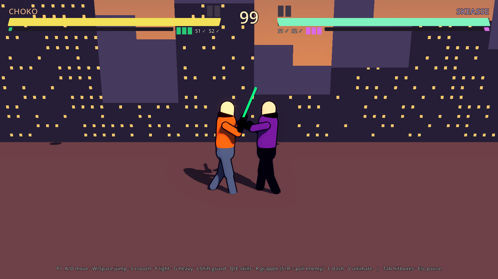

# No One Is Real

3D cel-shaded аніме-файтинг на арені (візуал — Naruto Ultimate Ninja Storm, фізика — active ragdoll,
мобільність — гарпун на зарядах) за мотивами власного аніме. Godot 4.7 · GDScript. Місто — Kronshift,
перші бійці — Choko і Skeasse.

**Вікі:** [docs/index.md](docs/index.md) · **поточна правда:** [docs/system/state.md](docs/system/state.md) ·
**закон:** [docs/system/constitution.md](docs/system/constitution.md) · **ролі агентів:** `roles/` (`make roles`).

## Запустити (Mac)

```bash
# 1. Godot 4.7-stable → /Applications. 2. Клон. 3. Арт із CDN Higgsfield:
bash tools/fetch_assets.sh
# 4. Перевірка (імпорт, парс, headless smoke-тест бою) і гра:
GODOT_BIN=/Applications/Godot.app/Contents/MacOS/Godot make check
GODOT_BIN=/Applications/Godot.app/Contents/MacOS/Godot make run
```

P1: `A/D` рух · `W`/`Space` стрибок · `S` присід · `F` легкий · `G` важкий · `LShift` блок · `Q`/`E` скіли ·
`R` гарпун (`S+R` — підтягнути ворога) · `C` деш · `V` ультимейт. P2: стрілки · `K`/`L` · `RShift` · `;`/`'` · `I` · `.` · `,`.
Геймпади: device 0 → P1, device 1 → P2. `Tab` — хітбокси, `Esc` — пауза.

## Структура

| шлях | що |
|---|---|
| `game/` | Godot-проєкт: сцени, скрипти, шейдери, дані персонажів (`data/characters/*.tres`), ассети |
| `docs/` | Obsidian-вікі: GDD, персонажі, світ, арт (реєстр текстур), техніка, ADR, ресерч, журнали, інтерв'ю |
| `roles/` · `.claude/` | 8 ролей агентів (T1 Дедал … T8 Гермес), скіли, саб-агенти, хуки |
| `tools/` | гейти (`make gates`), хуки, `fetch_assets.sh` |

## Перевірки

`make check` — `godot --headless --import` → парс усіх `.gd` → smoke-тест (`-- --smoke`, 11 перевірок бою).
`make gates` — wikilinks, реєстр ассетів, парність ролей. Обидва зелені = «готово».

## Статус



Prototype 0.1 (2026-10-02): бій, гарпун, регдол, HUD, меню, CPU-спаринг — працює headless; плейсхолдерні
капсульні бійці; усі числа бою `PLACEHOLDER`. Далі — [docs/Roadmap.md](docs/Roadmap.md) і
[інтерв'ю персонажів](docs/Interview/2026-10-02-Characters-Interview.md).
