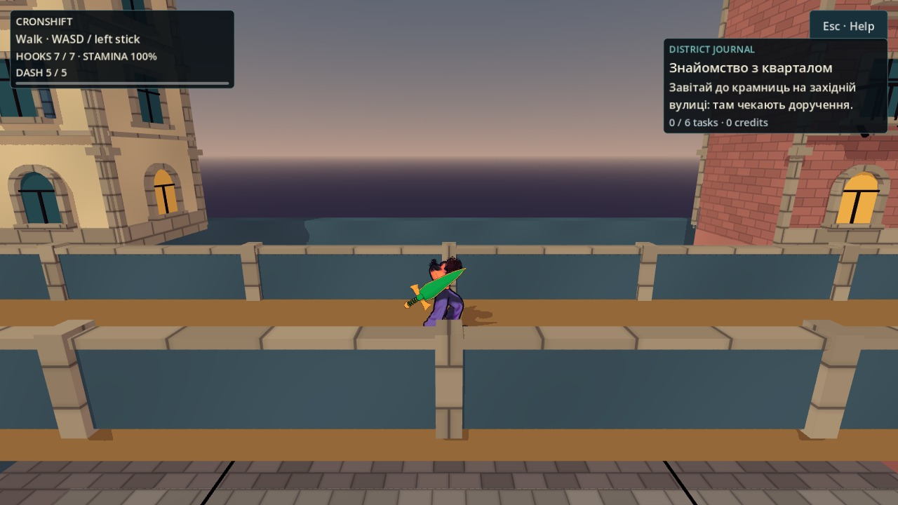
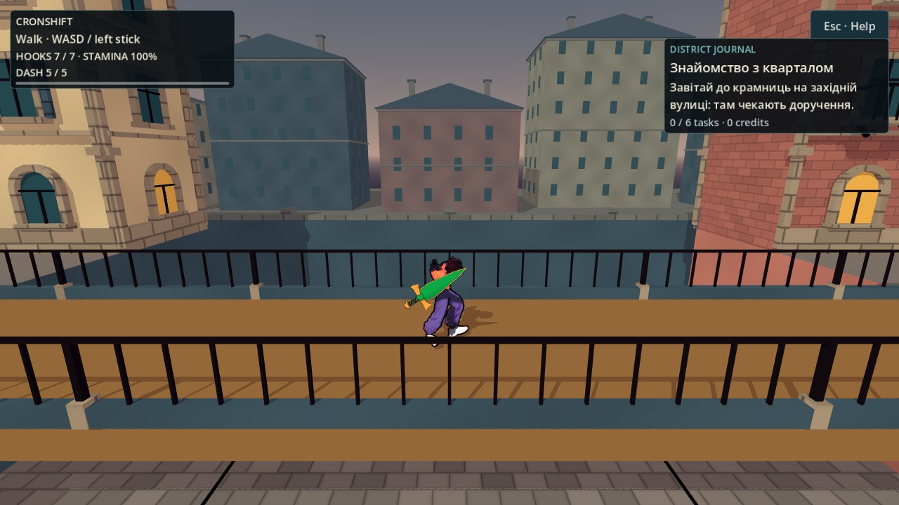
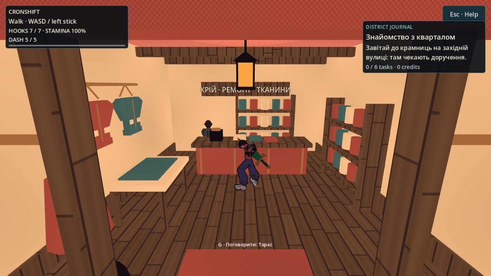
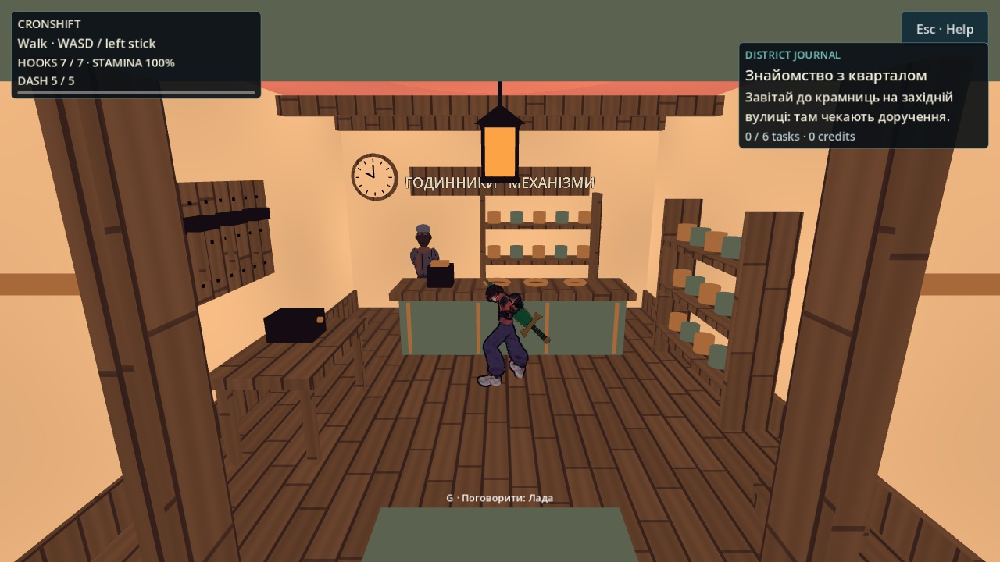

# Квартал: силует міста та читабельність героя

2026-10-05 · T6. Виконання approved [[2026-10-05-District-Motion-And-Readability]]. Нових покупок, генерацій, файлів у `game/assets/` і змін ліцензій немає.

## Аудит і вибір

Прочитано [[01-Vision]], [[06-UI-UX]], [[Style-Guide]] і [[2026-10-05-Playable-District-Art]]. Свіжий native before з production-камерою підтвердив: суцільний метровий парапет перекриває ноги героя на мосту, за північною межею порожній горизонт; ательє й майстерня мають схожий ритм дрібного товару. Окремий proximity-дефект камери передано відповідальній смузі; цей арт-прохід камеру не змінює.

Три варіанти: глобальна прозорість усіх стін (ризик читабельності/рендера), новий великий asset pack (не потрібен, немає перевірених байтів), локальні відкриті перила та обмежений фон із чинного kit. Обрано третій. Погляди: дослідник бачить стопи на мосту; гравець із мотузкою зберігає старі перешкоди й опори; NPC і checkpoint не змінюють місця; художник отримує глибину без фототекстур; слабкий пристрій — фіксований бюджет; тестувальник порівнює ту саму камеру, а не вигідніший постановочний ракурс.

## Що змінено

- `CityDistrict`: видима заливка мостового парапету стала цоколем 0.24 м. Початковий `BoxShape3D` 20×1×0.2 м, його трансформація й layer збережені.
- `CityArchitecture`: тонка верхня залізна рейка, вертикальні прути й вузькі опори. Після першого native проходу прибрано товсту центральну декоративну колону та широку кам'яну рейку, які досі накривали стопи. Це лише visual geometry.
- `CityBackdrop`: **10** будинків за чинною межею ±32 м, центри приблизно на 65–74 м від початку відповідної осі. Матові приглушені фасади, дахи, димарі й віконний ритм з усіх боків. Чотири декоративні наземні смуги закінчуються на ±100 м і не заходять у playable square; вони прибирають ефект будинків, що висять над небом. Накривні камені/пілястри також за межею. **Жодних collision objects, grapple anchors або нових місць призначення.** Це недоступне фонове місто, не новий ігровий район.
- `CityInteriors`: два підвішені пальта над розкрійним столом; у майстерні — перфорована дошка інструментів і настінний годинник. Годинник після native перегляду зменшено й відсунуто від напису. Додаткових колізій немає.

Художні розміри й палітра — PLACEHOLDER до приймання Santos. Фізику, бойові числа, маршрут рамп, landmark/checkpoint API й центральні бойові кишені не змінювали.

## Одна камера до та після

У восьми before/after кадрах використано однакові позиції героя, yaw, production FOV та camera implementation попередньої бази: ринок, центральна площа, міст x=−6/0/+6, три крамниці. Це навмисно відділяє арт від паралельної camera-смуги. Перевірені координати камери збігаються в raw-журналах. NPC/поза героя можуть відрізнятися через час симуляції; піксельної тотожності решти сцени не заявляємо.

До:

Після:

## Бюджет і перевірка

| Метрика геометрії district | До | Після |
|---|---:|---:|
| Усі nodes, разом із коренем | 618 | 626 |
| MeshInstance3D | 65 | 72 |
| Трикутники | 77 112 | 88 004 |
| CollisionShape3D | 256 | 256 |

Сам backdrop: **8 744 трикутники, 6 mesh/material batches, 7 nodes разом із коренем**. Ліміт у коді — 10 будинків/16 000 трикутників; geometry probe обмежує 7 mesh nodes і перевіряє, що всі фонові вершини поза playable square. Це облік геометрії, **не** твердження про FPS.

`CITY_GEOMETRY_COMPLETE checks=1813 failures=0`: старі проходи/рампи/опори, двері/прилавки, нові бюджетні/межові перевірки та незмінна повна колізія перил. Окремий probe серіалізував усі 256 shape types, розміри/точки, global transforms, layers/masks; before/after файли побайтово однакові. SHA256 обох: `14b80103fb5ac9fa6886433e5cdd2f2f9249d3e962b96304a51e71fb6095c822`.

Докази сесії: `/workspace/nooneisreal-evidence/district-motion-world/`, підкаталоги `before/`, `after/`, `probes/`; `geometry.log`, `collision-before.log`, `collision-after.log`. Відтворення — Godot 4.7-stable на ізольованій копії проєкту з окремими XDG directories; native додає `DISPLAY=:97`, `LP_NUM_THREADS=4`, `--rendering-method gl_compatibility --audio-driver Dummy`. Реальні кадри отримані Linux/Mesa llvmpipe; M3, апаратний FPS і фінальний художній комфорт тут не перевірені. Інтегровані check/gates й незалежне приймання належать координатору та T4.

## Related

- [[2026-10-05-District-Motion-And-Readability]] · [[2026-10-05-District-Motion-Session]] · [[2026-10-05-Playable-District-Art]] · [[Style-Guide]] · [[Textures-Registry]] · [[01-Vision]] · [[06-UI-UX]]
