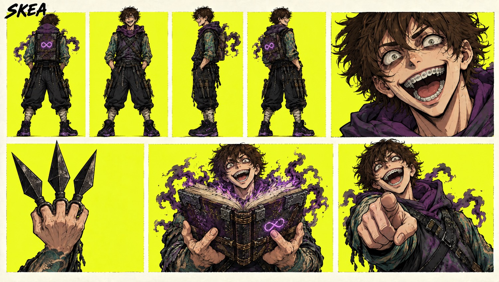
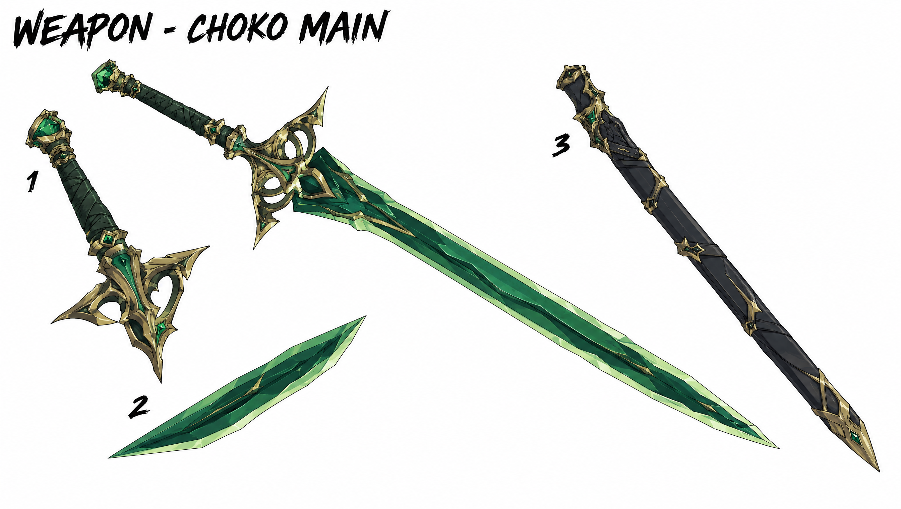

# Збережені референси: знак гримуара Skea та меч Choko

2026-10-05 · T6 Аполлон · пряма корекція Santos: «На рюкзаку дивні круги, має бути 8 як у референсу … Меч … під стиль одягу, а не такий кислотний».

## Skea — канонічний знак гримуара; одяг v1 застарів

**Збережений оригінал:** `game/assets/characters/cards/card_skea_v1.jpg`, надісланий Santos 2026-10-02; registry ID `card-skea-v1`. Оригінальні байти не змінено. Картка тут є джерелом **знака та книги**, не поточного одягу/обличчя Skea v3.

На першій верхній back-view панелі й нижній панелі відкритої книги видно **одну горизонтальну вісімку-нескінченність ∞**: дві бокові петлі зі спільним перехрестям, без додаткової вертикальної «8» під нею. Це не набір окремих кіл. Фіолетовий колір `#9E4CF2`; знак лише по центру задньої панелі, спрямованої від спини, без знаків на корінці/лямках/боках. Ці правила також прямо збережені в [[Skea]] § Рюкзак-гримуар і [[2026-10-03-Skea-Redesign]] § Канон.

Для чинної 3D обкладинки орієнтир fitting: ширина знака близько 45–50% cover, висота 22–26%; тонкий безперервний штрих, спокійне фіолетове світло, без очей/рота/пульсації. Це масштабування до існуючого предмета, не новий дизайн знака.

Пошук локального каталогу/реєстру не виявив новішої окремої схваленої картинки backpack із заднім знаком. Згадана генерація `14c45bff` у плані прямо позначена як неправильна (немає вісімки); вона не є заміною референсу. Позначення «∞8» у прозі означає назву цього infinity-eight сигілу, **не два послідовні гліфи й не чотири torus rings**.

## Choko — смарагд у палітрі одягу, без кислотної заливки

**Збережений оригінал:** `game/assets/characters/cards/weapon_choko_main_sword.png`, registry ID `weapon-choko-main`, Higgsfield source `hf_20261002_111511_9652a5b1-…png`. Він задає тонкий emerald клинок, темно-зелену обмотку й стриману aged-brass гарду; довжина/форма gameplay тут не переглядаються.

Картка `card_choko_v3.png` додатково показує цей темний меч поруч із приглушеним помаранчем куртки та charcoal/faint-violet низом; її старі outfit деталі не замінюють поточний v5.

Runtime palette target T6, підібраний візуально під референс (**не заявлений як pixel sampling**):

| Поверхня | Ціль |
|---|---|
| Основна грань | `#315D52`, приглушений forest/teal emerald |
| Тіньова грань | `#183C36` |
| Світла вузька грань | `#91A78A`, sage; без neon-green emission |
| Темна обмотка | `#263B35` |
| Приглушена латунь | `#9A8960`; малий highlight `#B8AA7B` |
| Контур | `#2B2230` |

Зв'язок із курткою `#BD6133` і фіолетовими тінями забезпечують низька насиченість, графічні грані й тепла латунь. Старий яскравий VFX emerald `#33E68C` не слід використовувати як суцільний непрозорий матеріал клинка. Ultimate gold має окремий художній стан; джерело форми лишається незмінним.

## Незмінність джерел

- `game/assets/characters/cards/card_skea_v1.jpg` — SHA-256 `1ff95884c005888eb35f16b1df00a0428eabce62869648294d47dce428944fbd`.
- `game/assets/characters/cards/weapon_choko_main_sword.png` — SHA-256 `95b49244fd68885fb066acc36e691df828aae9bba4aa05f3dd3eb88863402b29`.
- `game/assets/characters/cards/card_choko_v3.png` — SHA-256 `01a3c0358ed06bc6f1e31bc96ddb67c01f93896c2875c7ace9238c4c72d6aa7b`.

Ліцензії та provenance лишаються чинними рядками [[Textures-Registry]], нові походження/дозволи не вигадані. Це локальні вже збережені reference assets, не нова provider генерація. Шість замовлених 2026-10-05 surface maps досі не завантажено через CDN policy.

## Related

- [[Skea]] · [[Choko]] · [[2026-10-03-Skea-Redesign]] · [[2026-10-05-Equipment-Visual-Audit]] · [[2026-10-05-Equipment-Texture-Production]] · [[Style-Guide]] · [[Textures-Registry]]
