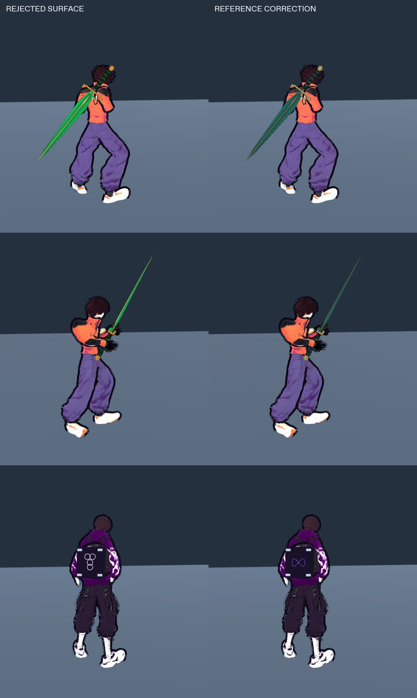
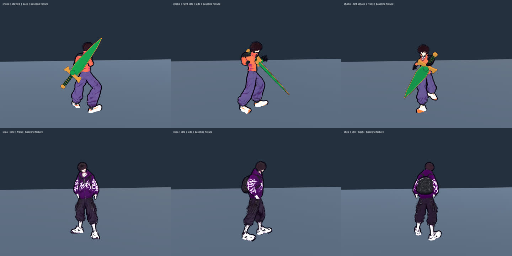
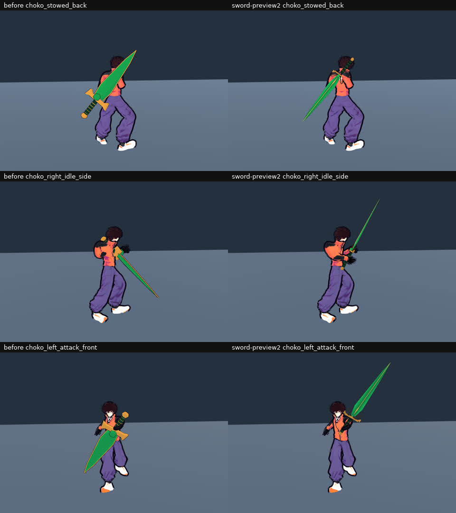
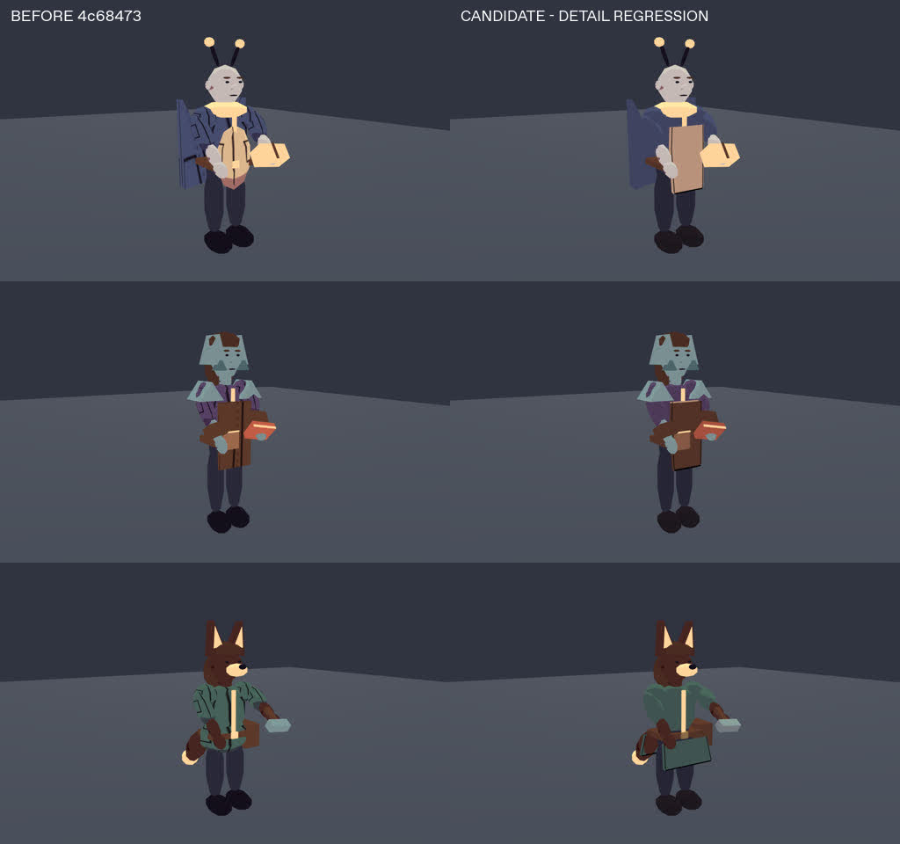
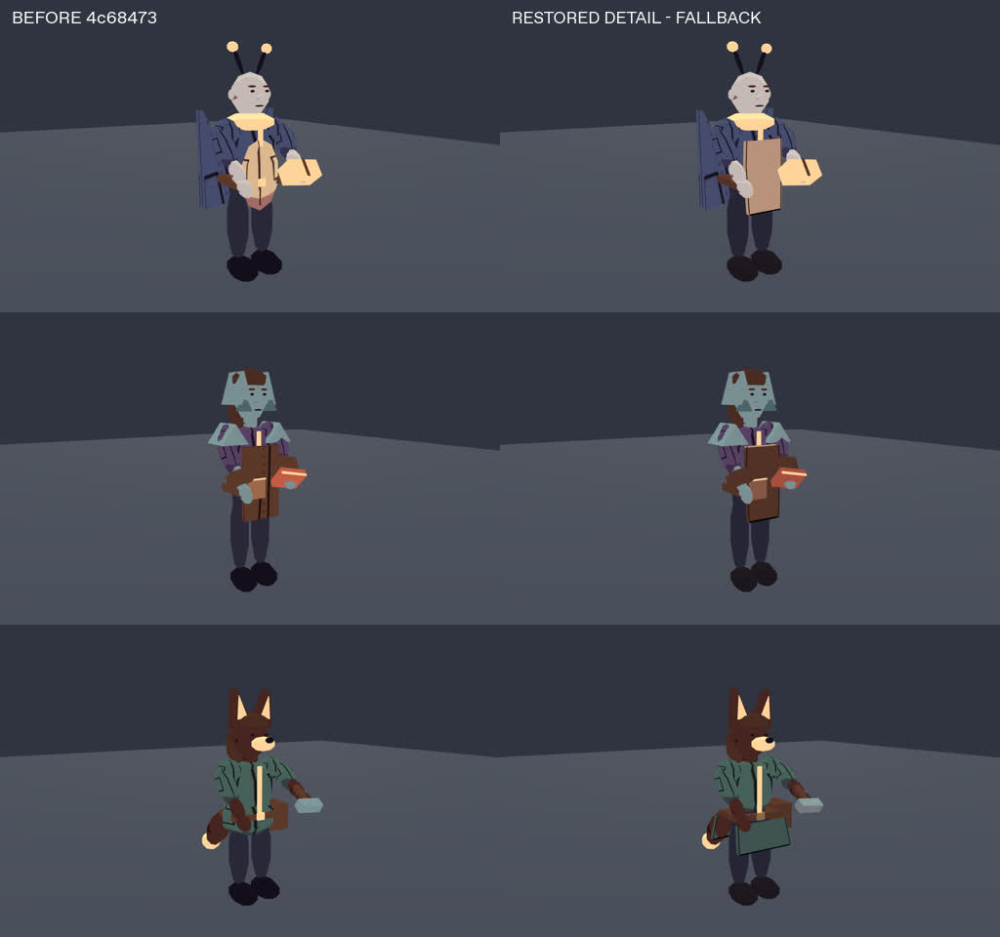
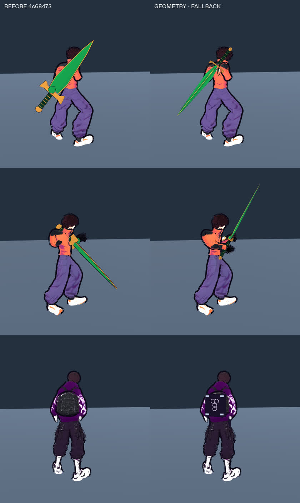
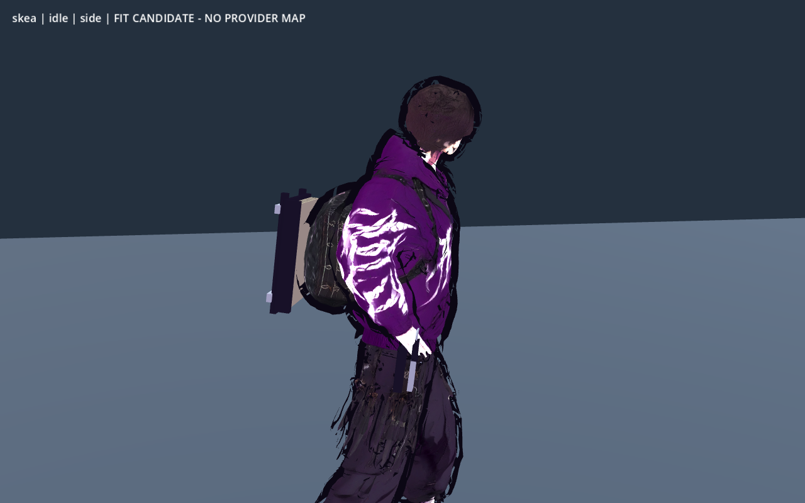

# Меч, інструменти й одяг: художній контракт та native аудит

2026-10-05 · T6 Аполлон · baseline `4c68473`. Santos уточнив: меч перевернутий **і в руці, і на спині**; потрібне тонше, індивідуальне оздоблене лезо та кращий вигляд спорядження/одягу. Skea меча не отримує: перевірка обох рук належить Choko. T6 не змінює production; реалізація T2 дозволена CP1 планом [[2026-10-05-Equipment-And-Cloth]] (`3c1db8f`). Frozen baseline лишається 4c68473.

## Пряма художня корекція Santos після checkpoint

Santos відхилив **дивні окремі круги на книзі** та **кислотний колір меча**. Усі наведені нижче ранні/frozen геометричні кадри з цими поверхнями не є їхнім художнім прийманням. Джерело точного горизонтального знака ∞, підписані незмінні оригінали, SHA й приглушена палітра — [[2026-10-05-Equipment-Canonical-References]]. T2 виправляє лише emblem/material; motion/cloth fitting не переробляються. Чергу старих expensive surface captures зупинено; вже завершені 1800 locomotion кадрів лишаються geometry-only evidence. Після корекції потрібні вузькі matched views, без повтору всіх дуг заради кольору.

## Перевірене виправлення за збереженим референсом

Останній bounded pass: `HeroGearPresentation d1e0719a`, `grimoire_sigil aa191264`, `SwordPresentation e5d19e6c`, sword shader `9cc1365e`; `SwordMotion b082a476`, authored motion `d3b082b0`, mask `4659ca51` не змінювались. Manifest — `gear-readability/reference-correction/candidate-source.json`. **18 native body poses + 6 book close**, усі логи clean (Godot4.7 Compatibility llvmpipe).

T6 особисто звірив stowed/right-hand/ultimate blade та rear-book gameplay/close: один горизонтальний violet ∞ із центральним перехрестям; лезо приглушене forest emerald, тепла латунь узгоджена з одягом; золотий стан відрізняється як ultimate. Root окремо переглянув і прийняв ці вузькі виправлення. Це поточна ілюстрація для PR; попередній checkpoint нижче — історичний, із відхиленими поверхнями.

Окремий запис руху завершив **1800 native кадрів**: 450 кадрів × Choko/Skea × front/side, реальні 60 fps; walk→run→stop→turn90→crouch→block→jump/landing→jab. T6 оглянув 4 sheets по 30 вибіркових кадрів і крупні fitting views; великих видимих відривів спорядження або нових деформацій на цих вибірках не видно. Повні кадри та trace збережені. Цей запис містить **старі відхилені колір/кільця** до останньої корекції, тому відео `equipment-geometry-matched-30s.mp4` прямо підписане `GEOMETRY ONLY — COLOR AND SIGN SUPERSEDED`. Пара baseline бере `whole-body/after/locomotion60`, чия тотожність 4c підтверджена `before/motion-reuse-provenance.json`; це не старий baseline 3df43a5. Palette/emblem-only fix перевірений новими 24 кадрами вище, а не підставлений у старе відео. Новий hook render зупинено за steering, full hook geometry guards лишаються окремими доказами T2/T4.

Фактура plain cover/paper/new cloth panels ще не фінальна. Створений revised muted texture job `581e7a06` замінює старий `f2667187`, але локальних bytes немає; за всі 7 успішних зображень витрачено 63 кредити, поточний набір — 6 maps. Provider quality/admission лишається відкритою, без blanket art GREEN.

## Фактична база

- `SwordPresentation` будує оригінальний procedural mesh: найбільша ширина леза 0.23 м, товщина 0.066 м, guard близько 0.44 м із quillons. UV немає; матеріал — рівна emerald заливка. Товсті латунні рейки й проста поперечина читаються грубо поряд із тонкою графікою героя. Нову карту кольору не можна коректно накласти без UV або іншої явної параметризації.
- Переглянуто чинний зареєстрований `weapon_choko_main_sword.png`: довге вузьке emerald лезо, тонка центральна золота лінія, окремі світлі грані, ажурна латунна гарда й темно-зелена діагональна обмотка. Це вже наявний локальний референс; нових завантажень, генерацій або змін ліцензій немає.
- Raw glTF JSON обох `choko_m0.glb`/`skea_m1.glb`: один mesh, один primitive, один `Material_0`, один embedded JPEG atlas. Немає незалежних material slots тканини/шкіри. `SkeletalRig` використовує загальний `material_override`: загальне перефарбування такого меша торкнеться обличчя й шкіри.
- `CityCosmetics` — три жорсткі примітиви; оригінальна палітра приховує їх. NPC використовують окремі поверхні, але груба UV дрібної seam-текстури на sphere дає нерівномірний масштаб. Для видимих швів потрібне свідоме розміщення.

## ТЗ для реалізації та власність

Меч і калібровка — T2 combat; hero gear/cloth та спільний `GearSurface` — T2 rope; NPC tailoring/spring — T2 npc. T6 задає поверхні, перевіряє native силуети й веде provenance/реєстр. Робочий API спільної фабрики: `GearSurface.make(kind, color, accent) -> ShaderMaterial`, `kind=cloth|leather|metal`; actor palette лишається власністю caller. Hero реєструє `hit_flash/desat` у чинному animator; camera visibility контракт не губиться.

| Поверхня | Образ | Межа |
|---|---|---|
| Emerald лезо Choko | 2–3 широкі пласкі грані, тонкий світлий edge, одна центральна золота нитка та малий мотив біля гарди | Орієнтовно max width 0.12–0.14 м, thickness 0.016–0.022 м; довжина й gameplay reach не змінюються |
| Латунь | приглушений теплий колір, ажурна гарда з читабельним отвором, небагато тонких ліній | Не масивна золота рамка по всьому клинку, не chrome/gloss |
| Шкіра | темний body, темніший край, спокійний широкий тональний акцент, діагональна обмотка/декілька швів | Без випадкового шуму й яскравих specular плям |
| Тканина | великі пласкі заливки, graphite seam та приглушена світла окантовка | Weave контраст ≤5%, без moiré; деталі не розповзаються по UV; не змінювати hero atlas |
| Геройські інструменти | Choko — лівий аналоговий годинник/технічні дрібниці; Skea — стримані leather/silver kunai/book деталі | Гладка помаранчева спина Choko лишається гладкою; ∞8 лише на обкладинці гримуара Skea; нових зброї/навичок не додавати |

Ці розміри й деталі — параметри кандидата для native перегляду, не новий незмінний канон. При gameplay дистанції спершу мають читатися клинок/гарда/руків'я й основні garment panels; fine ornament доповнює їх зблизька. Стиль — [[Style-Guide]]: graphite контур, пласка заливка, лілова тінь, без пластикового блиску.

## Native baseline і критерій приймання

Ізольований baseline `/workspace/nir-gear-art-before/game`; побайтова звірка ключових файлів із commit у `/workspace/nooneisreal-evidence/gear-readability/before/source-provenance.json`. Godot 4.7, Compatibility, Linux llvmpipe, Xvfb :98 — не M3/FPS приймання. Probe `probes/gear_before.gd` зберігає front/side/back Choko stow/right/left/attack/swap/draw/crouch і Skea idle/crouch, а також world guard/tip/pommel/grip у sidecar. Це презентаційні snapshot fixtures, не доказ input-послідовності чи перетинів у всіх кадрах.

Baseline запис завершено: **30 native PNG**, ключові production файли побайтово відповідають 4c68473. Особисто переглянуті back/right-idle/left-attack кадри підтверджують обидві скарги: вістря на спині високо над плечем із руків’ям унизу, а в руці blade виходить назад/вниз до ноги. Skea back показує вбудований у atlas/mesh округлий рюкзак: окрему книгу потрібно свідомо посадити поверх нього, не заховати всередині.

Для базової динаміки повторно використано вже наявний native `whole-body/after` (1800 locomotion, 720 hook, 450 city кадрів): усі scripts/data/scenes/shaders snapshot побайтово збігаються з frozen4c, окрім `SmokeTest.gd`, який ці helpers не викликають. Це **reuse наявного запису**, не новий рендер; деталі у `before/motion-reuse-provenance.json`.

Приймання меча перевіряє **напрям guard→tip та pommel→guard**, обидві руки й back mount, а не тільки близькість origin до кисті. Одяг/підвіски перевіряються в actual start/stop/turn/jump/crouch/hang: обмежене запізнення, повернення в спокій, відсутність відриву, проходу через кисті/меч або тремтіння після pause/reset. Окремий крупний і gameplay ракурс потрібні для оцінки ornament масштабу.

## Ранні native кандидати: зафіксовані зауваження

`pose-preview` (`SwordPresentation e04ed0c`, `SwordMotion c5abc3f`) виправив напрям, але стара широка гарда закривала праву щоку/кисть. Цей pass не прийнято як доказ правильного wrist twist. Наступний `sword-preview2` (`ad7056b2`, `823302ba`, shader `41d69e28`) має **30 matched full-body PNG + 18 upper-body close PNG**: тонший клинок, відкрита гарда й опущена ready-поза дають видимий зазор перед обличчям збоку. Грубої інверсії передпліччя на оглянутих right/left idle/attack/draw ракурсах не видно. У front blade може перекривати лице перспективно; side показує фізичне розташування. Пальці GLB не мають окремих thumb/index bones і не огортають руків’я повністю — це не приховується твердженням про finger-IK. Повні переходи та незалежні landmarks перевіряє T4. Пізніша покадрова перевірка виявила перетин тулуба клинком у lowcut/recovery: snapshot preview2 не є прийманням attack clearance; T2 окремо виправляє forearm/wrist дугу й draw.

Перший NPC `cloth-preview` мав зайву світлу лінію на шарнірі фартуха, яка читалася як картонний згин. Після T6 зауваження `cloth-preview2` (`NpcAppearance 42d3d80`) прибрав цю лінію, додав тонкі side seams і chamfered hem. Оглянуто worker seeds40/41/42 зблизька спереду й збоку; великого відриву upper apron від torso не видно. **360 кадрів** presentation probe (два ракурси, 60fps, work→walk→turn90→stop→greet) показують малий обмежений рух, без постійного махання в спокої. Це контрольований transform-сценарій для тканини, не тест NPC-навігації. Actual CityWorld baseline має 10 кадрів worker/conversation/return/crowd із production камерою.

`hero-preview` (`HeroGearPresentation afdf7ab6`, `HeroGarmentMask df196da8`, shader `86c915a9`) містить 30 matched native PNG. Face/skin збережені на оглянутих front/side/back, різкого переходу torso→sleeve у слабкому fallback weave не видно; при цьому загальне покращення тканини з gameplay відстані поки малопомітне. Дві жорсткі помаранчеві смуги на поясі Choko стирчали як bars — T6 відхилив fitting, T2 прибрав їх після цього запису. Годинник читається на лівій руці. Книга Skea розташована зовні baked backpack, зберігає видимість у crouch; cover поки читається як плаский темний прямокутник із світлими застібками. Це потребує остаточного surface pass, а page edge — стриманих поділів. Частка masked vertices (Choko 2790/28520, Skea 7758/33108) не є часткою видимої площі одягу й сама не доводить художню якість.

Окремий `fit-final` запис (назва каталогу не означає приймання) містить 12 body кадрів із candidate mask `4659ca51` (+реальний chest bone `Spine01`) та gear `c5ef23b5`. На оглянутих Choko front/side і Skea front/side/back protected face/skin збережені, нової різкої межі тканини не видно; Compatibility shader compile чистий. **Gear геометрію цього snapshot відхилено**: після запису позитивна регресія знайшла порожній Skea `tail.skin`, тому нуль перетинів був недостатнім доказом. Close/motion pass призупинено до непорожнього pin і перевірки actual triangles. Маска й fitting мають окремі критерії, цей результат не переноситься на ще невиправлений одяг.

Ці passes зберігаються як рання критика з source hashes, а не як фінальне приймання. Фінальний hero gear fitting, рух і захищені face/skin області мають пройти окремий native огляд після source freeze.

## NPC geometry pass; fallback surface regression

`npc-final/source.json` фіксує `NpcAppearance 4b8a146`, `NpcClothMotion 3be689c`, `GearSurface bff1a96`, shader `9e5ec83`. Повторно записано **360 native кадрів** (front/side по 180, 60fps) і 8 lineup/worker close кадрів. Зліва baseline4c, справа чинна геометрія з локальним fallback:

T6 оглянув два sequence sheets із кожним шостим кадром та worker close: тонкі hem/side seams тримаються узгоджено, великих відривів панелей не видно, обличчя й професійні пропси читабельні. Full motion лишається у `npc-final/motion`; paired `npc-cloth-matched-6s.mp4` перевірено ffprobe: 360 кадрів, 60fps, 6 секунд, без інтерполяції. Це підтвердження bounded geometry, **surface pass відхилено**: root matched review виявив, що candidate втратив уже наявні темні графічні складки/шви torso та sleeves. Причина — заміна `_material(knit_stripes.svg/workwear_seams.svg)` на `_garment` без macro-pattern. Це регрес поточного fallback, а не виправдане очікування provider. T2 повертає читабельні наявні деталі окремою вузькою material правкою; geometry/motion перевірки при незмінній геометрії зберігаються. Provider карти досі відсутні. Probe задає actual appearance transforms, але не замінює навігаційний тест.

Вузький fix `NpcAppearance 27e72a7` повернув exact baseline `knit_stripes.svg`/`workwear_seams.svg` для torso/shoulder/sleeve/wing; geometry, spring і shared shader не змінювалися. Повторено **8 native ракурсів**, T6 особисто переглянув три worker close: темні графічні складки знову читабельні. `npc-surface-fixed/source.json` і clean log фіксують актуальний source. Попередні 360 motion кадрів залишаються доказом незмінної геометрії зі старою поверхнею; їх не видаємо за новий material capture.

**Регрес macro-detail закрито**. Якість фактури нових панелей/фартухів лишається pending provider maps; це не blanket art GREEN.

## Зафіксований hero geometry/fallback checkpoint

Фінальний source для цього checkpoint: `HeroGearPresentation b9db3112`, `HeroGarmentMask 4659ca51`, `SwordMotion b082a476`, `SwordPresentation b5f9bd73`, `AuthoredCombatMotion d3b082b0`, sword shader `35e544b5`. Повні hashes усіх scripts/shaders/data/scenes — `gear-readability/final/source.json`. Snapshot ізольований; **provider PNG відсутні**.

Записано 30 matched body poses і 12 close кадрів, логи завершені без script/shader помилок. Особисто оглянуто back sword, right/left idle/attack, draw/swap та hero gear side/back/crouch: напрям клинка виправлений, тонкий профіль і відкрита гарда читабельні, жорсткі waist bars усунуті, обличчя/шкіра збережені. Snapshot перевірка не підміняє повні weapon trajectories T2/T4.

Крупний side/crouch показує світлий блок сторінок і тонку обкладинку зовні baked backpack; зі спини обкладинка досі пласка й потребує provider surface pass. Годинник читається на лівій руці Choko. Skea має **короткі пришиті кінці 25 мм**, майже непомітні з gameplay дистанції, дрібні й у close: це обмежена secondary motion деталь, не довга тканина й не повна симуляція одягу. Choko зберіг вузькі 6 см елементи. Пальці imported GLB не повністю огортають руків’я; finger-IK не реалізовано цим pass.

## Авторизовані provider карти

Після додаткового прямого дозволу Santos root подав 6 texture jobs через Higgsfield. Exact prompts, IDs, model і quote — [[2026-10-05-Equipment-Texture-Production]]. Початковий baseline і ранні candidates **не містять цих карт**. Їхнє завантаження/admission та фактичний UV/native результат перевіряються окремо; сплачений або terminal job не дорівнює інтегрованій текстурі. Новий оригінальний fallback `cloth_weave.svg` зареєстровано в [[Textures-Registry]], стороння ліцензія чи CC0 йому не приписуються.

## Related

- [[2026-10-05-Equipment-Texture-Production]] · [[2026-10-05-Equipment-And-Cloth]] · [[Style-Guide]] · [[Choko]] · [[Skea]] · [[Textures-Registry]] · [[2026-10-05-Whole-Body-Visual-Audit]] · [[2026-10-03-Behaviour-Cloth-VFX-Shaders]]
