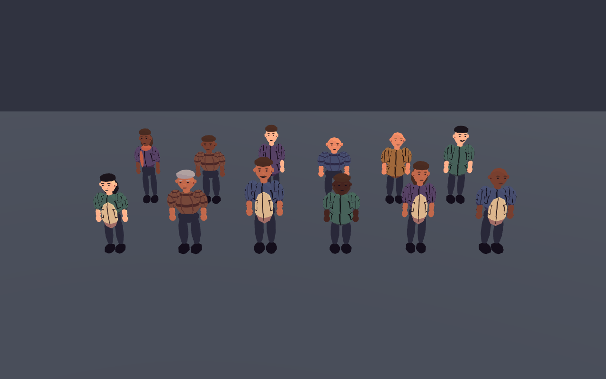
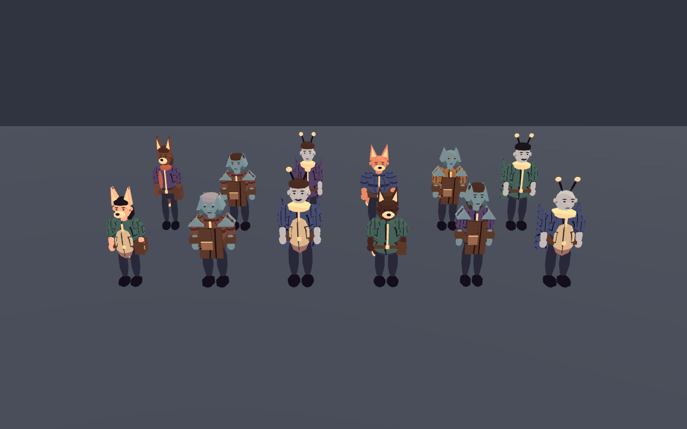
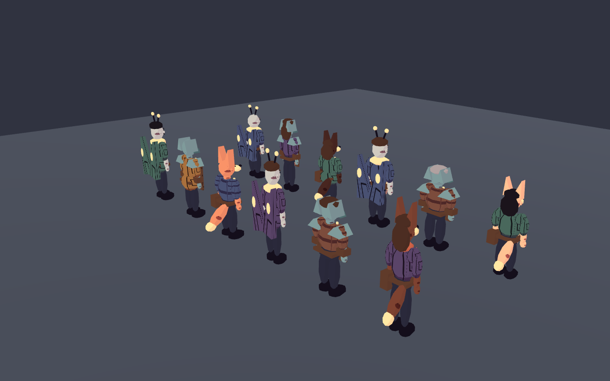
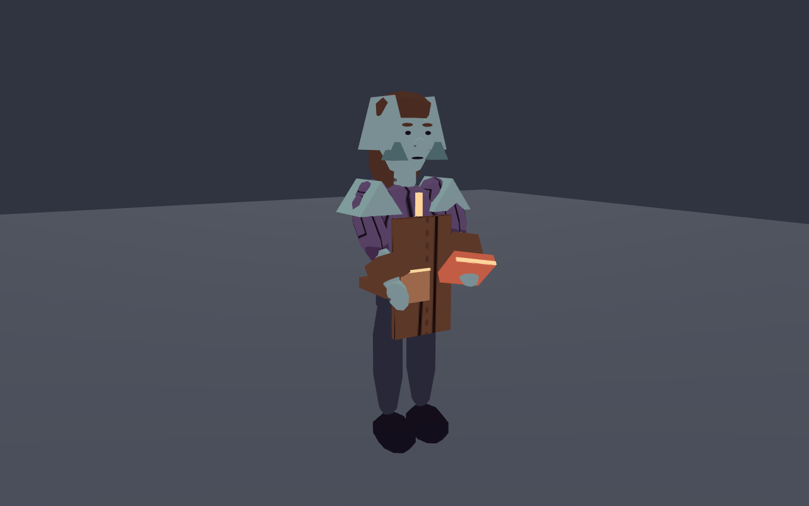
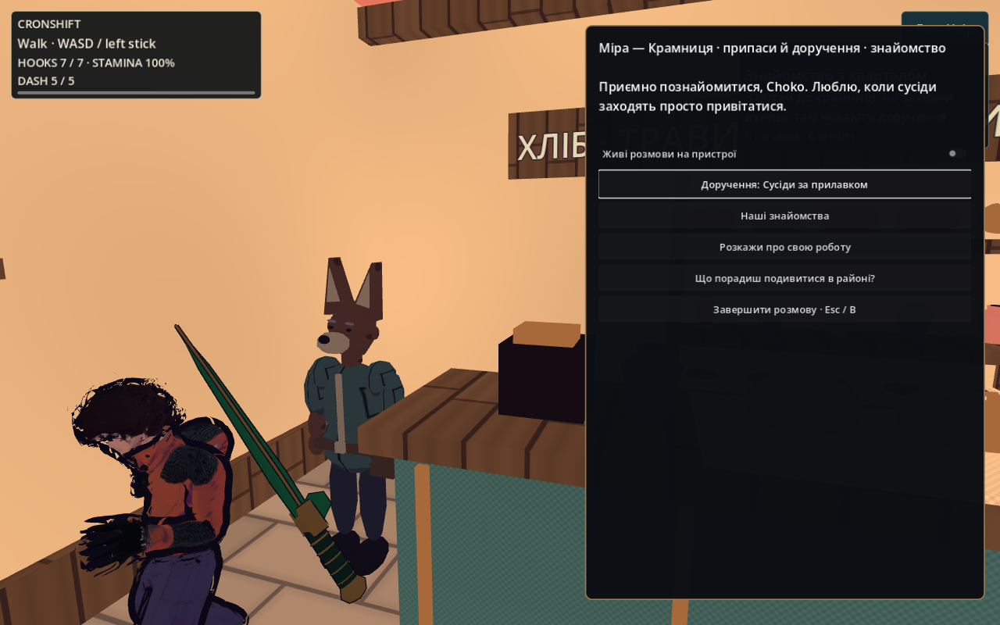
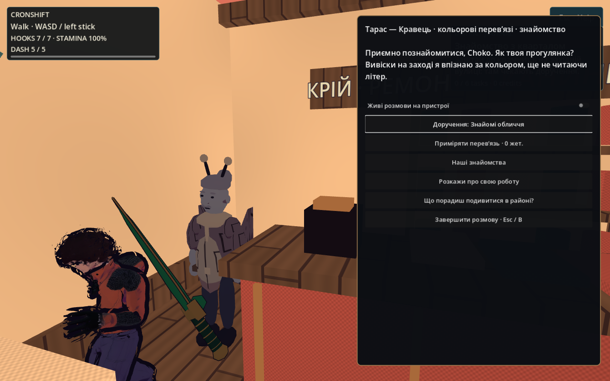
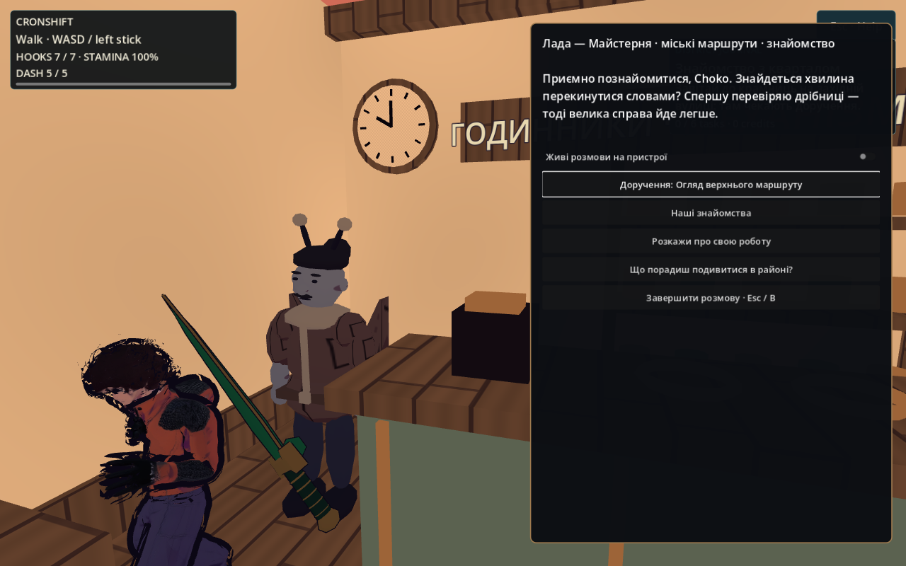
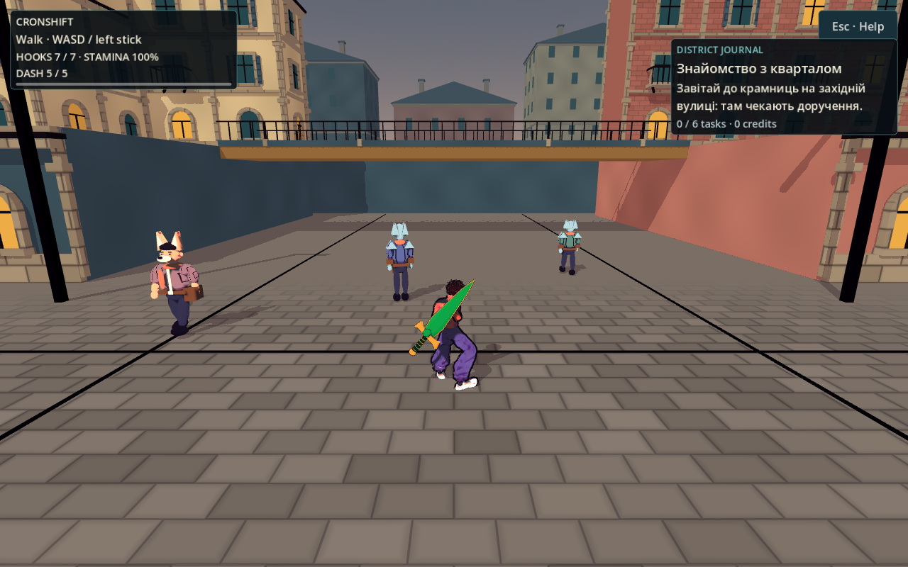

# Мешканці кварталу: силуети, жести та безсловесні голоси

2026-10-05 · T6 · виконання approved [[2026-10-05-Living-District-Characters]]. Власна геометрія й синтез, без покупок, paid generation, сторонніх моделей або зміни ліцензій. Художнє приймання Santos і слухове приймання на його пристрої залишаються окремими перевірками.

## Видима зміна

`NpcAppearance` додає три оригінальні групи: лисоподібні мешканці з короткою мордочкою, гострими вухами, хвостом і сумкою; молеподібні з вусиками, коміром та складеними візерунчастими крилами; кам'яні з гранованими щоками, плечима та робочим фартухом із кишенею й швом. Це компактні процедурні персонажі Sketch-Cel, а не імпортовані герої чужої гри. Повторно використані чинні `workwear_seams`, `knit_stripes`, `skin_marks`.

Збережені всі вісім старих RNG draws, їхній порядок, height/width/одяг/палітра/шкіра/волосся/обличчя та appearance_seed. Phenotype визначається лише seed modulo 3, presentation_version=2 додається після старих draws. Legacy version=1 і save schema не змінювалися. Професія, стосунки й пам'ять вигляду не переролять.

## Рух і предмети роботи

API `presentation_event(greet/listen/talk/agree/goodbye)` задає короткий жест із плавним входом/виходом. `set_motion` повертає повні rotation vectors рук/ніг/голови до спокою; `set_work` поступається активному жесту. Голова з усіма очима/вухами/рисами рухається одним pivot. Greeting піднімає руку назовні від обличчя; listen — нахил голови; agree — кивок; talk — дві кисті. Через 1.4 секунди відновлюється робота. Швидка зміна репліки починає новий жест із поточної видимої пози та змішує її за 0.18 с, замість стрибка рук у початкову позицію. Числа — PLACEHOLDER до художнього приймання.

Виправлено давній напрям робочого згину: від'ємна rotation.x відносила опущені кисті за спину; тепер руки працюють перед корпусом. Пакунок крамаря, складена тканина кравця й маленький молоток майстра мають по два меші, прив'язані до кисті. Вони ховаються на час жесту, щоб махання не виглядало ударом інструментом. Це дозволяє працювати збоку прилавка у новій service position без нової колізії.

## Просторове аудіо

`NpcChatter` синтезує три детерміновані тембри: 115/185/285 Hz основи, гармоніки, два складоподібні імпульси й короткий pitch contour. Це **безсловесне бурмотіння**, не озвучені репліки, LLM speech або клон реального голосу. Mono PCM16 22 050 Hz кешується за трьома тембрами × чотирма подіями; тривалість 0.30/0.42 s. Нових файлів у `game/assets` немає.

Один district helper володіє **двома** AudioStreamPlayer3D, max_polyphony=1 у кожного; третій голос відхиляється. Дистанція 8 м, пауза мешканця 2 с, загальна пауза 0.18 с. Existing Master/SFX mute зупиняє та забороняє голоси. Director звільняє голос при despawn, helper зупиняє його при виході слухача за радіус. AudioListener3D стоїть на голові героя (1.5 м), бере camera basis для stereo panning та звільняється разом зі сценою. Це усуває залежність гучності від віддалення third-person camera; решта SFX лишаються на чинній шині.

Приклади `chatter_0.wav`–`chatter_2.wav` лежать у `/workspace/nooneisreal-evidence/living-residents/after/`: кожний 9 261 sample / 0.42 s, peak 9 777 / 8 587 / 9 820 із 32 767, RMS близько 4 615. Авторські runtime-джерела зареєстровані в [[Textures-Registry]] без вигаданої CC0-декларації.

## Межі й докази

- `tools/npc/presentation_check.gd`: **1076 checks, 0 failures**, 100 seed із точним порівнянням legacy draws; спільні mesh/material resources; усі п'ять жестів/скидання/пріоритет; PCM cache, три різні тембри, pool limit, cooldown, mute, despawn, out-of-range і listener lifecycle та передавання ownership новому listener.
- Бюджет включає предмет роботи: максимум **45 MeshInstance3D / 2 956 трикутників на NPC**, нижче планових 48 / 8 000. Це облік геометрії, не FPS. Shared cache immutable після створення; instance transforms не змінюють спільні ресурси.
- `tools/npc/chatter_mix_check.gd`: AudioEffectCapture виміряв фактичний engine bus output. RMS ненульових frames **0.03812105963418** при camera distance 2/6/20 м; однаковий player/listener position. На 12 м запит відхилено й output energy=0. Перевірка також пройшла з офіційними `--fixed-fps 60 --quit-after 12000`: probe чекає фактичні mixer frames і завершення голосів за bounded monotonic wall clock, а не прискореним simulation timer (28 672 frames у кожній пробі; без exit leaks). Driver Dummy є кінцевим sink; звук на фізичних колонках/M3 цим не перевірений.
- `tools/npc/appearance_capture.gd`: ті самі seeds40..51, камери/FOV/освітлення для before й after; front/back, три worker closeups, greet і три фази кожного з п'яти жестів. Native Linux Godot4.7 / Mesa llvmpipe, не target-device FPS.
- Перший `resident_city_capture.gd` чесно виявив окрему проблему: production camera за віконною перекладиною і непрозорий центральний dialogue panel закривали worker/жести. Передано root/T4; approved CP1 виправляють відповідальні camera/UI смуги. Після інтеграції CP1 повторено реальну `CityWorld` із активною фізикою героя: **10 native PNG, NPC_CITY_CAPTURE_COMPLETE**, усі три `open_conversation=true`, surface gaps 0.593 / 0.553 / 0.493 м. Тепер голова/корпус/кисті NPC видимі ліворуч від панелі. Normal exploration orbit після закриття відновлюється; при тому самому прямому ракурсі через вікно перекладина залишається частиною світу — гарантований чистий framing стосується розмови. Перший заблокований POV не видається за приймання.

## Інтегрована production-камера після CP1

Raw журнали й native PNG/WAV: `/workspace/nooneisreal-evidence/living-residents/`; відтворювана ізольована копія `/workspace/nir-art-living`, native display :98 без MIT-SHM. Наявність різних силуетів та жестів перевірена, фінальна суб'єктивна «готовність» не оголошена.

## Related

- [[2026-10-05-Living-District-Characters]] · [[2026-10-05-Living-District-Session]] · [[2026-10-04-NPC-Appearance]] · [[Style-Guide]] · [[Textures-Registry]] · [[07-Audio]] · [[2026-10-05-Local-NPC-Models-And-Physics-Reuse]]
