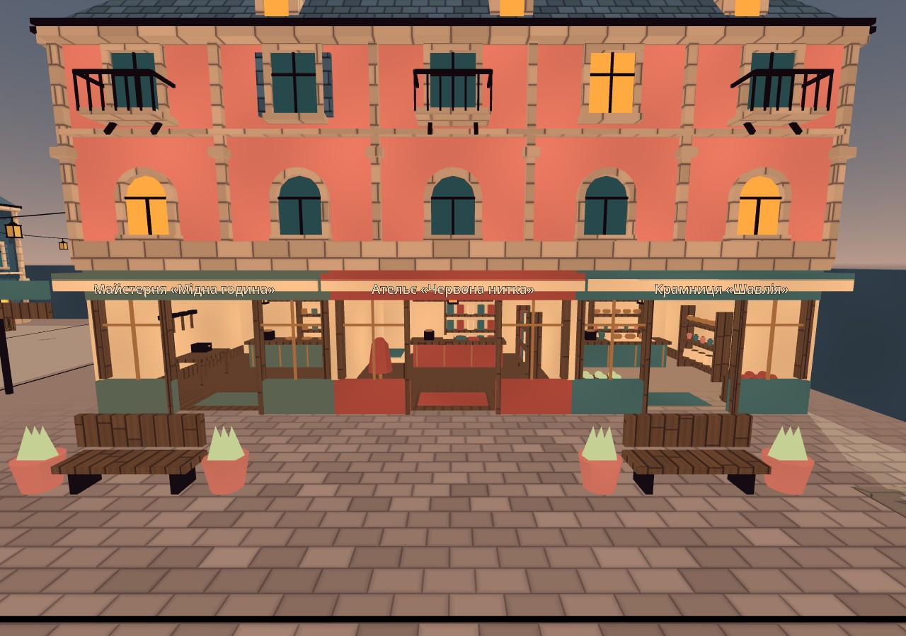
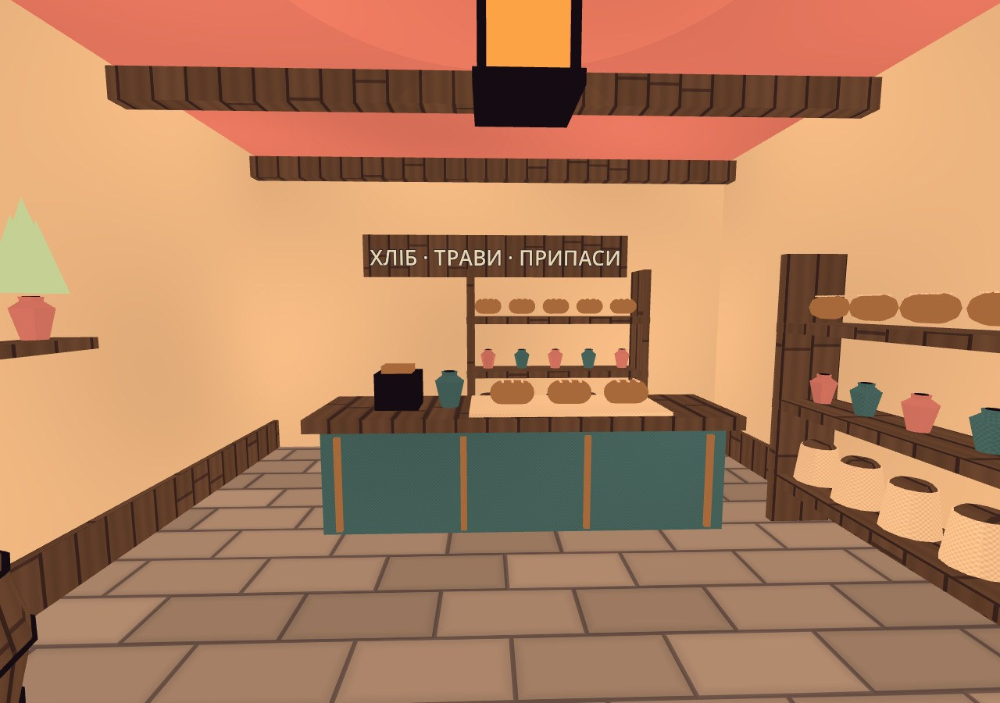
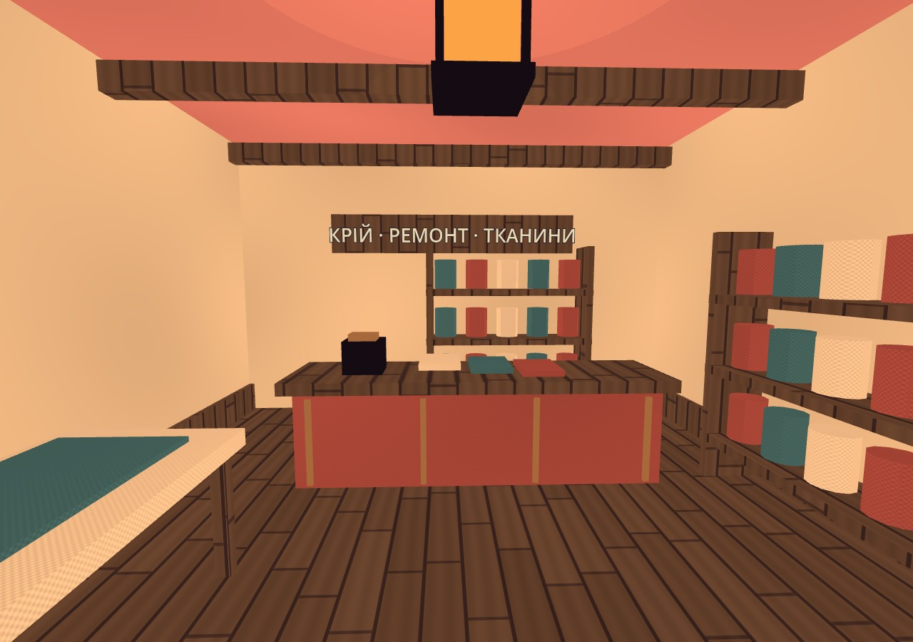
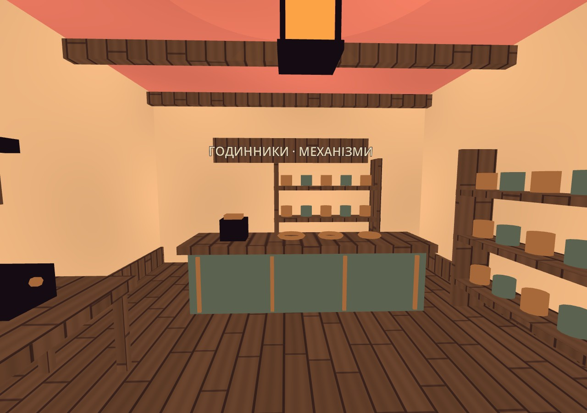

# Прохідний квартал: три крамниці Cronshift

2026-10-05. Поточне доручення Santos — видимий населений шматок світу: входи й інтер'єри замість закритих коробок. Цей документ описує геометрію та художній прохід; торгівля, мешканці й завдання мають окрему реалізацію.

## Аудит і погляди

База `f24d973` мала суцільний `SouthWestBlock` 20×10×18 м, декоративні вікна й чотири ринкові ятки. У будинки фізично зайти було неможливо. Прочитано `CityLayout`, `CityDistrict`, `CityArchitecture`, `CityMarket`, `CityMaterials`, [[Style-Guide]] та [[Textures-Registry]]. На поточному диску немає каталогів CC0 паків, згаданих у старому дослідженні; нових байтів/ліцензій не вигадували. Перевикористано чинний процедурний market kit та його матеріальні пакети.

| Варіант | Наслідок | Вибір |
|---|---|---|
| Двері з телепортом в окрему сцену | Швидко, але приховує непрохідну зовнішню коробку й розриває міський рух | Не обрано |
| Нові окремі будиночки на вулиці | Забирає перевірені проходи, бойові кишені й маршрут рамп | Не обрано |
| Відкрити нижній поверх існуючого корпусу | Реальні двері та безперервний вхід, збережений силует дахів | Реалізовано |

Погляди: гравець із центральної площі має бачити входи; гравець зі стартового ринку потребує вказівника; власник третьоособової камери — достатньої висоти стелі; працівник NPC — вільного місця за прилавком; дослідник дахів — збережених опор/рампи/моста; художник — різних силуетів товару й спокійної Sketch-Cel палітри; власник M3 — спільних material batches замість сотень draw calls на дрібні предмети.

## Реалізація

`SouthWestBlock` тепер починається над першим поверхом (нижня грань y=4 м); задній об'єм лишається суцільним. Нижній фасад створює `CityInteriors`, а `CityArchitecture` починає декоративну верхню частину на y=4. Двері — відсутній об'єм між двома косяками, без невидимої стіни, тригера телепорту чи завантаження сцени. Ширина 2.4 м, висота 3.2 м; кожна кімната приблизно 6.6×8 м. Це авторські розміри PLACEHOLDER до ігрового приймання.

| id | Назва | Двері (x,y,z) | Відмінні предмети |
|---|---|---|---|
| `grocer` | Крамниця «Шавлія» | −26.6, 0, 12 | фрукти у ящиках, надрізані буханці, мішечки, глечики, трави, скатертина на прилавку |
| `tailor` | Ательє «Червона нитка» | −20, 0, 12 | манекен, рулони, стопки тканини, розкрійний стіл |
| `workshop` | Майстерня «Мідна година» | −13.4, 0, 12 | верстак із лещатами, інструменти на стіні, мідні деталі, кільця механізмів, табурет |

У всіх трьох: суцільні бокові/задні стіни, підлога, балки, навіс, прилавок, полиці, ліхтар і тепле локальне світло, нерухомі читабельні вивіски та оздоблення нижньої частини стін. Перед фасадом — дві групи лавок із кашпо. З боку стартового ринку є вказівник крамниць і верхнього маршруту. Великий центр вулиці й бойові кишені не заставляли декором. Вітринні отвори відкриті; скління не симулюється.

Дрібні декоративні товари не мають окремих фізичних тіл. Стіни, полиці, прилавки, робочі столи й сидіння мають прості колізії; матеріальна геометрія зводиться в спільні batches через наявний `CityMarket`. У `CityMarket` виділено спільний `_flush_batches()`, його ринкова композиція не змінена. Нових файлів у `game/assets/` немає, генерацій і нових ліцензій немає.

## Кадри цього проходу

## Контракт місць

`CityPlaces.shops()` повертає `id`, українську `title`, `npc_index`, `door`, `approach`, `visit`, `worker`, `worker_path`, `bounds`, `radius`, `door_width`, `door_height`. `worker_positions()` — словник трьох робочих позицій. `landmarks()` — ці три крамниці та `clock_tower`, `roof_bridge`, `market_court` з `id/title/position/radius`.

Worker path проходить через середину дверей, центральний прохід, точку z=16.65 і правий боковий прохід за прилавок; він не перетинає стіл майстерні. `visit` стоїть на z=15.4, але для розмови на короткій дистанції можна підійти до z=16.3. Керування NPC/торгівлею не заховане в коді меблів.

## Перевірка та межі

Godot **4.7-stable**, окрема копія `/tmp/nir-art-check`: `CITY_GEOMETRY_COMPLETE checks=1798 failures=0`. До чинних перевірок рамп, мосту, опор, бойових кишень і гарпунних точок додано корпусний прохід кожних дверей, маршрут до робочого місця, вільну лінію розмови над прилавком, тверді прилавки/стіни й ліміт пакетів матеріалів. Журнал `/tmp/nir-art-district-geometry.log`.

`tools/world/city_interiors_capture.gd` зняв **5 справжніх кадрів** через Xvfb/Compatibility/Mesa llvmpipe: фронтальні фасади, кут вулиці й три кімнати. Камера цього інструмента оглядова, освітлення — виробниче з `CityWorld`. Огляд очима виконав арт-агент; приймання героя з виробничою камерою виконує окрема audit-смуга. Зображення не є свідченням FPS на M3. Загальні check/gates і NPC/quest інтеграцію перевіряє координатор пакета.

Це три облаштовані прохідні приміщення в наявному кварталі, а не завершене повне місто: верхні поверхи не відкриті, нового міського стримінгу чи канону сюжету цей код не додає. Художнє приймання Santos та комфорт камери на цільовому Mac залишаються окремою перевіркою.

## Related

- [[Style-Guide]] · [[Textures-Registry]] · [[2026-10-05-City-Texture-And-Icon]] · [[Art/2026-10-04-City-Style-Match]] · [[Plans/2026-10-04-City-First]] · [[ADR-023-City-First-Exploration]]
