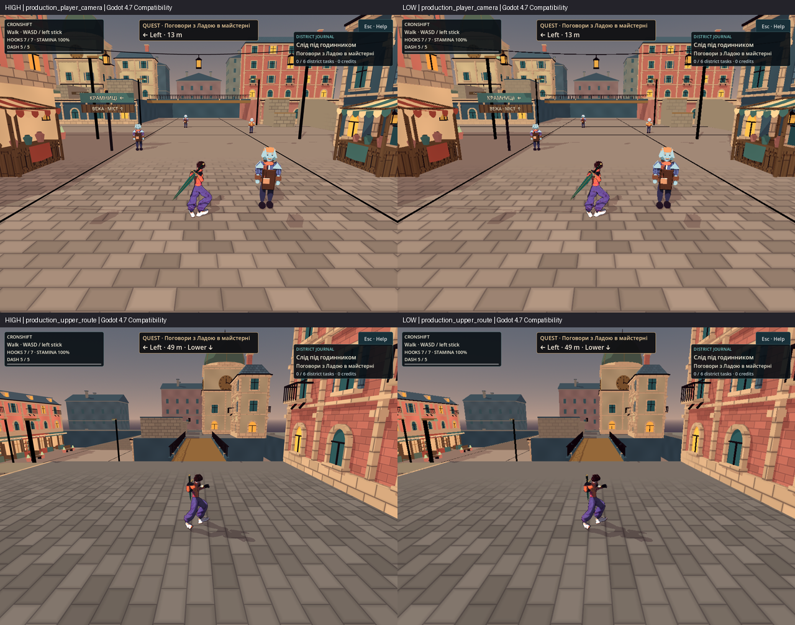
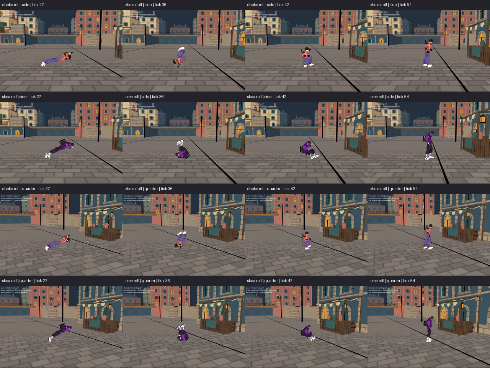
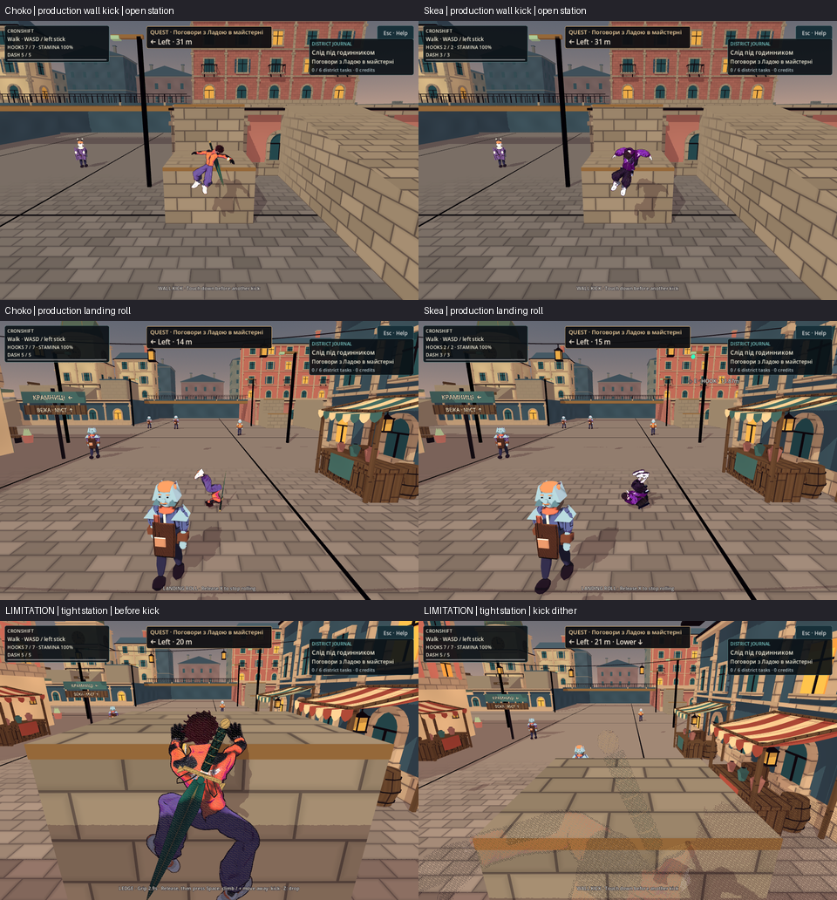

# Трюки й міські поверхні: контракт художнього огляду

2026-10-05 · T6 Аполлон. Сфера: незалежний огляд хвилі фізики, трюків і якості
картинки. Нові ассети, генерації та зміни production у цій T6-смузі відсутні.

## Перевірена вихідна точка

У цій сесії прочитано `CityMaterials.gd`, `city_surface.gdshader`,
`water_toon.gdshader`, `toon.gdshader`, `fx_stroke.gdshaderinc`, освітлення
`CityWorld._build_lighting`, чинні [[Style-Guide]] та [[VFX-Direction]].
Міська поверхня вже має матовий opaque pass, графіт-баклажанове чорнило,
одну освітлену смугу й лілову тінь, проєкцію в світових метрах та спільні
матеріали родин. Шви/варіація згасають через `fwidth`, тканина має окреме
згасання плетіння. Це база для обмеженого поліпшення, а не відсутній шейдер.

Канон міста — приглушена теракота, вохра, холодний камінь і сланцеві дахи;
свіжі окремі вирізки мають перевагу над історичними панорамами. Не додаємо
до цієї хвилі bloom, новий неон, фотографічні normal maps або суцільний шум.
Наявний VFX-контракт допускає мальовані штрихи й ступінчасті привиди для
відповідних навичок; це не вимога дублювати такі ефекти в кожному трюку.

Історичний каталог `/workspace/nooneisreal-evidence/` на час первинного
огляду відсутній. Попередні результати в документах не є новим native доказом.

## Варіанти та погляди

| Варіант | Користь | Обмеження |
|---|---|---|
| Лише нові рухи, матеріали без змін | Найменший візуальний ризик | Не поліпшує стабільність дрібних ліній під час руху камери |
| Обмежене згладжування/згасання деталей і економні профілі | Зберігає палітру, робить рух спокійнішим | Потрібне парне native порівняння, щоб не стерти близьку матеріальність |
| Нові світні шари та густі процедурні деталі | Більше декоративної активності | Слабша читабельність опор, відхід від матового Sketch-Cel, більша вартість |

Рекомендація T6 — другий варіант разом із читабельними фазами трюків.
Погляди, якими перевіряємо вибір:

- Новачок: бачить опору й напрям наступного руху без знання анімації.
- Досвідчений гравець: відрізняє початок трюку, пік і момент повернення контролю.
- Гравець на невеликому екрані: герой не губиться серед кладки та штрихів.
- Глядач, чутливий до руху: немає нової тряски, мерехтіння чи різких спалахів.
- Художник: тінь і матеріальність залишаються графічними, пальці й стопи не
  видають політ за контакт з опорою.
- Користувач слабшого GPU: економний профіль зберігає фізичні опори, орієнтири
  та інтерфейс; простіша картинка не має приховувати gameplay інформацію.

## Мінімальні вимоги до кандидата

1. Віддалені шви й плетіння не мерехтять, а близький камінь/дерево/тканина
   лишаються відмінними. Просторова стабільність важливіша за густоту деталей.
2. Новий рух читається через силует і напрям корпусу. Початок, пік і вихід
   мають відрізнятися; поза не підміняє справжній контакт кисті/стопи.
3. Силует спорядження й герой залишаються видимими на теракоті, камені та
   темному даху. Локальний слід руху не закриває точку приземлення.
4. Налаштування якості не прибирає колізії, опори, важливі орієнтири чи HUD.
   Назви профілів не означають виміряний FPS на M3.

## Native перевірка

`tools/world/city_capture.gd` створює 14 geometry views, монохромний план і
3 production кадри. Geometry views використовують production lighting builder;
лише production views мають звичайну ігрову камеру. Обов'язковий огляд A/B:
`street_entry`, `facade_close`, `market_close`, `canopy_underneath`,
`production_player_camera`, `production_upper_route`. Камера, розмір кадру,
експозиція та renderer однакові між порівнюваними версіями. Для мерехтіння
потрібна коротка послідовність руху камери: один статичний PNG його не доводить.

`tools/animation/parkour_capture.gd` подає справжні дії через `InputRouter`
і звичайно використовує `CityDistrict`; однак має ізольовані освітлення та
камеру. Ці кадри доводять вигляд контактів, а не весь production presentation.
Нові трюки потребують власної послідовності початок/пік/вихід для обох героїв
і хоча б одного кадру у звичайному міському ракурсі. Контакт із виступами
перевіряється також з протилежного боку.

Блокери: видиме проникнення в опору; неправдоподібний контакт; зниклий герой
або край приземлення; світлий/чорний shader artifact; тканина з отворами;
виразне мерехтіння чи велика зміна палітри між профілями. Headless parse,
assertions і числові виміри не є художнім прийманням. Native llvmpipe не
доводить продуктивність або комфорт M3.

## Native огляд якості

T6 особисто прочитав `quality/native-01.log` та `quality/native/receipt.json`
у `/workspace/nooneisreal-evidence/parkour-quality/`: Godot **4.7 stable**, native
**Compatibility / Mesa llvmpipe**, **44 PNG / 0 failures**, лише відоме попередження
VSync. Оглянуто low/high/baseline міських видів, парні near/grazing проби тканини
й дерева, contact sheet восьми кадрів pan для candidate та baseline, а також
усі чотири повні production кадри high/low. Medium окремо художньо не приймався.

- Геометрія, пласка палітра, суцільний тент і близька фактура збережені; у
  матеріальних A/B немає очевидного нового shader artifact або втрати матеріалу.
- High краще тримає край героя, дроти та діагоналі дахів. Low має видимі
  сходинки й м'якшу 3D-картинку, але герой, опори й напрям маршруту читабельні;
  HUD зберігає різкий текст, бо не зменшується разом із 3D render target.
- Нова різниця wood/cloth у цих кадрах невелика. Статичний sheet короткого pan
  не є вимірюванням суб'єктивного мерехтіння або доказом значного візуального
  прискорення; великого художнього поліпшення з нього не заявляємо.

На однаковому production player-camera receipt показує **1860 draw calls** і
**136506 primitives** для обох профілів, а конфігуровану частку 3D-пікселів
**1.0 → 0.5625**. Це зменшення render scale, не доведене прискорення CPU/GPU.
Forward+ та M3 цим Compatibility capture не прийняті. У межах оглянутих кадрів
нових блокерів для обмеженої quality зміни немає.

Це зменшений оглядовий sheet із native PNG; повні кадри й receipt — у наведеному
evidence-каталозі. Масштабування sheet не використовувалося для числових вимірів.

## Native огляд перекату

У `/workspace/nooneisreal-evidence/parkour-tricks/` T6 прочитав raw
`validation/motion/native-side.log`, `native-quarter.log`, `compact-head.log`
і trace обох ракурсів. Обидва native запуски — **93 PNG / 275 ticks / 0 failures**,
Godot 4.7 Compatibility llvmpipe, лише відоме попередження VSync. Focused
`compact-head.log` має **3265277 checks / 0 failures**; це числовий доказ
виконавця, прочитаний T6, а не заміна художнього огляду.

T6 переглянув послідовності всіх чотирьох маршрутів збоку і під кутом 3/4,
а середину перекату — також у повних кадрах. Перекат має зрозумілий кидок
уперед, перевертання і зібраний вихід у звичайний рух. Обидва герої зберігають
своє спорядження. Тривалого зависання або зламаного виходу в оглянутих
послідовностях немає; обмежений стилізований перекат художньо прийнятий.

Межа цього приймання істотна: у Choko спорядження коротко піднімає тіло над
підлогою. Trace side tick39, progress0.5 фіксує мінімальну висоту **body skin
0.28955 м**; це не постійний контакт тулуба з підлогою. Skea у відповідній
середній фазі tick40 має **0.09018 м**. Support враховує спорядження, тому
«вся геометрія над підлогою» не дорівнює анатомічному перекату по плечу.
Цю особливість не приховано камерою або назвою тесту. Ізольоване освітлення
capture не дає надійної контактної тіні; mm clearance оцінюється числовим
oracle разом із послідовністю. Повного production-camera gameplay приймання
нових трюків цей station-start capture не замінює.

## Виявлений дефект другого ракурсу wall kick

У первинному `motion-quarter/` для обох wall-kick маршрутів камера знаходиться
за синьою стіною: герой повністю закритий у всій оглянутій послідовності.
Числовий `observed=true` цього не виправляє. T6 відхилив ці кадри як
доказ другого ракурсу й передав T2 вимогу змінити лише capture camera.
Збоку героя видно. Повтор `motion-kicks-opposed/` змінив лише ракурс capture,
не production чи геометрію: особисто прочитаний `native-kicks-opposed.log`
має **42 PNG / 124 ticks / 0 failures**. T6 оглянув обидві послідовності та
повні Choko tick24 / Skea tick30: герої тепер видимі, читаються контакт,
відрив і повітряний вихід. Дефект доказу усунено, scoped wall-kick art прийнятий.
Власноруч прочитані side trace дають minimum wall-plane body-skin clearance
під час kick **Choko 0.19819 м / Skea 0.22815 м**; це не означає, що стопа
залишається на стіні після відштовхування. Старий закритий стіною quarter
залишається відхиленим, незалежно від успішного numeric `observed=true`.

## Production камера: доповнення та відкрита межа

T6 прочитав три production receipts: `native-production/receipt.json`
(**90 PNG / 0 failures**) та `native-production-open-choko/receipt.json`,
`native-production-open-skea/receipt.json` (**по 19 PNG / 0 failures**).
Це Godot 4.7 Compatibility, high quality, 960×640, справжні `CityWorld`,
`CityCamera`/SpringArm, світло та HUD, без примусового обертання камери.
Capture починається із явно заданих станцій, а не суцільного проходження зі spawn.

Переглянуті production roll-послідовності Choko/Skea та before/peak/after
відкритої wall-kick станції `[12, 0, -3.3]` підтверджують читабельність рухів
у звичайній камері. У повних кадрах Choko roll33, Skea roll36 та обох kick29
герой, напрям руху, опора й HUD видимі. Scoped production приймання стосується
цих відкритих видимих опор і не поширюється автоматично на кожен кут міста.

**Відкрита camera limitation:** тісна станція `[4, 0, 31.4]` стискає камеру.
Перед kick (Choko hang18/21, Skea hang18) вона вже дуже близька й застосовує
proximity stipple; у Choko kick36 герой майже зникає в dither, а уступ закриває
нижню частину кадру. Цей production вигляд T6 **не приймає**. Camera/proximity
код у хвилі не змінювався, але baseline попереднього backward drop не знімався,
тому причинну регресію нового трюку або доведене старе походження не заявляємо.
Це виявлений крайовий випадок production camera; успішний відкритий station
його не виправляє. Наступне обмежене завдання — читабельність камери біля
тісних опор, із власними регресіями.

У цьому документі рівно три компактні sheets з native PNG. Нічого не
домальовано; зменшення і підписи служать огляду, повні докази лишаються в
evidence-каталогах. Eye/mouth art, звук, фізичний контролер, Forward+ та M3
FPS не входять у це приймання.

## Статус

Первинний аудит, обмежений native quality огляд і scoped roll/wall-kick
приймання завершено, включно з production-camera supplement на видимій
відкритій опорі. Тісний camera corner залишається явно відкритою межею.
Production код та Godot у T6-смузі не змінювалися й не запускалися.

## Related

- [[Style-Guide]] · [[VFX-Direction]] · [[2026-10-04-City-Style-Match]]
- [[2026-10-05-Parkour-Visual-Audit]] · [[2026-10-05-Whole-Body-Visual-Audit]]
