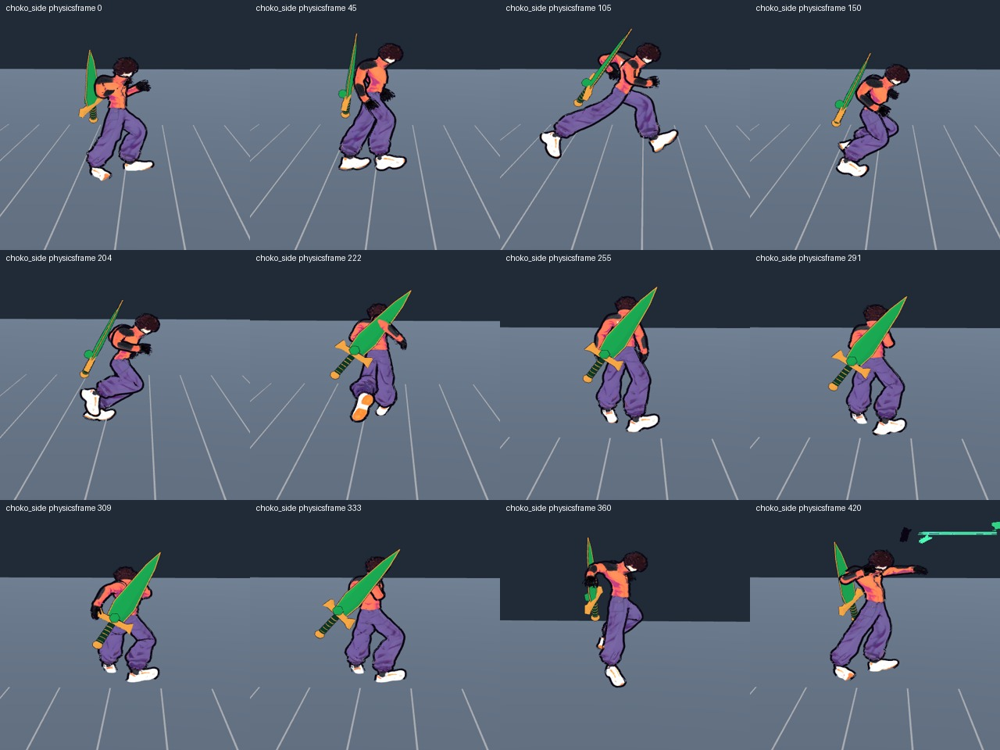
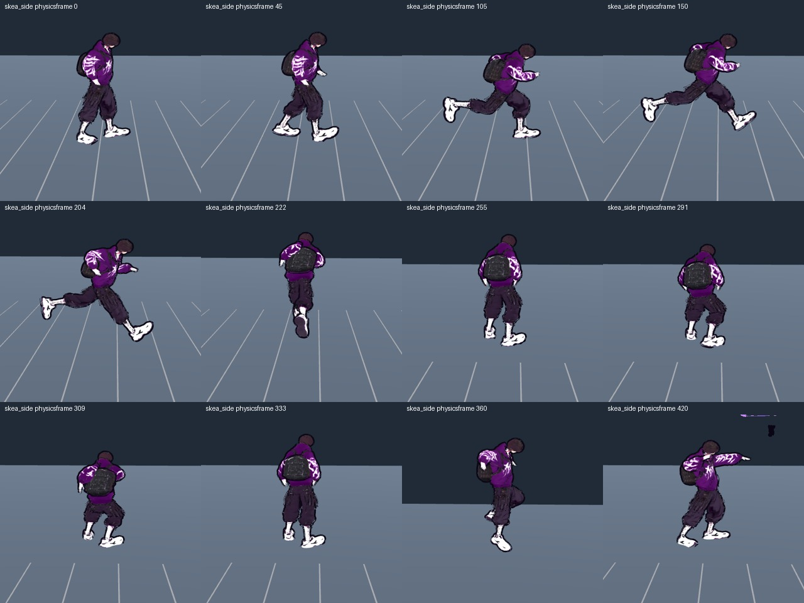
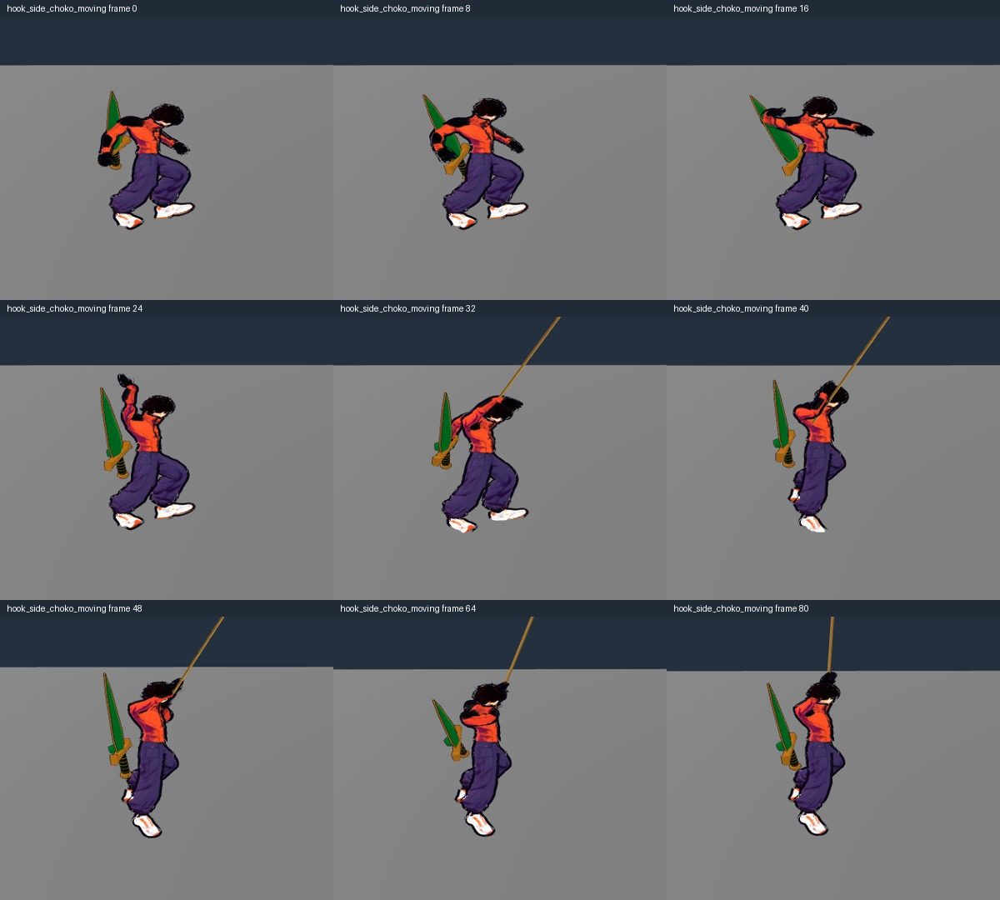
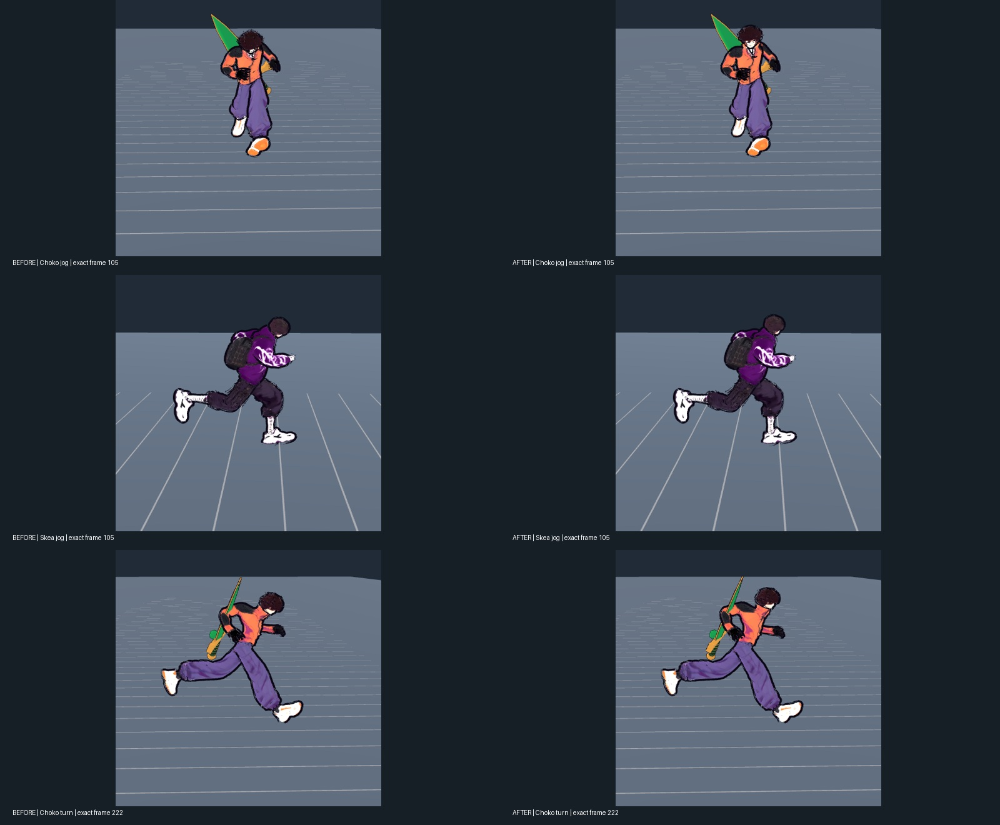
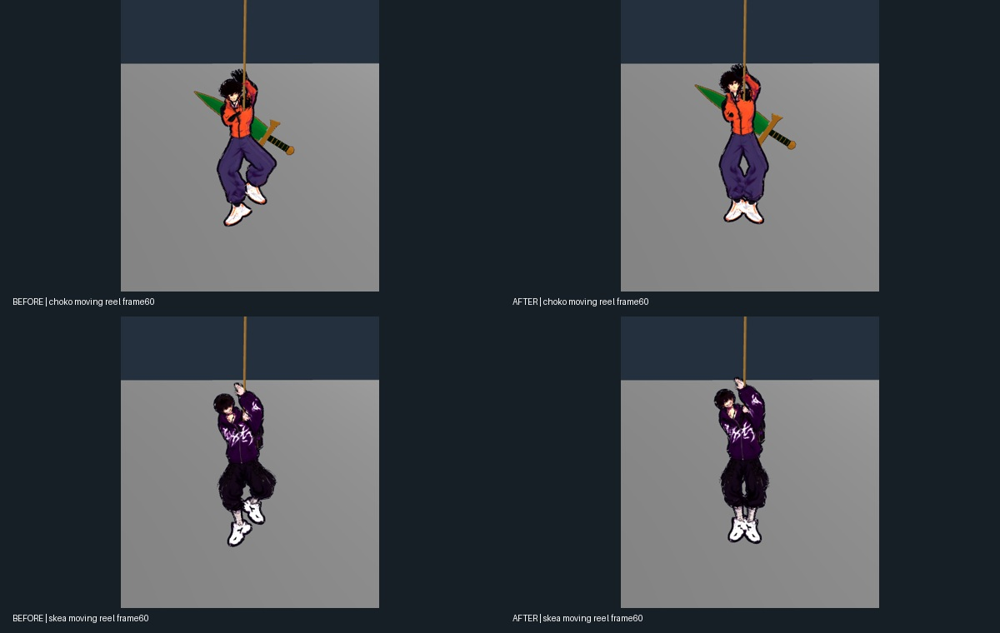
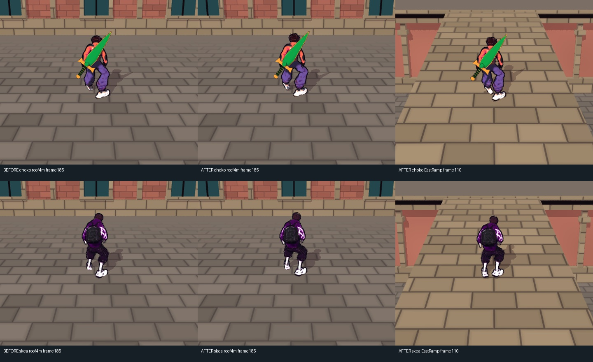

# Цілісність руху героя: native арт-аудит

2026-10-05 · T6 · baseline `3df43a520e494c809905854efff44ffe7de4341f`. Завдання Santos: спершу анатомічно узгодити все тіло й фізичний рух. Попередній GREEN для точності кисті на мотузці не доводить доброго руху таза, стоп, хребта й голови. Production і assets у цьому аудиті не змінювалися.

## Baseline: що видно без припущень

1. **Погляд систематично спрямований у підлогу.** На обох героях це видно збоку в повільній ході, бігу, зупинці й блокуванні; спереду обличчя часто перекрите волоссям. Нахил тулуба в бігу додає нахил голови, замість окремого шийного компенсування. Для Choko native frame 120: реальні 5.6 м/с, `Jog_Fwd`, grounded=true. Точні кути й джерело clamp перевіряє T2; T6 не виводить числовий pitch із картинки.
2. **Поворот на 90° не читається як послідовна зміна опори.** У кадрах 204 → 222 силует розвертається загалом, немає виразного раннього погляду/верхньої частини корпуса з подальшим тазом. Це художній критерій для CP3, а не твердження, що всі кістки математично нерухомі.
3. **Мотузка рухає руки переконливіше за решту тіла.** У moving windup 0–16 форма нижньої половини практично та сама, хоча body продовжує гальмувати. У taut/reel 40–80 коліна тримають асиметричну зігнуту позу, корпус майже вертикальний; через це неясно, куди навантаження від рук переходить через плечі, хребет і таз. При цьому старий probe звітує grip error = 0: локальна точність не є оцінкою всієї анімації.
4. **Опора стоп потребує окремого вимірювання.** Плоске світло й відсутність контактної тіні можуть створити враження зависання навіть за правильного положення sole. Тому це не оголошується penetration/slide лише за sheet. Для приймання потрібні skinned sole/world support дані T4, реальна рампа й підвищена підлога, а також безперервна послідовність старту/зупинки. Сам toe-bone origin не дорівнює найнижчій точці підошви.

## Відтворення та межі доказів

Ізольований незмінний game snapshot: `/workspace/nir-whole-art-before/game`. Godot 4.7 stable, Linux/Mesa llvmpipe, GL compatibility, Xvfb :98 без MIT-SHM. Це не перевірка M3 або hardware FPS.

Докази: `/workspace/nooneisreal-evidence/whole-body/`, `README.md` із provenance, `probes/` із відтворюваними сценаріями. Actual Fighter/InputRouter, реальна CharacterBody collision floor, чинний animator/SkeletalRig; manual probe просуває їх рівно на 1/60 с. Камера супроводжує лише перенос тіла й лишає світову орієнтацію, тому після повороту «front» стає боковим ракурсом навмисно.

Ранній locomotion pass: 4×450 physics ticks, PNG кожного третього tick (600 кадрів / чотири 20fps відео), sidecar: 1800 рядків. У ньому три назви spine/neck були хибними й пропущені; інші bone fields правильні. Назви виправлено на реальні `Spine02`, `Spine01`, `neck` для наступного повного60fps pass. Незалежний T4 sidecar з правильними кістками/підошвами доповнює ранній запис.

Timeline: idle, analog0.35 walk, full input, stop, restart, 90° turn, crouch/exit, block/exit, moving jump/landing, jab/recovery. Повний інпут тут реально вибирає `Jog_Fwd`, не вигадану клавішу sprint. Окремий rope baseline — **720 PNG / вісім 60fps відео**: обидва герої, high cast зі спокою та початковою швидкістю 6.2 м/с, front/side, реальні WINDUP/THROW/PULL/HANG, reel 40–77; запис закінчується до detach, тому rope-release landing ним не заявлено.

Відео кодуються з native PNG без проміжних згенерованих кадрів, згладжування чи зміни швидкості. Sheets лише обрізають порожні поля й підписують початковий номер physics frame. Основний matched baseline завершено: **locomotion 60 fps — 1800 PNG, 1800 trace rows із правильними spine/neck, чотири відео по 7.5 с** (`before/locomotion60`, `before/videos60`). Actual CityWorld — **450 PNG / два 60fps відео**: підйом EastRamp, stop/crouch/exit, потім явно заданий fixture restart на даху 4 м і crouch/exit. Це не видається за безперервно пройдений шлях до даху. Камера/геометрія/освітлення production; NPC приховано лише для ізоляції героя. `source-provenance.json` перевіряє ключові production файли копії побайтово проти 3df43a5. Candidate після фіксації коду повторює ті самі helper/камери.

## Фінальний кандидат CP5: native перегляд

Frozen snapshot: `/workspace/nir-whole-art-after/game`; manifest `after/source-provenance.json`. `HeroBodyMotion` SHA-256 починається `2ce8f976`, остаточний `HeroGroundContact` — `46864f2c`. Повторено ті самі камери, інпути й physics tick. Ранній candidate preview не видається за остаточний результат.

- У ході й бігу обличчя краще видно спереду: голова не успадковує весь нахил грудної клітки. Порівняння нижче використовує однаковий frame105, а не різні вдалі моменти.
- У суцільних переходах stop, turn90, crouch enter/exit, block exit та landing→jab немає побаченої T6 інверсії коліна або перевороту шиї. Верх тіла входить у поворот перед завершенням розвороту таза, зупинка повертає корпус поступово. Це візуальний висновок із конкретних записів, не гарантія всіх можливих input-комбінацій.
- У moving reel ноги обох героїв звисають під тазом, замість збереження асиметричної наземної пози. Кисть лишається на мотузці; локальний grip-check доповнює, але не замінює оцінку всього силуету.
- Переглянуто бойові all-frame sheets Choko jab/frontkick та Skea lowhand/hammer, а також активні фази всіх чотирьох ударів обох героїв спереду. Ударна нога не прибита до підлоги; протилежна опора та повернення читаються. Незалежний T4 переглянув усі 878 бойових кадрів. Старі кольорові VFX над головою присутні в before/after й не є новою анатомічною регресією.

Фінальний locomotion запис: **1800 PNG / 1800 sidecar rows / чотири 60fps відео по 7.5 с**. У `after/transition_review` збережено суцільні покадрові sheets вікон переходів для обох героїв і ракурсів. T6 особисто переглянув stop148–179, turn206–237, crouch246–299, block320–344 та land/jab397–428; нумерація іншого 660-tick сценарію T4 до них не застосовується. Після turn герой виходить за край намальованих stripe-маркерів, тому доказ контакту там — незалежні full-skin виміри T4, а не лише плоска картинка. Числові пороги, опора на flat/roof/slope та grounded reactions описані в [[2026-10-05-Whole-Body-Anatomy-Review]].

Завершено також **720 hook PNG / вісім 60fps відео** і **450 actual CityWorld PNG / два 60fps відео**. У міському записі обидва герої проходять рампу, присідають і виходять із присідання; окремий явно позначений restart перевіряє дах на висоті 4 м. Production камера, освітлення, геометрія й колізії збережені. Огляд final кадрів рампи/даху не виявив видимого провалювання ніг або нового стрибка шиї; малу зміну підошви не перебільшено — її числове підтвердження належить T4 full-skin probe.

Компактне відео для review: `/workspace/nooneisreal-evidence/whole-body/after/whole-body-before-after-33s.mp4` — **33 с, 1980 кадрів, 60 fps, 1280×480**. Це повні чотири 7.5-секундні locomotion послідовності та дві 1.5-секундні moving-hook послідовності, before/after поруч; лише resize, padding і текстові підписи, без інтерполяції. Окремі повні міські відео: `after/videos60/city_ramp_choko.mp4` і `city_ramp_skea.mp4`. `comparison-metadata.json` і `video-metadata.json` містять перевірені ffprobe дані. Порівняння всіх 1800 locomotion sidecar рядків дало **0 відмінностей body / velocity / state / grounded**: цей native запис показує presentation-зміни на тому самому фізичному маршруті.

## Межі приймання

Перевіряти одночасно: стопу відносно конкретної опори → коліно/стегно → таз → хребет/плечі → шию/погляд. Під час зупинки опорна стопа не має їхати разом із тілом; поворот не має скручувати застигле коліно; повітряна поза має відрізнятися від стояння; нахил при гальмуванні/підтягуванні має бути пов'язаний із фактичним рухом. Порівняти повні 60fps послідовності обох героїв, а не обрати один вдалий contact frame. Цей T6 висновок обмежено записаними сценаріями. Перевірку M3/gamepad feel і загальне приймання визначає root з незалежним T4; Linux software capture не доводить апаратну продуктивність.

## Related

- [[2026-10-05-Whole-Body-Motion]] · [[2026-10-05-Whole-Body-Session]] · [[2026-10-05-Whole-Body-Anatomy-Review]] · [[2026-10-05-Whole-Body-Retarget-Research]] · [[Style-Guide]] · [[ADR-004-Physics-Is-Presentation]]
