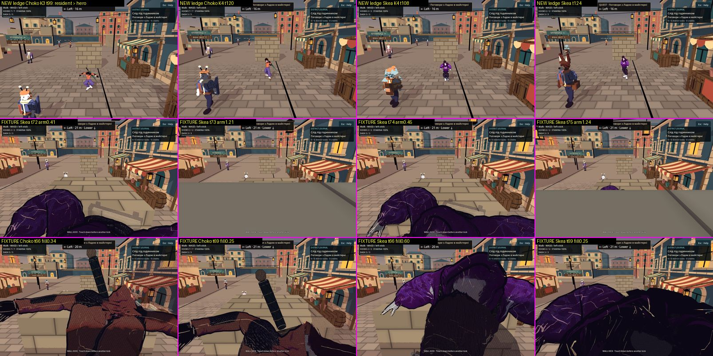

# Тісна опора після виправлення: художнє приймання T6

2026-10-07 · T6 Аполлон · **Статус:** вердикт за мірилами M1–M7 з [[2026-10-07-Tight-Station-Readability-Criteria]]
на кадри T2 після кроків 1–4 [[2026-10-07-Tight-Support-Camera]] (коміт `b5f10d2`, журнал
[[2026-10-07-Tight-Support-Camera-Fix]]). Генерацій не було, витрачено 0 кредитів. `game/` і `tools/` не змінювалися.
Пороги без джерела позначено **PLACEHOLDER**.

## Підсумок

| що | вердикт | одним реченням |
|---|---|---|
| Нова навчальна опора `(4,0,18.2)` | **YELLOW** | На всіх ключових кадрах M1–M7 виконані, а proximity жодного разу не спрацьовує. Проте в K3–K4 мешканець на передньому плані вдвічі більший за героя, а Low/Medium і ручний yaw після виправлення не знімали |
| Відкрита контрольна `(12,0,-3.3)` | **GREEN** | Без змін: траса камери й героя збігається з «до» на всіх 771 тіках |
| Стара геометрія `(4,0,31.4)` як фікстура | **RED (клас)** | Після kick героя немає в кадрі ≥ 46 тіків, камера мерехтить із циклом 3 тіки. У грі цієї опори вже немає, але так поводитиметься будь-яка тісна точка міста |
| «Темна заштрихована фігура» при заливці 25 % | **YELLOW** | Як остання лінія захисту прийнятна: контур цілий, світіння й градієнта немає. Як Sketch-Cel-ескіз не прийнята: всередині силуету проступає майже чорний hull, сцени крізь нього не видно |

**Блокерів RED для перенесеної опори немає.** RED-блокери нижче стосуються класу «тісна опора біля межі»: вони
забороняють ставити таку опору деінде в місті, доки їх не закрито. Злиттю виправлення вони не заважають.

## Джерела й межі

- **Шлях доказів виправлено.** У дорученні вказано `<scratchpad>/evidence/t2/fix/camera/after-matrix/`, але
  `ls <scratchpad>/evidence/t2/fix/camera/` → `No such file or directory`. Фактичні каталоги:
  `<scratchpad>/evidence/t2/camera/after-matrix/` (18 маршрутів, 451 PNG) і `.../camera/after-strips/` (4 маршрути, кожен тік).
  «До» лежить у `.../camera/matrix-high-v2/` і `.../camera/tight-strips/`. Тут
  `<scratchpad>` = `/tmp/claude-0/-home-user-nooneisreal/4c591b0b-bd83-5f00-bbc5-b305eb8acb26/scratchpad`.
- **Що саме знято.** `cat after-matrix/run.meta` → `head=6318e02…`, `probe_sha256=3c58ccc3…a0bed93`. На HEAD
  `sha256sum tools/camera/tight_station_probe.gd` дає той самий хеш, а `git diff --stat b5f10d2 HEAD -- game` порожній.
  Константи в `receipt.json` (`production_floor 0.25`, `production_rate 9.21`) збігаються з
  `CityCameraProximity.gd:11` і `CityCamera.gd:13`. Байтову тотожність `game/` у момент зйомки я не перевіряв.
- **«До» — це `f27fd67`.** `matrix-high-v2/run.meta` → `head=8bcb278…`; `git diff --stat f27fd67 8bcb278 -- game` порожній.
- **Умови зйомки** (з `receipt.json`): native 960×640, Compatibility/llvmpipe, High, MSAA 2×. Це не M3 і не Forward+.
- **Як я дивився.** Кожен вердикт нижче спирається на кадри, які я сам відкрив: native PNG/JPG і власні зведення та кропи
  (лише PIL crop/resize) у `<scratchpad>/t6/sheets/`. Числа з `receipt.json` я брав тільки як підпис до кадру.
  Ключові кадри зібрано в зведення:

**Звірка тверджень T2 з кадрами і receipt:**

| твердження | команда | вихід | висновок |
|---|---|---|---|
| Контур не відкидається | python по `after-matrix/receipt.json`: `min(applied_outline)` | `1.0` на 2401 тіку | підтверджено |
| На новій опорі proximity не вмикається | там само, тіки з `applied < 1` по маршрутах `practice_*` | `0`, крім `choko_practice_hang` t0–14 (0,86 → 1,00) | підтверджено з винятком: це перший маршрут прогону, перехідний стан одразу після завантаження світу. Поза зондом не перевірено |
| Відкрита станція «біт у біт» | порівняння полів камери й героя `matrix-high-v2` і `after-matrix` | 771 тік, розбіжностей 0 | траса тотожна. PNG — ні: `cmp` дає 30–39 різних файлів на маршрут, але змінено ≤ 0,19 % пікселів (поріг 24 рівні), і лише у фоні |
| Розмір героя як на контрольній | bbox `m*_visible_mask.png` (480×320) | нова 16–22 %, відкрита 19–21 %, стара hang 75–88 % висоти кадру | підтверджено. **T6 погоджує ≈ 20 % висоти кадру як міську норму** для hang/drop/kick (PLACEHOLDER до M3/Retina) |
| Мешканець «на мить» більший за героя (t130) | `after-strips/*_practice_kick/0100–0144`, кожен 4-й тік | мешканець більший за героя на всіх 12 переглянутих тіках обох героїв | **не «на мить»**: щонайменше 0,73 с, тобто весь кінець запису |

## Вердикт по кадрах

Шлях кадру відносно `<scratchpad>/evidence/t2/camera/`. M7 (HUD `LEDGE · Grip …` / `WALL KICK · …`) читається на
всіх переглянутих кадрах, тому окремої колонки для нього немає.

| кадр | герой | дія·фаза | станція | профіль | M1 | M2 | M3 | M4 | M5 | M6 | фейд (що, як) | стиль: лінія/палітра | вердикт | причина |
|---|---|---|---|---|---|---|---|---|---|---|---|---|---|---|
| `after-matrix/choko_practice_hang/0042.png`, `0090.png` | Choko | hang·H1, H2 | нова | High | так | так | так | — | так | так | немає (заливка 1,00) | так | GREEN | обидві чорні рукавиці лежать на дерев'яному краї, куртка, волосся й тінь на стіні читаються |
| `after-matrix/skea_practice_hang/0066.png`, `0090.png` | Skea | hang·H1, H2 | нова | High | так | так | так | — | так | так (∞ на рюкзаку) | немає | так | GREEN | у кропі ×4 обидві світлі кисті видно на верху опори. Зонд рахує 4/6 точок, бо промінь до кістки зачіпає край, але кадр показує контакт |
| `after-matrix/choko_practice_drop/0060.png`, `0072`, `0078`, `0090` | Choko | drop·D1–D4 | нова | High | так | так | — | так (t60, 2 тіки після вводу t58) | так | так | немає | так | GREEN | тіло опускається нижче краю, місце приземлення перед опорою видно. Розкинуті руки — питання анімації, на контрольній так само |
| `after-matrix/skea_practice_drop/0060.png`, `0072`, `0078`, `0096` | Skea | drop·D1–D4 | нова | High | так | так | — | так | так | так | немає | так | GREEN | те саме |
| `after-strips/choko_practice_kick/0058.jpg`, `0062`, `0070`, `0080` | Choko | kick·K1, K2 | нова | High | так | так | частково | так | так | так | немає | так | GREEN | на тіку вводу кисті вже відпущені, контакт читається через тінь на стіні, як і на контрольній. Відліт до камери видно за ≤ 4 тіки |
| `after-strips/skea_practice_kick/0060.jpg`, `0064`, `0072`, `0082` | Skea | kick·K1, K2 | нова | High | так | так | частково | так | так | так | немає | так | GREEN | те саме |
| `after-matrix/choko_practice_kick/0099.png`, `0120.png`; `after-strips/…/0100–0144` | Choko | kick·K3, K4 | нова | High | силует так, ієрархія ні | так | — | — | так | — (герой лицем до камери) | немає | так | **YELLOW** | мешканець у лівій третині приблизно вдвічі вищий за героя (оцінка на око). Героя він не закриває, герой стоїть у центрі й контрастніший |
| `after-matrix/skea_practice_kick/0102.png`, `0108.png`; `after-strips/…/0124.jpg` | Skea | kick·K3, K4 | нова | High | силует так, ієрархія ні | так | — | — | так | — | немає | так | **YELLOW** | те саме. На t108 у двох прогонах Skea на цьому місці мешканець той самий за одягом, але з різною головою (причину не перевіряв). Отже, причина у смузі, а не в одному кадрі |
| `after-matrix/{choko,skea}_open_hang/0060.png`, `0090.png` | обидва | hang·H1, H2 | відкрита | High | так | так | так | — | так | так | немає | так | GREEN | контроль |
| `after-matrix/choko_open_drop/0060.png`, `0066`; `skea_open_drop/0066` | обидва | drop·D2, D3 | відкрита | High | так | так | — | так | так | так | немає | так | GREEN | контроль |
| `after-matrix/choko_open_kick/0060.png`, `0096`; `skea_open_kick/0060`, `0078`, `0108` | обидва | kick·K1–K4 | відкрита | High | так | так | частково | так | так | так | немає | так | GREEN | мешканці малі й далеко |
| `after-matrix/{choko,skea}_tight_hang/0024.png` | обидва | стоїть, до hang | фікстура | High | ні | ні | — | — | ні | ні | заливка 0,25 | — | **RED** (фікстура) | лінза за 0,45 м: Choko поза кадром, від Skea видно лише темну верхівку внизу. Так само було й до виправлення |
| `after-matrix/{choko,skea}_tight_hang/0054.png`, `0090.png` | обидва | hang·H1, H2 | фікстура | High | так | так | так | — | так | так | немає (1,00) | так | YELLOW | герой займає 75–88 % висоти кадру, «завеликий», як і 2026-10-05 |
| `after-matrix/choko_tight_drop/0066.png`, `0084.png` | Choko | drop·D2, D4 | фікстура | High | частково | так | — | так | ні | — | крапки hull при 0,84 | ні: темні крапки | YELLOW | після приземлення камера впирається в стіну, герой зрізаний нижнім краєм |
| `after-matrix/skea_tight_drop/0072.png`, `0096.png` | Skea | drop·D2, D4 | фікстура | High | ні | ні | — | — | ні | ні | 0,25 | — | **RED** (фікстура) | від t78 до кінця запису (t120) герой займає 0–0,21 % кадру, у кадрі лише стіна |
| `after-strips/choko_tight_kick/0063.jpg`–`0072` | Choko | kick·після K1 | фікстура | High | так (контур) | так | — | частково | частково | ні при 0,25 | заливка до 0,25, крізь неї проступає hull | **ні**: маса `#0B0714`, растр 1 px | YELLOW | фігура з контуром читається, але майже чорна маса закриває край і частину вулиці (див. розділ нижче) |
| `after-strips/skea_tight_kick/0066.jpg`–`0072` | Skea | kick·після K1 | фікстура | High | так (контур) | ні | — | ні | ні на t69 | ні | те саме | **ні** | YELLOW | темна маса закриває більшу частину кадру. T2 міряє ink 45,5 % на t69, на око чорного ще більше |
| `after-strips/{choko,skea}_tight_kick/0072.jpg`–`0087`, кожен тік | обидва | kick·політ | фікстура | High | ні | ні | — | ні | ні | ні | чергується | — | **RED** (фікстура) | вид змінюється щотіку з циклом 3 тіки: темна маса → сіра стіна зблизька → вулиця. Arm Skea 0,41 → 1,21 → 0,45 → 1,24 → 1,92 → 2,50 → 0,30. До виправлення мерехтіло теж, з більшою амплітудою |
| `after-matrix/{choko,skea}_tight_kick/0099.png`–`0144` | обидва | kick·K3, K4 | фікстура | High | ні | ні | — | — | ні | ні | 0,25 | — | **RED** (фікстура) | від t87/t90 до кінця запису (t144) героя немає на жодному знятому тіку (`hero_px 0.0`) |
| Low, Medium; ручний yaw | — | — | нова / фікстура | Low/Med | — | — | — | — | — | — | — | — | **не знято** | `tight-kick-low` і `-medium` знято лише на `8bcb278`, тобто до виправлення. Після виправлення жодного Low/Medium чи orbit-прогону в `evidence/t2/camera/` немає |

## «Темна заштрихована фігура» при 25 % — чесна оцінка

**Що видно** (`after-strips/choko_tight_kick/0066–0072`, `skea_tight_kick/0066–0072`, кропи ×3 у
`<scratchpad>/t6/sheets/hatch_zoom.png`):
- Контур героя суцільний, тому фігура читається як фігура: видно руку, піхви меча, ноги. Привид без контуру, який був до
  виправлення, читався гірше. **За M1 це покращення.**
- Інтер'єр силуету майже чорний. Найчастіший темний колір у кадрі `#0B0714`: це
  `hero_outline.gdshader:8` (`0.06, 0.05, 0.09`), а не графіт `#2B2230` зі [[Style-Guide]], де прямо сказано «не `#000`».
  Розбіжність давня, її фіксує ще [[2026-10-03-Toon-Quality-Cloth]]. Поки контур тонкий, вона непомітна, а тут стає
  домінантним тоном кадру.
- Сцени крізь тіло не видно. Причина: inverted hull лежить позаду всього силуету, тож у кожну «дірку» dither-а
  потрапляє чорнило. Фон проступає лише там, де hull пригнічено (зона голови). Отже, за чинної техніки фейд нічого не
  відкриває. Він лише міняє колір героя на чорнило: заливка F означає приблизно F кольору героя і (1−F) чорнила.
- Растр — це `camera_proximity_threshold(floor(pixel))`, комірка в 1 екранний піксель, без часового члена. Сам по собі він
  не мерехтить, але читається як дрібна сітка, а не як графічне штрихування. Мірило «великий, упорядкований» не виконане.
- M6: при 0,34 помаранчева куртка Choko ще читається (`0066`), при 0,25 стає буро-чорною (`0072`). Одяг Skea темний і
  сам по собі, тож при 0,60 (`0066`) вона вже майже чорна.
- M5: у Skea на t69 маса закриває більшу частину кадру разом зі смугою приземлення. Привид до виправлення
  сцену пропускав, а ця маса ні.

**Вердикт: YELLOW.** Це опція E з мірил («dither героя з цілим контуром»), і ризик, який я там передбачив (чорні плями
від inverted hull, коли лінза в тілі), справдився.
- *Чому не GREEN:* темна маса — не «олівцевий ескіз із фоном», її тон чорніший за палітру, а растр дрібний.
- *Чому не RED:* контур цілий, нових кольорів, світіння й градієнта немає, gameplay не змінено. Головне — на новій
  опорі цей вигляд не з'являється жодного разу (заливка 1,00 на всіх тіках). Його видно лише на фікстурі.
- *Коли стане RED:* якщо ця маса з'явиться на будь-якій реальній станції на ключовому кадрі (hang, K1/K3, D3) або закриє
  місце приземлення до торкання.

**Художня вимога до T2: що має бути видно, коли лінза в межі proximity.** Код і техніку обирає T2 разом із T3.
1. **Контур** — суцільна лінія `#2B2230` по зовнішньому силуету. Це лінія, а не смуга, що товщає з наближенням
   (межа товщини — PLACEHOLDER). Цілість контуру вже є, колір — ні.
2. **Крізь розріджену заливку видно сцену за героєм:** край опори, вулицю, місце приземлення. Всередині силуету чорнило
   лишається тільки намальованими лініями (шви, складки) і ніколи не стає заливкою. Мірило: чорнило героя займає
   ≤ **10 % кадру** на будь-якому тіку (PLACEHOLDER; зараз максимум 45,5 % за receipt `skea_tight_kick`).
3. **Крапки заливки — власних кольорів героя:** у Choko помаранчеві, у Skea фіолетові, щоб M6 трималось і на нижній межі.
4. **Растр — упорядкований і крупний:** комірка ≥ 4 px при 1920×1080 (PLACEHOLDER). Він нерухомий на екрані, як і зараз.
5. **M5 на кожному тіку фейду:** край хвату й смуга приземлення лишаються видимими.
6. **Без мерехтіння:** вид не чергується між сусідніми тіками. Це питання камери (T3/T2), а мірило художнє.

Для Style-Guide: **T6 підтверджує `#2B2230` як колір hull героя**, як і просить [[2026-10-03-Toon-Quality-Cloth]].
Впровадження й кадри «до/після» — за T2. Цього пункту виправлення не вимагає. Він закриває давню розбіжність, і
темна маса від нього світлішає до графітової.

**Нижня межа.** Обов'язково міняти її зараз не потрібно, і жодне значення не поверне M5. Поки hull проступає, межа
визначає лише пропорцію «колір героя / чорнило»: 0 дасть суцільний чорний силует, а вища межа — більше кольору, але так
само непрозору масу. Кандидат на перевірку — **0,4 (PLACEHOLDER)**: на `choko_tight_kick/0066` при 0,34 куртка ще
читається, при 0,25 вже ні. Рішення лише за парою кадрів 0,25/0,4 на фікстурі, t63–t72, для обох героїв. Справжній
важіль — пункт 2: hull не має проступати всередині силуету. Коли це буде, межу переглянемо, і тоді вона, найімовірніше,
піде вниз (PLACEHOLDER).

## Блокери

**RED — клас «тісна опора біля межі»** (фікстура `ProbeTightLedge`). Ці пункти забороняють нові тісні розміщення,
перенесеній опорі вони не заважають.
- **R1.** Після kick герой поза кадром ≥ 46 тіків (t99–t144, обидва герої), після drop у Skea — з t78 до t120. Межа M1 —
  ≤ 3 кадри в переходах.
- **R2.** Мерехтіння камери t72–t87 із циклом 3 тіки. Демпфування зменшило амплітуду, але не прибрало чергування
  видів.
- Наслідок: будь-яку опору для hang/kick, за гранню хвату якої менше **3 м** вільного простору (поріг плану, PLACEHOLDER),
  не ставити, доки R1–R2 не закрито кадруванням або перевіркою прямої видимості (T3/T2). Неміряна кандидатка на той самий клас —
  стінний біг Skea `(14,0,31.25)`, 0,75 м від `SouthBoundary` (пункт «Відкрите» в журналі T2).

**YELLOW — закрити до GREEN нової опори:**
- **Y1. Композиція K3–K4.** Мешканець проходить між лінзою й місцем приземлення і стоїть на передньому плані
  ≥ 0,73 с. Вимога: у K3–K4 на навчальній опорі жоден мешканець не ближчий до лінзи, ніж герой, і не вищий за героя
  в кадрі довше **0,5 с** (PLACEHOLDER). Спосіб (смуга, опора, розклад) обирають T2/T1.
- **Y2. Матриця неповна.** Потрібні нова опора × kick × Low і Medium (Medium досі ніколи не приймався) і ручний yaw на
  hang нової опори (кут — PLACEHOLDER).
- **Y3. Темна фігура** — вимоги 1–6 вище; актуальні, доки proximity може спрацювати десь у місті.
- **Y4.** Колір hull `#0B0714` проти `#2B2230` (давнє, див. вище).
- **Y5 (не арт, для власника).** [[2026-10-07-M3-Acceptance-Checklist]] §5 досі веде на стару станцію `(4,0,31.4)`.

## Аудит і погляди

**Аудит:** таблиці вище, а також `CityCameraProximity.gd:11,75`, `camera_proximity.gdshaderinc`,
`hero_outline.gdshader:8`. Відкрите питання T3 щодо stencil у 4.7 для ShaderMaterial —
[[2026-10-07-Tight-Support-Camera-Research]].

**Варіанти для темної фігури:**

| варіант | що дає | ризик |
|---|---|---|
| A. Лишити як є | нічого не коштує | чорна маса до ~50 % кадру, тон поза палітрою |
| B. Підняти межу до 0,4–0,5 | більше кольору героя (M6) | непрозора маса лишається, M5 не повертається |
| C. Межа 0 | суцільний графічний силует | закриває ще більше, кольору героя немає |
| D. Hull не проступає всередині силуету, растр крупніший, колір `#2B2230` | справжній «ескіз із фоном» | вартість і техніку оцінює T2/T3 (stencil або глибина) |
| E. Кадрування: на реальних станціях proximity не вмикається, тісних розміщень немає | проблема не виникає | на новій опорі вже так; решту міста не міряли |

**Погляди:**

| погляд | що виграє / втрачає | що змінило у вердикті |
|---|---|---|
| Santos, автор | бачить героя в трюку на новій опорі; на фікстурі бачить чорну пляму або стіну | нова опора не RED; фікстура RED як клас |
| Новачок | губиться, коли кадр мерехтить або темніє в момент трюку | R2 — блокер класу |
| Досвідчений гравець | потребує краю й місця приземлення | M5 на кожному тіку фейду (вимога 5) |
| Малий екран / Low | растр в 1 px на scale 0,75 стане брудом; мешканець ще більше перекриє героя | Y2: Low/Medium обов'язкові |
| Чутливий до мерехтіння | цикл у 3 тіки — це строб близько 20 Гц | R2 |
| Художник | контур тримається, але чорнило заливкою — не наш стиль | YELLOW, вимоги 1–4 |
| Виконавець (T2) | D потребує нового проходу, B — один рядок | B лише як перевірка на кадрах, D — вимога |

**Вибір мірилами гри ([[ADR-019-Audit-And-Many-Views-Before-Decision]]):**
1. *Чесність і детермінізм:* усі варіанти — лише презентація.
2. *Клавіатура:* не зачіпається.
3. *Sketch-Cel:* D і E проходять, B проходить частково, A і C — ні.
4. *Ціна:* 0 кредитів.
5. *Прототип:* E вже діє на новій опорі.

**Рішення T6:** E — основне; D — вимога перед будь-яким тісним розміщенням; B — лише перевірка 0,25 проти 0,4 на кадрах;
A і C відхилено.

## Що лишається відкритим

- Low/Medium, ручний yaw, M3/Retina і Forward+ на новій опорі не знято. Станційні кадри не замінюють суцільного
  ручного проходження.
- Чи з'являється перехідний стан заливки 0,86 → 1,00 у перші 15 тіків після завантаження поза зондом, не перевірено.
- Мешканці на смузі різняться між прогонами, тож композиція K3–K4 залежить від часу. У живій грі не перевірено.
- Сирі кадри лежать лише в scratchpad. У репо є зведення T2 `fix-before-after.jpg` і моє `t6-fix-review-evidence.jpg`.

## Related

- [[state]] · [[2026-10-07-Tight-Station-Readability-Criteria]] · [[2026-10-07-Tight-Support-Camera-Fix]] · [[2026-10-07-Tight-Support-Camera]]
- [[2026-10-07-Tight-Station-Camera-Baseline]] · [[2026-10-07-Tight-Support-Camera-Research]] · [[2026-10-07-M3-Acceptance-Checklist]]
- [[Style-Guide]] · [[Cel-Shading]] · [[ADR-007-Art-Style-Sketch-Cel]] · [[ADR-019-Audit-And-Many-Views-Before-Decision]] · [[2026-10-03-Toon-Quality-Cloth]]
- [[Choko]] · [[Skea]] · [[2026-10-05-Traversal-And-Surface-Review]]
