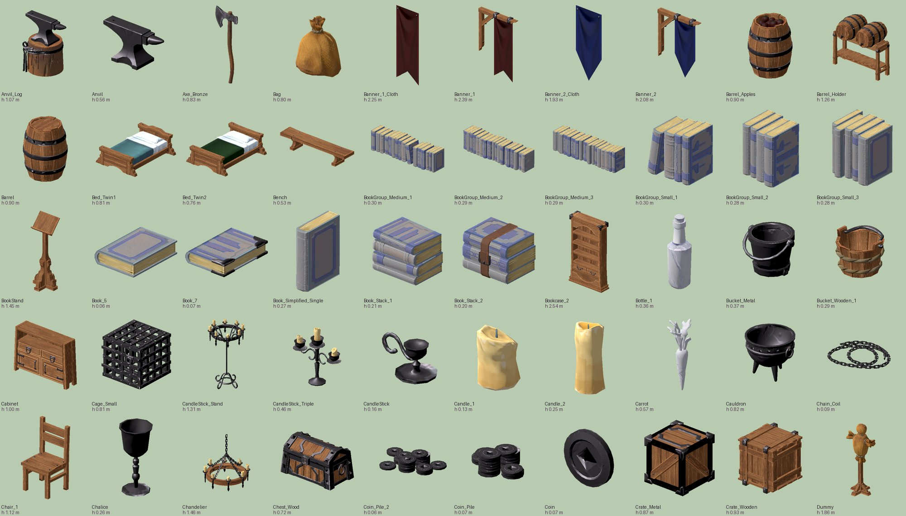
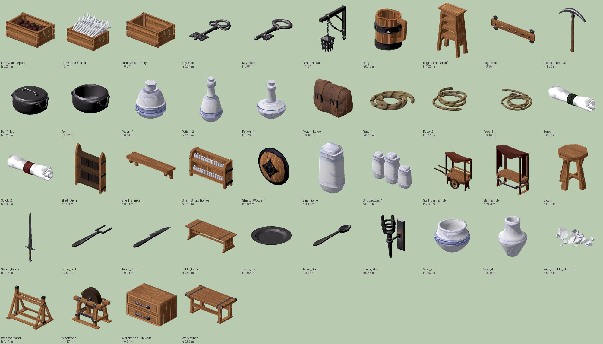
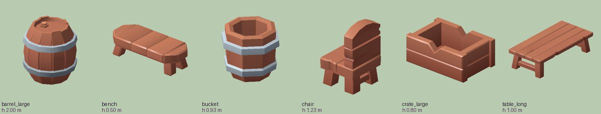

# Огляд паків очима — що з них «наше»

**Власник:** T6 Аполлон · **Дата:** 2026-10-03 · **План:** [[2026-10-03-Santos-Packs-Arenas]], хвиля T6-0, пункт 0i
**Статус:** KayKit Dungeon — переглянуто. **MegaKit — переглянуто** (Santos 2026-10-03: «бери все, що по максимуму підходить за
стилем і виглядає дійсно природно» — § MegaKit). Creative Trio — прибрано з гілки, не переглядаю.

Ця сторінка — колонка «Аполлон» для майбутнього каталогу пропів (план Ф1.1, Кліо): що беремо за стилем, що беремо з умовою,
що лишаємо в паку. Масштаб і колізію вирішує Арес (план Ф4.1), id за функцією — Кліо.

## Як дивився

KayKit кладе в архів власні превью: `contents.png`, `update_contents.png`, `Samples/extra_content1.png`, `extra_content2.png`,
`extra_textures.png`, `source_content.png` і 13 рендерів сцен `Samples/Dungeon_sample*.png` (усі 1920×1080, `PIL.Image.size`).
Усі їх я переглянув очима. `extra_textures.png` показує, як KayKit робить ніч: альтернативним атласом (`NightA/B`). Ми робимо її
світлом ([[Palette-Remap]] правило 5). Імена й кількість моделей узяв з `ls Assets/gltf/*.gltf` → 283. Габарити — з `accessors[POSITION].min/max`
(`python3`, як у плані). Хто з моделей яку плашку атласу бере — `tools/art/palette_remap.py scan` ([[Palette-Remap]]).

## Що читається з камери бою

Капсула бійця — 1.8 м (`Fighter.tscn:9`). Камера тримає бійця на 15–30 % висоти кадру
([[ADR-018-Camera-Frames-Fight-With-Air]]), тобто на 1080p один метр біля бійця займає 90–180 px. Звідси:

| розмір пропу | на 1080p біля бійця | висновок |
|---|---|---|
| 0.1 м (пляшка, монета, свічка) | 9–18 px | поодинці — шум. Лише купкою на прилавку або як нічне світло |
| 0.4 м (відро, табурет) | 36–72 px | читається плямою, а не формою |
| 1 м і більше (ящик, бочка, лавка, стіл) | 90–180 px і більше | читається формою — це основа ближнього плану |

Пропи за колом (3–8 м за краєм арени) ще далі від камери, ніж бійці, тож дрібне там зникає раніше.

## Стиль KayKit і наш

KayKit — масивні, округлі, з м'якими фасками «іграшкові» форми. Після перефарбування атласу ([[Palette-Remap]]), toon-тіні
й контуру `#2B2230` вони читаються як мультиплікаційні пропи. Це сумісно зі Sketch-Cel ([[ADR-007-Art-Style-Sketch-Cel]]):
там жест і силует важать більше за анатомію. Конфлікти не з формою, а зі **змістом**: підземелля, геральдика й фентезі
(мімік, щити, зброя, смолоскипи) — не старе індустріальне місто [[Cronshift]].

**Масштаб — для Ареса.** Стіл `table_long` 1.00 м заввишки, стілець `chair` 1.23 м, бочка `barrel_large` 2.00 м. Реальний стіл —
близько 0.75 м, тож одиниця KayKit ≈ 1.33 реального метра, а множник паку ≈ 0.75. Це PLACEHOLDER: число дає Арес під бійця
1.8 м і укриття `ArenaLayout.gd` (план Ф4.1).

## KayKit Dungeon 1.1 EXTRA — вердикт за групами

**Беремо** — входить у гру після перефарбування. **Умовно** — лише з умовою з колонки. **Ні** — лишається в паку.

| група (к-сть, `ls`) | приклади | вердикт | куди | чому / умова |
|---|---|---|---|---|
| бочки, діжки (4 + 2 `keg`) | `barrel_large`, `barrel_small_stack`, `keg` | **резерв** → MegaKit | `bazaar`, `river` (баржі, причал) | замінено MegaKit за правилом «один предмет — один пак» (§ MegaKit): справжній масштаб і природніший силует; головна форма ринку й порту; ≥ 1 м — читається |
| ящики, коробки (3 + 1 + 4) | `crate_large`, `crates_stacked`, `box_large`, `box_stacked` | **резерв** → MegaKit | `bazaar`, `river` | замінено MegaKit за правилом «один предмет — один пак» (§ MegaKit): справжній масштаб і природніший силует; укриття-кандидати (Арес); силует коробки збігається з `BoxMesh` смуги F |
| столи, стійки (20 + 6 `bartop`) | `table_long`, `table_round_*`, `bartop_A_large` | **резерв** → MegaKit | `bazaar` прилавки ятки, `fountain` тераси кав'ярень | замінено MegaKit за правилом «один предмет — один пак» (§ MegaKit): справжній масштаб і природніший силует; `table_*_broken` — лише як укриття «після бійки», не декор |
| стільці, табурети, лавки (1 + 2 + 1) | `chair`, `stool_round`, `bench` | **резерв** → MegaKit | `fountain` W тераси | замінено MegaKit за правилом «один предмет — один пак» (§ MegaKit): справжній масштаб і природніший силует; дрібне — групами біля столів |
| дерев'яні рами EXTRA (12 `scaffold_*`) | `scaffold_frame_large` 7×4×7 м, `scaffold_frame_small` 3×4×3 м, `scaffold_pillar_*` | **беремо** | скелет ятки `bazaar`; ремонт фасаду, кран-рама `river` | **умова:** без `*_torch` і без форм-«шибениць» (стовп з однією балкою й гаком — права колонка `extra_content1.png`): у місті це читається як шибениця. Яка саме це модель — побачимо на контакт-листі (Ф0.3) |
| полотна прапорів (42 `banner_*`) | `banner_red`, `banner_patternA_*`, `banner_triple_*` | **умовно** | тенти й гірлянди над ятками | **умова:** без `banner_shield_*` (щит-геральдика — підземелля); кольори — після [[Palette-Remap]]; літер на них немає — добре (ADR-011 п. 5) |
| сходи (15 `stairs_*`) | `stairs_wide` 7×5.1×4 м, `stairs_long`, `stairs_wood` | **беремо** | `river` S — сходи до води, `fountain` S — ратуша | `stairs_wood` — причал і баржі |
| колони (2 `pillar` + `column` + `post`) | `pillar_decorated`, `column`, `post` | **беремо** | ратуша `fountain` S, тумби причалу `river` | `post` 0.4×4 м — стовп тенту або тумба |
| балюстрада (5 `barrier_*`) | `barrier`, `barrier_column` | **беремо** | парапет набережної `river`, тераса | перила з `Dungeon_sample5` — найбільш «міська» річ у паку |
| стіни, арки, вікна (38 `wall_*`) | `wall_arched`, `wall_window_open`, `wall_doorway` | **умовно** | ближні фасади-краї кола, склади на причалі | **умова:** лише рівні, вікна й двері; без `wall_*_gated`, полиць-ніш і `wall_broken`. Кам'яна кладка з балками — це склад, а не замок, якщо поруч ящики й бочки |
| підлога, фундамент (34 `floor_*`) | `floor_wood_large`, `floor_foundation_*` | **умовно** | острівці під ятками, настил причалу | **умова:** без `floor_*_spikes`, `*_grate*`, `*_weeds*` (бур'ян дають декалі). Підлогу арени дає тайл, а не плитка KayKit ([[Arenas-360-Prompts]] § Текстури) |
| каміння, руїни (4 `rocks` + 2 `rubble`) | `rocks`, `rubble_half` | **беремо** | береги `river` | сливово-бурий `r0c7` після перефарбування |
| відра (2 `bucket`) | `bucket` | **резерв** → MegaKit | ятки, причал | замінено MegaKit за правилом «один предмет — один пак» (§ MegaKit): справжній масштаб і природніший силует; `bucket_pickaxes` — ні (кирки) |
| пляшки, тарілки, книги (8 + 5 + 3) | `bottle_A_labeled_green`, `plate_food_A` | **умовно** | купками на прилавках ятки спецій `bazaar` W | **умова:** лише групами (0.1 м = 9–18 px); етикетки без літер — перевірити на моделі |
| свічки (6 `candle*`) | `candle_triple`, `candle_lit` | **умовно** | столи терас уночі | **умова:** лише `*_lit` з емісією вночі ([[Palette-Remap]] § Емісія) |
| смолоскипи (3 `torch*`) | `torch_mounted` | **ні** | — | місто світять газові ліхтарі ([[ADR-011-Diegetic-Grapple-Anchors]]); смолоскип — це підземелля |
| монети, скрині (4 + 5 + 9 `trunk_*`) | `coin_stack_large`, `chest_large_gold`, `trunk_medium_A` | **резерв** | майбутня крамниця на `bazaar` (план § поза планом) | у гру — лише коли Santos відкриє тему крамниці; `chest_mimic` — **ні** (монстр) |
| ліжка (8 `bed_*`) | `bed_A_double` | **ні** | — | інтер'єр; бою ніде |
| книжкові шафи, полиці (6 + 4 + 2) | `bookcase_double_*`, `shelf_*` | **ні** | — | інтер'єр; на вулиці не стоять |
| грати, тюремні бруси (8 `bar_*`) | `bar_straight_A` | **ні** | — | в'язниця підземелля |
| зброя, ключі, кирки (3 + 2 + 2 + 2) | `sword_*`, `keyring`, `pickaxe` | **ні** | — | чужий жанр; зброя в кадрі сперечається зі зброєю бійців |
| стеля (`ceiling_tile`) | — | **ні** | — | арена під небом |

**Разом** (22 групи): беремо 10, умовно 5, ні 6, резерв 1 (монети, скрині, сундуки — до крамниці). Після огляду MegaKit (той самий день): 5 груп «беремо» перейшли в резерв на користь MegaKit — лишилось беремо 5 (риштування, сходи, колони, балюстрада, каміння), умовно 5, ні 6, резерв 6. Конкретні id і число
моделей на арену — каталог Кліо (Ф1.1). Множник масштабу — Арес (Ф4.1).

## Ятка `bazaar` — складаємо з паку, а не генеруємо

**Оновлено після огляду MegaKit:** ятка — готова `Stall_Empty` / `Stall_Cart_Empty` з MegaKit (§ MegaKit). Збірка з KayKit нижче — запасний шлях, якщо габарит MegaKit не ляже в укриття Ареса.

Ятка в [[Arenas-360-Prompts]] спершу стояла на листі пропів для Higgsfield. Тепер її складаємо з KayKit, і це 0 кр.:

| частина | модель KayKit | примітка |
|---|---|---|
| каркас | `scaffold_frame_small` (3×4×3 м до множника) | без `*_torch` |
| прилавок | `table_long` або `bartop_A_medium` | |
| тент | `banner_*` поверх рами, або площина з тайлом смугастої тканини | смугасту тканину паки не мають — це кандидат на тайл (хвиля T6-2, якщо потрібен) |
| товар | `crate_small`, `barrel_small`, `bucket`, купки `bottle_*` | купками, правило 0.1 м |
| світло | ліхтар-якір (3D, хвиля T6-3) | якір гарпуна, [[ADR-011-Diegetic-Grapple-Anchors]] |

Збирає Гефест (`PropKit`, план Ф4.2), габарит ятки під укриття — Арес.

## MegaKit [Standard] — вердикт (T6, 2026-10-03)

**Як дивився.** Превью в паку немає, тому кожну з 94 моделей я відрендерив сам: Godot 4.7.2 headless під `xvfb-run`,
`GLTFDocument` з файлів гілки `textures/santos-pack` (`6bd36a2`), вид 3/4, один сонячний світильник, плашка `#B8CBB1`;
поруч — 6 відповідників KayKit тим самим способом. Рендерер — одноразовий скрипт у scratchpad, у репо не кладу: контакт-лист
паків з інструментом — крок Гефеста (план Ф0.3). Габарити — AABB мешів у тому ж прогоні.

**Головне — масштаб і природність.** MegaKit змодельований у справжніх метрах: `Table_Large` 0.81 м заввишки, `Barrel` 0.90,
`Chair_1` 1.12, `Bench` 0.53, `Crate_Wooden` 0.93. KayKit — «іграшковий» і нерівний: `table_long` 1.00, `barrel_large` 2.00,
`bucket` 0.93 (MegaKit `Bucket_Wooden_1` — 0.29). Силуети MegaKit теж природніші: опукла бочка з обручами, мішок, що
осів, кільця мотузки, ятка з тентом на стовпах. Тому:

**Правило «один предмет — один пак».** Якщо предмет є в обох паках — у гру йде **MegaKit**. KayKit дає лише те, чого в MegaKit
немає: риштування, сходи, колони, балюстраду, стіни, підлоги, каміння. Так поруч не стоять дві бочки різної манери — це і є
«збірна солянка», якої боїться стиль. Таблиця KayKit вище відповідно звужується: бочки, ящики, столи, стільці, лавки, відра
KayKit — у резерв.

**Стиль після перефарбування.** На атласах MegaKit намальовані волокна дерева й подряпини. Sketch-Cel хоче пласку заливку з
однією тінню ([[ADR-007-Art-Style-Sketch-Cel]]), тож трім-атласи йдуть через постеризацію Ф3.2b до кольорів [[Palette-Remap]].
ТЗ Гефесту: перед квантуванням злегка розмити атлас, щоб волокна не дали «рябу» з окремих пікселів; на шматок трім-рядка —
1 основний тон, тінь дає toon-шейдер. Радіус розмиття — PLACEHOLDER, підбирається на `Barrel` і `Table_Large` очима (скрин у PR).
Normal/ORM у гру не йдуть (`toon.gdshader` читає лише `albedo_tex`, план Ф3.2b).

| група (к-сть) | моделі (висота, м) | вердикт | куди | чому / умова |
|---|---|---|---|---|
| ятки (2) | `Stall_Empty` 2.63, `Stall_Cart_Empty` 2.63 | **беремо** | `bazaar` — головні укриття-ятки | замінює збірну ятку з KayKit (§ Ятка): готовий силует з тентом і прилавком |
| бочки (3) | `Barrel` 0.90, `Barrel_Apples` 0.90, `Barrel_Holder` 1.26 | **беремо** | `bazaar`, `river` (причал, баржі) | природна опуклість і обручі |
| ящики (5) | `Crate_Wooden` 0.93, `Crate_Metal` 0.87, `FarmCrate_Apple` / `_Carrot` / `_Empty` 0.24–0.41 | **беремо** | `bazaar` (овочеві ятки), `river` (вантаж) | `Crate_Metal` з окуттям — найбільш «індустріальний» предмет паку; фермерські ящики — товар на прилавках і купками під ними |
| столи, стільці, лави (4) | `Table_Large` 0.81, `Chair_1` 1.12, `Stool` 0.59, `Bench` 0.53 | **беремо** | `fountain` — тераси кав'ярень і лави навколо чаші; `bazaar` — столи торговців | реальні меблі; лава 2.78 м довжиною — навколо фонтану |
| мішки (2) | `Bag` 0.80, `Pouch_Large` 0.16 | **беремо** `Bag` · **умовно** `Pouch_Large` | `bazaar`, `river` (вантаж) | мішок читається формою; гаманець — лише на прилавку |
| відра, горщики, казан (5) | `Bucket_Wooden_1` 0.29, `Bucket_Metal` 0.37, `Pot_1` 0.22, `Pot_1_Lid` 0.28, `Cauldron` 0.82 | **беремо** | ятка вуличної їжі `bazaar`; відра — причал і фонтан | казан на ятці їжі — природна «жива» деталь ринку |
| глечики, черепки (3) | `Vase_2` 0.52, `Vase_4` 0.49, `Vase_Rubble_Medium` 0.17 | **беремо** | гончарна ятка `bazaar`; черепки — біля зруйнованого укриття | розбитий глечик — слід бійки, природніше за ціле все |
| мотузки, ланцюг (4) | `Rope_1/2/3` 0.10–0.12, `Chain_Coil` 0.09 | **умовно** | причал `river`, біля тумб і на палубі | **умова:** лише кільцями біля тумби (пласкі 0.6–1.2 м у плані — видно згори) |
| настінний ліхтар (1) | `Lantern_Wall` 1.34 | **беремо** | фасади всіх трьох арен (декор, не якір) | газовий ліхтар на кронштейні — місто зі старим світлом; уночі емісія ([[Palette-Remap]] § Емісія). Якір гарпуна — окремий героїчний ліхтар (хвиля T6-3) |
| вивіски-прапори (4) | `Banner_1` 2.39 і `Banner_2` 2.08 на кронштейні, `*_Cloth` | **беремо** з кронштейном · **умовно** `*_Cloth` | вивіски крамниць над ятками й на фасадах | без літер (ADR-011 п. 5); колір полотна — за [[Palette-Remap]] |
| майстерня (4) | `Workbench` 0.89, `Workbench_Drawers` 0.24, `Whetstone` 1.17, `Anvil_Log` 1.07 / `Anvil` 0.56 | **умовно** | один куток-майстерня на `bazaar` (точильник, коваль) | **умова:** один набір на арену; точильне коло — вулична професія, ковадло — лише біля нього |
| дрібниці на столі (5) | `Mug` 0.18, `Bottle_1` 0.36, `SmallBottles_1` 0.15, `Table_Plate` 0.02, `Shelf_Small_Bottles` 0.65 | **умовно** | столи терас, прилавок аптеки `bazaar` | **умова:** групами (правило 0.1 м = 9–18 px) |
| гачки (1) | `Peg_Rack` 0.35 | **умовно** | задня стінка ятки | лише з товаром на гачках |
| тренувальне опудало (1) | `Dummy` 1.86 | **резерв** | режим тренування (`GameState.training_mode`) | на вулиці неприродне; у тренуванні — доречне. Вирішує Santos / Гермес |
| скарби (13) | `Chest_Wood`, `Coin*`, `Key_*`, `Chalice`, `Potion_*`, `Scroll_*`, `SmallBottle` | **резерв** | майбутня крамниця | як скрині KayKit |
| зброя (5) | `Sword_Bronze`, `Axe_Bronze`, `Pickaxe_Bronze`, `Shield_Wooden`, `WeaponStand` | **ні** | — | сперечається зі зброєю бійців |
| інтер'єр (19) | `Bed_*`, `Bookcase_2`, `Book*`, `BookStand`, `Cabinet`, `Nightstand_Shelf`, `Shelf_Arch`, `Shelf_Simple` | **ні** | — | на вулиці не стоять |
| світло підземелля (7) | `Chandelier`, `CandleStick*`, `Candle_*`, `Torch_Metal` | **ні** | — | місто світять газові ліхтарі |
| інше (5) | `Cage_Small`, `Carrot`, `Table_Fork` / `_Knife` / `_Spoon` | **ні** | — | клітка — тюремна; морква вже в ящику; прибори 0.01–0.02 м не видно |

**Разом (94):** беремо 26, умовно 18, резерв 14, ні 36 — `python3`: списки таблиці проти `ls glTF/*.gltf`, жодної моделі поза таблицею й жодної зайвої ([[2026-10-03-Apollon-Pack-Review-MegaKit]]).

## Щоб виглядало природно — правила розстановки (для `PropKit`, план Ф4.2)

- **Групи, а не ряди.** 2–5 предметів купкою: бочка + ящик + мішок біля ятки, а не бочки рівно вздовж стіни.
- **Кожен трохи повернутий.** Поворот і зсув — з власного зерна арени (детермінізм), без однакових кутів сусідів.
- **Причина для кожної речі.** Ящики — біля ятки, що торгує; мотузка — біля тумби; відро — біля фонтану. Без «просто стоїть».
- **Сліди життя.** Один-два черепки `Vase_Rubble_Medium`, ящик на боці, порожній `FarmCrate_Empty` серед повних.
- **Не густо.** Коло бою чисте; пропи — на краю й за колом (Арес, Ф4.1). Дрібне — лише там, де камера близько.
- **Один пак на категорію** (правило вище): бочки й ящики лише MegaKit, сходи й балюстрада лише KayKit.

## Creative Trio — що перевірити, коли буде контакт-лист

Що я знаю лише з таблиці T1 у плані (не бачив): мости 15–19 м, двері й арки, дерева рівно по 1 м, паркани, каміння, зілля з
`Base_Material_Emission`, їжа (бургер, хот-дог). Питання на огляд:

- чи пасує їхня манера до KayKit поруч. Два паки з різними фасками й товщиною поруч — це і є «збірна солянка», якої боїться стиль;
- бургер і паперовий стакан — сучасні речі, для старого Cronshift їх не беру, поки не скажуть Кліо або Santos;
- `GenshinMaterial.Default` на деревах — лише ім'я матеріалу, на стиль не впливає, але назва натякає на джерело. Ліцензія — UNGROUNDED
  за брифом Архімеда [[2026-10-03-Pack-Licenses]] (сайт CC0 чи платний стор — невідомо). До `License_<пак>.txt` від Santos у Higgsfield
  не вантажимо ([[Textures-Registry]] § Паки-джерела).

## Related
- [[2026-10-03-Santos-Packs-Arenas]] · [[2026-10-03-Apollon-Pack-Review-MegaKit]] · [[Palette-Remap]] · [[Arenas-360-Prompts]] · [[Textures-Registry]] · [[Style-Guide]]
- [[Stage-River]] · [[Stage-Bazaar]] · [[Stage-Fountain]] · [[Cronshift]] · [[ADR-018-Camera-Frames-Fight-With-Air]]
