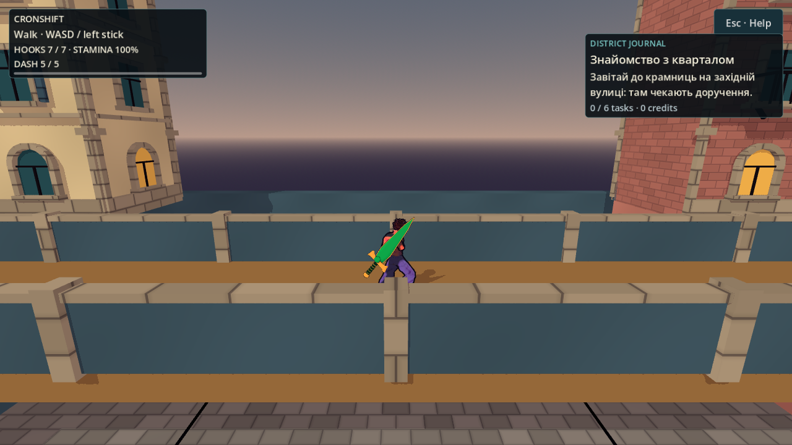
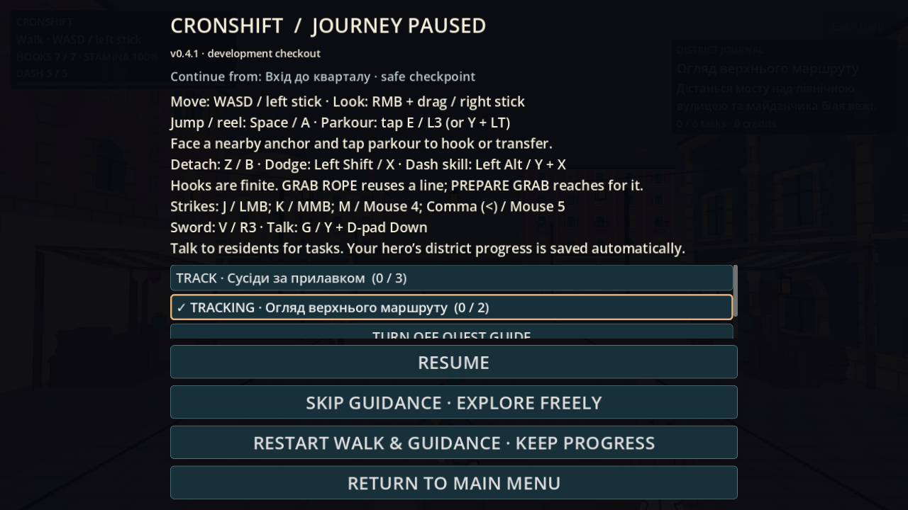

# Продовження подорожі — незалежне приймання

2026-10-05 · T4 Феміда. **Статус: GREEN у перевіреному зрізі; production `e6f13c8e0566819c694686f8748398df43d54140`.**

План [[2026-10-05-District-Journey-Continuity]] прочитано; база перевірена командою `git rev-parse HEAD`: `d9d12ec`, змерджений PR #175. Ізольована копія для перевірки — `/tmp/nir-journey-review`; довготривалі журнали та native-кадри — `/workspace/nooneisreal-evidence/district-journey-continuity/`. Аудитор не змінює production/state і не запускає Godot у shared checkout.

## Мірила

| Напрям | Перевірюваний результат |
|---|---|
| Іменоване повернення | Герой фізично стає в дозволену точку крамниці/даху, виходить зі сцени й повертається туди після disk reload. У кожній точці є підлога й вільний CharacterBody. |
| Runtime після повернення | Немає старої мотузки/швидкості/атаки; камера показує місце, не початок району. Restart walk явно повертає на початок. |
| Захист checkpoint | Повітря/мотузка не створює checkpoint; spawn/rescue не перетирає валідне повернення. Другий герой не отримує чужого місця. Невідомі імена/довільні координати/пошкоджений JSON відкидаються; файл не перезаписується мовчки. |
| Відстеження | Можна вибрати лише прийняте active/ready доручення. Явне вимкнення переживає disk reload. Старий save без поля зберігає прогрес. Невідомий/completed/неприйнятий id не приймається частково. |
| Наступна ціль | Всі шість доручень; уже врахована опора/мешканець не обирається знову. Ready спрямовує до замовника, completion прибирає stale marker. |
| Клавіатура/контролер | Журнал відкривається, focus переміщується, accept змінює tracked, clear вимикає, cancel закриває. Input/release не переходять у рух/атаку; pause/dialogue забирають guide і focus. Події контролера емульовані, фізичний пристрій не заявляється. |
| Native орієнтир | 1280×720 та менший viewport; ціль спереду/позаду/на іншій висоті, orbit. Назва/відстань/напрям читаються, не накладаються на harpoon hint; стрілка не видається за навігаційний маршрут. |
| Регресії | Попередні 57 сценаріїв лишаються зеленими; нові probes мають sentinels і негативні випадки. Gates/read-only diff підтверджують відсутність нових незареєстрованих assets та змін бойових чисел. |

## Виміряні результати

| Перевірка | Результат і журнал |
|---|---|
| Незалежний native scene loop | **44/0**, `native-acceptance.log`: справжні GameState.start_city / return_to_menu; grocer/roof_bridge після gravity, floor та dwell → disk → menu → повторний вхід. Velocity/rope очищені, Choko/Skea ізольовані, fall rescue зберігає roof, explicit restart ставить spawn. |
| Журнал у справжній сцені | У тому самому **44/0**: InputEventJoypadButton D-pad → A → B, вибір roof_walk, збережений focus, OFF, disk reload без автоувімкнення. Скриншоти 1280×720 та 960×540 особисто переглянуто; scroll показує сфокусовану кнопку, орієнтир читається й змінює Left/Right після orbit. |
| Native edge cases | **12/0**, `native-edges-final.log`: A залишається натиснутою під час B-close — стрибка немає; після release нове A стрибає. Справжній NPC dialogue ховає guide й повертає після close. За камерою показано Behind; ready веде до grocer, completion прибирає marker. |
| Іменовані точки | `journey-check.log`: **122/0**, реально використана BodyShape обох героїв у всіх семи точках; floor/clearance, повітря/мотузка/висота під дахом/dwell, restart/rescue/ізоляція. Незалежний native loop окремо підтвердив крамницю і міст. |
| Негативні збереження | Власний `journey-negative-final.log`: **19/0**, без SCRIPT ERROR. JSON number roundtrip, чужі імена/довільні coordinates/типи/partial overwrite, corrupt-disk bytes після restart, missing legacy journey file, обидва герої й справжній atomic disk reload. |
| Цілі та optional field | Незалежно виконано production probe: `tracking-independent.log` **44/0**. Усі шість цілей, used anchor/resident, рухомий і unloaded NPC, ready/giver, completion, auto/manual/off, disk reload, legacy та malformed tracking. |
| Негативний контроль тесту | Тільки в ізольованому `/tmp` вилучено used-anchor filter із CityQuestTargets; `tracking-mutated-repeat-anchor.log` дав **44 checks / 8 failures**, починаючи з used anchor excluded. Оригінал відновлено; shared production не змінений. Це очікуваний RED mutation, не поточна помилка гри. |
| Регресії та гейти | Перечитані raw-журнали координатора скопійовано в `validation/`: `playable.log` **60 сценаріїв / 0 failures** (попередні 57 збережені), `make-check.log` smoke **164/0 у 19847 frames**, `gates.log` **БАТАРЕЯ ЗЕЛЕНА, 90 GDS / 0 parse failures**. |

Команди незалежних probes: Godot 4.7 `--headless --path /tmp/nir-journey-review/game --script <probe.gd>`; native додає `DISPLAY=:97`, `LP_NUM_THREADS=4`, `--rendering-method gl_compatibility --audio-driver Dummy --fixed-fps 60`. Кожний запуск використовує окремі XDG_DATA_HOME/CACHE_HOME/CONFIG_HOME. Scripts лежать у durable `probes/`, native PNG у `native/`; source hashes — `native-source-sha256.json` та `final-source-provenance.json`. Усі шість фінальних journey/progress/HUD/guide файлів у незалежній копії звірено byte-exact із `e6f13c8`.

## Знайдено і виправлено

Перший незалежний malicious-save probe знайшов GDS runtime exception для `version=true` та `version="1"`: порівняння Variant із int відбувалось до перевірки типу. Boolean asserts при цьому хибно давали 19/0, тому перевірявся також сирий журнал. Власник додав numeric/finite/exact version guard до CityJourney; той самий клас закрито в CityProgress content/restore. Повтор `journey-negative-final.log` чистий; tracking wrong-version cases також зелені.

Перший edge-fixture заморозив камеру біля крамниці, а героя переніс на spawn, тому його вимога точного Behind була неправильною. Fixture встановив узгоджені origin/heading, повтор **12/0**. Це не зміна production. Камера в цьому спеціальному behind-тесті розташована вручну; цей кадр не доводить collision-комфорт production camera.

## Видимий результат

Повторний вхід після фактичного menu/disk loop повертає Choko на міст дахів:

Фінальний native кадр UI-смуги з version 0.4.1, особисто переглянутий T4. Незалежний controller loop окремо перевірив вибір цієї кнопки й вимкнення guide:

## Вердикт

**GREEN** для named resume, tracked journal та орієнтира у перевірених сценаріях. План має три варіанти та щонайменше п'ять поглядів; фактична схема не приймає довільні координати зі save. `git log d9d12ec..HEAD` показав окрему гілку й англомовні коміти; diff assets/Textures-Registry порожній, нових завантажень чи ліцензій тут немає.

Початкове перенесення до checkpoint робиться fixture на 0.4 м над точкою; приземлення, dwell, збереження, меню й відновлення справжні. Це не ручна безперервна прогулянка від воріт до даху. Контролерні події емульовані. Native — Linux Godot 4.7, llvmpipe/Xvfb; Mac/M3, hardware FPS, фізичний геймпад, звук та тривале ручне проходження не заявляються. Перший власний capture використовував project version 0.4.0 з базової копії; актуальні gameplay/UI scripts звірені окремо, фінальний 0.4.1 journal кадр надано UI-смугою. PR мерджить Santos.

## Related

- [[2026-10-05-District-Journey-Continuity]] · [[2026-10-05-District-Journey-Session]] · [[2026-10-05-Quest-Tracking]] · [[2026-10-05-Quest-Journal-And-Guide]] · [[2026-10-05-Playable-District-Review]] · [[Testing]] · [[Build-and-Run]] · [[recurring_class_register]]
