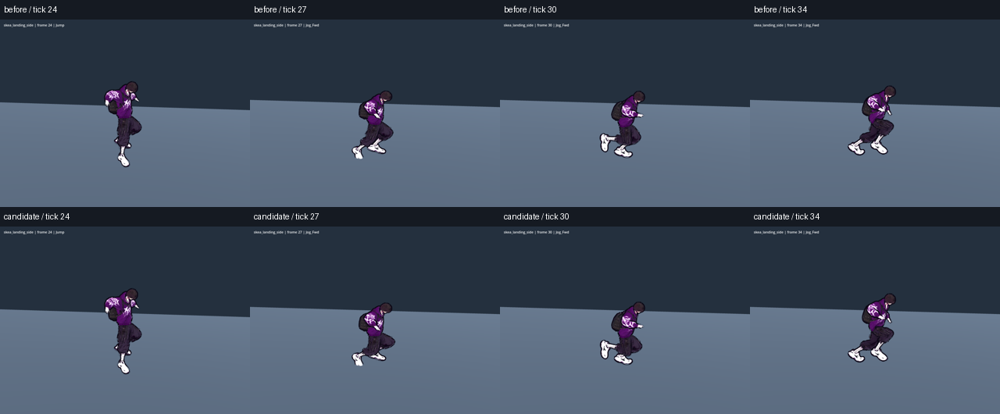
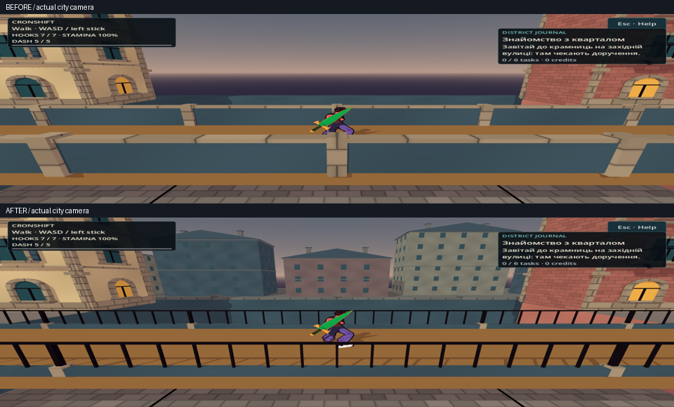
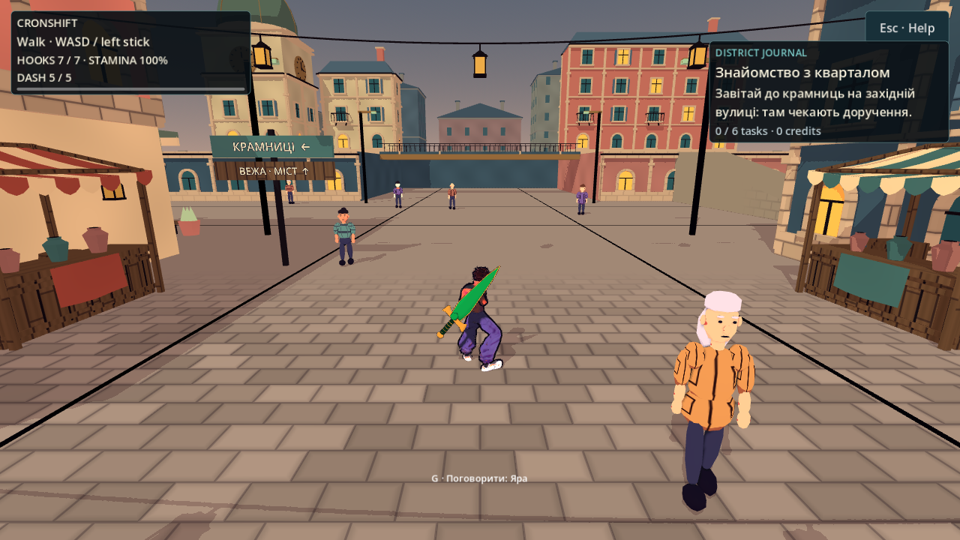
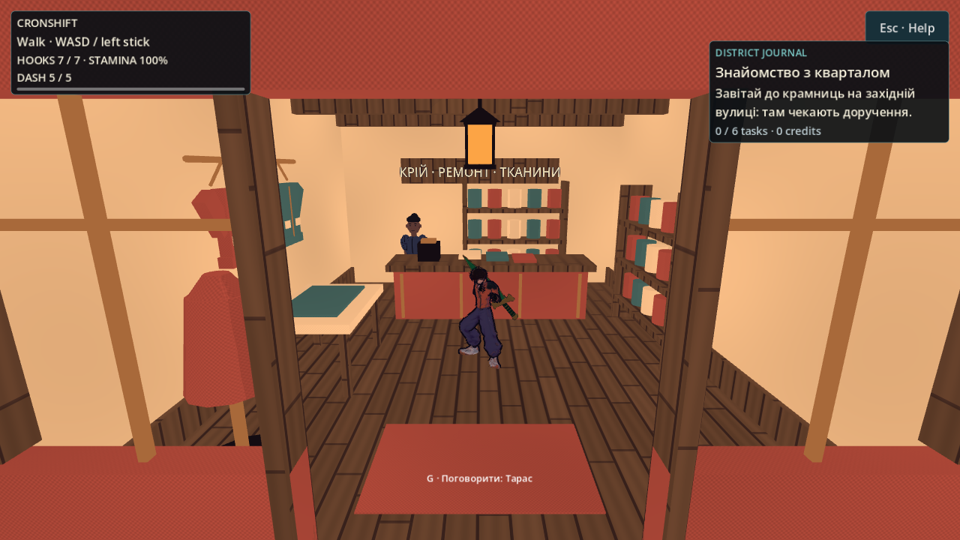
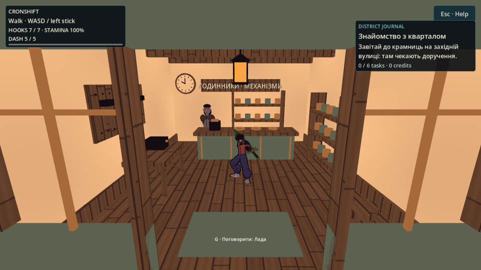
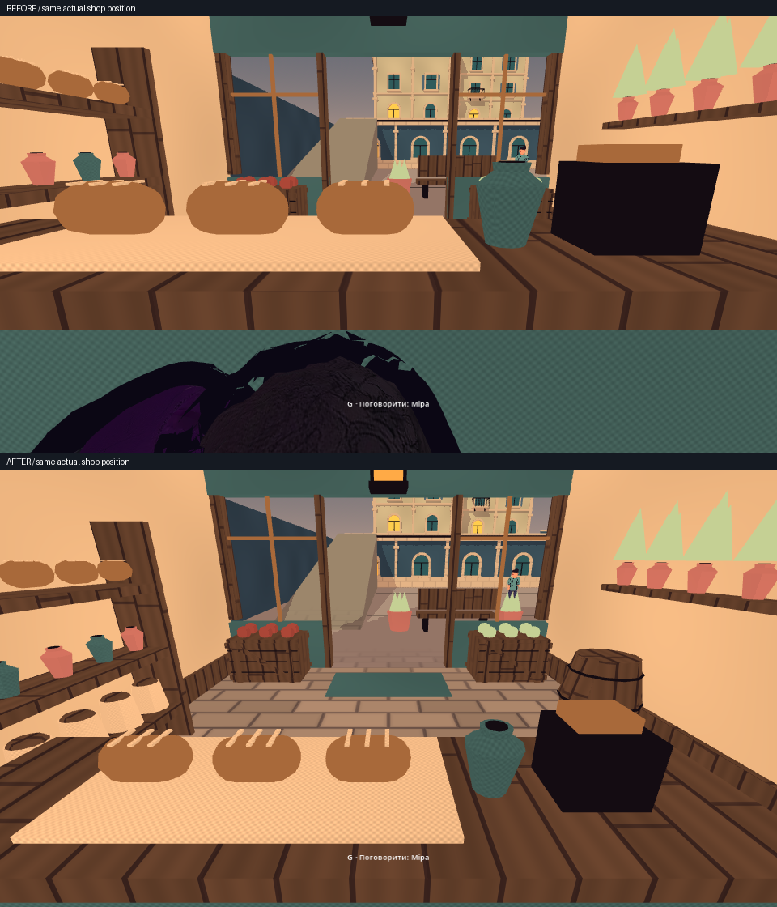

# Рух і читабельність — незалежне приймання

2026-10-05 · T4 Феміда. **GREEN для перевіреного обсягу production `9685dfaa7d75829066ca54faf5c56c3fd820d91c`.** BEFORE — незмінний `git archive 6d929f8`; native AFTER та негативні проби виконані в окремій копії. Production/state аудитор не змінював. Це приймання конкретного пакета руху, камери й читабельності кварталу, не завершеної гри.

## Побачений результат

Переглянуто суцільні покадрові contact sheets: 592 кадри dodge (два справжні GLB, чотири напрямки, ground/air), 288 додаткових кадрів Choko з мечем у лівій/правій руці, 200 кадрів moving landing (обидва герої, front/side). Перевірено збільшені пози поштовху. Видимі підготовка, перенос і повернення в guard; нового розриву суглобів, завислої recovery-пози або конкретного проходження клинка крізь тулуб не виявлено. Це покадровий перегляд native-послідовностей, не твердження про ручну тривалу гру або бездоганну відсутність clipping у всіх ситуаціях.

Dodge використовує source Dodge_Left/Right, напрямок переноситься презентаційним yaw. Moving landing — **компресія, похідна від Jump_Land, разом із поточним gait та IK**, не повний Jump_Land clip поверх бігу. Порівняння біля контакту показує м'якше згинання колін із продовженням кроку. CSV до/після: усі 592 dodge та 200 landing кадрів мають тотожні position/velocity/state; dodge також stamina/frames. Physics authority не змінилась у цих траєкторіях.

Переглянуто 12 фінальних інтегрованих world-ракурсів: міст center/±6 м, clock tower, north roof, ринок, три крамниці у двох напрямках. На мосту видно ноги крізь відкриті перила; дальні будинки додають глибини, ательє отримало впізнаваний одяг, майстерня — годинник та інструменти. Кольори героя й NPC збережені.

Actual near-body BEFORE показував обрізану голову на передньому плані за прилавком. AFTER у тій самій позиції відкриває вихід і прилавок: камера піднімається, близький власний герой плавно прибирається матеріалом. NPC та навколишні предмети залишаються видимими.

## Контрприклади та межі механіки

- Незалежна `camera_negative.gd`: **394/0**, реальні NPC uniforms/colors незмінні; hero visible/layers/base color незмінні; late material з default/null приєднується й точно відновлюється; cloth palette змінюється під час fade без втрати оригінального ресурсу; inactive camera, прямий виклик helper, exit та наступний Skea Fighter не успадковують fade.
- Mutation лише в ізольованій копії: вилучення active-camera guard helper дає **1 очікуваний fail** `direct helper rejects inactive camera`. Після перевірки файл відновлено. Кількість NPC-зразків залежить від streaming, тому mutation має 390 загальних checks; конкретний порушений guard той самий.
- Native Compatibility renderer probe власника: **4/0**, hide pixel delta `0.0075066`, shadow delta `0.0060352` проти shadow OFF; тіло прибирається, тінь зберігається. Звичайна `GeometryInstance3D.transparency` у цьому renderer не дала ефекту, тому використаний opaque dither.
- Незалежно побайтово порівняно serialized **256 collision shapes/transforms/layers/masks** до/після: тотожні, SHA256 `14b80103fb5ac9fa6886433e5cdd2f2f9249d3e962b96304a51e71fb6095c822`. Backdrop поза playable square, не нова доступна територія; geometry probe **1813/0**. Відкрита видима огорожа зберігає стару суцільну фізичну перешкоду.

Ранній native `candidate/world/` виявив **RED**: shader compile failure перетворював героїв/NPC на білі силуети. Причина — built-ins викликані в недоступному shader stage. Після передачі main-camera ознаки з vertex через flat varying повторено всі 12 ракурсів: фінальні кольорові кадри лише **`after/world/`**, `after-world.log` без shader/runtime errors. Ранні RED-кадри не є доказом приймання.

## Перевірки та відтворення

Прочитано завершені журнали координатора: `make check-playable` rc0, smoke **164 checks / 19 847 frames**, **62 scenarios / 0 failures**, збережені попередні 60; authored evasion **13760/0**, camera **432/0**. `gates.log`: **94 GDScript / 0 parse failures**, БАТАРЕЯ ЗЕЛЕНА. Runtime journey/checkpoint та rope/aim/input сценарії залишаються у повній батареї.

Докази: `/workspace/nooneisreal-evidence/district-motion/`. `before/` містить native PNG, raw logs і CSV; `candidate/dodge/`, `candidate/landing/`, `candidate/armed-dodge/` — motion sequences; comparison JSON містить порожній `authority_differences`. `after/world/` — фінальні 12 PNG, `after/provenance.json` — source SHA256 проти `9685df`. Усі runtime `.gd`/shader/project файли копії тотожні commit; три engine-generated `.uid` у копії відрізняються, завантаження тут за resource paths. Окремий `candidate/provenance.json` фіксує шість motion-файлів. World/collision докази — сусідній `district-motion-world/`; camera native — `district-motion-camera/camera/`.

Відтворення незалежних probe: Godot 4.7 `--path <isolated>/game --script <evidence>/probes/camera_negative.gd --headless --audio-driver Dummy`. Native: ті самі isolated/XDG directories, `DISPLAY=:97 LP_NUM_THREADS=4`, `--rendering-method gl_compatibility --audio-driver Dummy --fixed-fps 60`; scripts `probes/dodge_fullsequence.gd`, `probes/moving_landing_capture.gd`, `probes/world_views.gd`, аргумент `-- --out=<folder>`. Shared checkout під Godot аудитор не запускав. У repo залишено лише сім компактних репрезентативних PNG, повні кадри й відео — у durable evidence.

Native — Linux/Mesa llvmpipe/Xvfb. Mac/M3, hardware FPS, фізичний геймпад, повний manual маршрут через усі дахи та 30-хвилинна гра **не перевірені**. World fixtures переставляють героя між ракурсами й дають справжній фізиці осісти; moving landing — actual падіння з 3.8 м на fixture floor, не ручний стрибок із city roof. Пакування/install приймає окремо координатор; цей audit не заявляє результату ще не завершеної доставки.

## Related

- [[2026-10-05-District-Motion-And-Readability]] · [[2026-10-05-District-Motion-Session]] · [[2026-10-05-Authored-Evasion-And-Landing]] · [[2026-10-05-District-Silhouette-And-Readability]] · [[2026-10-05-District-Motion-Delivery]] · [[2026-10-05-District-Journey-Review]] · [[2026-10-05-Playable-District-Review]] · [[ADR-004-Physics-Is-Presentation]] · [[recurring_class_register]]
