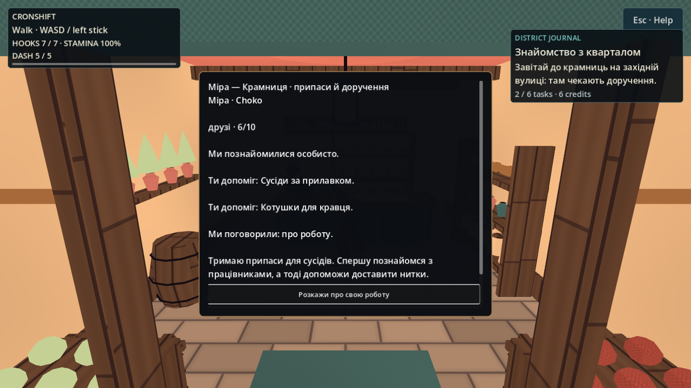
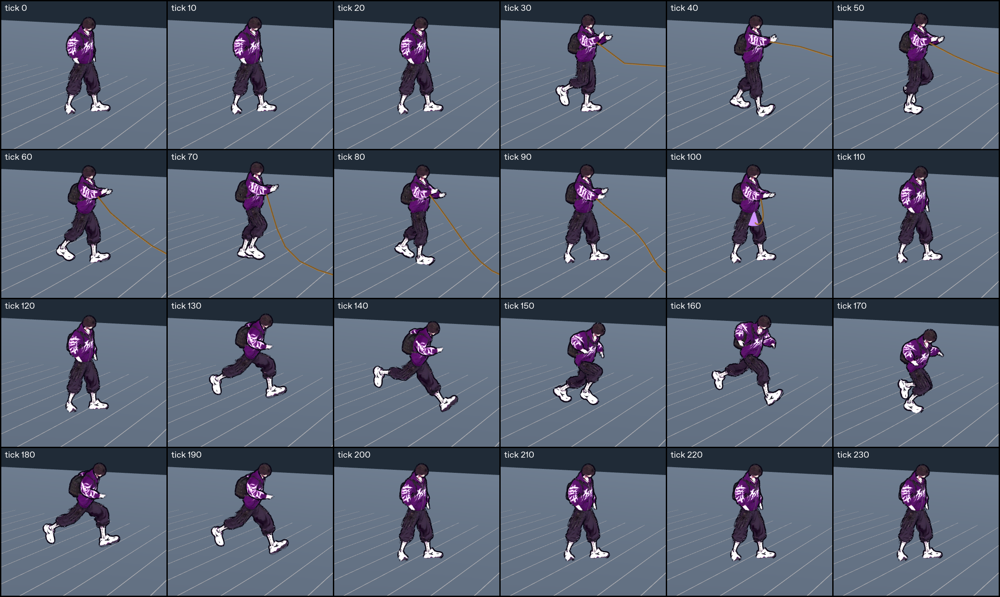

# Живий квартал — незалежне видиме приймання

2026-10-05 · T4 Феміда. **Статус: GREEN у перевіреному зрізі кварталу; код `0999c77254858a23d76c1b806653b73a1e2881ab`.**
Базу для BEFORE взято через `git archive origin/main` у незалежну копію `/tmp/nir-district-before`; SHA збережено разом зі свідченнями. Production/state аудитор не змінює.

## Мірило приймання

| Напрям | Обов'язковий видимий і поведінковий доказ |
|---|---|
| Три відкриті крамниці | Вхід, внутрішній прилавок і вихід кожної пройдено справжнім тілом героя через physics ticks; без телепорту крізь поріг. На production camera видно вивіску, двері, меблі та працівника; дах/передня стіна не закриває дію. |
| Працівники та мешканці | Працівники мають зрозуміле заняття; перехожі рухаються/спілкуються, не утворюють демонстраційний ряд mannequin. Запис руху доповнює minimum-distance/obstruction guards. |
| Завдання та герой | Прийняття → дієва ціль → завершення → видима нагорода → reload. Пам'ять та виконані цілі героя A не переходять герою B; persistence перевіряється реальним save/load. Діалог має пояснювати наступну дію й давати закриття. |
| Бій | Обидва видимі GLB-герої; ліва/права рука та нога. Motion sequence із замахом, контактом, відновленням показує справжні UAL-кліпи/ретаргет, а не лише назву анімації. Перевіряються плечі, лікті, коліна, кисті, опора й орієнтація удару. Hitstop/reaction не розмазано; combat authority збережено. |
| Пересування | Start/walk/stop і підтягування записано в русі; кроки узгоджені з переміщенням, зупинка не ковзає, кисті під час підтягування прив'язані до наміру мотузки. Швидкі зміни напрямку не залишають застряглої пози. |
| Меню й доставка | Поточні меню/пауза/діалог читаються на 1280×720; кнопки й пояснення не обрізані. У записаних свідченнях зазначено revision. Linux render не видається за застосунок в Applications чи Mac/M3-приймання. |

Візуальний дефект повертається власнику навіть за зелених headless-тестів. Повна 30-хвилинна ручна гра, апаратний FPS і фізичний геймпад не заявляються без такого фактичного сеансу.

## BEFORE

Довготривалі свідчення: `/workspace/nooneisreal-evidence/playable-district/before/`.
`revision.txt` містить точну базу. Native Godot **4.7-stable**, Xvfb `:97`, Compatibility/OpenGL, Mesa llvmpipe; це справжній raster гри на software renderer. `city.log` — **18 кадрів / 0 помилок capture**, включно з реальною production camera та паузою; `menu.png` — меню гри на 1280×720. Motion capture базових ударів обох героїв зберігається окремо з покадровими PNG та журналом фактичного clip/procedural state.

Переглянуто `menu.png` і `city/production_player_camera.png`: поточне меню перевантажене рівнозначними рядками; вулиця має замкнений фон і багато NPC, візуально вишикуваних рядами. Ці кадри задають базу порівняння; твердження про зміну вигляду спиратиметься на AFTER, а не на diff.

## AFTER: виміряні результати

| Перевірка | Висновок і доказ |
|---|---|
| Крамниці | **GREEN:** незалежний справжній CharacterBody пройшов дев'ять відрізків approach→inside→counter→exit для трьох крамниць. Усі worker indices 0/1/2 знайдено через реальну distance/LOS перевірку. `after/shops-early.log`: `captures=12 failures=0`; усі три production-camera інтер'єри переглянуто. Початкове перенесення до кожного approach — явний fixture teleport; двері/прилавок/вихід пройдено фізично. |
| Розмови, дружба, перші два доручення, диск | **GREEN:** `after/quest-final.log`: **26/0**. Справжні Button.pressed → introductions/три працівники/нагорода → parcel/передача кравцю/нагорода; 6 жетонів. Окрема нова тема довела дружбу до 6/10; повтор теми не збільшує довіру. Mint перев'язь, реальний disk reload прогресу й NPC, незалежний Skea без чужих completion/credits/palette/meetings. |
| Решта чотири доручення | **GREEN:** `after/remaining-quest-hooks-final.log`: **20/0**, усі шість завершено, 21 жетон. Реально пройдено східну рампу, міст та підхід до вежі. Дві різні опори зачеплено через windup/swept projectile/contact GrappleHook; CityWorld сам записав події. Чотири перехожі доступні через LOS/distance; production dialogue choices, mint та market visit завершують наступні доручення. Між окремими місцями fixture переставляє героя: це інтеграційний proof проводки, не безперервна ручна гра. |
| Негативний audit збережень/контенту | **GREEN:** `after/save-content-negative-final.log`: **23/0** на CityProgress SHA256 `6260cbf88b160f1ba43fefb75620c58fca23f80f57055aaefa243519b7d03f2f`, звіреному зі shared. Відкинуто NaN, невідомих героїв/події/шляхи, дублікати подій, чужі палітри, часткові completion, script/resource поля, неможливі цілі, цикли й пошкоджені relationships без часткового overwrite. Щільний DAG із 24 вузлів прийнято; цикл відкинуто; разом 1182 µs у цьому запуску, не апаратний performance claim. |
| Пересування | **GREEN у перевіреному зрізі:** незалежно звірено всі **240** рядків before/after CSV — speed/x/phase тотожні. Переглянуто 24 native samples через усі 4 с simulation: змотування з Walk, прискорення, Jog, гальмування й stance. На tick184 лишається Jog при 5.26667 м/с, на 188 — Walk при 1.53333 м/с, до 200 — усталений Idle; раніше гальмування одразу показувало Idle. `locomotion/comparison.json`, `after-motion-sheet.png`. Нульове прослизання стоп не заявляється; це покадровий огляд, не 30 хвилин ручного відеоприймання. |
| Базові удари | **GREEN для восьми базових L/R hand/leg samples:** незалежний native capture дав реальні Punch_Jab/Kick, `procedural=false` в усіх восьми випадках; BEFORE ті самі рухи показували Sword_Idle/Idle і `procedural=true`. Переглянуто всі вісім чотирифазних strips; читаються розгинання ударної кінцівки, опорна нога й повернення до захисту. |
| Lowhand/hammer та кріплення прибраного меча | **GREEN після виправлення:** незалежно захоплено й переглянуто всі **70 native кадрів** чотирьох послідовностей (Choko 19/17, Skea 19/15). Lowhand тепер простягає руку вперед і повертає guard; hammer контактує у active, далі опускається у recovery; меч слідує спині при нахилах. `after/final-contact-motion/`: чотири MP4 та all-frame sheets; `after/final-contact-motion.log`: Punch_Jab/OverhandThrow, procedural=false. Код із **6d05914**, SHA256 у `after/final-contact-provenance.json`. Перевірено також final sword L/R native samples. |
| Actual-hero contact guards | **GREEN:** `authored-contact-proof.log`: **10173/0**, включно з 48 точками справжніх кистей обох героїв, L/R, двома yaw і кожним active-кадром lowhand/hammer. Forward/height лежать у чинному hitbox; перевіряються відстань від власного обличчя, довжини сегментів і незмінність combat authority. Це не лише donor skeleton або перевірка назви clip. |
| Меню і працівники | Final `district_menu.png` особисто переглянуто: ієрархія city/arena, portrait, footer і focus читаються на 1280×720. Native діалоги та працівники в крамницях переглянуті у власному shop/quest-прийманні. Runtime робочих жестів/маршрутів покривають `district_life_check` і NPC suite; окреме повне відеоприймання кожного працівника не заявляється. |

Повторювані probes збережено у `tools/npc/remaining_quest_hooks_check.gd` та `tools/npc/save_content_negative_check.gd`. Запуск: Godot 4.7 `--headless --fixed-fps 60 --path game --script <absolute script path>`. Перший probe відтворює checkpoint двох перших доручень у пам'яті; читання/запис користувацького progress не потрібні. Native probes та повні журнали лежать у `/workspace/nooneisreal-evidence/playable-district/probes/` і `after/`.

## Видимі свідчення

Дружба 6/10 після виконаних доручень і нової теми; near-opaque діалог виправлено після T4 зауваження про накладення написів крамниці:

Вибірки через усю fixed-clock послідовність реального героя — змотування під час ходи, рух і гальмування:

Виправлені contact-пози справжніх героїв: lowhand і hammer, замах → contact → recovery. Повний незалежний покадровий запис збережено окремо; ці 12 вибірок зроблено native capture combat-смуги й переглянуто T4:

MP4 закодовано з послідовних 60-Гц gameplay samples у 30 fps для уповільненого огляду; це не запис ручного бою. Native capture на Linux llvmpipe; відсутній аудіопристрій дав очікуваний ALSA→dummy fallback.

## Вердикт

**GREEN для перевіреного зрізу живого кварталу.** Виправлений v2 NPC disk loader, непрозорий діалог, lowhand/hammer і torso-кріплення меча незалежно повторно перевірені. Після всіх шести доручень summary явно повідомляє завершення й отримані нагороди, а не знову пропонує знайомство. Останній інтегрований `validation/accepted.log`: smoke **164/0 у 19847 frames**, playable **57 scenarios / 0 failures**. У цьому запуску actual-hero combat **10173/0**, district-progress **41/0** (із фінальним completion summary), quest hooks **20/0**, negative saves/content **23/0**. Код `0999c77254858a23d76c1b806653b73a1e2881ab`; маленьке фінальне текстове виправлення не змінює native-пози з `6d05914`.

`validation/gates-accepted.log`: **БАТАРЕЯ ЗЕЛЕНА**, GDS **87/0**. `validation/distribution-accepted.log`: **25/0**. Незалежний повтор wikilinks після audit: **354 сторінки, 5238 посилань, 0 зламаних**. Попередній `validation/final.log` із трьома failures лишено як історію; чинний результат — `accepted.log`. Перевірено, що виправлення fixture не послабили поведінкових guards: world-space tolerance для cm-scaled sword mount, актуальне джерело OverhandThrow, bounded audio teardown drain. Оригінальну іконку Santos вирішив залишити до надходження потрібного PNG; поточний пакет не видається за встановлене оновлення Applications або M3/FPS-приймання.

## Related

- [[2026-10-05-Playable-District]] · [[2026-10-05-Playable-District-Session]] · [[2026-10-05-Authored-Combat]] · [[2026-10-05-District-Life]] · [[2026-10-05-Locomotion-States]] · [[2026-10-05-City-Action-Review]] · [[2026-10-05-City-Action-Polish]] · [[Build-and-Run]] · [[Testing]] · [[ADR-004-Physics-Is-Presentation]] · [[recurring_class_register]]
