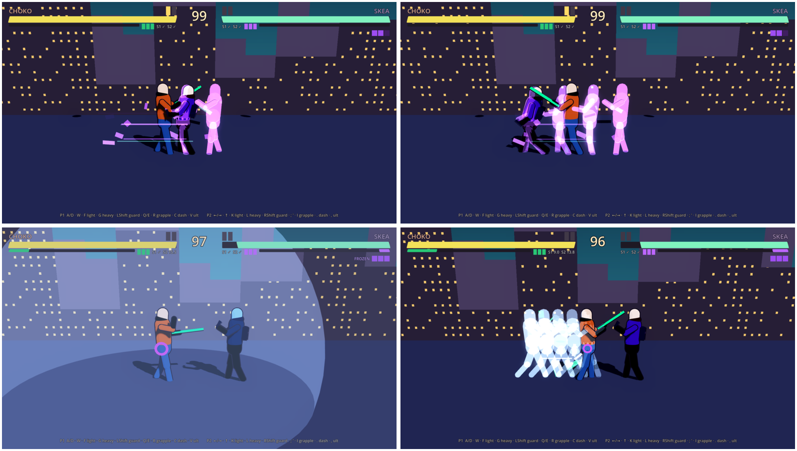
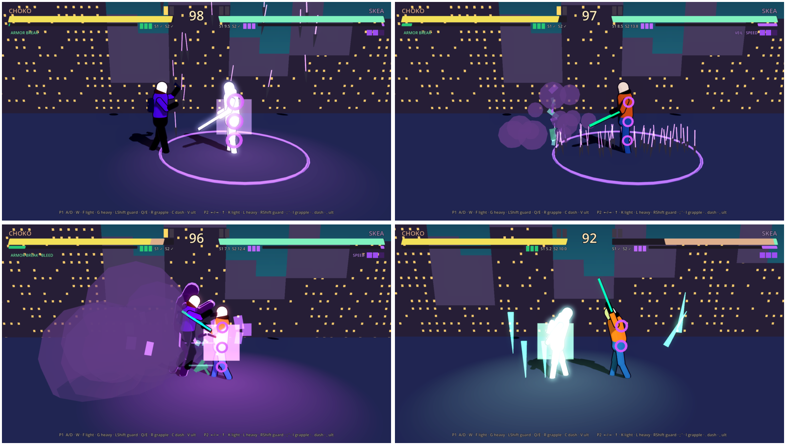

# Skea («Скі»), повне ім'я Skeasse («Скізі»)

**Ім'я:** коротко **Skea** — «Скі», повне **Skeasse** — «Скізі» (Santos, 2026-10-03); на картці — **SKEA**. **Статус у грі:** боєць №2, кіт реалізовано (числа PLACEHOLDER).
**Картка:** `game/assets/characters/cards/card_skea_v1.jpg` (надіслав Santos 2026-10-02) — [[Textures-Registry]]. Зовнішність на ній — v1, застаріла (див. § Було).
**Роль:** скляна гармата. Muay Thai + флеш-кроки + криты по слабких точках.

## Характер (Santos, 2026-10-03, santos-va/nooneisreal#33)

- Skea — **психопат**. Це має читатися навіть на 3D-моделі в 2D-стилі: погляд на нього дає **вау-ефект і мороз по шкірі**.
- У його психопатичній посмішці є **щось надприродне**: вона **занадто широка**, **нерухома**, поки решта обличчя рухається,
  а **очі в ній не беруть участі** — спокійні й холодні.
- Чого він **не** має читати: милоти, «дурнуватості», дитячості — саме так Santos назвав Skea хвилі 2 ([[2026-10-03-Skea-Redesign]]).

- **Звідки це (лор):** до прокляття Skea був **дружнім і чесним до всіх**. Тепер той, хто його прокляв, живиться його духом;
  Skea майже нічого про себе не розповідає і прагне лише **перерізати всі 12 сторінок** гримуара — **особливо свою тінь, Shaper**.
  Обрали його, бо він хотів лише волі дій і жив законом «не несеш болю світу — і світ дасть тобі добро»
  ([[Lore]] § Прокляття і гримуар ∞8).

Джерело — слова Santos у [[2026-10-03-Skea-Redesign]] § Що сказав Santos і [[2026-10-03-Skea-Curse-Lore-Answers]]. Як це малювати — бриф у [[2026-10-03-Skea-Redesign]] § Напрям.

## Зовнішність — v2 (Santos, 2026-10-03, #33)

Промпт — [[Prompt-Library]] § 1 IDENTITY Skea v2 і § 12. Тут — маркери, за якими Skea впізнають.

- **≈ 20 років** (бриф: 19–21), **довгий і худий**: голова ≈ 1/6–1/7 зросту (у [[Choko]] ≈ 1/5), довгі тонкі пальці.
- **Запалі щоки**, різкі вилиці, темні маджента-фіолетові тіні під очима.
- Світло-сірі очі з дрібними зіницями, **майже не кліпають**.
- Посмішка: кутики заходять трохи за лінію, де мали б закінчитися щоки; зубів забагато; брекети тонкі, темні, з фіолетовим відблиском.
- **Ледь помітні веснянки** — ідентичність, не «милота».
- Скуйовджене кучеряве каштанове волосся, спадає на лоб.
- Постава розхлябана: голова нахилена, плечі опущені, **стоїть занадто нерухомо**.

**Одяг** далі змінювався: худі, взуття й штани — **v3** ([[Prompt-Library]] § 14, рішення Santos 2026-10-03; лист S-1 `dcdef91d`,
худі N-5 `ab80973c`). Обличчя, посмішка й постава в v3 — ті самі, що вище.

### Рюкзак-гримуар і ∞8 (Santos, 2026-10-03)

- Рюкзак — стара шкіряна книга-гримуар. **∞8 — лише на задній панелі**, по центру, дивиться назад від спини Skea. На боках,
  лямках, клапані й корінці — нічого.
- Вісімка **жива**, бо це проклята книга, але **без очей, зубів і рота**. Життя в ній духовне: **жодного пульсу чи серцебиття**.
- Коли Skea рухається, вісімка лишає **неоновий шлейф, що відстає й розпорошується**; коли стоїть — шлейфу майже нема.

Джерело й реалізація в 3D (декаль + частинки, не генерація) — [[2026-10-03-Skea-Redesign]] § Рюкзак-гримуар і ∞8.

### Було — v1 (картка 2026-10-02, хвиля 2)

Широко розплющені сірі очі, «маніакальна усмішка з брекетами», веснянки; фіолетове худі з бірюзово-зеленим камуфляжем на
рукавах, ремені навхрест; чорні карго з кунаями на стегнах, перебинтовані гомілки, чорно-фіолетові кросівки; рюкзак-фоліант
зі світним ∞8 (місце не визначене); татуювання на передпліччі. Зброя на картці: **три кунаї в кастетному хваті** (панель 2),
**книга ∞8**, з якої валить фіолетовий дим (панель 3); панель 4 — тицяє пальцем у камеру. Santos 2026-10-03: читається
«дурнуватим, занадто дитячим» — замінено v2.

**Палітра VFX:** фіолетовий худі `#5C2E80` · світний фіолет ∞ `#9E4CF2` · бірюзовий камуфляж `#3D7A6B` · чорнило `#0D0814`.

## Історія (Santos, 2026-10-03)

- Skea і [[Choko]] — **в одному загоні**, **дуже близькі товариші**, разом пройшли багато складного.
- **Прокляття:** Skea був у **старій будівлі міста, у катакомбах**, і там його **охопив дух**. Choko в цей час був поруч,
  але **зовні, на вулиці**; потім він потрапив у будівлю, коли там лишився **непритомний Skea**.
- **Після прокляття:** той, хто прокляв (ім'я поки невідоме), **живиться духом Skea**. Під час прокляття була викликана **тінь
  Skea — Shaper**: один із ворогів, що з'явився, бо Skea прокляли, і тепер на боці того, хто прокляв. Shaper — один із 12. Той, хто прокляв, забрав **12 душ і 11 тіл**; **Skea теж хотіли
  забрати, але не вдалося** (причина невідома) — Skea так і лишився **«на половині»**. **Вісімка ∞8 — проти того, хто прокляв**:
  хоче його зупинити й робить усе, щоб його знайти.

Повний канон — [[Lore]] § Choko і Skea та § Прокляття і гримуар ∞8; джерела — [[2026-10-03-Choko-Skea-Bond-and-Curse]],
[[2026-10-03-Skea-Curse-Lore-Answers]].

## Стиль бою — Muay Thai + тіні

«Вісім кінцівок»: джеб, лікоть, коліно, раундхаус гомілкою, лоу-кік. Рваний, божевільний ритм: флеш крізь
суперника → коліно в повітрі → лікоть. Слабкий у захисті (900 HP, вага 0.9), сильний у вибуховому уроні.

## Кіт (реалізовано в `game/data/characters/skea.tres`)

| слот | P1: SHARED · SOLO | назва | суть | числа (PLACEHOLDER) |
|---|---|---|---|---|
| Легкий | F · J | Jab → Elbow | 2-й натиск — лікоть у верхню зону | 4/3/8 кадрів, 34 |
| Важкий | G · K | Roundhouse | гомілкою в корпус, поворот стегна | 11/4/18, 88 |
| Присід | S+F · S+J | Low Kick | по литці — глухий удар | 6/3/11, 32, нижня зона |
| Повітря | F · J у стрибку | Flying Knee (kao loi) | найкраще одразу після флешу | 6/5/12, 58 |
| **Рух** | C · Shift | **Flash Step** | телепорт-ривок 3.6 м **крізь** суперника за 4 кадри; 7 i-кадрів; привиди + рвані шматки руху | **3 заряди підряд → 4.5 с КД** (усі разом) |
| Скіл 1 | Q · U | **Kunai Rain** (Стальний ливень) | зв'язка кунаїв падає на коло 2.2 м у точці суперника (≤ 7 м) | 8 тіків × 11, кожен — Armor Break 4 с; КД 10 с |
| Скіл 2 | E · I | **Shadow Veil** (Покров безумства) | димова шашка: хмара 3 с (сліпить CPU), невидимість 3.5 с, +30 % швидкості | перша атака з вуалі — гарантований крит + Bleed 3 с; КД 14 с |
| Ульта | V · O | **Cursed Grimoire ∞8: 12 Печаток** | книга відкривається, 12 сторінок кружляють, три запечатані лиходії б'ють у радіусі 3.6 м | Сторінка 3 «Кривава хватка» 60 · Сторінка 7 «Проклятий опік» 60 · Сторінка 12 «Тінь» 90 + регдол + Poison; усе крит → 315 |
| Пасивка | — | **Weak Point Perception** (Око вразливості) | кожні 2.5 с на суперникові з'являється пульсуюча мітка (нижня/середня/верхня зона, макс. 2) | удар у мічену зону = крит ×1.5, ×3 чіп крізь блок, +30 % швидкості на 1.5 с |
| Гарпун | R · E | спільний | зип / свінг / підтягнути в клінч | 3 заряди, 3 с на заряд |

### Як дизайн-док перекладено у файтинг

- «Мітки на тілі» → **три зони** (низ/середина/верх), бо в 2.5D-файтингу анатомія = висота удару. Зона удару
  рахується з висоти хітбокса. Під Armor Break світяться всі три.
- «Ігнорує частину броні» → **×3 чіп-урону крізь блок** і +4 кадри блокстану.
- Kunai Rain «зондування» → дебафф **Armor Break** відкриває всі мітки на 4 с; самі тіки не критять (інакше ×1.5 на AoE).
- Shadow Veil «повна невидимість» → у локальному версусі гравець має бачити себе, тому лишається **ледь помітне мерехтіння-привид**
  (alpha 0.13 кожні 7 кадрів). Для CPU — повна сліпота: блукає, поки ти у вуалі чи в димі.
- Ульта: обрано **варіант Б** (контекстний призов). Варіант А (гортати сторінки і вибрати 3 з 12) — фаза 2: Q/E гортають, F підтверджує;
  потребує 12 описів лиходіїв (питання до Santos).

## VFX-напрям (див. [[VFX-Direction]])

Флеш: на кожному з 4 кадрів телепорту лишається **ступінчасто згасаючий фіолетовий привид** (12 fps-фейд), плюс
чорний «чорнильний» двійник на старті, **рвані шматки** (фіолет/бірюза/чорнило) летять проти руху, 5 тонких **штрихів
швидкості**. Після телепорту — **пружинний перехил тіла** (вторинний рух), щоб тіло «доганяло» рух як живе.

## Анімації для 3D-версії (Meshy library, група Fighting)

Kung_Fu_Punch (джеб) · Counterstrike (лікоть) · Simple_Kick / Flying_Fist_Kick (раундхаус/коліно) · Roll_Dodge (вуаль) ·
Charged_Spell_Cast (гримуар) · Hit_Reaction / BeHit_FlyUp. Справжній Muay Thai — Rokoko free fight packs або власний мокап.

## Не сказано — Santos додає з часом

- Ім'я того, хто прокляв; назва й склад загону; імена й ефекти 12 ([[2026-10-03-Skea-Curse-Lore-Answers]]).
- Голос і фрази ([[2026-10-02-Characters-Interview]] блок B). Стосунок до Choko і вимова імені — закрито (B1).

**Не плутати:** Shaper — ворог, **не** «Сторінка 12 „Тінь“» з ульти (§ Кіт).

## Related
- [[Choko]] · [[Roster]] · [[Lore]] · [[03-Skills-Framework]] · [[08-Balance]] · [[VFX-Direction]] · [[2026-10-02-Skea-Kit-and-Balance]] · [[2026-10-03-Skea-Redesign]] · [[2026-10-03-Choko-Skea-Bond-and-Curse]] · [[2026-10-03-Skea-Curse-Lore-Answers]]
