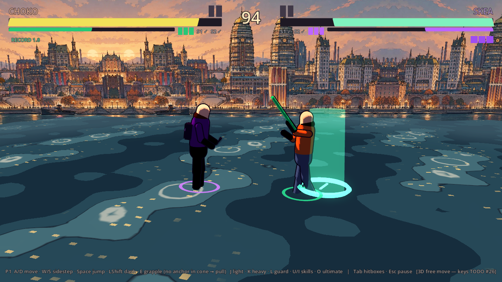
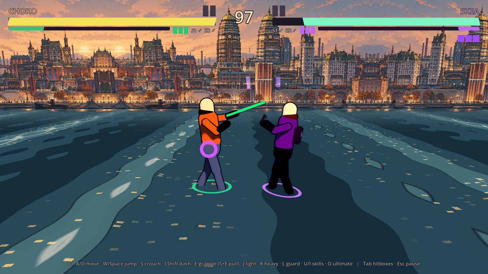
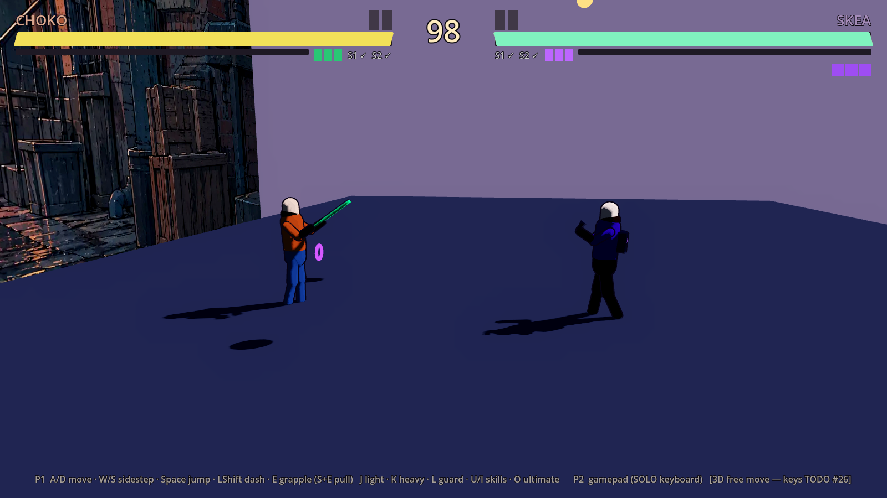
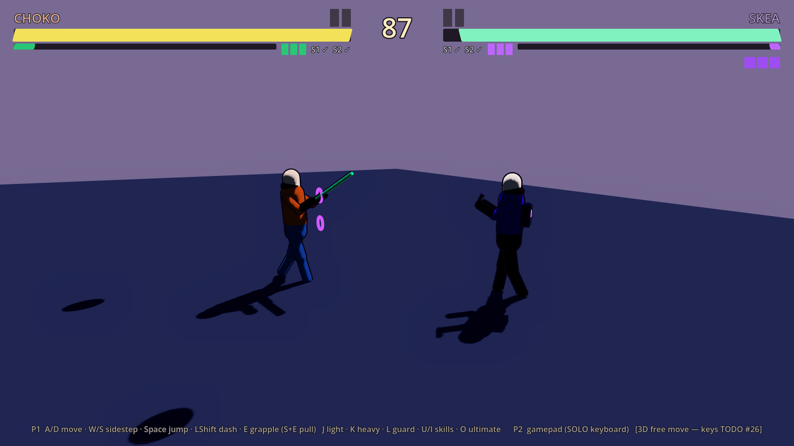
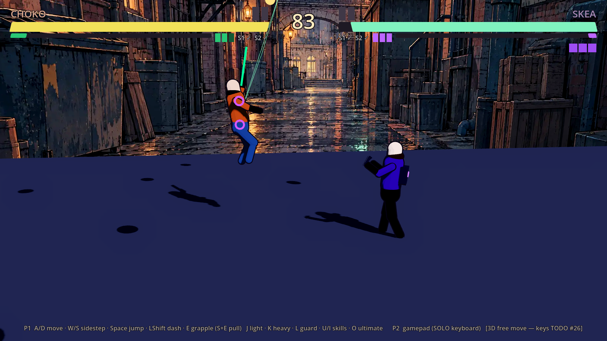

# Fix-журнал — Prototype 0.3: вільний рух (0.3-1), камера дуелі (0.3-2), гарпун у 3D (0.3-3)

**Роль:** T2 Гефест. **План:** [[2026-10-03-Prototype-0.3-Free-Movement]]. **Issue:** santos-va/nooneisreal#27.
**Гілка:** `claude/friendly-ritchie-3ti2sm` (перезапущена від `main` `4dd6c84`, бо PR #21 уже змерджено).

## Звірка плану з репо (до роботи)

- `git log --oneline -1` → `4dd6c84 Merge pull request #28`. `godot --version` → `4.7.stable.official.5b4e0cb0f`.
- Базова лінія: `make check` → `[smoke] ALL OK (36 checks)`, `SMOKE ЗЕЛЕНИЙ`.
- Рядки з § «Що є зараз» перевірено через `sed -n <n>p`, вони збігаються: `Fighter.gd:22, 57, 613–614, 670, 690, 714, 986,
  1038, 1128, 1152–1153`, `FightCamera.gd:17–23`, `InputRouter.gd:130`, `GrappleHook.gd:21, 125–129`, `WaveField.gd:86`,
  `SmokeTest.gd:62`.
- Розбіжності повернуто Дедалу коментарем у #27 (issuecomment-5964184886):
  1. `Arena.tscn` `Ground` має `size = Vector3(60, 1, 12)`, а коло R = 12.5 виходить за підлогу по z.
  2. Площина зашита ще й тут: `Fighter.gd:155, 472–473, 919, 986, 990, 1038, 1129`, `get_pulled(target_x)`,
     `RigAnimator.gd:195, 208, 271`, `GrappleHook.gd:95, 139, 204, 207`, скіли.
  3. Клавіш обходу план не фіксує, а W/S і стік-вниз уже зайняті стрибком і присідом.
  4. #24 (PR #29) ще не змерджено, #25 і #26 не готові, тож усі числа — PLACEHOLDER.

## 0.3-1 Вільний рух за прапорцем

- `GameState.free_move := false`, `set_free_move()` (одразу перебудовує клавіатуру), ключ запуску `-- --free-move` (`Main.gd`).
- `scripts/core/DuelFrame.gd` (новий): `right` показує, куди на екрані «праворуч». Вектор іде вздовж лінії P1→P2,
  оновлюється раз на фізкадр (`InputRouter.frame()`) і зберігає знак, тож при обміні сторонами не перекидається.
  Якщо бійці ближче за 0.05 м, лишається попередній напрям.
- `InputRouter`: дії `up`/`down` (створюються в рантаймі), `move(player) -> Vector2`; у площині y = 0.
  `apply_profile()` при `free_move` переносить W/↑ зі `jump` на `up`, S/↓ з `crouch` на `down` (TODO #26).
- `Fighter.gd`: `forward: Vector3`; `facing` у 3D визначає бік екрана (`forward · duel.right`). Кожна зміна стоїть за `_free()`,
  тож код площини лишився тим самим:
  - рух: уздовж лінії йде на walk/back-walk, впоперек — обхід зі збереженням дистанції (дуга, а не спіраль);
  - стрибок, повітря, деш і flash-step — за вектором стіка;
  - lock-on у `_update_facing`;
  - трекінг: за startup атака доповертає не більше `tracking_deg` сумарно;
  - хітбокс і дебаг-бокс — через базис `yaw()`; відкидання, пушбек блоку, KO-імпульс — по `attacker.forward`;
  - блок: атакувальник у межах `BLOCK_HALF_ANGLE` від `forward`;
  - коло `clamp_arena()`, push-box радіально (у спільній точці — вздовж `-forward`);
  - регдол і KO тримають z.
- `MoveData.tracking_deg = 30.0` (PLACEHOLDER, кут узято з перевірки плану). `RigAnimator`: поворот рига — `f.yaw()`,
  фаза ходьби рахується за `velocity · forward`.
- `Arena.gd`: при `free_move` підлога по z = 2·(R + 1) = 27 м. Режим площини сцену не міняє.
- Предмет: для всіх кадрів у `free_move` боєць у наземних станах дивиться на суперника, обхід тримає дистанцію,
  атака доповертає рівно min(кут, `tracking_deg`), а позиція не виходить за коло R.

## 0.3-2 Камера дуелі

- `scripts/arena/DuelCamera.gd` (новий) і вузол `DuelRig` → `SpringArm3D` (mask 1, margin 0.2) → `Camera3D` в `Arena.tscn`.
  Рамка камери (відстань, підйом, згладжування `pow(0.0015, delta)`) — як у `FightCamera`. Yaw іде за `GameState.duel.right`.
- `Arena.gd`: у `free_move` вимикає `CameraRig` і робить `DuelRig` поточною камерою. У площині `DuelRig` видаляється
  (`queue_free`), тож площина не змінюється. Тряска йде на активну камеру. `FightCamera.gd` не змінено.
- Предмет: для всіх обходів і обмінів сторонами камера повертається не швидше за `MAX_TURN_DEG_PER_FRAME` (6°, PLACEHOLDER)
  і тримає обох бійців у кадрі.

## Перевірка

- `make check` → `[smoke] ALL OK (45 checks) in 3864 frames`, `SMOKE ЗЕЛЕНИЙ`. Перші 36 — старі, з `free_move=false`.
  Нові:
  - `free move: duel camera current; SOLO W/S → sidestep (TODO #26), no key clashes in SOLO/SHARED`
  - `sidestep 90° in 102 frames: forward 0.89° off the opponent, distance 6.000 → 6.000 (arc, not spiral), p1 z -6.00`
  - `tracking: light started 60° off the opponent turned 30.0° and hit (hp 900 → 858)`
  - `tracking negative control: with tracking_deg 0 the same strike turns 0.0° and misses`
  - `arena circle: walked into the edge, max radius 12.500 ≤ 12.50`
  - `duel camera: 360° sidestep in 271 frames, max turn 1.34°/frame ≤ 6.0, at most 13.0° off side-on ≤ 25.0 (both PLACEHOLDER), both fighters in view`
  - `duel camera: side swap without a flip, max turn 1.20°/frame; screen x p1 1208, p2 392`
- `make gates` → `БАТАРЕЯ ЗЕЛЕНА` (GDS 35 файлів).
- Негативні контролі: мутація → smoke → відновлення; результат див. нижче.

Скрипт мутує файл, запускає `godot --headless --path game --quit-after 12000 -- --smoke` і відновлює файл
(`git status` після прогону: лише мої зміни). Кожна мутація має дати `[smoke] FAIL`.

| мутація | що ламає | результат |
|---|---|---|
| T1 `step := ang` | трекінг без межі | `FAIL tracking: … turned 60.0° (want hit, 30.0° = tracking_deg)` |
| T2 `_track()` не викликається | трекінгу немає | `FAIL tracking: 60°-off light hit false, turned 0.0°` |
| T3 `rotated(…, -step)` | трекінг не в той бік | `FAIL tracking: 60°-off light hit false, turned 30.0°` |
| S1 без корекції орбіти | обхід іде спіраллю | спершу **пройшло** (допуск 0.3 м); після посилення до ±0.01 м — `FAIL … distance 6.000 → 6.074` |
| S2 без lock-on | боєць не дивиться на суперника | `FAIL sidestep 90°: forward off by 91.80°` |
| R1 без `clamp_arena` | коло не тримає | `FAIL arena circle: p1 at radius 12.546 > 12.50` |
| C1 `DuelFrame` без збереження знака | камера перекидається | `FAIL duel camera on a side swap: max turn 17.29°/frame` |
| C2 камера сама рахує лінію P1→P2 | те саме, оминаючи `DuelFrame` | `FAIL … side swap: max turn 17.41°/frame` |
| C3 yaw камери зафіксовано | камера не йде за лінією | спершу **пройшло**; після нової перевірки «не далі 25° від положення збоку» — `FAIL … off side-on 90.0° (bound 25.0)` |

Два мутанти (S1, C3) спершу не впіймались. Тести посилено, і після цього обидва дають `FAIL`.
Після посилення `make check` → `ALL OK (45 checks)`: дистанція `6.000 → 6.000`, камера відходить від положення збоку максимум на 13.0°.

## 0.3-3 Гарпун у 3D

**Звірка:**
- Правило — [[04-Grapple-System]] § «Конус вибору в 3D» (Арес, #25, змерджено в `main`). Конус по yaw із напівкутом
  `grapple_cone_deg` = 30° (ДИЗАЙН). Вісь — стік відносно камери, а без стіка — погляд. Оцінка `відстань − 0.6·вперед`, де
  «вперед» — проєкція на вісь конуса. `pull_enemy` тягне вздовж погляду в тому самому конусі ≤ 14 м.
  [[02-Combat-System]]:156 каже те саме: `grapple_cone_deg` у `CharacterData`, 30.
- Код до змін: `GrappleHook.gd:95, 139, 204, 207` рахують лише по x, `drive()` обнуляє `velocity.z`, а п'ять якорів `Arena.tscn`
  стоять на лінії z = 0 (`x = −9.5, −4.5, 0, 4.5, 9.5`).
- Розбіжність, яку повертаю Дедалу: план просить «якорі арен у 3D по колу», але позицій ніде немає. Тимчасово, лише при
  `free_move`, `Arena._anchors_around()` дублює кожен бічний якір, повернутий на 90° навколо центру. Висоти й відстані
  беру наявні, нових чисел немає. Це PLACEHOLDER розкладки.

**Зміни:**
- `CharacterData.grapple_cone_deg = 30.0`. У `.tres` поле не пишу, бо значення там — зона Ареса, а дефолт збігається з його числом.
- `GrappleHook`: `aim_axis()` і `_in_cone()` (yaw, `cos(a) ≥ cos(cone)`); `_best_anchor` відкидає якорі поза конусом.
  Свінг у 3D: кермо — стік відносно камери, `velocity.z` не обнуляється, а при досягненні якоря горизонталь обмежена 8 м/с
  (той самий кламп, що й по x).
- `Fighter.get_pulled_to(target: Vector3, stun)` — версія `get_pulled(target_x)` для 3D.
- **Баг з 0.3-1:** `_friction()` у 3D гальмував x і z окремо, тож по діагоналі рух гас у √2 раз швидше. Тепер `Vector2.move_toward`
  гальмує вектор. Знайшов його тест підтяжки: P2 недолітав на 0.91 м, після виправлення — 0.09 м.
- Предмет: для всіх положень і стіків у `free_move` обраний якір лежить у конусі навколо осі прицілу, зип і свінг доводять
  до якоря в глибині, а підтяжка ставить суперника на 1.25 м перед бійцем незалежно від напрямку.

**Перевірка:** `make check` → `[smoke] ALL OK (48 checks) in 4069 frames`, `SMOKE ЗЕЛЕНИЙ`. Нові:
- `grapple cone 30°: stick up → Anchor2Z, down → Anchor4Z, neutral (gaze) → Anchor4; next to Anchor2 with stick up → Anchor1Z (the lamp beside is outside the cone)`
- `grapple 3D: reeled to the anchor at z -4.50 (closest 1.28 m), p1 now at z -5.07`
- `grapple pull 3D: P2 from (3, 3) to 0.09 m off the spot 1.25 m in front of P1 (z moved 2.05)`

**Негативні контролі 0.3-3** (той самий скрипт: мутація → smoke → відновлення):

| мутація | що ламає | результат |
|---|---|---|
| G1 без перевірки конуса | хапає будь-який якір | спершу **пройшло**: на тій розкладці найкраща оцінка й так була в конусі. Додано позицію поруч із ліхтарем Anchor2, і тепер `FAIL grapple cone (up_near_lamp): Anchor2 is 100.6° off the aim` |
| G2 вісь лише з погляду | стік ігнорується | `FAIL grapple cone: up Anchor4, down Anchor4, neutral Anchor4` |
| G3 вибір як у площині | лише вісь x | `FAIL grapple cone (up): Anchor4 is 90.8° off the aim (cone 30°)` |
| G4 свінг з `velocity.z = 0` | гарпун плаский | `FAIL grapple 3D never attached/released (state 13, attached true)` |
| G5 підтяжка по x | старий `get_pulled(target_x)` | `FAIL grapple pull 3D: … 1.90 m …, z moved 0.00` |
| G6 тертя окремо по x і z | баг 0.3-1 | `FAIL grapple pull 3D: … 0.91 m …` |

Після контролів, без зміни поведінки в тестах: `GrappleHook` читає стік через публічний `Fighter.wish()`, а не через `_wish`.
Кламп швидкості на відпусканні в 3D тепер лише векторний: раніше перед ним ще спрацьовував площинний кламп x.
Підказка HUD у 3D: «(no anchor in cone → pull)» замість «S+E pull». Контролі G1–G6 проганялись до цієї чистки.

Після посилення `make check` → `ALL OK (48 checks) in 4072 frames`; новий рядок конуса:
`… next to Anchor2 with stick up → Anchor1Z (the lamp beside is outside the cone)`.

## Відповідь Дедала (#39): скіли в 3D, числа Ареса, фон

PR #37 змерджено о 02:41 на `0c9af12`, ще до мого пушу 0.3-3. Коміт гарпуна перенесено на свіжий `main` (`12ccf38`,
уже з #39), тож тепер він іде новим draft PR santos-va/nooneisreal#43. Мій коментар у #27 спершу хибно називав PR #37 —
виправлено.

**Звірка відповіді з джерелами** (не з переказом): [[02-Combat-System]] рядки 82, 86–100, 104–114, 123, 150–157 і
[[03-Skills-Framework]] § Як у 3D. Числа збігаються з таблицею Дедала. У джерелі ширше, ніж у переказі: м'яка стіна, wall splat,
відсув arm камери, замок вводу на флеші.

**Зроблено (усе за `free_move`):**
- `tracking_deg` у `.tres`: light 30 · crouch_light 20 · heavy 15 · air_light 10 · ult 45 · hook_pull 0 · скіли 0 (у [[03-Skills-Framework]]
  куту немає: коло, гліф або ціль). Дефолт `MoveData` тепер 0. У `.tres` пишу числа Ареса, а не свої.
- `backhit_hitstun_bonus` у `.tres` за класом: light/air 2, heavy/crouch 3, skill/ult 6 (`SkillHit` — 6), hook_pull 0.
  Повітряний удар Арес окремо не назвав, тож віднесено до легких — це мій мапінг, винесено на перевірку Аресу.
- `CharacterData.block_arc_deg = 70`, `circle_speed_mult = 0.8`. `BLOCK_HALF_ANGLE` прибрано.
- М'яка стіна: на колі гаситься радіальна складова швидкості, тангенційна лишається.
- `DuelFrame.hold()`: на Flash Step плюс 6 кадрів напрям вводу замкнений (02 § Камера, п. 4).
- `DuelCamera`: кламп yaw 3°/тік у `_physics_process`; коли відставання > 15°, arm відсувається до +30 %.
- Скіли: TIME STOP і CURSED GRIMOIRE б'ють колом; SWORD STORM — смугою 5.4 × 1.2 м уздовж погляду (ефект повернуто на yaw);
  KUNAI RAIN падає на точку суперника (≤ 7 м); Flash Step іде вздовж лінії крізь суперника, а стік убік дає ±45°.
- Фон повертається за yaw камери на тій самій відстані (п. 5).
- **Не зроблено:** wall splat (`wall_splat_frames` 10, раз на комбо). Регдол — лише презентація ([[ADR-004-Physics-Is-Presentation]]),
  а прилипання до стіни потребує окремого стану в бійця. Це борг на 0.3-6 або окремий крок, не вигадую на ходу.
  Також не зроблено поділ дешу на 8 напрямків (зараз деш іде точно за стіком).

**Перевірка:** `make check` → `[smoke] ALL OK (56 checks) in 4874 frames`. Нові:
- `sidestep 90° in 128 frames (want 126 at 0.8 × walk)`
- `block arc ±70°: attacker at 65° blocked, at 75° not; back hit stun 16 = hitstun 14 + 2; soft wall keeps tangential 3.0 m/s, outward → 0`
- `duel camera: 360° sidestep … max turn 1.07°/frame ≤ clamp 3.001 … backdrop at most 10.2° off the view (< 90)`
- `duel camera on a 90° jump: max turn 3.00°/tick ≤ 3.0, arm pulled back to +28 %, caught up (lag 0.00°)`
- `TIME STOP 3D: P2 3 m away at 50° frozen; P2 at |dx| 1 but 5.1 m away untouched`
- `SWORD STORM 3D: band along the gaze hit P2 at 40° (hp 900 → 874); 2 m beside the band — no more hits`
- `KUNAI RAIN 3D: P1 4 m away at -60° hit (hp 1050 → 992), armor break 235 f`
- `CURSED GRIMOIRE 3D: P1 2.5 m away at 60° hit and ragdolled (hp 1050 → 729); at |dx| 1 but 5.1 m away untouched`
- `FLASH STEP 3D: from 135° straight through P2's line (0.0° off), 3.60 m travelled`
- `FLASH STEP 3D: sideways stick turned the exit 45.0° off the line (rule 45°)`

Помилки в самих тестах (не в грі), виправлено. Я двічі помилився саме в тесті. Перший раз — натискання time stop у кадрі,
коли P1 ще був у відновленні, тож буфер спливав. Другий раз — одна змінна на два виміри камери. Обидва — помилки тесту, не гри.

**Негативні контролі** (мутація → smoke → відновлення):

| мутація | що ламає | результат |
|---|---|---|
| S1 TIME STOP по `|dx|` | коло → смуга | `FAIL time stop 3D: froze P2 5.1 m away (only |dx| = 1)` |
| S2 SWORD STORM без ширини смуги | б'є збоку від смуги | `FAIL sword storm 3D: hit P2 2 m beside the band` |
| S3 KUNAI на осі x | центр без z | `FAIL kunai 3D: P1 4 m away at -60° not hit` |
| S4 GRIMOIRE по `|dx|` | коло → смуга | `FAIL grimoire 3D: hit P1 5.1 m away (|dx| 1)` |
| S5 флеш без зсуву вбік | правило ±45° | `FAIL flash 3D: sideways stick turned the exit 0.0°` |
| S6 флеш за стіком (як деш) | не крізь суперника | `FAIL flash 3D: … turned the exit 90.0°` |
| N1 `block_arc_deg` 90 | старий кут | спершу **пройшло**: тест брав кут із даних, тобто був тавтологією. Тепер кути з плану 65°/75° → `FAIL … guards at 65° true, at 75° true` |
| N2 без бонусу за спину | +2/+3/+6 | `FAIL backhit: stun 14, want 14 + 2` |
| N3 обхід на швидкості `walk_speed` | множник 0.8 | `FAIL sidestep speed: 90° took 102 frames, want 126 ± 5 %` |
| C1 без клампу камери | 3°/тік | `FAIL … 90° jump: max turn 89.61°/tick` |
| C2 без відсуву arm | +30 % | `FAIL … max pull-back 0.00 (want > 0.2)` |
| B1 фон не крутиться | п. 5 Дедала | `FAIL … backdrop at 169.8° (want < 90)` |
| W1 без м'якої стіни | радіальна складова | спершу **пройшло**, бо тесту не було. Додано пряму перевірку → `FAIL soft wall: outward 5.000 (want 0)` |

Після посилення `make check` → `ALL OK (56 checks) in 4874 frames`.

## 0.3-4 CPU у вільному русі

План ([[2026-10-03-Prototype-0.3-Free-Movement]], рядок 0.3-4): «підхід у 3D, обхід, реакція на обхід гравця;
smoke: CPU за 10 с хоч раз обходить і хоч раз влучає». Звірка: `CpuBrain.gd` існує, `GameState.free_move` і
`GameState.duel.right` є (з 0.3-1/0.3-2), дії `up`/`down` у `InputRouter.ACTIONS` є — розбіжностей немає.

- **Підхід у 3D:** у `free_move` бік і дистанцію CPU рахує в кадрі дуелі: `dx` = проєкція на `GameState.duel.right`,
  відстань — довжина вектора в XZ, а не |Δx|, тож «до/від» правильні під будь-яким кутом лінії.
- **Обхід:** з близької/середньої дистанції (1.2–6 м) з імовірністю `SIDESTEP_CHANCE` 0.25 за рішення CPU тримає
  `up` або `down` 20–40 кадрів замість підходу чи удару; лічильник `sidesteps` для smoke.
- **Реакція на обхід гравця:** якщо суперник ближче 2.8 м і його дотична швидкість > 1 м/с, CPU б'є легким з
  імовірністю `PUNISH_SIDESTEP_CHANCE` 0.6 × difficulty (удари доводяться трекінгом Ареса на startup).
- Імовірності — PLACEHOLDER налаштування ШІ, не числа бою; Арес може переналаштувати. Площина без змін.
- **Smoke, стадія 56:** P2 = CPU у 3D, старт на ±2.5 м; за 600 кадрів має бути ≥ 1 обхід, кут, обметений
  довкола P1, ≥ 20° (стрибки бірунгу > 30° — прохід крізь/над суперником — не рахуються) і ≥ 1 влучання.
  Чистий прогін: `CPU 3D in 10 s: 3 sidesteps, swept 237° around P1, 11 hits landed`.
- `make check` → `[smoke] ALL OK (57 checks) in 5478 frames`; `make gates` → rc=0.
- Предмет: для всіх 10-секундних відрізків бою CPU у 3D: CPU хоч раз обходить і хоч раз влучає.
- Негативний контроль — три форми зламу від предмета, кожна → `FAIL`, файл відновлено (`git status` чистий):
  A) CPU не обходить (`SIDESTEP_CHANCE = 0`) → `sidesteps 0, swept around P1 0° (want ≥ 20), hits 18`;
  B) CPU кружляє, але в 3D ніколи не доходить до атаки (`_free_move_choice` завжди `true`) →
  `sidesteps 6, swept around P1 132°, hits 0 (want ≥ 1)`;
  C) обхід зараховано, але натиснуто не `up`/`down` (`v_set(p, "block")`) → `sidesteps 3, swept around P1 0°
  (want ≥ 20), hits 9` — тобто тест рахує кут довкола P1, а не лічильник `sidesteps`.
  Спершу була лише форма A; B і C додано за словом Santos (борг закрито).
- Історія коміту: робота лишилась незакоміченою в робочому дереві після мержу #46; знайдена за хуком, прогнана
  `make check` і негативним контролем, закомічена (`6c4cbef`), після мержу #46 перенесена на `main` → `19f63b1`,
  draft PR santos-va/nooneisreal#48.

## 0.3-5 Річка у вільному русі

План (рядок 0.3-5): «`WaveField.gd` `height(x, z)`, `slope`, `Water.gd` (стадія `river` у 3D); smoke-стадія `river`
у `free_move`: висота детермінована (два прогони → однаковий хеш)». Звірка: `WaveField.height(x)` одновимірна,
`Fighter.floor_y()` бере лише x, меш води — смуга z ∈ +7…−18, а коло арени — радіус 12.5 (`Fighter.ARENA_RADIUS`):
план відповідає коду, розбіжностей немає.

- **`WaveField`:** `height(x, z = 0)`, `gradient(x, z) → (∂h/∂x, ∂h/∂z)`, `slope(x, z)` = ∂h/∂x. Нове
  `directions_deg` (0°, 35°, −50°, PLACEHOLDER у `river_water.tres`) і прапорець `use_z`, який Arena ставить з
  `GameState.free_move`. Без `use_z` кожна хвиля йде вздовж +X **тією самою арифметикою, що в 0.2** (`_along`
  повертає саме `x`) — площина не змінюється. Хвиля 0 (несе вал) лишається вздовж X.
- **`Fighter.floor_y()`** → `height(x, z)`. **`RigAnimator`**: гойдання за нахилом уздовж `forward` у 3D
  (у площині `forward·∇h` = `slope × facing`, як було).
- **`Water.gd` / `water_toon.gdshader`:** у 3D меш 38 × 38 м з центром у центрі арени (160 × 160 поділок), шейдер
  рахує ту саму формулу з `use_z` і `dir_deg`; затухання в намальовану річку — за відстанню від центру
  (`far_r` 18 м = відстань картки фону), не за z. Кільця тримання стоять на (x, z) бійця й нахиляються за ∇h.
- **Smoke, стадії 60–61:** річка у `free_move`, однаковий скрипт вводу двічі (обходи `up`/`down` знімають
  обох з лінії z = 0). Щокадру: y ≥ h(x, z) − 0.05. На кадрі 600: хеш позицій і HP обох + сітки 9 × 9 висот
  над колом (округлено до 1e-6). Додатково тест вимагає, щоб прогін справді перевіряв глибину: |z| ≥ 1 м і
  |h(x, z) − h(x, 0)| ≥ 0.01 м. Чисто: `nobody sank (min gap -0.011 m), |z| up to 3.62 m, surface differs from
  z=0 by up to 0.093 m; hash 672390874` обидва рази → `deterministic`.
- Площина без регресу: стадія `river` у площині дає ті самі позиції на кадрі 600, що у фазі 1
  (`p1 x 4.1532 y 0.0019, p2 x -1.7949 y 0.0915`). Мін. зазор −0.026 м там — і до моїх змін (перевірено
  окремим `git worktree` на `HEAD`), а не −0.017 з фази 1: його змінили кроки 0.3-1…0.3-4.
- Предмет: для всіх кадрів і бійців на воді у 3D: y ≥ h(x, z) − 0.05, і однаковий ввід дає однаковий хеш стану й поверхні.
- Негативний контроль (кожен → червоне, файли відновлено): A) `floor_y` ігнорує z → `P2 sank (y -0.073, surface
  -0.020 at x 0.34 z 2.39)`; B) Arena не ставить `use_z` → `WaveField.use_z is off under free_move`; C) напрям
  хвилі дрейфує на кожному завантаженні (`randf_range`) → `two runs differ at frame 600 (hash 3486546911 vs 2619771948)`.

### Знахідка в гейті `make check` (виправлено)

- Перший прогін з новою стадією показав `SMOKE ЗЕЛЕНИЙ` **без** рядка `ALL OK`: smoke не дійшов до кінця, а
  процес вийшов по `--quit-after 12000` з rc=0. Причина: `--quit-after` рахує ітерації головного циклу, а headless
  крутить цикл швидше за 60 Гц, тож фізкадрів у бюджеті менше й залежить від швидкості машини; власний
  таймаут smoke (14000 фізкадрів) не встигав спрацювати.
- `Makefile`: smoke з `--fixed-fps 60` (одна ітерація = один фізкадр), `--quit-after 20000` (> таймауту 14000), і
  «зелений» лише якщо rc=0 **і** є `[smoke] ALL OK`. Прогін тепер ≈ 4.4 с (`time`), а не до двох хвилин.
- Негативний контроль гейта: `--quit-after 3000` → `SMOKE ЧЕРВОНИЙ: немає рядка «[smoke] ALL OK»`.
- Підсумок: `make check` → `[smoke] ALL OK (64 checks) in 6841 frames`, `SMOKE ЗЕЛЕНИЙ`.

## 0.3-6 Детермінізм обох режимів

План (рядок 0.3-6): «`SmokeTest.gd`: прогін обох режимів + детермінізм (однаковий ввід двічі → однаковий хеш позицій
і HP)». Звірка: обидва режими smoke вже проганяв; детермінізм перевірявся лише на річці (площина з 0.2, 3D з 0.3-5),
а повного бою з ударами, скілами, гарпуном, ультами й регдолом двічі не проганяв ніхто.

- **Smoke, стадії 70–71 (`back_alley`):** один сценарій вводу на 1110 кадрів для обох режимів (підхід, рядок ударів,
  важкий, скіли обох, деш/флеш, стрибок з ударом, гарпун, обходи — лише у 3D, обидві ульти з наповненням шкали).
  Кожні 30 кадрів — знімок обох бійців (позиція, `forward`, HP, шкала, стан, комбо, статуси, влучання), 37 точок →
  хеш. Площина двічі, далі `free_move` двічі. При розбіжності тест друкує перший кадр і обидва знімки.
- Сценарій сам себе перевіряє: ≥ 3 влучань і ≥ 1 регдол, і **наприкінці ніхто не в регдолі**. Перша версія
  (900 кадрів) у площині ловила регдол на останньому знімку, тож його результат у хеш не потрапляв — B нижче
  проходила в площині. Подовжено до 1110 кадрів і додано цю умову.
- `--smoke-only=duel` — запуск лише цієї стадії (для розробки й негативних контролів), ≈ 4.8 тис. кадрів.

### Знахідка: недетермінізм після регдола (виправлено)

- Чистий код, `--smoke-only=duel`, три запуски: 1 зелений, 2 червоні — `runs differ, first at frame 900/930`,
  різниця в x бійця в стані LAUNCHED ≈ 1e-5…2e-5 м.
- Причина: `RigAnimator.flinch()` брав `randf_range` із глобального RNG (`RigAnimator.gd:198`). Флінч входить у позу,
  з якої `Ragdoll.build_from(animator.part_snapshot())` будує тіла, а `pelvis_position()` після регдола стає позицією
  бійця (`Fighter._tick_launched`) — «візуальна» випадковість протікала в геймплей.
- Виправлення: власний `RandomNumberGenerator` у `RigAnimator`, зерно `hash(data.id)` у `setup()`. Після нього:
  `--smoke-only=duel` 5 / 5 — однаковий хеш навіть між процесами (площина `2663329136`, 3D `2042024736`);
  повний `make check` 3 / 3 — однакові хеші (площина `1657113323`, 3D `1388734946`).
- **Відкрите (до Дедала, ADR-004):** хеші повного прогону й `--smoke-only` різняться: після регдола x лягає інакше
  на ≈ 0.7 мм (знімок 32, кадр 960) — **число хибне, виправлення нижче в § Після аудиту 0.3-7**, коли до дуелі в процесі були інші сцени. Детермінізм тримається за однакової
  історії процесу, але позицію бійця після регдола вирішує фізичний рушій. Для реплеїв/мережі треба, щоб місце
  приземлення рахувалося кінематично, а регдол лишався лише картинкою — це архітектурне рішення, не цей крок.

- `make check` → `[smoke] ALL OK (78 checks) in 11621 frames`; `make gates` → rc=0.
- Предмет: для обох режимів і будь-якого бою з ударами, скілами, гарпуном і регдолом: однаковий ввід двічі →
  однаковий стан у кожній контрольній точці.
- Негативний контроль (`--smoke-only=duel`, кожна → `FAIL`, файли відновлено):
  A) відкидання × `randf_range(0.99, 1.01)` → `duel replay plane: runs differ, first at frame 60`;
  B) імпульс регдола × `randf_range(0.9, 1.1)` → `plane: … first at frame 900`;
  C) лише у 3D: `forward` повернутий на ±0.002 рад випадково → площина `deterministic`, `free: … first at frame 0`;
  D) повернути глобальний `randf` у флінч → `plane: … first at frame 930` тричі з трьох — це відтворення знахідки.

## Після аудиту 0.3-7 (Феміда: YELLOW, без RED) і wall splat

Вказівки Феміди для Гефеста — `docs/Audit/2026-10-03-0.3-7-Free-Movement.md` (гілка `claude/femida-0.3-7`, `67a493d`).

- **Виправлення мого числа (R0).** Я писав «≈ 0.7 мм» розбіжності після регдола між повним smoke і `--smoke-only=duel`.
  Це число я прочитав на око з двох рядків трас, не порахувавши. Перерахунок (`awk` + Python по 37 знімках обох трас):
  площина — max |Δ позиції| **1·10⁻⁵ м** (з кадру 960), 3D — **5·10⁻⁵ м** (з кадру 780); HP, шкала, стан, комбо в площині — 0
  розбіжностей. У 3D є 12 розбіжностей в інших полях знімка; за розміром вони схожі на округлення `forward` (4 знаки),
  але по полях я їх не розбирав, тож розбіжності в HP чи стані у 3D не виключено. Феміда виміряла ≤ 0.05 мм — збігається.
  Висновок для Дедала той самий (ADR-004), масштаб — у 14 разів менший.
- **п. 1 Що їде і куди:** 0.3-6 (`303604f`) після мержу #48 перенесено на свіжий `main` (`ee06a4c`) разом з усім нижче,
  новий PR; «draft PR #48» у `state.md` виправлено.
- **п. 3 Дизайн-числа — літералами з GDD.** `SmokeTest` має таблицю `GDD_*` з [[02-Combat-System]] § «Поле → значення →
  джерело» і пряму звірку `_gdd_mismatch()` (радіус, кламп камери, відсув, кут блоку, обхід, конус гарпуна, wall splat,
  `tracking_deg` і `backhit_hitstun_bonus` за класом руху для обох героїв); поведінкові перевірки беруть ті самі літерали.
  Негативний контроль: NC5 Феміди `YAW_CLAMP_DEG` 3 → 6 → `FAIL design numbers drifted …: DuelCamera.YAW_CLAMP_DEG = 6.0,
  GDD says 3.0`; NC7 `ARENA_RADIUS` 12.5 → 14 → `… Fighter.ARENA_RADIUS = 14.0, GDD says 12.5`; `choko.tres` light
  `tracking_deg` 30 → 25 → `FAIL … choko.light.tracking_deg = 25.0`; `block_arc_deg` 70 → 80 → `FAIL … choko.block_arc_deg = 80.0`.
  (До цього NC5 і NC7 давали `ALL OK (78 checks)` — у Феміди.)
- **п. 7 `free_move = true` за замовчуванням** (слово Santos у Феміди): `GameState.free_move = true`, `-- --plane` у `Main.gd`,
  `make run-plane`; `make run` тепер грає вільний рух (це й п. 2: «Santos гратиме саме 0.3»). `SmokeTest._ready()` сам
  ставить площину й падає, якщо стадії площини стартували у 3D. Негативний контроль: прибрати `set_free_move(false)` →
  `FAIL plane stages started under free_move — SmokeTest._ready must set_free_move(false)`.
- **Wall splat** ([[02-Combat-System]] § Коло арени: `wall_splat_frames` 10, без шкоди, 1 раз на комбо — ДИЗАЙН Ареса), лише
  `free_move`: таз регдола дійшов до кола → регдол обривається, стан `WALL_SPLAT` біля стіни спиною до неї (обличчям до
  центру), хертбокс увімкнений (вікно добивання), 10 кадрів → `KNOCKDOWN`. Прапорець «уже був splat» скидається, коли боєць
  знову керований. Поза `WALL_SPLAT` у ригу — спина вигнута, руки врозкид.
  Smoke 80–82: 10 кадрів (літерал), HP без змін, радіус 12.5, обличчям до центру, далі нокдаун; наступне комбо — знову splat;
  другий лаунч у те саме комбо — без splat. Предмет: для всіх лаунчів у стіну: splat ⇔ перший у комбо; триває 10 кадрів;
  шкоди 0. Негативний контроль: без запобіжника «раз на комбо» → `wall splat twice in one combo (splats 1 → 3)`; 12 кадрів →
  `lasted 12 frames`; splat −20 HP → `hp 900.0 → 880.0 (want no damage)`; прапорець не скидається → `never splatted`.
- Не зроблено з аудиту: п. 4 (розвилка ADR-004 — Дедал), п. 5 (ADR-014 — Гермес), п. 6 (iCloud — Santos).
- `make check` → `[smoke] ALL OK (81 checks) in 11904 frames`; `make gates` → rc=0.

## Кадри (Xvfb + llvmpipe, `--rendering-driver opengl3 --rendering-method gl_compatibility`)

- Режим площини: `-- --screenshot=DIR` → 4 кадри OK. Вільний рух: `-- --free-move --screenshot=DIR` → 4 кадри OK.
  На момент цих кадрів CPU у 3D ходив лише вздовж лінії (до 0.3-4), тож кадр за складом той самий, що в площині, — камера
  зблизька читається як бічна. Файли кадрів 230 різняться (`cmp` → differ), бо відрізняється рядок підказки.
- `-- --smoke --shots=DIR` → `ALL OK (45 checks)` плюс кадри `11_free_sidestep_90`, `12_free_duel_camera`, `13_free_side_swap`; після 0.3-3 → `ALL OK (48 checks)` і кадр `14_free_grapple_zip`.

## Не перевірено / ризики

- **Фон — плаский квад на z = −18** (`Backdrop.gd`): коли камера дуелі повертається, за ареною видно порожнє небо (кадр
  `12_free_duel_camera`). Для 3D потрібне оточення на 360°. Це питання арту й плану (Аполлон, Дедал), не цього кроку.
- ~~Меш води не покриває коло в 3D~~ — закрито в 0.3-5 (меш 38 × 38 м навколо центру).

- Гра на Mac у 3D. Перевірено лише headless і Xvfb/llvmpipe.
- Гарпун у 3D (0.3-3), скіли (#25), CPU (0.3-4) і вода по z (0.3-5) — зроблено. На Mac у 3D не грали.
- Вал (`swell`) у 3D іде лише вздовж X (хвиля 0) — так задумано, щоб STUMBLE лишився тим самим; Арес може змінити.
- Розкладка якорів у 3D — PLACEHOLDER (повернуті двійники), чекає Дедала й Ареса. Дрон-якір (ADR-011) — окремий крок #19.
- Підтяжка ворога в 3D з клавіатури SOLO недоступна: S тепер обхід, а присід без клавіші (TODO #26). Лишається фолбек «немає якоря в конусі».
- ~~Детермінізм `free_move` двома прогонами~~ — зроблено в 0.3-6; відкрито: регдол вирішує позицію (див. § 0.3-6).

## Related
- [[2026-10-03-Prototype-0.3-Free-Movement]] · [[2026-10-03-Free-Movement-0.3-1-2]] · [[state]] · [[ADR-004-Physics-Is-Presentation]] · [[02-Combat-System]]
