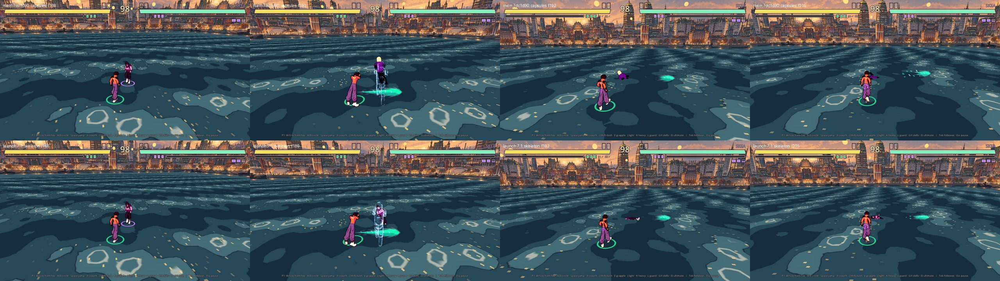

# Fix-журнал — запуск 7.1: регдол на скелеті + 0 попереджень Jolt (Н7)

**Роль:** T2 Гефест (T2·A, смуга бою хвилі 2), 2026-10-03.
**Запит Santos:** «T2·A, 7.1: регдол на скелеті + 0 попереджень Jolt. Кінематика ADR-017 — лише після мого „так“».
**План:** `docs/Plans/2026-10-03-Wave-2-Kickoff.md` § Хендофи → T2·A. Він лежить лише на гілці
`claude/dreamy-turing-7rsxo9` (`git ls-tree origin/main docs/Plans | grep Wave-2` → порожньо), тому тут шлях, не wikilink.
Також [[2026-10-03-Living-Combat]] (запуск 7) і [[Active-Ragdoll]] (стадія 2).

## Звірка

| що в плані | що в коді (`main` `7dc1d90`) | команда |
|---|---|---|
| Godot 4.7.2 у хмарі | `4.7.2.stable.official.ed1daf0bf` | `Godot_v4.7.2-stable_linux.x86_64 --version` |
| 165 попереджень Jolt «scale not supported» | 165, усі — капсули `Ragdoll.gd` (`shin_r`, `thigh_l`, `forearm_l`… з масштабом пози на кшталт `(1.0196, 0.9621, 1.024)`) | `make check` → `grep -c "not supported by Jolt"` |
| `make check` зелений | `[smoke] ALL OK (161 checks) in 19712 frames` | `make check` |
| регдол — капсули `Ragdoll.gd` | так: 11 `RigidBody3D` зі знімка `RigAnimator.part_snapshot()`; герой під час регдола схований (`Fighter._spawn_ragdoll` → `animator.visible = false`) | `grep -n Ragdoll game/scripts/fighter/Fighter.gd` |
| кінематика ADR-017 — `Fighter.gd:1350-1355`, `:1431` | ті самі місця (`_tick_launched`, `_tick_ko`) — **не чіпав**, «так» Santos немає | — |

Здогадка плану «Н7 — від присіду PR #141» **не перевірена** мною (це завдання Феміди). Що виміряв: після мого виправлення
капсул (без масштабу) і з поверненим масштабом лічильник однаковий — 165 = 165, тобто всі попередження Н7 дають капсульні
етапи smoke (`GameState.skeletal_rig = false`, `SmokeTest.gd:158`, `:379`, `:1152`).

## Проба — чому симулятор на манекені, а не на герої

План каже `PhysicalBoneSimulator3D`. Проби в scratchpad (не в репо), Godot 4.7.2 + Jolt:

| проба | результат |
|---|---|
| `PhysicalBone3D` на скелеті героя Meshy без суглобів | падають стабільно; рух батьківського вузла тіла не тягне |
| скелет героя | `Armature` масштаб `(0.01, 0.01, 0.01)` — кістки в сантиметрах; `body_offset` теж у см |
| ті самі тіла з суглобами `cone` / `6dof` / `6dof` + `joint_offset` | вибухають у всіх трьох: vmax 500 м/с, таз на сотнях метрів |
| манекен UAL (джерело пози `SkeletalRig`) | масштаб 1; з суглобом 6DOF стабільний; поза, змінена симулятором, читається в сигналі `skeleton_updated` (поза ним `get_bone_global_pose()` дає позу кліпу) |

Отже: симулятор — на манекені, а герой отримує позу тим самим ретаргетом запуску 5. Клас той, що в плані; вузол — інший.
**Дедалу:** це розбіжність із буквою хендофу («на скелеті героя»), але не з метою — падає саме герой. Прошу підтвердити.

## Що зроблено

- **`BoneRagdoll.gd`** (новий, `extends Ragdoll`): `PhysicalBoneSimulator3D` + 11 `PhysicalBone3D` на кістках манекена
  (`pelvis`, `spine_02`, `Head`, руки, ноги). Маси й радіуси — з тих самих частин капсульного рига, довжини — з кісток.
  Шари як у капсул (16 / маска 1), `axis_lock_linear_z`, CCD. Вплив симулятора 0 → 1 за 3 кадри (стадія 2: 2–4).
  Суглоби 6DOF з лімітами `JOINT_LIMITS` в осях рига. **М'язи — кутові пружини 6DOF суглоба** (55 / 6, як у капсул);
  на KO і після 0.9 с вимикаються.
- **`SkeletalRig.gd`**: ретаргет на героя — у `skeleton_updated` манекена (після модифікаторів), а не одразу після `seek`;
  герой видимий, поки йде скелетний регдол (`visible = animator.visible or ragdoll != null`).
- **`Fighter.gd`**: зі `SkeletalRig` — `BoneRagdoll`, без нього — капсули як були; `_clear_ragdoll()` спершу `release()`
  (симулятор зупиняється одразу, кадр підйому вже малює кліп). `pelvis_position()` / `settled()` — той самий інтерфейс.
- **`Ragdoll.gd`**: тіло капсули ставиться з `orthonormalized()` — без масштабу присіду (Н7); `release()` — порожній.
  **Спливання на воді** (`_float`, для обох регдолів): підлога водних арен нижче найглибшої западини (`Arena.gd:41-44`),
  тіло лягало під воду — на моїх кадрах Skea на `river` зникала повністю (таз на y = −0.13, поверхня ≈ 0). Сила
  `FLOAT_LIFT` 2.5 ваги при повному зануренні, опір `FLOAT_DRAG` 3.0 — картинка, у правила бою не входить.
- **`Makefile`**: `make check` червоніє, якщо в лозі smoke є хоч одне «not supported by Jolt».
- **`SmokeTest.gd`**: етап 112 — тепер герой видимий у регдолі; нова перевірка «кожна з 11 кісток героя повертається разом
  зі своїм тілом Jolt» (40 кадрів, межа 3°); на `river` — «таз регдола не нижче поверхні на 0.05 м за кадри 46–100».

### Що виміряв по дорозі (і що виявилось хибним)

- Мій перший варіант м'язів — PD-момент зі скрипта (`body_apply_torque_impulse`): кінцівки впирались у стелю Jolt ω 47 рад/с.
  Пружини суглоба: ω ≤ 9 рад/с, середнє відхилення від пози 4–18°. Твердження [[Active-Ragdoll]] «`PhysicalBone3D` має
  лише ліміти (без моторів)» під Jolt 4.7.2 **не підтвердилось** — пружини діють; сторінку виправлено.
- Перша перевірка в smoke порівнювала напрям кістки з тілом *після* кроку фізики і дала 24.6°. Причина — малюнок відстає
  на один крок: похибка = ω/60 (29.9° при ω 33.9 рад/с). Тепер smoke порівнює з тілом попереднього кадру.
- Перевірку «масштаб тіла = 1» у smoke я прибрав: `PhysicalBone3D.global_transform` показує 1, навіть коли Jolt лається
  (негатив N3 нижче). Масштаб ловить лише гейт у `Makefile`.
- Моє пояснення «суглоби треба ставити після `physical_bones_start_simulation()`» не підтвердилось: числа до й після
  перестановки однакові. Порядок лишив, коментар виправив.

## Перевірка

| команда | вихід |
|---|---|
| `GODOT_BIN=… make check` | `[smoke] ALL OK (163 checks) in 19944 frames`, `SMOKE ЗЕЛЕНИЙ`, rc=0 |
| `grep -c "not supported by Jolt"` у лозі `make check` | **0** (було 165) |
| `make gates` | `БАТАРЕЯ ЗЕЛЕНА`, rc=0 |
| smoke `skeleton ragdoll` | `40 frames × 11 parts, worst 'forearm_l' turned 0.06° off its body (limit 3°)` |
| smoke `river float` | `pelvis ≥ -0.034 m from the surface over frames 46–100` |
| smoke `river: deterministic` | `both runs identical at frame 600 (Σ|Δ| 0.000000)` |

**Предмет:** для всіх кадрів скелетного регдола і всіх 11 частин: кістка героя повертається разом зі своїм тілом Jolt,
герой видимий, жодне тіло регдола (скелетного чи капсульного) не має масштабу, тіло на воді не тоне.

### Негативний контроль (кожна форма — окремий злам предмета, потім повернуто)

| # | злам | результат |
|---|---|---|
| N1 | ретаргет знову в `_physics_process` (читає кліп, а не симулятор) | `FAIL skeleton ragdoll: … 'head' turned 158.41° off its body` |
| N2 | `sim.influence` завжди 0 | `FAIL skeleton ragdoll: 11 bodies (want 11), influence 0.00` |
| N3 | тілу `PhysicalBone3D` масштаб присіду `(1.02, 0.96, 1.024)` | smoke **зелений**, Jolt — 11 попереджень → гейт `Makefile` червоний; через це smoke-перевірку масштабу прибрано |
| N4 | герой схований у регдолі | `FAIL skeleton ragdoll: BoneRagdoll true, hero visible false` |
| N5 | капсулам повернуто масштаб (без `orthonormalized()`) | `SMOKE ЧЕРВОНИЙ: 165 попереджень Jolt про масштаб тіла` при `ALL OK (162 checks)` |
| N6 | без спливання (`FLOAT_LIFT` 0) | `FAIL river float: the ragdoll pelvis sank 0.188 m under the surface` |

N1–N4 — `--smoke-only=rig`; N5, N6 — повний `make check`.

### Кадри з хмари

`xvfb-run … -- --screenshot=<dir> --stage river` з тимчасовою правкою `Screenshot.gd` (не в коміті): P2 у регдол на кадрі
160. «До» — worktree `main` `7dc1d90`, «після» — ця гілка.

Верхній ряд — капсули; нижній — Skea падає власною моделлю і лежить на воді (f192, f215).

## Чого не робив

- Кінематична позиція після регдола ([[ADR-017-Post-Ragdoll-Position]] (а)) — чекає «так» Santos. `_tick_launched` і
  `_tick_ko` досі беруть позицію з тазу Jolt.
- Вставання за орієнтацією хребта (стадія 2 у [[Active-Ragdoll]]) — не в хендофі 7.1.
- Не бачив: звук, клавіатуру, FPS на Mac. Чи не спадає FPS на телефоні з 11 `PhysicalBone3D` замість 11 `RigidBody3D` — не міряв.

## Related
- [[Active-Ragdoll]] · [[ADR-017-Post-Ragdoll-Position]] · [[ADR-004-Physics-Is-Presentation]] · [[2026-10-03-Living-Combat]] ·
  [[2026-10-03-launch-5-heroes]] · [[state]]
