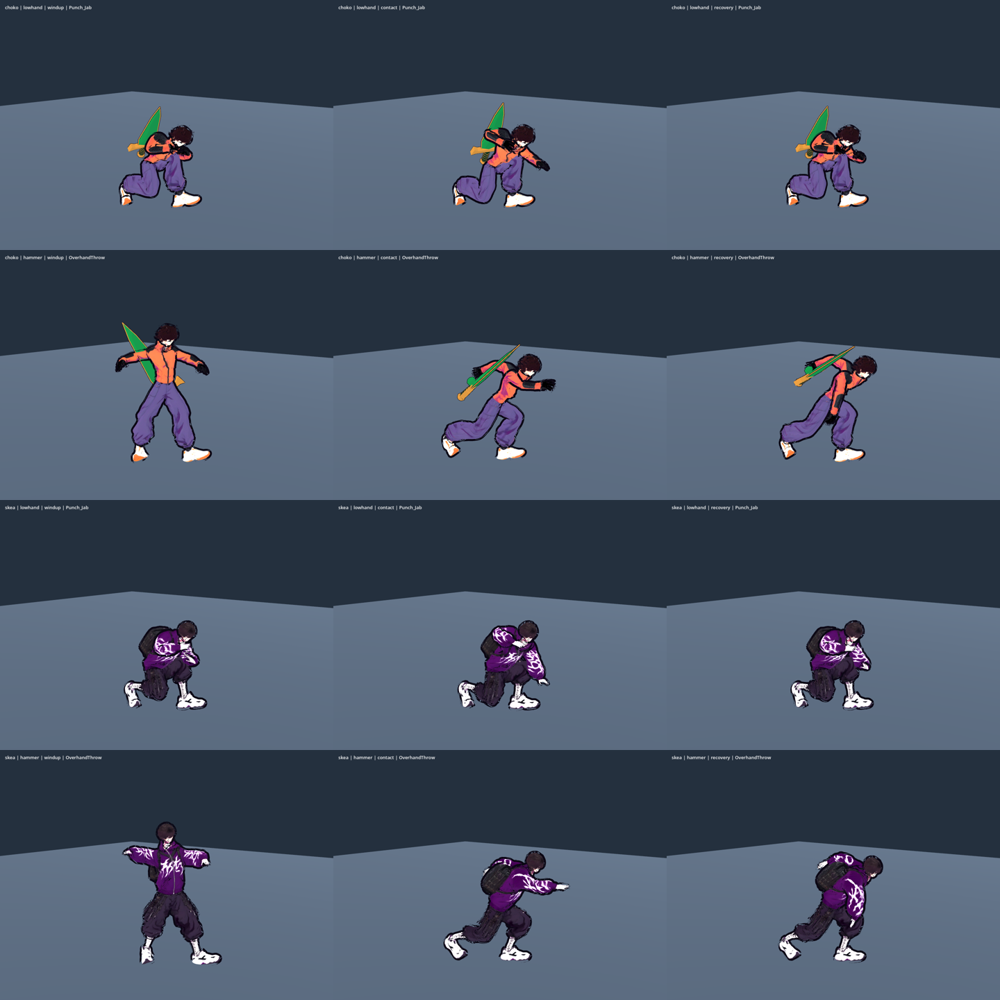

# Бойові рухи з UAL на справжніх моделях героїв

Дата: 2026-10-05. T2 Гефест, combat-смуга [[2026-10-05-Playable-District]].

## Аудит і вибір

На старті чотири кнопки кінцівок створювали `LimbMoves` без `anim_clip`; видимі Choko/Skea отримували абсолютні капсульні пози через `ProceduralMotionFallback`, хоча в репозиторії вже є UAL1/UAL2. Розглянуто: допрацьовувати лише капсули; довільно роздати назви кліпів; виміряти справжні траєкторії, адаптувати сторони й окремо закрити низькі/обертові варіанти. Обрано третє.

Перевірено п'ять поглядів: новачок розрізняє руку й ногу; комбо-гравець бачить контакт у чинному active-кадрі; противник розпізнає низьку атаку; герой зі зброєю справді несе її на тілі; повтор і симуляція зберігають authority, seed і frame data.

Предмет: усі generated `LimbMoves`/`SwordMotion` варіанти мають реальний UAL source на видимому скелеті, правильну сторону і контакт за чинними кадрами; семантичні композиції позначені окремо, без заяви про нові mocap-кліпи.

## Джерела й адаптація

`AuthoredCombatMotion.gd` зіставляє generated move з 13 наявними джерелами. Права, файли й ліцензії UAL не змінено; нових завантажень, платних генерацій чи ассетів немає. Джерело ліцензії — [[Textures-Registry]], а не назва GitHub-пакета.

| варіант | наявний source | сторона source / контакт, с |
|---|---|---|
| jab / lowhand | Punch_Jab | ліва / 0,200 |
| cross / airhand | Punch_Cross | права / 0,300 |
| bodyhook | Melee_Hook + Rec | права / 0,267 |
| uppercut | Melee_Uppercut | ліва / 0,267 |
| frontkick / roundhouse / lowkick / spin / hookspin; Choko airkick | Kick | права / 0,517 |
| Skea airkick | Melee_Knee | права / 0,300 |
| sword cut | Sword_Light_A + Rec | права / 0,233 |
| sword thrust | Sword_Light_B + Rec | права / 0,233 |
| sword rising | Sword_UpperCut | права / 0,200 |
| sword cleave | Sword_Heavy_D | права / 0,600 |
| sword aircut | Sword_Aerial_A + Rec | права / 0,233 |
| sword lowcut | Sword_Regular_A + Rec | права / 0,233 |
| hammer | OverhandThrow | права / 0,383 |

Контактні секунди виміряні на імпортованому donor при 60 Гц; це метадані анімації, не нові frame data. Початок active прив'язаний до contact; кінець active — до окремого follow-through; recovery відтворює решту source або Rec. Для hammer follow-through обмежено 0,393 с, щоб кисть не падала нижче mid-hitbox до завершення active.

Віддзеркалюється весь скелет із опорною ногою, хребтом і пальцями. Горизонтальний hip travel джерела прибрано; гравцем рухає тільки `Fighter`. Lowhand має окреме обмежене перенесення ваги на 0,18 м у source-просторі (PLACEHOLDER презентації), зі збереженням опори ніг; це не переміщення gameplay-кореня. Вертикальна вага й анатомічні довжини лишаються. Retarget працює через наявний UAL→Meshy mapping; actual hero face pitch обмежено −20…+15° (PLACEHOLDER художньої адаптації), щоб різниця rest-напрямків не ховала обличчя в грудях.

Низькі рухи — source-удар поверх авторського `Crouch_Idle`, з аналітичним двосуглобовим наведенням без розтягування кінцівки. Lowhand зберігає forward reach і орієнтацію кулака до заміни pelvis. Після retarget коротша рука actual hero додатково розв’язується до ближньої частини наявного hitbox; actual hero feet лишаються на захоплених опорних точках. Кістки не подовжуються. Spin/hookspin — суглобовий Kick плюс повний поворот pelvis до контакту, без зворотного розкручування. Sword `thrust` використовує наявну перехресну траєкторію Light_B; це не окремий імпортований thrust-кліп. Frontkick/roundhouse також чесно поділяють один Kick.

Схований меч тепер повторює actual torso transform, тож під час присідання/нахилу не висить над героєм у координатах кореня.

## Виявлені під час перевірки дефекти

T4 прийняв помітне поліпшення восьми базових L/R hand/foot рухів, але заблокував перший lowhand та hammer contact. Вимірювання підтвердило: Choko lowhand мав wrist forward лише 0,16–0,19 м при ближній межі low hitbox 0,35 м; GroundPound опускав кисть нижче mid-hitbox ще всередині active. Виправлення зберігає source reach низького удару й замінює hammer на виміряний сегмент OverhandThrow. Повторний замір actual hero wrist підтвердив перекриття hitbox у кожному active-кадрі для обох сторін і двох світових yaw. Hammer — композиція з наявного overhead throw, а не заява про новий окремий hammer mocap.

Idle idempotence-регресія походила від зайвого restore сталого locomotion-позування; locomotion-смуга прибрала переписування кісток поза активним blend. Rope-порівняння повернуто до `Transform3D.is_equal_approx`: виміряна різниця була лише 3,7×10⁻⁷ у basis при нульовій різниці origin, без зміни пози.

## Перевірка

`tools/animation/authored_combat_check.gd`: generated coverage, імпортовані джерела, first-active contact, L/R mirror при двох yaw, donor→hero anatomy, frozen/hitstop, незмінність authority/RNG, low-height і actual gaze; також attachment меча до torso. Додатково перевіряються forward/vertical перекриття hitbox у **кожному active-кадрі**, віддалення кулака від власного обличчя, сталі довжини скоригованих arm/leg сегментів, actual hero foot planting і повторюваність retarget того самого кадру. Source-angle guard лишився для нескоригованих кісток; скориговані суглоби мають явні геометричні гейти.

Цільовий Godot 4.7 повтор: **authored combat 10173/0**, gait **722/0**; суміжні перевірки цього пакета: character motion **860/0**, sword presentation **230/0**, rope recovery **284/0**, combat presentation **167/0**, idle presence **18120/0**, foot contact **774/0**. Фінальна інтегрована перевірка знімка `0999c77`: **smoke 164/0 за 19847 кадрів**, **playable 57 сценаріїв / 0 помилок**. Журнал: `/workspace/nooneisreal-evidence/playable-district/validation/accepted.log`; загальне приймання описане в [[2026-10-05-Playable-District-Session]]. Бойові production-файли у цьому знімку збігаються з `6d05914`, на якому знято нативні докази нижче.

| actual hero wrist, усі active × L/R × 2 yaw | forward, м | висота, м |
|---|---|---|
| Choko lowhand | 0,424–0,430 | 0,600–0,603 |
| Skea lowhand | 0,464–0,476 | 0,459–0,490 |
| Choko hammer | 0,484–0,502 | 0,830–0,924 |
| Skea hammer | 0,633–0,659 | 0,865–0,954 |

Опорні actual hero feet зберігають XZ у межах 5 мм; довжини скоригованих сегментів — у межах 1 мм від rest. Back mount перевіряється у світових одиницях: <1 мм і <0,1°. Попередній компонентний guard у сантиметровому skeleton basis давав хибну відмову при фактичному world drift **0,00000003 м / 0°**; фізичний guard збережено, а не видалено.

Native `tools/animation/authored_combat_capture.gd` відтворює справжні GLB героїв у Godot 4.7. Остаточні **72 PNG**: `/workspace/nooneisreal-evidence/playable-district/authored-combat-final/`. Manifest `provenance.json` звіряє SHA256 render-inputs з production commit **6d05914**; усі вісім перевірених combat/retarget/mount/locomotion/data файлів збігаються. Actual contact log: `/workspace/nooneisreal-evidence/playable-district/authored-contact-proof.log`; числовий підсумок — `authored-combat-final/contact-metrics.json`.

Нижче — компактна копія справжніх кадрів: рядки Choko lowhand/hammer, Skea lowhand/hammer; колонки windup/contact/recovery. Godot OpenGL compatibility, Mesa llvmpipe, 960×720; `ffmpeg` лише зменшує до 480×360 і складає 3×4. Без домальовування; PNG 448467 B. Choko одночасно демонструє, що схований меч повторює спину під час нахилу.

T4 незалежно захопив усі gameplay-кадри чотирьох виправлених атак — **70 PNG і 4 MP4**, `after/final-contact-motion/` у тому самому evidence-каталозі — та закрив visual blockers lowhand, hammer і back mount. Аудит: [[2026-10-05-Playable-District-Review]]. Helper також має `--motion-only` для повторення повної послідовності. Native M3, фізичний контролер і остаточний художній комфорт лишаються окремим прийманням.

## Related

- [[2026-10-05-Playable-District]] · [[02-Combat-System]] · [[Textures-Registry]]
- [[ADR-004-Physics-Is-Presentation]] · [[2026-10-05-Combat-Animation]] · [[Build-and-Run]]
