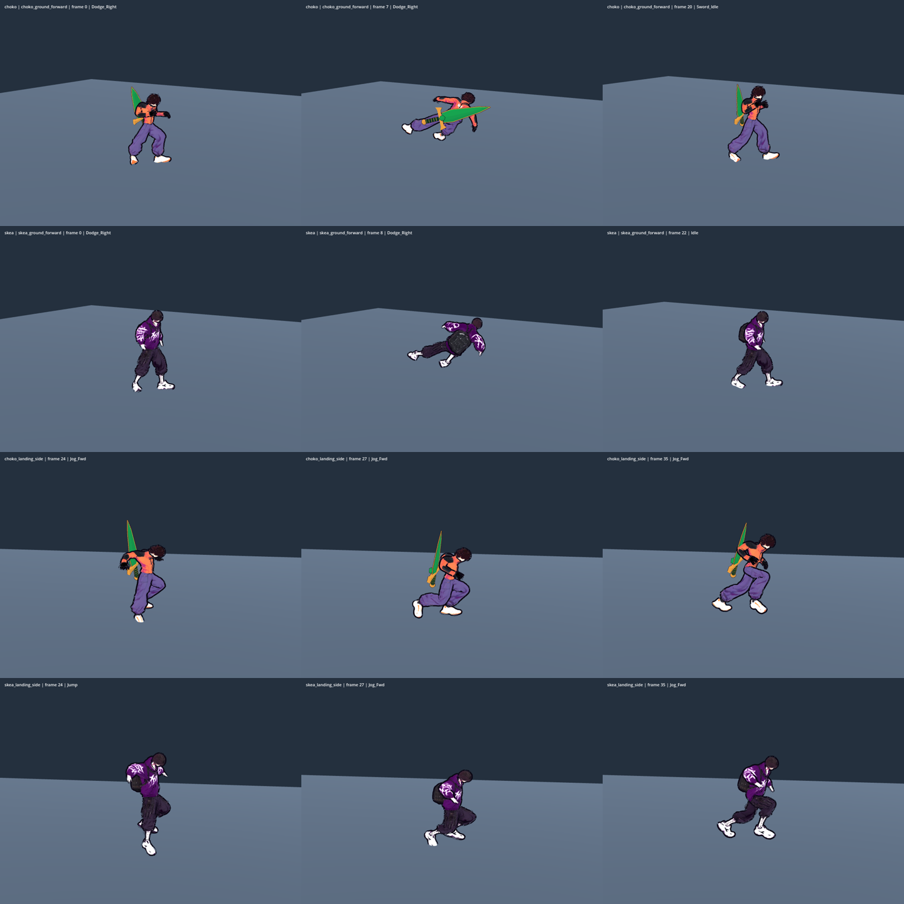

# Авторське ухилення та контакт приземлення в русі

2026-10-05 · T2 Гефест · [[2026-10-05-District-Motion-And-Readability]].

## Аудит і межі

У прийнятому попередньому зрізі всі normal-атаки вже мали authored джерела, а Walk/Jog/Sprint і нерухомий Jump_Land працювали. Прогалини були конкретні: dodge обирав idle і повне перенесення процедурних кутів `DodgeMotion`; рухоме приземлення обходило Jump_Land через перевірку `speed <= STOP_SPEED`. Попередні атаки, jump start та sprint transitions не реалізовувалися повторно. Варіанти й погляди — у плані: повторна процедурна доробка, перебудова rig/physics або обмежене використання вже ліцензованої бібліотеки; обрано останнє.

UAL1 GLB справді містить `Dodge_Left` і `Dodge_Right` по 1,3 с, `Jump_Land` — 1,2667 с. Кожен має 195 каналів. Джерело: локальні GLB animation samplers; CC0 1.0 за [[Textures-Registry]]. Нових завантажень, витрат або game/assets немає.

## Що змінено

`AuthoredDodgeMotion` семплює повнотілі Dodge_Left/Right через чинний retarget Choko/Skea. Вибір боку походить від фактичного локального напрямку ухилення. Поворот таза навколо вертикалі орієнтує позу для вперед/назад і плавно повертає її; самі суглоби та довжини кінцівок залишаються авторськими/геройськими. Горизонтальна позиція source-таза скидається до rest: кліп не переносить ані CharacterBody, ані hitbox.

Семплюється активна частина джерела, а не вся 1,3-секундна анімація на прискоренні: завантаження — 0 с, розкриття — 0,217 с, приймання ваги — 0,433 с, завершення — 0,70 с. Ці точки зіставлено з чинним `dodge_progress`; початок змішується з попередньою видимою позою, вихід — з чинним idle/gait/jump за 0,10 с. Це PLACEHOLDER художня тривалість переходу, не додатковий lock керування. Реакція, атака чи новий стан переривають повернення. Freeze/hitstop тримають точний семпл. Старий `DodgeMotion` лишається для діагностичного capsule rig, не підміняє authored героя.

`AuthoredLandingMotion` — **UAL-derived крива стискання + чинний gait + IK фактичного героя**, не повний Jump_Land поверх бігу. Вона зчитує вертикальний рух таза Jump_Land у проміжку 0–0,80 с; після реального контакту в русі додає максимум 0,10 м стискання за наявне presentation-вікно 0,18 с. Обидві ноги аналітично доводяться до стоп саме поточного кадру ходи: старі світові точки не заморожуються. Наприкінці крива точно сходить до поточного gait. Стояче приземлення продовжує використовувати попередній повний Jump_Land.

Fighter, DodgeProfile, stamina, hop, invulnerability, gravity, timing, damage і RNG не змінювалися. Немає нової механіки climb, wallrun чи roll; відповідні кліпи не видаються за анімації мотузки.

## Перевірки

Предмет: для обох героїв усі напрямки ухилення й контакт приземлення змінюють лише презентацію, зберігаючи фізичну траєкторію та анатомічні довжини.

`tools/animation/authored_evasion_check.gd`: **13760 перевірок / 0 помилок** на Godot 4.7. Фактичний `_start_dodge` і Fighter physics: 2 герої × 4 напрямки × 2 yaw × ground/air, повна дія +18 кадрів після неї; кожна траєкторія порівнюється з виконанням без skeletal presentation. Перевірено position/velocity/state/timers/stamina/RNG/rope/HP, реальні довжини рук і ніг, повторний retarget, точне утримання freeze/hitstop, вихід із мотузки та переривання реакцією. Рухоме приземлення на справжній підлозі перевіряє ненульове стискання, його межу та збереження обох рухомих геройських стоп з похибкою <1 мм. Журнал: `/workspace/nooneisreal-evidence/district-motion/authored-evasion-check.log`.

Суміжні цільові регресії на тому самому знімку: locomotion **306/0**, idle presence **18120/0**, sword presentation **230/0**, authored combat **10173/0**.

Production motion зафіксовано в `9685dfa`; manifest `candidate/provenance.json` звіряє SHA256 шести production-файлів між capture-копією і checkout. Нативне джерело BEFORE — immutable `6d929f8`, окрема копія T4. Одним і тим самим capture-скриптом (відтворювана копія — `tools/animation/authored_evasion_capture.gd`) знято **16 повних послідовностей / 592 кадри** BEFORE і candidate AFTER, 800×600, Godot 4.7 Compatibility/llvmpipe. Незалежне T4 порівняння CSV: **0 відмінностей** position/velocity/stamina/state/dodging/frames_left. AFTER використовує Dodge_Left/Right і `procedural=false`. Це фактичне native-виконання, не намальована ілюстрація.

`tools/animation/moving_landing_capture.gd` дає ще 4 послідовності / 200 кадрів: Choko/Skea, спереду/збоку, фізичне падіння з 3,8 м і утриманий рух через контакт. Сирі докази зберігаються поза git у `/workspace/nooneisreal-evidence/district-motion/`. T4 покадрово переглянув усі **592 dodge +288 armed +200 landing =1080 AFTER-кадрів** і прийняв motion у межах цього пакета: не виявлено нового розриву/скручування суглобів, проходження клинка крізь тулуб або завислого crouch після контакту. Armed-вибірка: Choko, меч у лівій/правій руці ×4 напрямки; moving landing BEFORE/AFTER має **200/200 тотожних фізичних рядків**. Загальний GREEN залежить також від окремих camera negatives та root smoke/playable/gates у [[2026-10-05-District-Motion-Session]]. Native macOS/M3, фізичний геймпад і суб'єктивний комфорт Santos тут не заявляються.

Компактний native contact sheet: Choko dodge, Skea dodge, Choko moving landing, Skea moving landing; у кожному рядку початок/контакт/повернення. Це лише вибірка для документа, не заміна повнокадрового огляду.

## Related

- [[2026-10-05-District-Motion-And-Readability]] · [[2026-10-05-District-Motion-Session]] · [[2026-10-05-Locomotion-States]] · [[2026-10-05-Authored-Combat]] · [[Textures-Registry]] · [[ADR-004-Physics-Is-Presentation]]
