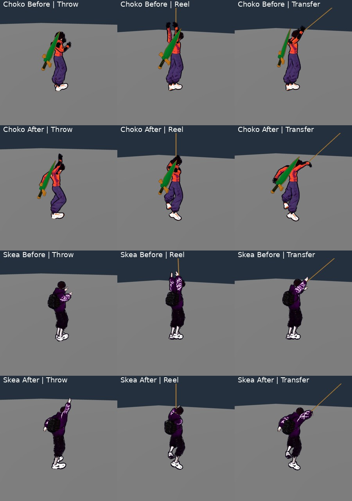

# Авторські жести мотузки

2026-10-05 · T2. Реалізація [[2026-10-05-Living-District-Characters]]. Статус: реалізація пройшла цільові перевірки та незалежне native-приймання T4; інтегровані гейти пакета фіксує T1 у журналі сесії.

Предмет: для обох героїв на всіх перевірених кадрах фізичних послідовностей кидка, хвату, підтягування, перенесення й відпускання авторська анімація не змінює рух, запас пристроїв, мотузку чи RNG; довжини кінцівок зберігаються.

## Що змінено

`AuthoredHookMotion` кешує локальні оберти верхньої частини тіла з установлених CC0 UAL. Нижня частина тіла використовує наявну авторську ходу або Jump_Loop: ноги wall-climb джерела не переносяться на вільне висіння. При русі по землі частота кроку залишається похідною від фактичного переміщення, а не від часу чи натиснутої кнопки. Старий капсульний GrappleMotion залишається діагностичним представленням.

| Фаза | Джерело | Прив'язка |
|---|---|---|
| Замах / кидок | UAL2 OverhandThrow | windup_progress; далі реальна відстань польоту пристрою |
| Близька підготовка | UAL1 Interact | лише чинний presentation_grip, далека підказка не підіймає руки |
| Хват після attach | UAL1 Climb_Enter | окремі 0,20 с візуального входу; однокадровий ROPE_REACH не втрачає жест |
| Висіння | UAL1 Climb_Idle | верхня частина тіла плюс обмежений хват |
| Підтягування / перехват | UAL1 Climb_Up | цикл просуває тільки реальне скорочення rope_length; стоп не продовжує підтягування |
| Змотування промаху / extraction | UAL1 Climb_Up | наявний recovery_progress; кроки й опорний торс удару ногою збережено |
| Перенесення / відпускання | OverhandThrow / збережена остання поза | політ нового пристрою; 0,14 с переходу в ходу, idle чи jump |

Це адаптація наявних авторських джерел, не новий mocap і не готовий зовнішній rope animation pack. Час переходів — presentation PLACEHOLDER, без затримки вводу. Attack/dodge/reaction переривають візуальний вихід, freeze/hitstop утримують намальовану позу.

Після retarget дволанкова IK використовує справжні довжини рук Choko/Skea. Точка хвату лежить на фізичному сегменті й у сфері досяжності руки; перевірка сфери використовує проєкцію на нескінченну пряму перед обмеженням сегментом. Виявлений негативний випадок низької опори показав, що затискання проєкції до кінця сегмента завищувало доступний хід руки на 7,7 см; виправлено саме геометрію. Корені, масштаб кісток, зіткнення, input, tokens і фізичний solver не змінюються.

## Перевірка

Ізольований Godot 4.7, `/workspace/nir-hook-motion/game`; shared checkout не запускався. `tools/animation/authored_hook_check.gd` викликає справжні fire/drive/reel/retarget/detach для обох героїв: high, low, catch, transfer, miss, по 108 кадрів. Аудіопул у fixture вимкнений: це перевірка руху, не звуку, і прискорене завершення не повинно залишати OGG playback у audio thread.

- Headless 11498 checks, 0 failures; чистий `final-completion.log`, додатковий guard просування reel_cycle тільки від реального скорочення мотузки.
- Native 11414 checks, 0 failures; 1080 PNG, чистий `native-v2.log`. Усі 1080 рядків фізичної CSV траси точно збігаються з immutable baseline `f4defd5`.
- Регресії: gait 722/0, rope recovery 284/0, idle presence 18120/0, authored evasion 13760/0.
- Максимальна виміряна похибка зап'ястка від цільової точки фізичного сегмента — 0,000001 м після завершення catch-переходу.
- Кожен кадр: invariant transform/velocity/state/meter/phase/token/deployed-token/length/charges/recovery/registry та глобальний RNG, довжини плеча/передпліччя.
- Окремий freeze guard усіх кісток; промах не створює HANG; transfer проходить справжню валідацію опори.
- Базовий gait guard оновлено на наявність авторського джерела; старі перевірки геометрії ударів і cadence збережено.

Повні native послідовності з тим самим сценарієм: `/workspace/nooneisreal-evidence/living-district/hook-final-v2/`; CSV містить фізичну трасу. SHA256 шести production-файлів, версія engine та межі fixture записані в `provenance.json`. Компактне 21,2-секундне порівняння: `/workspace/nooneisreal-evidence/living-district/hook-before-after.mp4`, основні фрагменти 60 fps у реальному часі, фінальний catch/reel окремо підписано 0,5×. Замах читає записану aim_intent.point: фізичний anchor_point визначається лише при launch. Обидва промахи перезнято з кожнотактовим tick_regen (native AFTER 2174/0, BEFORE 1346/0); раніше fixture помилково пропускав змотування через busy. Підсумкові PNG, CSV та відео вже містять виправлені послідовності. Сценарій ізолює драйвер мотузки; 18 кадрів після detach показують візуальне повернення без подальшого керування тілом. T4 особисто переглянув усі 1080 кадрів у 30 contact sheets: нового дефекту анатомії не виявлено. Незалежно повторено CSV comparison 1080/0diff і збіг шести production SHA256 зі shared checkout. Промах у native — обмежений відрізок змотування; headless продовжує обидва випадки до справжнього повернення token/charges, після 14 кадрів перевіряє idle source і очищені руки. Це розділяє побачений відрізок і перевірене завершення. Поточна межа: fingers успадковують UAL, окремого фізичного затиску кожної фаланги немає; мотузка не керується візуальними руками.

Компактний кадр вище: незмінений рендер Godot з тих самих приймальних послідовностей, лише crop/scale/підписи для порівняння; повний рух — у відео.

## Перевірені готові рішення

Детальніше [[2026-10-05-Local-NPC-Models-And-Physics-Reuse]]. Перевірено README/LICENSE, жодний сторонній код не виконувався й нова залежність не додавалася:

- [GodotIK](https://github.com/monxa/GodotIK): MIT (`LICENSE.md`), Godot 4.3+, FABRIK/SkeletonModifier, C++ GDExtension. Придатний загальний solver, але потребує бінарного пакування; існуючої дволанкової IK вистачає для цих рук.
- [Godot 4.7 TwoBoneIK3D](https://github.com/godotengine/godot/blob/4.7-stable/doc/classes/TwoBoneIK3D.xml): MIT engine, вбудований дволанковий solver з pole. API справді присутній у локальному 4.7 ClassDB.
- [SpringBoneSimulator3D](https://github.com/godotengine/godot/blob/4.7-stable/doc/classes/SpringBoneSimulator3D.xml): для інерції волосся/одягу, документація попереджає про масштабовані Skeleton/bones. Це не заміна фізичного хвату чи solver героя.
- [bone-ik](https://github.com/thiagola92/bone-ik): MIT, лише 2D; не підходить для цих 3D моделей.
- Reddit search endpoint повернув 403. Прочитаного треду чи запозиченої поради з Reddit тут не заявлено.

## Related

- [[2026-10-05-Living-District-Characters]] · [[2026-10-05-Living-District-Session]] · [[2026-10-05-Living-District-Review]] · [[2026-10-05-Local-NPC-Models-And-Physics-Reuse]] · [[2026-10-05-Rope-Contact-Range]] · [[2026-10-05-Authored-Combat]] · [[Textures-Registry]] · [[ADR-004-Physics-Is-Presentation]]
