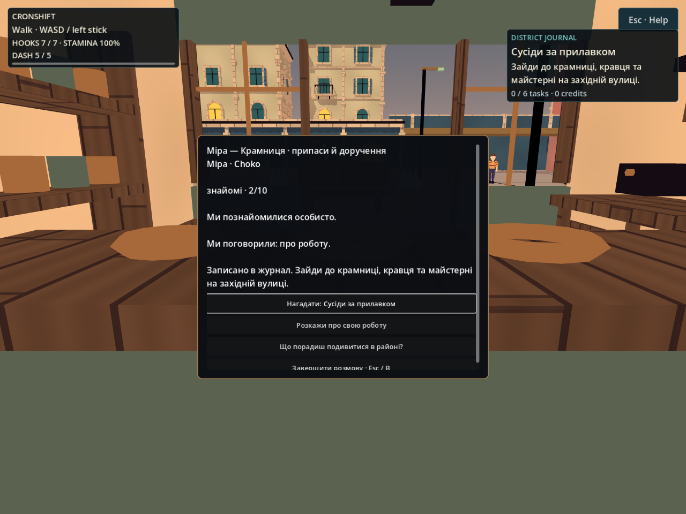
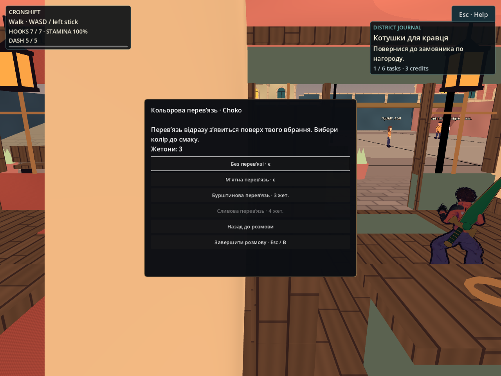
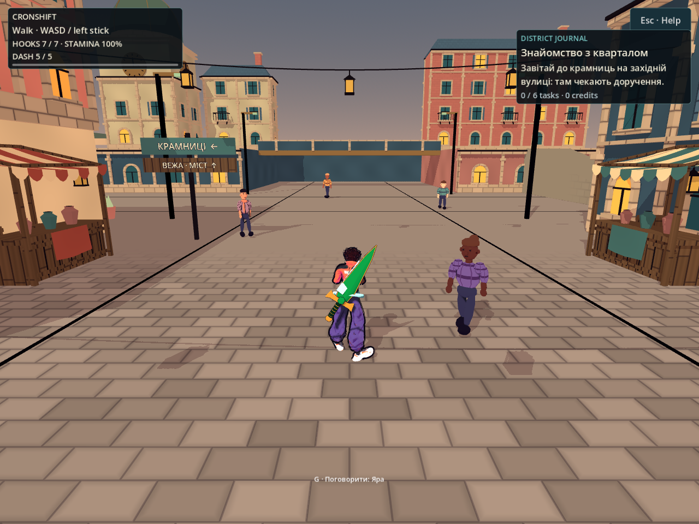

# Життя кварталу: працівники, доручення й особисті знайомства

2026-10-05 · T2 Гефест. Робочий пакет `codex/playable-district`. Цей журнал описує реалізацію й власні перевірки NPC-смуги; загальне приймання пакета веде координатор.

Предмет: для кожного доступного героя виконані доручення, винагороди, покупки, довіра та спогади зберігаються окремо; повтор тієї самої дії не створює повторної нагороди або дружби.

## Аудит і вибір

База після [[2026-10-05-Npc-Crowding]] уже мала 12 детермінованих мешканців, локальні маршрути, сусідські вітання й memory/save. Однак розміщення читалося як регулярні ряди, працівники не мали приміщень, діалог був одним фактом без вибору, а trust/meetings не знали героя. Окремого квестового стану й видимої кастомізації не було. Перечитано `NpcPopulation`, `CityNpcActor`, `CityNpcDirector`, `NpcDialogue`, `CityWorld`, матеріали героя й контракт нових `CityPlaces`.

Розглянуто три варіанти: дописати текстові завдання без світових подій; будувати універсальний сюжетний рушій/LLM; зробити обмежений декларативний зріз із конкретними місцями, подіями та перевірюваним save. Обрано третій. Погляди: новачок отримує наступну дію в діалозі й журналі; дослідник може заздалегідь знайти місця без повторного обходу; любитель спілкування має доступні теми й реальну дружбу; гравець іншого героя починає власні знайомства; власник старого save не отримує вигаданої біографії; майбутній автор контенту редагує дані без виконання довільного коду.

## Працівники та вулиця

Перші три чинні мешканці працюють у крамниці, ательє та майстерні на позиціях `CityPlaces.worker_positions()`. Їхні руки виконують різні прості локальні жести сортування/шиття/роботи; це процедурна презентація на наявних легких мешканцях, не нові mocap-кліпи. Ідентичність, appearance seed і загальний набір мешканців не змінювалися. Назва місця роботи накладається під час міського діалогу, не переписує збережену випадкову професію.

Дев'ять перехожих розподілено нерегулярно між центральною вулицею та східним/західним перехрестями. Рух лишається обмеженим власними безпечними маршрутами; близькі мешканці вітаються з прямою видимістю та cooldown. Зокрема двоє центральних перехожих мають сусідні, але неперетинні маршрути: це зберігає реальні зустрічі після розосередження. Візуальний масштаб мешканців зменшено до 0.92 від попереднього; це PLACEHOLDER художня пропорція, не зміна фізики героя.

`NpcDialogue` має фокусовані кнопки вибору, прокручування, закриття через Esc/B, непрозорий темний фон і віддає gameplay input після закриття. Підказка розмови приховується також у паузі. Розмова з працівником працює через прилавок із перевіркою видимості на висоті 1.5 м.

## Шість доручень

| Доручення | Хто пропонує | Фактична умова | Нагорода |
|---|---|---|---|
| Сусіди за прилавком | Крамниця | Особиста розмова з усіма трьома працівниками | 3 жетони |
| Котушки для кравця | Крамниця, після знайомств | Прийняти доручення й передати пакунок через окрему дію у кравця | 3 жетони |
| Огляд верхнього маршруту | Майстерня | Герой фізично відвідує міст дахів і майданчик біля вежі | 4 жетони |
| Дві надійні опори | Майстерня, після верхнього маршруту | Справжнє прикріплення до двох різних міських опор | 4 жетони |
| Знайомі обличчя | Кравець | Особиста розмова з чотирма різними перехожими | 4 жетони |
| Свій колір у місті | Кравець, після знайомих облич | Приміряти м'ятну перев'язь і відвідати ринок | 3 жетони |

Нагороду видає замовник після повернення. Після всіх шести завершень HUD явно показує «Усі доручення кварталу завершено» та вільні заняття замість початкового запрошення по доручення. Стани `locked/available/active/ready/completed` читає HUD і журнал; повторне завершення не видає жетони. Повтор одного зачепа чи розмови з тим самим мешканцем не замінює різних цілей. Уже відвідані місця й знайомства можуть зараховуватися, але доставку не можна виконати до прийняття пакунка. Числа нагород — PLACEHOLDER локальної економіки.

Це змістовний обмежений маршрут дослідження без примусових таймерів. Тривалість 30 хвилин не виміряна й не гарантується цими шістьма дорученнями.

## Особистий прогрес і міграція

`CityProgress` зберігає accepted/completed, унікальні події, жетони, куплені кольори та вибрану перев'язь у `user://city_progress_v1.json`, під ключами `choko` і `skea`. `NpcPopulation` schema v2 зберігає trust, meetings, memory та одноразові теми під парою hero_id/resident_id. Нових ідентичностей героїв або прихованого unlock roster немає.

Вступна розмова й кожна тема дають довіру лише один раз; завершені доручення та розблоковані теми про верхній маршрут/спільних знайомих дають додаткову довіру. Поріг дружби досяжний також для звичайного перехожого через доступні діалогові дії, без повторного натискання однієї кнопки. Пам'ять одного героя не показується іншому.

Старий NPC v1 не містить hero_id. Його trust/meetings/memory збережено в legacy-полях мешканця, але жодному героєві не приписано. Нові hero-relationships починаються окремо. Filename `city_population_v1.json` залишено для сумісного знаходження старого файлу; внутрішня `version` уже 2. JSON-числа версії перевіряються чисельно, тому власний запис v2 відновлюється після парсингу JSON.

Обидва save пишуться через тимчасовий файл і rename. Некоректний файл не перезаписується; сесія може тривати в пам'яті з вимкненим записом. Це два окремих файли, не спільна транзакційна база кампанії. Перезапуск прогулянки не стирає їх.

## Перев'язь й декларативний контент

`CityCosmetics` додає невелику тканинну перев'язь і пояс, що слідують за тазом/шиєю видимого героя. Колір змінюється на самій перев'язі; матеріал шкіри, очей та оригінального вбрання не перефарбовується. Початковий варіант ховає аксесуар, м'ятний безкоштовний; бурштиновий і сливовий купуються один раз за зароблені жетони. Це runtime-геометрія, без нового стороннього mesh/texture-файлу або ліцензії.

`game/data/city/district.json` містить шість завдань і палітри. Loader приймає лише визначені поля, типи подій і відомі об'єкти цього кварталу. Обмежено обсяг документа, кількість завдань/цілей, довжини рядків і кількість подій. Невідома script-властивість, циклічні залежності, недосяжний count чи невідомий object id відхиляються. Залежності перевіряються обмеженими топологічними проходами, без експоненційного обходу густого графа. Дані не запускають скрипти й не завантажують зазначені в них ресурси. Це редагований контракт контенту, не встановлений менеджер довільних модів.

## Перевірка та кадри

Ізольований project `/tmp/nir-district-life`, Godot **4.7-stable**, окремі XDG data/config/cache:

- `tools/npc/district_progress_check.gd`: **41/0**, включно з окремою перевіркою завершального HUD-тексту. Усі шість завдань досяжні; repeat-safe rewards, різні опори/мешканці, двоє героїв, покупки, v1 migration. Реальний disk write/load для прогресу та NPC v2; пошкоджений JSON лишається незмінним. Негативні форми: код у контенті, цикл, неможливий count, невідомий target/hero, від'ємна валюта, дубль completion.
- `tools/npc/district_life_check.gd`: **25/0** headless, **28/0** із native capture. Перевірено станції трьох працівників, рух рук, вибір через прилавок, справжні діалогові пропозиції/прийняття/нагороди/доставку, світові roof events, доступну дружбу перехожого, hero isolation та незмінність основного матеріалу після вибору перев'язі.
- Оновлений `npc_runtime_check.gd`: **63/0**; місця/маршрути/особистий простір, сусідська пам'ять, cooldown, streaming та input cleanup. `npc_check.gd`: **23/0**.
- Інтеграційний повтор знайшов teardown race лише у тесті: після трьох fixed ticks лишалися чотири Ogg playback objects для `land_2.ogg`. Verbose відтворення `/tmp/nir-district-life/leak-verbose.log` установило типи об’єктів. Test cleanup тепер дає audio mixer обмежені 200 мс реального часу, як чинні city/NPC runtime tests; повтор `leak-fixed-verbose.log` — **25/0**, rc 0, без leaked objects/resources та runtime ERROR. Production audio й суворий log guard не змінено.
- Логи: `/tmp/nir-district-life/progress-final.log`, `life.log`, `native.log`, `npc-runtime.log`, `npc-model-final.log`. Native — Xvfb `:97`, OpenGL Compatibility / Mesa llvmpipe. ALSA на хості недоступний і переключився на Dummy; звук не прийнято цим запуском.

Кадри переглянуто в цій сесії. Фінальний кадр героя замінено результатом короткого native capture координатора `/tmp/district-player-style-final.png`: на ньому є передня/задня смуги та пояс. Джерело — та сама ізольована копія з оновленим `CityCosmetics`, 12 physics ticks, production camera, Compatibility та Dummy audio; кадр оглянуто також NPC-смугою. Технічне проходження не є прийманням камери в кожній тісній кімнаті, Mac/M3, фізичного контролера або повної кампанії. Остаточні загальні check/gates і незалежний вердикт — у [[2026-10-05-Playable-District-Session]] та [[2026-10-05-Playable-District-Review]].

## Related

- [[2026-10-05-Playable-District]] · [[2026-10-05-Npc-Crowding]] · [[2026-10-05-Playable-District-Art]] · [[2026-10-05-District-Delivery]]
- [[2026-10-05-Locomotion-States]] · [[2026-10-05-Authored-Combat]] · [[2026-10-05-Combat-Animation]] · [[ADR-023-City-First-Exploration]] · [[state]]
