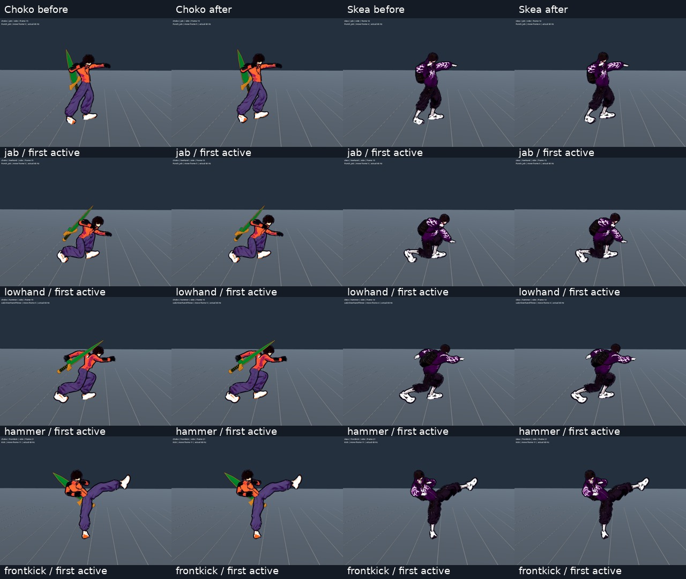

# Цілісна поза: корпус, опора й погляд

2026-10-05 · T2 Гефест. Реалізація [[2026-10-05-Whole-Body-Motion]]. Статус: цільовий whole-body тест, старі регресії та незалежне native-приймання бойових послідовностей пройдено; фінальний інтегрований пакет і решту native-послідовностей фіксує T1. Це продовження відкритого PR #178 від baseline `3df43a5`, не повторне приймання попереднього пакета жестів.

## Відтворені причини

Реальний напрям лиця Meshy визначає `Head → headfront`. Попередній retarget успадковував для голови вирівнювання шиї: калібрування осі лиця бракувало. У ході та бігу Choko/Skea дивилися вниз приблизно на 35°; у спринті діапазон сягав −57…−33°. Hard pitch clamp бойової голови перетворював всю дугу jab на незмінні −20°: 17/17 кадрів Choko та 15/15 Skea. Саме додавання постійної rest-поправки не вирішує крайні авторські нахили: калібрований lowhand усе ще давав −72…−62°.

Незалежний actual-input baseline T4 знайшов однокадрові стрибки Choko: Idle→Walk 32,38° голови, Walk→Idle 22,84°, Crouch→Exit 41,74°, Block→Idle 31,06° голови та 71,29° верхнього хребта. Висіння тримало ноги з Jump_Loop незалежно від навантаження мотузки. Попередня точність зап'ястка не доводила природність усього тіла.

Окремі підтверджені розриви actual physics/animation і поверхневої опори описані в [[2026-10-05-Physics-Motion-Signals]]: grounded windup рухав тіло до 0,59 м з нерухомими ногами; teleport сприймався як 600 м/с. Готові зовнішні solver та їхні обмеження перевірені в [[2026-10-05-Whole-Body-Retarget-Research]]; нової бібліотеки чи assets тут немає.

## Порядок і межі корекцій

`HeroBodyMotion` отримує тільки read-only фактичну швидкість/прискорення з `FighterMotionSignals`. Фізичний root, вводи, стан, MoveData, hit timing, damage, RNG і мотузка лишаються авторитетними.

1. UAL source seek та авторські шари; нейтральний перехід між блоком/присіданням/стійкою змішує останню видиму позу протягом 0,24 с. Idle↔Walk використовує чинний locomotion blend. Attack/hit reaction не отримують загального уповільнення.
2. Retarget за справжніми довжинами героя; обмежений поворот таза, випередження грудей і нахил від реального прискорення. 90° зміна facing читається як поворот тіла, а не миттєва заміна всього силуету.
3. У HANG таз реагує на напрям натягу, хребет частково компенсує нахил; ноги звисають за гравітацією з обмеженим відставанням від тангенційної швидкості. Це фізично керована презентація поверх авторських жестів, не новий mocap і не solver мотузки.
4. Moving landing, чинна вузька foot-корекція та `HeroGroundContact` за реальною поверхнею; після опори повторно розв'язуються потрібний бойовий контакт і руки мотузки.
5. Погляд використовує rest-relative авторський напрям, реальну вісь лиця й плавну обмежену pitch-відповідь. Корекція розподілена між шиєю та головою; авторська зміна залишається ненульовою, hard plateau видалено. Реакції/рагдол не калібруються цим шаром. Меч слідує остаточній позі.

Часи, кути й ваги — **PLACEHOLDER art constraints**, прив'язані до native-приймання, не універсальні анатомічні норми. Перед seek кожен source-overlay відновлює власну базу. Helper clock просувається один раз на physics tick; фінальний retarget виконується після всіх source-шарів, а повторний skeleton callback відтворює кешовану позу без нового захоплення опори. Freeze/hitstop утримують позу; motion revision скидає cadence, neutral/attack/crouch transition та кеші тіла/стоп.

## Перевірка

Ізольований Godot 4.7 у `/workspace/nir-hook-motion/game`; production shared Godot запускає T1. `tools/animation/whole_body_motion_check.gd` керує справжнім Fighter через InputRouter: рух, 90° поворот, зупинка, присідання, блок, потім jab/lowhand/hammer/kick обох героїв.

- Whole-body: **12686 checks, 0 failures**, чистий `whole-body-final.log`. Choko head max 9,01689°/tick, spine 10,00013°; Skea 8,66383° та 9,99997° при 60 Hz. Контракт CP2: 10°/12° для цих повільних переходів.
- Jab має справжню зміну pitch: Choko −13,53…−12,03° замість незмінних −20°. Lowhand має обмежену, але ненульову авторську дугу −18,05…−17,55°; це свідомо стиснена дуга, не обіцянка повної амплітуди джерела.
- Перевіряються actual local chain lengths ≤0,5%, одиничні масштаби, all-bone rotation/position/scale ідемпотентність повторного retarget, незмінні plant anchors/query/history counters, freeze clock і gameplay authority.
- Authored combat: **11325/0**; source-direction assertions для всіх неадаптованих суглобів, actual low/hammer contact, plant, mirror/yaw, freeze та repeated-retarget збережені. Для навмисно адаптованої шиї donor aim замінено length/scale guards; face pitch і authored arc перевіряються окремо.
- Character motion: **860/0**; збережено capsule-source direction та решту donor alignment, для шиї/вже скоригованих crouch-ніг перевіряється actual anatomy.

Повні baseline/candidate траси й native матеріали зберігаються в `/workspace/nooneisreal-evidence/whole-body/`; preview не видається за фінальне приймання. Підсумкові native, опора стоп та інтегрований suite додаються після завершення незалежних перевірок. Незалежний T4 actual-input probe: 1320 physics ticks, 54/0 acceptance; head/spine bounds проходять за повними world quaternion, не лише напрямом лиця.

Додатково: smoke **164 checks / 19847 frames**, authored hook **11498/0** (максимальна похибка хвату 1 мкм), evasion **13760/0**, rope recovery **284/0**, idle presence **18120/0**. Старий raw idle guard чекає завершення нейтрального/locomotion/attack переходу; fresh mannequin comparison та fixed-phase unkeyed-bone guards збережено. Fixed-phase hanging guard змінює лише напрям фізичної опори: таз і торс реагують, обидві ноги спрямовані вниз понад 85% своєї довжини; після release баланс очищується. Це числовий guard презентаційного контракту, а справжню hook drive траєкторію перевіряє окремий authored hook сценарій.

## Native доказ і provenance

Додатковий actual-combat capture: `probes/combat_full_capture.gd`, 878 кадрів у кожній версії, jab/lowhand/hammer/frontkick обох героїв спереду й збоку. Викликається справжній `_start_move`, потім звичайний Fighter physics; `move_frame` не підставляється вручну. На кожний удар є idle до початку й 24 кадри повернення після його тривалості. PNG, усі 16 суцільних contact sheets і 60 fps MP4: `whole-body/{before,after}/combat/`. Усі 878 рядків position/velocity/state/move_frame/hp/meter/RNG точно збігаються; T4 повторив comparison незалежно та особисто переглянув усі 16 AFTER sheets, усі 878 кадрів. Нового перевороту коліна, неналежної фіксації ударної ноги або перевороту голови не виявлено.

Цей компактний аркуш — native кадри першого active frame, лише resize/компонування й підписи; він не замінює повний перегляд руху. Baseline — immutable `3df43a5`. AFTER знято на CP5 helper; `provenance.json` зберігає точні SHA256. Пізніша final-правка helper `46864f2c` додає тільки standing HITSTUN/BLOCKSTUN/STUMBLE до політики підтримки; запис містить лише IDLE/ATTACK, тому їхні гілки та математика незмінені. Знімки чесно не перейменовані на final SHA. Опорна корекція стоячих реакцій має окремі actual-physics докази в [[2026-10-05-Hero-Ground-Contact]].

Final-helper smoke **164/19847** повторено: source-direction guard чотирьох стегон/гомілок замінено actual chain length/scale та незалежним scalar full-skinned sole guard ≤5 мм; Foot→Toe орієнтації, руки, торс і hips залишаються donor-aligned. Новий optimized ground sampler не використовується як власний oracle. Окремий незалежний T4 lowhand probe перевірив plant-after-ground порядок: 480 actual physics rows, ліва/права рука обох героїв; усі 18 ATTACK кадрів кожного випадку мають full-weighted sole вище поверхні (мінімум Choko +2,720 мм, Skea +2,486 мм). Примусового move_frame немає, додаткової зміни source-порядку не знадобилося.

## Related

- [[2026-10-05-Whole-Body-Motion]] · [[2026-10-05-Whole-Body-Session]] · [[2026-10-05-Whole-Body-Retarget-Research]] · [[2026-10-05-Physics-Motion-Signals]] · [[2026-10-05-Hero-Ground-Contact]] · [[2026-10-05-Authored-Hook-Motion]] · [[2026-10-05-Authored-Combat]] · [[2026-10-05-Locomotion-States]] · [[ADR-004-Physics-Is-Presentation]]
