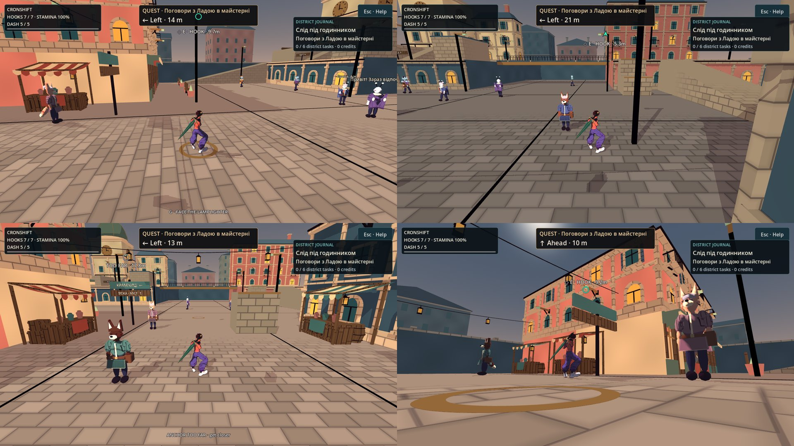

# Трос без прицілювання — кроки 1–2

**Дата:** 2026-10-07 · **Роль:** T2 Гефест · **Статус:** кроки 1–2 [[2026-10-07-Aim-Free-Rope]] виконано в робочому дереві;
`make check-playable` і `make gates` — rc0. Коміт робить T1. Специфікація — T8, [[06-UI-UX]] § «Трос без прицілювання — GAP-специфікація 2026-10-07» (варіант Г).
Гілка `claude/t1-orchestration-2026-10-07`, база `8dcd972`, дерево на старті чисте.

Слова Santos: «ще тросік з мотузкою пофікси, аби закидувалось завжди чітко без прицілювання».

**Предмет:** для кожного натиску паркурного гака людиною P1 (місто й дуель «за спиною»): або герой чіпляється саме за
позначений якір, або не видається нічого (ні замаху, ні слота, ні втоми), а відповідають звук і причина; ворожий гарпун,
CPU, бокова камера й SHARED P2 вибирають біт у біт як база.

## Звірка плану з реальністю

| що в плані / T8 | команда | вихід |
|---|---|---|
| вибір цілі, конус 42°, висота 1,5 м | `sed -n 9,13p;149,156p game/scripts/core/HarpoonAim.gd` (на `8dcd972`) | `traversal_assist_degrees = 42.0`, `offset.y < 1.5`, `alignment < cos(cone)` — збігається |
| без цілі натиск однаково стріляє | `sed -n 300,330p;478,481p game/scripts/grapple/GrappleHook.gd` | `fire` іде в WINDUP за порожнього `target_id`; `_spend` видає токен і додає втому — збігається |
| 4 якорі | `sed -n 43,45p game/scripts/world/CityLayout.gd` | `(±8; 6,5; ±8)` — збігається |
| дальність 14 м | `grep -n grapple_range game/data/characters/*.tres` | 14.0 у Choko (`:224`), Skea (`:268`), Lamplighter (`:220`) |
| покриття 1533 / 3969 | `python3` по 4 якорях, ціла сітка −31…31, рука 1,25 м, ≤ 14 м, без LOS | `(1533, 3969)` — відтворено; сітка −32…32 дала б 1533 / 4225 |
| туторіал і друга вибірка HUD | `grep -n "Aim at a lamp\|helper.capture" game/scripts/world/CityHud.gd` | `:535` і `:631` — збігається |
| запас гаків | `grep -n grapple_charges game/data/characters/*.tres` | Choko 7, Skea **2**: рядок `NO HARPOONS` для Skea настає швидко |
| база батареї | `make check-playable` на `8dcd972` (окремий worktree) | smoke `ALL OK (165 checks) in 19847 frames`, `PLAYABLE CHECK: 141 scenarios, 0 failures`, rc0 |

**Розбіжності, знайдені звіркою.** План вони не зупиняють, але T8/T1 мають їх бачити.

1. **Прогноз лише на замах не дає N6 («`MISS_REWIND` ніколи»).** Під час польоту тіло рухається далі з тією самою
   горизонтальною швидкістю (`GrappleHook.drive`, фаза FLIGHT: лише гравітація й `move_and_slide`). На контакті `_flight`
   перевіряє `rope_length > range_m` від руки **в цю мить**. Приклад: біг від якоря за 12,5 м. Після замаху до нього
   13,43 м (≤ 14), тож прогноз T8 його пропускає. Політ триває 13,43 / 48 = 0,28 с, тіло проходить ще +1,57 м, і на
   контакті відстань ≈ 15,0 м > 14 → `MISS_REWIND`. Тому фільтр дальності рахує руку на мить контакту
   (`GrappleHook.contact_hand`): спершу замах (місто зберігає біг, дуель гальмує до нуля за 30 м/с²), далі політ. Перехід
   у свінгу йде без замаху, але політ у нього теж є. Це суворіше за букву T8 і рівно те, що обіцяє його N6.
   **Потрібне підтвердження T8.**
2. **Липкість 0,25 с змінює дві наявні перевірки** `traversal_check.gd` (див. § Наявні перевірки).
3. **У дуелі «за спиною» немає щотактової публікації.** `DuelCamera` не викликає `publish`, тож натиск там бере свіжу
   вибірку, а маркер `Hud.gd` — свою. Правила Г діють і там (той самий `capture`), але «одна вибірка за кадр» у цьому
   режимі не виконана. `DuelCamera.gd` поза списком кроку 1 — відкрите.
4. **Перевибір при запуску бере лише якорі.** Якщо ціль зайняли між натиском і запуском, на її місці з'являється чужа
   мотузка. Новий відбір обрав би підказку `APPROACH ROPE`, у яку не можна випустити пристрій, і запуск скасувався б,
   хоча поруч є вільний якір. Тому `capture(..., anchors_only = true)` для перевибору (`GrappleHook._fresh_traversal`).

## Що змінено — крок 1 (логіка Г)

| файл | суть |
|---|---|
| `game/scripts/core/HarpoonAim.gd` | Шлях людини P1 із камерою `solo` і не `enemy_mode` іде в `_capture_traversal`. Жорсткі фільтри: якір вільний і запас є (мотузки — за чинними GRAB/APPROACH ROPE); ≤ дальності від руки зараз **і** на контакті; ≥ 1,5 м над рукою; чиста лінія від руки (шари 1 \| COVER). Точка позаду (`travel_alignment < −0,2`) — кандидат лише в кадрі. Конуса 42° немає. Вісь руху: у свінгу й у повітрі горизонтальна швидкість ≥ 2 м/с, інакше `wish`, інакше `forward`. Оцінка: таблиця T8 (відстань 0,25; напрям 0,40 / 0,20 / 0; висота 0,10; видимість 0,25 / 0,45 / 0,65; затулено від камери +0,25; поза кадром 1). Липкість: 0,12, плюс заміна валідної цілі не раніше ніж через 0,25 с; досяжна рукою мотузка йде першою. Без цілі пакет несе причину: `no_harpoons` → `behind` → `above` → `too_far` → `none`, а для сірого кільця `far_point` / `far_distance` (у кадрі, ≤ 1,5 × дальності, видно з руки). `publish(f)` — одна вибірка за фізичний такт. `press_packet` віддає натиску пакет із **попереднього** такту, тож смикання стіка в такті натиску ціль не міняє. Шлях ворога, CPU, бокової камери й SHARED P2 текстуально той самий, лише без мертвих гілок traversal |
| `game/scripts/grapple/GrappleHook.gd` | `signal denied(reason)`. Пакет Г без готової цілі → `fire()` повертає `NONE` ще до WINDUP: без слота, втоми й анімації кидка. Звук `grapple_denied` −4 дБ звучить не частіше ніж раз на 18 тіків (0,3 с, PLACEHOLDER). На натиску ціль перевіряється ще раз; якщо не пройшла — один свіжий відбір. У `_launch`, до `_spend`, ціль перевіряється знову від фактичної руки (дальність зараз і на контакті, лінія, зайнятість). Не пройшла → новий відбір лише по якорях, а якщо цілі немає — IDLE, звук і причина. `retarget` (перехід у свінгу) так само. Дотик до якоря: `Sfx.play("grapple_anchor", −6)` для пакетів Г (файлу немає, тож поки тиша). `contact_hand(point, with_windup)` — рука на мить контакту |
| `game/scripts/world/CityCamera.gd` | Зелену сферу r 0,15 м прибрано. Щотакту `aim.publish(player)` |
| `game/scripts/world/CityHookMarker.gd` (новий) | Екранний маркер: тонке кільце ≈ 28 px на 1080p (сталий розмір), сіре порожнє кільце `TOO FAR`, стрілка на краю кадру, заповнення під час замаху, приглушення на 50 % для затуленого від камери, один пульс 0,1 с до 1,15×. Без звуку, без спалаху. Колір — колишній `(0.2, 1, 0.75)`, поки T6 не вибере |
| `game/scripts/world/CityHud.gd` | Друга вибірка (`helper.capture` у `_process`) зникла: HUD малює кільце, стрілку й підпис з `aim.published`. Кільце й підпис стоять над картками HUD, бо перший нативний кадр показав кільце під панеллю quest guide. Підпис ставиться над кільцем, а коли там картка — під ним. Біля стрілки підпис іде з внутрішнього боку, бо спершу він накривав стрілку. Відступи — як у підпису раніше: 12 px з боків і згори, 80 px знизу, під status, quest і quest guide. Рядок причини 1,5 с у спільному `hint_label` з пріоритетом: запечатані навички → сюжет → відмова гака → стани паркуру. Повторний натиск оновлює таймер. Туторіал: `Move toward a lamp · E / L3 to hook`. Довідка: `Hook: tap E / L3 (or Y + LT), marked anchor only` |
| `game/scripts/ui/Hud.gd` | Паркурний рядок дуелі більше не ставить `HOOK` у точці променя камери без цілі (ворожий рядок не змінено) |
| `game/scripts/npc/CityProgress.gd` | Подія `rope` приймає кожен індекс якоря (`anchor_0` … `anchor_<N−1>`, точне написання), а не лише 0–3. Без цього доручення «Дві надійні опори» не зараховувало нові якорі, а підказка вела саме до найближчого з них (`quest-tracking` перший прогін: 7 failures). Старі збереження з 0–3 лишаються валідними |

Бойові числа, `.tres`, input map, `project.godot` і ворожий гарпун не змінювались:
`git diff --stat 8dcd972 -- game/data game/project.godot` → порожньо.

## Що змінено — крок 2 (покриття)

`CityLayout.anchor_supports()` — нові якорі з опорою. `anchors()` тепер похідний від неї, і перші 4 індекси ті самі, бо
доручення `rope_route` і його збереження називають `anchor_<index>`. `CityDistrict._anchor_support` будує опору трьох
видів. `post` — ліхтарний стовп на землі чи терасі (чотири старі ліхтарі будуються з тими самими розмірами). `bracket` —
залізний кронштейн, вкручений у стіну під карнизом, з пластиною й підкосом. `hanger` — вушко під плитою (зараз не
використано). Дальність 14 м і `.tres` не чіпані.

| # | де | точка | опора |
|---|---|---|---|
| 4–7 | ринкова вулиця, фасади південно-східного крила й південно-західного блоку, центри прольотів | (±8,6; 6,7; 17,4 / 24,6) | кронштейни під карнизом |
| 8 | південно-східний прохід (глухий кут), гола стіна східного крила | (20,4; 7,0; 22) | кронштейн |
| 9–10 | східна вулиця, північні фасади обох крил, між рядами вікон | (28; 8,6; 10,6), (16; 6,7; 10,6) | кронштейни |
| 11–13 | краї терас над вулицею | (15; 8; −9,6), (26; 8; −9,6), (−18; 8; −9,6) | стовпи на терасі, плече над вулицею |
| 14–15 | північна вулиця, краї терас біля мосту | (±9,6; 8; −24) | стовпи на терасах |
| 16–17 | західна вулиця, північний фасад над крамницями | (−24 / −16; 6,8; 10,6) | кронштейни |
| 18 | біля західної рампи, поза колом `west_court` r 5 (6,4 м від центру) | (−26; 6,5; −4) | вуличний ліхтар |
| 19–21 | годинникова вежа: схід, південь, захід, над капітелями пілястр | (−18,6; 10,2; −25), (−24; 10,2; −19,6), (−29,4; 10,2; −25) | кронштейни |
| 22 | штукатурений будинок на північно-західній терасі | (−12; 9,3; −24,6) | кронштейн |
| 23–24 | високий будинок на північно-східній терасі, між балконами 1-го поверху й карнизом 2-го | (16 / 24; 9,3; −24,6) | кронштейни |

Скрипт покриття — `tools/world/anchor_coverage.gd` (у `playable_check.sh` як `anchor-coverage`). Він рахує три міри:

- **T8** — міра аудиту T8: ціла сітка −31…31, ступні на y 0, рука +1,25 м, якір ≤ 14 м, без будівель і LOS.
- **real** — справжні колайдери `CityDistrict`. Береться кожна підлога колонки, де є латка 0,6 м і 1,8 м простору над
  нею, досяжна від spawn: пішки, падінням або стрибком із хватом ≤ 4,5 м (2,52 м апогею Choko + 2,05 м reach). Точка
  покрита, коли хоч один якір проходить жорсткі фільтри T8: ≤ 14 м, ≥ 1,5 м над рукою, чиста лінія на шарах 1 | COVER.
- **дахи** — на кожному даху ≥ 1 покрита точка. **Опори** — ковпачок якоря ≤ 0,35 м від точки, точка кріплення всередині
  світової геометрії, яка не є новою опорою.

Сирий вихід — `scratchpad/aim-free-rope/coverage/{before,after}.log` і `.csv` (кожна підлога, покриття і номери якорів).
«До» виміряне тим самим скриптом у worktree `8dcd972` з тими самими 4 якорями.

| міра | до (4 якорі) | після (25 якорів) |
|---|---|---|
| T8, мета ≥ 90 % (PLACEHOLDER) | 1533 / 3969 = **38,6 %** | 3876 / 3969 = **97,7 %** |
| real, усі досяжні підлоги | 1087 / 3018 = 36,0 % | 2683 / 3012 = **89,1 %** |
| real без крамниць і метрових смуг біля межі | 1083 / 2657 = 40,8 % | 2583 / 2651 = **97,4 %** |
| дах NorthWestRoof | 0 / 240 | 217 / 238 |
| дах NorthEastRoof | 0 / 296 | 293 / 293 |
| міст RoofBridge | 0 / 63 | 63 / 63 |
| опори | 4 / 4 | 25 / 25 |

`ANCHOR_COVERAGE_COMPLETE checks=57 failures=0 anchors=25 t8=3876/3969 real=2683/3012 roofs=3/3 supports=25/25`
(дві перевірки з 57: доручення приймає `anchor_0` … `anchor_24` і відкидає `anchor_25`, `anchor_01`, `anchor_-1`).

Непокрите після (329 підлог), за розбивкою скрипта:

- у крамницях — 109 / 113. Мотузки в приміщенні немає за задумом;
- у метрових смугах між будинками й межовими стінами (|x| або |z| = 31) — 152 / 248;
- на відкритому — 68. Усі під дахом: під плитою мосту (≈ 28), під ServiceGallery у дворі обслуги, під наметами ринку
  й під навісом архівної галереї. Розбивка — `after.csv`.

Висоти дахів 10–16 м (мансарди, вежа, високі будинки) скрипт не вважає досяжними. Якір над ними потребував би опори
≥ 18 м.

## Регресія — `tools/grapple/auto_hook_check.gd`

Пороги — літерали специфікації: перемикання 0,25 с, позаду −0,2, TOO FAR ≤ 1,5 × дальності, рядок 1,5 с, звук 0,3 с.
Обидва герої. Частина A — синтетична підлога в 16:9 `SubViewport`. Корінь headless — квадрат 100 × 100 (видимий
прямокутник 1600 × 1600), а числа T8 (48,6° півширини) рахувались для 16:9. Частина B — справжній `CityWorld` зі
справжніми подіями: клавіатура E, pad L3 і лівий стік.

| № | що | як |
|---|---|---|
| P1 | якір у кадрі між 42° і краєм, попереду руху | приклад T8: камера (0; 4,25; 8), рука (0; 4,25; 0), якір (7; 7; 0), 43,2° — обраний, `in_frame` |
| P2 | над кадром (під ліхтарем) і за бічним краєм | обраний, `in_frame = false`; у місті під ліхтарем (7,5; 0; 8,5) — `ARROW` на верхньому краї в межах відступів |
| P3 | стіна між камерою й якорем, рука бачить | обраний, `camera_hidden` |
| P4 | два якорі попереду, 6 і 12 м, кут підйому 40° | ближчий |
| P5 | біг; попереду 10 м, позаду в кадрі 6 м | передній |
| P6 | огляд на якір позаду | обраний; після 2 с огляду знову вирішує рух |
| P7 | дрібний crossover; явно кращий якір | ціль не міняється; за 9 тіків ще стара, за 17 — нова |
| P8 | маркер на такті N, смикання `wish` у такті N+1 | натиск бере ціль такту N; повторний натиск під час замаху нічого не міняє; HANG на ній |
| P9 | yaw незмінний, герой розвертається до якоря поза кадром | обраний без жодного огляду |
| P10 | перехід у свінгу за швидкістю | `retarget` → FLIGHT → HANG, витрата рівно 1 |
| P11 | справжній квартал, безпечна точка (0; 0; 9,5), обидва південні якорі | E → HANG на (−8; 6,5; 8), L3 → HANG на (8; 6,5; 8); кільце й `◇ E · HOOK · …` над картками HUD; кільце заповнюється під час замаху; підпис стрілки — під нею. Маршрут `CityLayout.route_points()` із бігом лівим стіком: Choko 25 натисків / 18 HANG / 7 відмов / **0 rewind**, Skea 25 / 19 / 6 / **0** |
| N1 | старт (0; 0; 23) на базовому наборі з 4 якорів | IDLE, запас і втома ті самі, стану GRAPPLE немає; `Sfx.last_frame["grapple_denied"]` — цей такт, `grapple_fire` не грав; `too_far` один раз; сіре кільце `TOO FAR · 17.8m`; рядок `ANCHOR TOO FAR · get closer`. Другий натиск за 6 тіків оновлює рядок без другого звуку; рядок ще є на 80-му тіку й зник на 96-му; за 0,3 с звук знову грає. Синтетично те саме: `far_distance` = 17,79 м |
| N2 | якір за стіною від руки | не обраний, `none` |
| N3 | біг, якір позаду поза кадром | не обраний, `behind` |
| N4 | дах, ступні на y 4, якорі 6,5 м | жодної цілі, `above` |
| N5 | запас 0, мотузки немає | відмова, `no_harpoons` |
| N6 | біг від якоря за 10…14 м (7 дистанцій) і запуск, коли ціль на натиску була, а на запуску вже ні | або `too_far` до натиску, або HANG; `MISS_REWIND` ніколи; скасований запуск — IDLE без витрати, зі звуком відмови |
| N7 | ціль зайняли між натиском і запуском | є запасний якір → HANG на ньому, витрата 1; немає → IDLE без витрати |
| N8 / N9 | `enemy_mode`, ручний ворожий, CPU, бокова камера, SHARED P2 | 20 / 20 пакетів `var_to_bytes`-тотожні замороженій копії `HarpoonAim.gd@8dcd972` (`tools/grapple/harpoon_aim_base.gd`, відрізняється лише рядком `class_name`, звірено `diff`) |
| N10 | канарка | див. негативи |

Негативи (`--break=`), кожен червоний лише своїми `ERROR: AUTO_HOOK:`:

| мутація | що ламає | вихід |
|---|---|---|
| `base` | замість Г — вибір бази (конус 42°, камера як фільтр) | 40 failures: P1, P2, P3, P6, P7, P9, N2… |
| `empty_shot` | натиск без прапорця Г — постріл у порожнечу, як до правки | 12 failures: N1, N5, N7 |
| `no_recheck` | запуск без повторної перевірки | 4 failures: N6 на запуску (обидва герої) |
| `lock` | без затримки 0,25 с | 2 failures: P7 |

## Наявні перевірки, змінені свідомо

- `traversal_check.gd`, «camera-hidden anchor is not advertised through walls» **змінила знак за рішенням T8 (P3)**, це
  не регресія. Тепер: «camera-hidden anchor stays selectable when the hand sees it (T8 decision, sign changed)» — якір
  обраний і `camera_hidden`. Перевірки руки, дальності й переходу крізь стіну лишились як були.
- `traversal_check.gd`, «changing travel direction replaces opposite-side sticky target» і «explicit orbit overrides
  movement preference»: між зміною й перевіркою тепер чекаємо 0,25 с (P7). Додано перевірку, що всередині 0,25 с
  ціль ще стара. Знак обох перевірок той самий.
- `city_geometry_check.gd`, «four sparse street anchors» → кількість дорівнює `CityLayout.anchors()` і > 4. Вуличні
  перевірки (наближення, чиста лінія, мотузка над землею) — для чотирьох ліхтарів 0–3. Для всіх якорів мотузка висить
  над підлогою в межах 12 м (ліхтар 10 стоїть на 8,6 м).
- Довідка CityHud: хвіст `marked anchor only` став у рядок `Hook:` (T8 указав `:462`). У першій спробі він стояв у рядку
  `Face anchor…`, рядок переносився, і `city_onboarding_check` упіймав, що кнопка паузи вийшла за 900 px.

## Кадри

Нативний Compatibility, llvmpipe, 1280×720 під xvfb (scratch `dbg/aim_capture.gd`, worktree-дзеркало робочого
дерева). Сирі кадри 01–09 — `scratchpad/aim-free-rope/frames/`: ще стовпи на краю тераси й кронштейни вежі. Художньо
не прийнято: колір, розмір кільця, стрілка й вигляд опор — за T6, вимоги T8 — на 1280×720 і 3840×2160.

## Перевірки

Сирі логи — `scratchpad/aim-free-rope/`: `base/` (батарея на `8dcd972`), `run1/` (перший повний прогін), `final/`
(остаточний), `coverage/`, `frames/`. Бінар — official Godot 4.7 (`4.7.stable.official.5b4e0cb0f`).

| команда | вихід |
|---|---|
| `make check-playable` (остаточно, включає `make check`) | rc0. GDS `перевірено: 128 · не парсяться: 0`, канарка FAIL як треба. `[smoke] ALL OK (165 checks) in 19847 frames`. `PLAYABLE CHECK: 147 scenarios, 0 failures` — було 141, додано `auto-hook`, `anchor-coverage` і 4 негативи. Жодного `SCRIPT ERROR` у 147 логах |
| перший повний прогін | `PLAYABLE CHECK: 147 scenarios, 1 failures` — `quest-tracking` (7 failures): нові якорі не зараховувались дорученням. Виправлено в `CityProgress.gd`, далі остаточний прогін |
| `make gates` | rc0, `БАТАРЕЯ ЗЕЛЕНА`: wikilinks 7278 / 0 зламаних, реєстр 176 / 176, ролі 8 / 0, GDS 128 / 0 |
| `auto-hook` | `AUTO_HOOK_COMPLETE checks=162 failures=0 mutation=none`, 5319 кадрів із 12000. Маршрут: Choko 25 натисків / 18 HANG / 7 відмов / 0 rewind, Skea 25 / 19 / 6 / 0 |
| негативи `auto-hook-negative-*` | base 40, empty_shot 12, no_recheck 4, lock 2 failures (усі з 162 checks); інших помилок немає (harness пускає лише `ERROR: AUTO_HOOK:`) |
| `anchor-coverage` | `ANCHOR_COVERAGE_COMPLETE checks=57 failures=0 anchors=25 t8=3876/3969 real=2683/3012 roofs=3/3 supports=25/25` |
| `traversal` / `city-geometry` / `quest-tracking` / `harpoon-aim` | 54 / 0 · 1775 / 0 · 44 / 0 · 22 / 0 |
| `lethal-fight` / `city-controls` / `city-onboarding` | 121 / 0 · 48 / 0 · 72 / 0 |
| `city_camera_renderer_check.gd` під xvfb, як `ci.yml:78-80` (llvmpipe, 1280×720) | rc0, `CITY_CAMERA_RENDERER_TRACE renderer=gl_compatibility …`, `CITY_CAMERA_RENDERER_COMPLETE checks=4 failures=0`; той самий розбір Python, що в CI → `NATIVE_COMPATIBILITY_PASS checks=4 errors=0`. Прогнано в worktree-дзеркалі (поки йшла батарея); `diff -rq` його `game/scripts` і `tools` з робочим деревом — порожньо |

## Відкрите

- **T8:** підтвердити розбіжність 1. Прогноз дальності тут — замах плюс політ, а не лише замах. Також липкість
  0,25 с діє й після явного огляду (виняток лише невалідність, як у специфікації).
- **T8/T2:** у дуелі «за спиною» немає щотактової публікації (`DuelCamera.gd`), тож маркер `Hud.gd` і натиск
  вибирають окремо (розбіжність 3). У кишені смертельного бою рядок причини не показується: верх екрана тримає LethalHud.
- **T6:** колір і форма кільця, сірого кільця, стрілки, а також вигляд 21 нової опори (кронштейни, стовпи на терасах).
  Кільце, що падає на картку HUD, малюється поверх неї — оцінити на кадрах. Розмір ≈ 28 px на 1080p — PLACEHOLDER
  до мінімуму T3 для 6″ і Retina.
- **T3:** джерело й ліцензія звуку `grapple_anchor`. Поки виклик мовчить: `ls game/assets/audio/sfx | grep -c grapple_anchor` → 0.
- **Покриття:** 68 відкритих точок «під дахом» (найбільше під мостом), метрові смуги біля межових стін і крамниці
  лишаються без якоря. Звідти натиск дає відмову з причиною. Висока дальність лише в місті (П2 плану) не
  застосовувалась.
- **T5 / T8:** крок 4 плану — оновити [[04-Grapple-System]] § Вибір якоря і [[05-Platforms-Input]]. Там досі
  описані 4 якорі й конус.
- **M3:** ручне приймання без миші (10 натисків біля ліхтарів, 5 на старті) — за [[2026-10-07-M3-Acceptance-Checklist]].
  Тепер старт має якорі в дальності, тож «5 відмов на старті» з T8 треба перевіряти на базовому наборі або в іншій
  непокритій точці.

## Related
- [[2026-10-07-Aim-Free-Rope]] · [[06-UI-UX]] · [[04-Grapple-System]] · [[05-Platforms-Input]] · [[state]]
- [[2026-10-05-Rope-Assistance]] · [[2026-10-05-Responsive-Rope]] · [[2026-10-05-Rope-Contact-Range]] · [[ADR-019-Audit-And-Many-Views-Before-Decision]]
