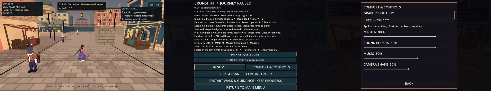

# Місто: пояснення запечатаних навичок і COMFORT & CONTROLS у паузі

**Дата:** 2026-10-07 · **Роль:** T2 Гефест · **Статус:** крок 0 [[2026-10-07-First-Enemy-Lethal-Fight]] виконано в робочому дереві. Код — на базі `262ea88`; HEAD тепер `5fe9753`, але після нього додались лише документи. Коміт робить T1. Специфікація — T8 (план, рядок 0; [[06-UI-UX]], «Відомі розриви»). Рішення — [[ADR-024-Lethal-Fights-And-First-Enemy]], розрив — [[ADR-023-City-First-Exploration]] («Навички, залежні від арени, тимчасово недоступні з явним поясненням у HUD»).

## Звірка плану з реальністю

1. **Натиск ковтався лише в наземному тіку.** `CityFighter._pressed` відкидав `skill1/skill2/ultimate/grapple_enemy`. Але навички `Fighter` опитує тільки в `_tick_ground` (`Fighter.gd:572-578`). Натиск у повітрі, на виступі чи на мотузці просто згасав у буфері, тож сигнал лише з `_pressed` пропускав би ці стани. Тепер `CityFighter._physics_process` наприкінці кожного тіку забирає з буфера свіжі натиски цих дій і подає `sealed_action` один раз на натиск. `_pressed` для них просто повертає `false`. Поведінка бою від цього не змінюється: у місті ці дії й досі нічого не запускають.
2. **Подвійна пауза.** Пауза в місті (`CityHud.set_paused`) і пауза арени (`Hud.toggle_pause`) — різні власники. Модалка `ComfortPanel` власником паузи не стає: вона лише бере свій токен вводу, як у дуелі. Поки модалка відкрита, `CityHud._input` ігнорує Esc / B, і закриває їх сама модалка. Будь-який вихід із паузи (`set_paused(false)`: resume, skip, restart, exit) спершу закриває модалку.
3. **Пауза не влазила в 900 px.** З новою кнопкою й рядком довідки «RETURN TO MAIN MENU» опинявся на y 916–975 при полотні 1600×900. Тому RESUME і COMFORT & CONTROLS тепер ділять перший ряд, а журнал має мінімальну висоту 110 px замість 130. Нижній край — 894 px; на `HEAD` був 887 px (scratch `dbg/pause_layout.gd`). Перший варіант рядка довідки переносився у два рядки й знову виводив кнопку за край. Фікстура це впіймала, і рядок скорочено.

## Що змінено

| файл | суть |
|---|---|
| `game/scripts/world/CityFighter.gd` | `signal sealed_action(action)` і `SEALED_ACTIONS`. Кожен тік забирає свіжі натиски цих дій з буфера, сигнал — лише коли `control_locked` не діє. Input map, числа бою й дуель без змін |
| `game/scripts/world/CityHud.gd` | Рядок `SKILLS SEALED IN THE CITY · Skills, ultimate and enemy hook work in fights only` у наявному `hint_label`. Тримається 2 с і має найвищий пріоритет, повторно — не частіше ніж раз на 6 с (обидва PLACEHOLDER). Поки гра на паузі або ввід у UI, таймери стоять. Довідка паузи отримала рядок `Sealed in the city, fights only: skills U / R, I / T · ultimate O / C · enemy hook Q` (клавіші з `InputRouter.binding_label`). Кнопку `COMFORT & CONTROLS` додано в перший ряд поруч із RESUME, вона відкриває наявний `ComfortPanel` з довідкою міста. Закриття повертає ту саму паузу й фокус на кнопку. Фокус: Tab — RESUME → COMFORT → решта, ←/→ — у межах ряду, ↑/↓ — ряд як одне ціле |
| `tools/ui/city_controls_check.gd` (новий) | UI-фікстура на справжньому `CityWorld`: реальні події клавіатури й геймпада через `Input.parse_input_event`. Пороги літеральні (див. нижче). Негативи `--break=signal\|interval\|comfort\|focus` |
| `tools/gates/playable_check.sh` | `city-controls` і 4 негативи `city-controls-negative-*` з префіксом `ERROR: CITY_CONTROLS: ` |

Кадр нативний (Compatibility, llvmpipe, 1600×900, scratch `dbg/step0_capture.gd`), художньо не прийнятий.

## Регресія

`city_controls_check.gd`, 48 перевірок:

| властивість | як перевірено (справжні події) | літерал | негатив |
|---|---|---|---|
| підказка на натиск | U (SOLO skill1) | показ ≤ 3 тіки, ще видно на 1,8 с, зникла до 2,4 с | `signal` — HUD відключено від сигналу |
| не частіше інтервалу | Q (enemy hook) через 3 с | другого показу немає протягом 4 с, натиск усе одно забрано й подано один раз | `interval` — інтервал 0 |
| повтор після інтервалу | геймпад D-pad Up (ultimate) на ~8,4 с | показ до 9 с | — |
| будь-який стан і пристрій | акорд Y + LB (skill1), I (skill2) у стрибку | по одному `sealed_action` на натиск | — |
| у бійці нічого не стартує | — | `current_move == null`, стан IDLE/WALK, `meter` і `cooldowns` без змін | — |
| довідка | `exploration_help()` | є «Sealed in the city», «fights only» і справжня клавіша кожної з 4 дій | — |
| пауза влазить | окремий `CityHud` у SubViewport 1600×900, 2134×900, 1600×1200 | 5 кнопок усередині полотна | — |
| відкриття з паузи | Esc → → (фокус на COMFORT) → Enter | модалка видима, панель паузи схована | `comfort` — кнопку відключено |
| один власник паузи | — | `paused_ui`, `SceneTree.paused`, `ui_suppressed()` тримаються, поки модалка відкрита і після її закриття | — |
| звук і графіка як у меню | ← на повзунку MASTER; вибір Low | `master` і гучність шини Master падають; профіль `low`, `root.scaling_3d_scale` змінюється | — |
| повернення | Esc, потім pad A / pad B | та сама пауза, фокус на COMFORT & CONTROLS | `focus` — `closed` відключено |
| вихід будь-яким шляхом | `set_paused(false)` з відкритою модалкою | модалка закрита, гра йде, жоден токен вводу не лишився | — |

Фікстура пише налаштування в тимчасові `user://city_controls_*.cfg`, видаляє їх і повертає попередній профіль графіки.

## Перевірки

Сирі логи — у scratchpad T2 `evidence/t2/step0/`; остаточні прогони батареї — `evidence/t2/step0/final/`.

| команда | вихід |
|---|---|
| `city_controls_check.gd` | `CITY_CONTROLS_COMPLETE checks=48 failures=0 mutation=none`. Негативи: signal 3, interval 2, comfort 10, focus 5 failures, інших помилок 0 |
| сусідні фікстури | `city_onboarding_check` 72/0, `quest_journal_check` 32/0, `district_ui_check` 33/0 |
| `make check` | rc0: GDS 119/0 (канарка FAIL як треба), `[smoke] ALL OK (164 checks) in 19847 frames` |
| `make gates` | rc0, `БАТАРЕЯ ЗЕЛЕНА`: wikilinks 0 зламаних, реєстр 175/175 |
| `make check-playable` | rc0, `PLAYABLE CHECK: 107 scenarios, 0 failures` (було 102: + `city-controls` і 4 негативи). Сусідні `city-onboarding`, `quest-journal`, `district-ui`, `comfort-*`, `conversation-camera`, `npc-runtime` — PASS |

## Відкрите

- Тривалість (2 с) та інтервал (6 с) — PLACEHOLDER, їх приймає T8.
- Рядок 1 «Відомих розривів» у [[06-UI-UX]] тепер закрито кодом. Документ належить T8, тож правлю не я. Рядок 2 (клавіатурний огляд камери) не зачеплено.
- Підказка має пріоритет над сюжетною підказкою й підказками паркуру на 2 с. Якщо T8 хоче інший порядок, це один `if` у `_refresh_traversal_hint`.
- Натиск під час перекладання меча (`Fighter._discard_swap_blocked_inputs`) і далі забирається мовчки.

## Related
- [[2026-10-07-First-Enemy-Lethal-Fight]] · [[ADR-024-Lethal-Fights-And-First-Enemy]] · [[ADR-023-City-First-Exploration]] · [[06-UI-UX]] · [[state]]
