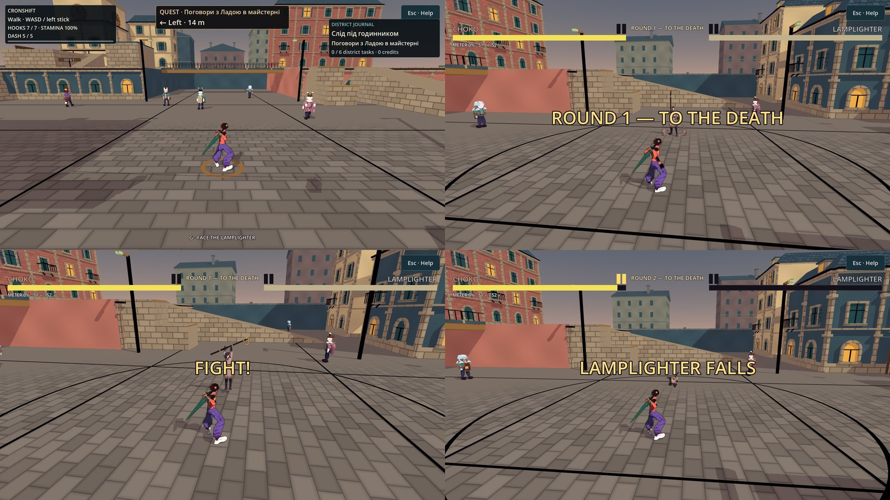

# Смертельний бій: ядро кишені `central_court`

**Дата:** 2026-10-07 · **Роль:** T2 Гефест · **Статус:** виконано в робочому дереві — крок 2 і мінімальний HUD кроку 4 [[2026-10-07-First-Enemy-Lethal-Fight]], рішення [[ADR-024-Lethal-Fights-And-First-Enemy]]. Кров і `ContentSettings` — наступним заходом. База гри `c1cdd4e`; HEAD `43c2e75` додав лише `docs/system/state.md` (`git diff --stat c1cdd4e HEAD` → 1 файл). Коміт робить T1.

## Звірка плану з реальністю

Кожен рядок перевірено `sed -n` / `grep -n` у цій сесії на `c1cdd4e`.

1. **Рядки T5 і T1 збігаються з кодом.** `Fighter.gd:268` `hp = data.max_hp`; `MatchFlow.gd:44-57` (`_start_round`, скидання на `:50-51`), `:80-96` (FIGHT: втома, тренування, таймер), `:97-104` (ROUND_END), `:124` (`wins[winner] += 1`), `:127` (slow-mo 0,4×), `:144-145` (`rematch`); `GameState.gd:43-44`; `CityFighter.gd:9`, `:33-36`, `:65-67`; `CpuBrain.gd:7`, `:22`, `:67`, `:95-110`; `DuelCamera.gd:83`, `:122-124`; `SmokeTest.gd:1522-1526`; `RigAnimator.gd:79-110` (гілки `staff` немає).
2. **Чужі профілі героїв — більше, ніж знайшов T5.** `Fighter.dodge_profile()` для невідомого `id` бере профіль Choko (`Fighter.gd:729-730`) — підтверджено. `LimbMotion.PROFILES.get(id, default_profile)` (`LimbMotion.gd:30`) і `apply_guard` (`:149-151`) для чужого `id` дають нейтральний профіль; `HeroFacePresentation.get_profile` (`:18`) і `IdlePresence.apply` (`:19`) для чужого `id` нічого не роблять — тут проблеми немає. **Нове:** щойно `model_scene` не порожній, `SkeletalRig.setup` будує `HeroGearPresentation` (`SkeletalRig.gd:147-151`), а той для будь-якого `id`, крім `choko`, малює спорядження Skea — книгу й куна (`HeroGearPresentation.gd:40-57`). Ворог із моделлю отримав би книгу Skea.
3. **`GameState.training_mode` переживає вихід у місто.** `CityWorld._ready` зберігає `free_move`, профіль вводу, воду, `duel` і `time_scale` (`CityWorld.gd:41-45`), але не `training_mode`. Після TRAINING у меню `CpuBrain` стоїть (`CpuBrain.gd:37`), а `MatchFlow` лікує (`:84-88`). Смертельний бій мусить не залежати від цього прапора.
4. **NPC кишені.** `CityNpcActor.home_for` (`CityNpcActor.gd:24-26`) і маршрут `home ± (0,5; 4)` (`:33-34`): у коло r 7 від (0,0) заходять мешканці з індексами 3 (`(-5,5; -5)`), 5 (`(5,6; 4)`) і 11 (`(-1,7; -4)`); 4 і 6 — ні. Це ті самі №3/№5/№11 T5 (нумерація з нуля).
5. **Припущення центру й підлоги.** `reset_for_round` ставить бійця в `(x, 0, 0)` (`Fighter.gd:250`), `_ground_spot` — на `y = 0` (`:1880-1883`), `_post_move` звичайного бійця тримає `y ≥ 0` (`:1955-1956`). У `central_court` центр (0,0,0) (`CityLayout.gd:13`), верх `Ground` — `y = 0` (`:37`). Кишеня з іншим центром чи підлогою цих припущень не витримує — підтримано лише `central_court`.
6. **HUD H2 від T8 у документах немає.** Специфікація є лише одним рядком плану (крок 4) і в дорученні T1. Рядка `SPARRING · FIRST TO 2` у грі немає (`grep -rn "SPARRING" game` → 0): дуель пише `FIRST TO 2`, потім `ROUND n · FIRST TO 2` (`Hud.gd:137`, `:565`).
7. **Модель «Ліхтарника».** `lamplighter_m0.glb`: 24 кістки з тими самими назвами, що в Choko/Skea; зріст 1,70 м, як у героїв; стегна 1,003 м (Choko 1,039, Skea 1,014) — зонд `scratchpad/lethal/glb_probe.gd`. Пропорції ретаргету героїв, тож ретаргет застосовний. «Високий силует» зростом не передано: Meshy нормалізував модель до 1,70 м.

## Хід роботи

Журнал по ходу (на випадок обриву). Зонди — `scratchpad/lethal/`.

- [x] Дані: `CharacterData.cpu_only` (ADR-024 п. 9) і `cpu_difficulty` (дефолт 0,6 = старий `CpuBrain.difficulty`, тож герої без змін). `lamplighter.tres`: `cpu_only = true`, `cpu_difficulty = 0.6`, `model_scene` → `lamplighter_m0.glb`.
- [x] Правило бою: `MatchFlow.lethal` (ставить власник бою, арена — ніколи) і `LETHAL_HP_CARRY_K = 0.35` з посиланням на GDD 02. У lethal: перенос HP у `_start_round` (лише між раундами, новий матч і `rematch` — повне HP), немає таймера й TIME UP, немає гілки тренування, `GameState.last_result` не пишеться, оголошення `ROUND n — TO THE DEATH` / `<ENEMY> FALLS` / `DEFEATED`. Спаринг — ті самі рядки, що й були.
- [x] Межа бою на бійці: `Fighter.arena_center/arena_radius` (дефолт — ARENA_RADIUS від (0,0)), метод `bound()`. Його беруть soft wall, push-box, wall splat, `_ground_spot`, flash і beat-flash. Статичний `clamp_arena` лишився колом дуелі для Printer/FX.
- [x] Кишеня: `CityLethalFight` (новий), вхід — взаємодія `interact` на безпечній точці `(0, 0, 9.5)` (`CityLayout.lethal_encounter`), так само, як точки сюжету. `CityFighter.lethal_pocket` відкриває skill1/skill2/ульту, `grapple_enemy` лишається запечатаним; `_try_grapple` міста ніколи не тягне ворога.
- [x] NPC: `CityNpcDirector.hold_clear_of/release_hold`; розмови на час бою вимкнено.
- [x] HUD: `LethalHud` (новий), `CityHud.set_fight_mode`; дуель пише `SPARRING · FIRST TO 2` з `MatchFlow.round_title()`.
- [x] CPU ворога: `CpuBrain._enemy_tick` лише для `cpu_only`.
- [x] Модель: `StaffPresentation` (новий), `HeroGear` лише для Choko/Skea, нейтральний `DodgeProfile` для CPU-only, міст поз `ProceduralMotionFallback` для п'яти рухів ворога.
- [x] Smoke: `_gdd_slots` пропускає `ultimate`/`throw` лише для `cpu_only` + перевірка з трьома зламами.
- [x] Перший зонд (`probe_fight.gd`): вхід → раунд 1 з (−3,0,0)/(3,0,0) → KO ворога → раунд 2: ворог 350,0, герой 420 → 640,5 → вирішальний KO → 3 с → кишеня закрита, камера міста поточна, NPC на маршрутах. Знайдено й виправлено: `SCRIPT ERROR` `Fighter.gd:391` (ворог тікав ще раз після `player.opponent = null`) і зайвий мешканець 4 (зазор 1,0 м тягнув лінію за 7,74 м).
- [x] **Знайдено давній дефект Н7 у дуелі.** KO від удару (і будь-який knockdown) зі скелетними героями будує `BoneRagdoll` під сплющеним `receive_hit` скелетом, і Jolt відкидає непропорційний масштаб: 11 рядків `ERROR: … not supported by Jolt Physics` на кожен KO. Відтворено на базі `c1cdd4e` (окремий worktree, зонд `scratchpad/lethal/probe_duel_ko.gd`: Choko б'є Skea з 1 HP → `grep -c "not supported by Jolt"` → 11). Капсульний `Ragdoll.build_from` це вже обходить (`Ragdoll.gd:58-59`, ортонормалізація), кістяний — ні. Smoke цього шляху не проходить, тому гейт Н7 мовчав. Виправлення: `Fighter._spawn_ragdoll` знімає сплющення (лише картинка) перед `BoneRagdoll.build_on`, знімок капсул береться до цього. Той самий зонд після → 0. Смертельний бій проходить цей шлях на кожному KO й SNUFF, тож без виправлення фікстура червона.
- [x] Додано після першої батареї: іскри, FxDirector і тряска з `Arena._on_hit`; камера відкривається після розстановки раунду 1; смуга H2 опущена під кнопку паузи міста (перевірка перекриття, див. «Регресія»).
- [x] Регресії й негативи; остаточні `make check-playable` і `make gates` — «Перевірки».

## Що змінено

| файл | суть |
|---|---|
| `game/scripts/fighter/CharacterData.gd` | `cpu_only` (ADR-024 п. 9) і `cpu_difficulty` (дефолт 0,6 = колишня константа `CpuBrain`). `.tres` героїв не змінено |
| `game/data/characters/lamplighter.tres` | `model_scene` → `lamplighter_m0.glb`, `cpu_only = true`, `cpu_difficulty = 0.6`. Жодне бойове число T5 не змінено |
| `game/scripts/arena/MatchFlow.gd` | `lethal` (ставить власник бою) і `LETHAL_HP_CARRY_K = 0.35` з посиланням на GDD 02. `carried_hp()`, `round_title()`, `decisive()`. У lethal немає таймера, TIME UP і лікування тренування, `last_result` не пишеться, а оголошення такі: `ROUND n — TO THE DEATH`, `LAMPLIGHTER FALLS` / `DEFEATED`. Вирішальний KO — той самий `_die` + slow-mo, без `_start_round` |
| `game/scripts/fighter/Fighter.gd` | `arena_center` / `arena_radius` на бійці й `bound()` (soft wall, push-box, wall splat, `_ground_spot`, flash, beat-flash). Для дефолтних значень `bound()` дорівнює `clamp_arena()` біт у біт: `x − 0` і `0 + x` дають ті самі float. Також `set_round_hp()`, нейтральний `DodgeProfile` для CPU-only і виправлення Н7 у `_spawn_ragdoll` |
| `game/scripts/world/CityFighter.gd` | `lethal_pocket`: у кишені запечатано лише `grapple_enemy`, skill1/skill2/ульта відкриті. Soft wall і flash тримаються кола кишені. `_try_grapple` міста ніколи не тягне ворога (навіть generic grapple із присідом) |
| `game/scripts/world/CityLethalFight.gd` (новий) | Увесь життєвий цикл бою: вхід, ворог P2-CPU, `MatchFlow(lethal)`, коло r 7 на обох, NPC убік, `DuelCamera` у режимі «за спиною» (зібрана кодом, як `DuelRig` в `Arena.tscn`), `LethalHud`, іскри/FxDirector/тряска як в `Arena._on_hit`, кільце межі на землі. Вихід: перемога — 3 с над тілом, далі ворог зникає з кишенею. Поразка — RETRY FIGHT (`rematch`, повне HP) або RETURN TO SAFE POINT. Також `abort` із паузи чи при виході зі сцени. TRAINING на час бою вимкнено, потім повернуто |
| `game/scripts/world/CityWorld.gd`, `CityLayout.gd` | Створення бою, підказка й `interact` на безпечній точці (якщо поруч немає точки сюжету й мешканця). `recover_to_spawn` спершу закриває бій. `lethal_encounter()`: кишеня, ворог, безпечна точка `(0, 0, 9.5)` (PLACEHOLDER) |
| `game/scripts/world/CityHud.gd` | `set_fight_mode()`: картка статусу, журнал, гід і приціл гака ховаються. Пауза лишається тут. У кишені на натиск enemy hook — рядок `ENEMY HOOK SEALED IN THIS FIGHT` (PLACEHOLDER для T8) |
| `game/scripts/npc/CityNpcDirector.gd` | `lane()`, `lane_crosses()` (кути й відрізки маршруту), `hold_clear_of()` / `release_hold()`, `fight_lock`. Мешканці, чий маршрут перетинає коло, стають на r 9,5 (не ближче за свій дім). Після бою — свій маршрут і точний стан руху до бою |
| `game/scripts/ui/LethalHud.gd` (новий) | HUD H2: HP героя, рядок раунду, HP ворога, пункти раундів, метр і S1/S2 героя, оголошення, картка DEFEATED з фокусом на RETRY FIGHT (клавіатура й геймпад). Шар 19 — під паузою міста. Червоного немає |
| `game/scripts/ui/Hud.gd` | Рядок рамки дуелі з `MatchFlow.round_title()` → `SPARRING · FIRST TO 2`. Номер раунду лишився в оголошенні `ROUND n` |
| `game/scripts/fighter/CpuBrain.gd` | `difficulty` з даних. Для `cpu_only` — `_enemy_tick`: авторські серії (light→light→heavy, low hook→heavy, heavy→SNUFF; наступний крок лише після контакту), пауза чи блок після серії, покарання промаху в recovery (одна спроба на замах, вага difficulty), SNUFF лише на 2,0–3,6 м, низький гак, без відступу в стіну кишені. Гілка спарингу героїв не змінена |
| `game/scripts/fighter/StaffPresentation.gd` (новий), `SkeletalRig.gd`, `RigAnimator.gd` | Процедурна жердина 2,27 м (≈ 4/3 зросту, Prompt-Library § 19): держак, шкіряний хват, три латунні обойми, залізний наконечник, відкритий гак і гасильник. Поза ударом стоїть вертикально біля руки, в ударі, падінні й KO іде за правою кистю. Окрема гілка `staff` і для капсульного вигляду. Хітбокси від неї не залежать |
| `game/scripts/fighter/HeroGearPresentation.gd`, `ProceduralMotionFallback.gd` | `HEROES` — спорядження будується лише для Choko/Skea. Міст наявних капсульних поз (light/slash/crouch_light/air_light/slam) для п'яти рухів ворога: без нього скелет стояв би в стійці весь удар, разом із 24-кадровим телеграфом SNUFF |
| `game/scripts/core/SmokeTest.gd` | `_gdd_slots` / `_gdd_compare`: `ultimate` і `throw` можна пропустити лише для `cpu_only`. Нова перевірка на справжніх даних із трьома зламами: герой без ульти, ворог без `cpu_only`, ворог без light. Smoke 164 → 165 перевірок |
| `tools/match/lethal_fight_check.gd` (новий), `tools/gates/playable_check.sh` | Фікстура + 13 негативів із префіксом `ERROR: LETHAL_FIGHT: ` |
| `docs/Art/Textures-Registry.md` | Рядок `model-lamplighter-m0`: стовпчик «використання» — підключено |

Кадри нативні (Compatibility, llvmpipe, 1600×900, `scratchpad/lethal/capture_fight.gd`, rc0, `CAPTURE_DONE`, без `ERROR`), художньо не прийняті. Видно: кільце входу й підказку `G · FACE THE LAMPLIGHTER`; смугу H2 з `ROUND 1 — TO THE DEATH`; модель «Ліхтарника» з жердиною (гак вище голови); телеграф SNUFF — жердина над головою обома руками; після вирішального KO — `LAMPLIGHTER FALLS`, тіло на землі. Решта кадрів (`3_idle_pole`, `5_snuff_active`, `7_city_back`) лежить у scratchpad.

## Рішення в межах T2

| розвилка | варіанти | обрано і чому |
|---|---|---|
| Де живе коло кишені | (а) глобальний радіус у `GameState`; (б) підклас ворога; (в) центр і радіус на бійці | (в): коло не переживає бій і не протікає в іншу сцену. Дефолти дають дуелі той самий float. Варіант (а) треба відновлювати на кожному виході, (б) не покриває героя |
| Вхід | тригер-зона (вхід «випадково»), розмова з ворогом, `interact` на безпечній точці | `interact` на точці: так само, як точки сюжету. Безпечна точка водночас є входом і місцем RETURN |
| Камера | нова камера пари; `CityCamera` з другою ціллю; наявна `DuelCamera` | `DuelCamera` у режимі «за спиною»: фокус на абсолютних 1,2 м (`DuelCamera.gd:122-124`) у дворі на `y = 0` збігається з дуеллю. `CityCamera` лише стоїть і повертається з `reset_view()` |
| NPC | ведення пішки, глядачі за бар'єром, миттєво вбік | Миттєво вбік на зрізі камери (пішки з 5 м — 4+ с при 1,15 м/с, довше за INTRO 84 кадри). Після бою — точний стан |
| RETRY / RETURN | — | RETRY = `MatchFlow.rematch()` (GDD 02 § Поразка героя), той самий ворог, повне HP обох. RETURN = закрити бій і поставити героя на безпечну точку |
| Тіло після смерті | лишити в дворі; прибрати одразу; 3 с і прибрати | 3 с (`AFTERMATH_SECONDS`, PLACEHOLDER) під `LAMPLIGHTER FALLS`, далі тіло зникає з кишенею. Що далі з тілом і ліхтарями — T7/T1 (GDD 02) |

**Наслідок, який має підтвердити T5:** оскільки `_tick_launched` тепер міряє стіну по колу бійця, регдол, що долетів до стіни кишені (7 м), отримує wall splat, як на колі арени (20 м).

## Регресія

`tools/match/lethal_fight_check.gd`, справжні `Arena` і `CityWorld`, події клавіатури й геймпада (`Input.parse_input_event`). Пороги — літерали GDD і плану: 350,0 і 640,5 (GDD 02, таблиця k), r 7, 99 с, 2,0–3,6 м, ≥ 20 кадрів, мешканці 3/5/11, безпечна точка `(0, 0, 9.5)`, 3° ретаргету (межа smoke).

Предмет: для будь-якого бою `M`: (`M.lethal` ⇔ `M` належить кишені) ∧ (lethal ⇒ між раундами `hp = hp_end + 0,35·(max − hp_end)`, годинника немає, смерть лише на вирішальному KO, кишеня закривається й віддає місту ввід, камеру й мешканців) ∧ (спаринг ⇒ усе як до цього кроку).

| властивість | як перевірено | негатив (форма зламу) |
|---|---|---|
| спаринг без змін | арена: `lethal` вимкнено, рядок `SPARRING · FIRST TO 2`, годинник іде, раунд 2 з 1050/900, TIME UP, `CHOKO WINS`, картка REMATCH, `last_result` | `sparring` — арена стає lethal |
| перенос HP | Choko 420 → 640,5, ворог 0 → 350,0 | `carry` — повне лікування; `carry_none` — без відновлення; `retry_carry` — рани в новому матчі |
| смерть лише на вирішальному | після 1-го KO ворог той самий і стоїть; після 2-го — KO, hp 0, `LAMPLIGHTER FALLS` у HUD, тіло лежить ≥ 0,5 с, кишеня закривається | `death` — ворога скинуто після смерті; `early_death` — ворог зник на 1-му KO |
| без годинника | 60 тіків — `time_left` той самий; `time_left = 0.05` — TIME UP немає | `clock` — у раунді годинник іде |
| мешканці | 3/5/11 стоять далі за 8 м і не ходять маршрутом, решта маршрутів не змінена, розмов немає; після бою — свої маршрути | `npc` — лишились; `npc_return` — не повернулись |
| навички лише в кишені | U в місті → `sealed_action("skill1")`, нічого не стартує (до й після бою); U у кишені → `skill1` стартує без сигналу; Q у кишені → лише сигнал, гак не летить, рядок кишені; Printer вимкнено | `skills` — запечатано в кишені; `outside` — відкрито поза нею |
| вихід | камера міста поточна і працює, `opponent` null, коло 20, `duel.behind` вимкнено, `time_scale` 1, ввід вільний, TRAINING повернуто, HUD і розмови на місці, двір без стіни | `exit` — камеру міста не відновлено |
| поразка | DEFEATED, фокус на RETRY FIGHT, ввід у картки. Enter — новий матч 1050/1000; Down + геймпад A — RETURN, герой на безпечній точці з повним HP, вхід знову доступний; рестарт із паузи — `abort` | `retry_carry` |
| CPU | `difficulty` = 0,6 з даних; SNUFF startup ≥ 20; смуга SNUFF 1,9 ✗ · 2,0 ✓ · 3,6 ✓ · 3,7 ✗; біля стіни відхід стає кроком убік; промах важкого Choko на 3,15 м карається в recovery; у вільному бою є серії, низькі гаки, SNUFF у смузі, ланцюг 2–3 і пауза ≥ 16 кадрів після серії | `edge` — CPU «забуває» стіну |
| тіло ворога | своя модель, жердина, гак вище голови, без спорядження героїв, нейтральний dodge, без профілю обличчя й кінцівок, пози-міст, ретаргет ≤ 3° | — |
| двір | 80 променів на r 0–6,95: підлога `y = 0` (≤ 0,01); циліндр r 7, висота 0,1–2,1 м не перетинає жодного твердого тіла | — |
| смуга HUD читається | кнопка паузи міста «Esc · Help» (шар вище, 140 × 56 від y 18) не перетинає імені, смуги HP ворога й рядка раунду | контроль руками: з відступом смуги 18 і 64 px перевірка червона (`runs/overlap-old-margin.log`, `runs/overlap-64.log`), з 86 — зелена |

## Перевірки

Сирі логи остаточного прогону — `scratchpad/lethal/final/` (`make_check_playable.log`, `playable-logs/*.log`, HEAD і `git status` на старті). Godot 4.7 official `5b4e0cb0f` (SHA512 звірено T1), `GODOT_BIN` на бінар у scratchpad.

| команда | вихід |
|---|---|
| `make check-playable` (включає `make check`) | rc0. GDS: `перевірено: 122 · не парсяться: 0`, канарка FAIL як треба. `[smoke] ALL OK (165 checks) in 19847 frames` — було 164, +1 перевірка ADR-024 п. 9; кадрів стільки ж. `PLAYABLE CHECK: 121 scenarios, 0 failures` — було 107, + `lethal-fight` і 13 негативів |
| `lethal-fight` | `LETHAL_FIGHT_COMPLETE checks=118 failures=0 mutation=none`. CPU: покарано 4 з 6 промахів; за 1500 тіків — 29 рухів, 7 серій, 3 низькі гаки, 4 SNUFF на 2,27 / 2,62 / 2,54 / 2,53 м, найдовший ланцюг 3, найкоротша пауза після серії 20 кадрів. Числа ті самі, що в окремих прогонах: детерміновано |
| 13 негативів | усі rc1 з `failures ≥ 1` і лише `ERROR: LETHAL_FIGHT:`: sparring 8, carry 3, carry_none 2, retry_carry 1, death 3, early_death 1, clock 6, npc 7, npc_return 3, skills 1, outside 1, exit 1, edge 1 |
| `grep -l "not supported by Jolt"` по всіх 121 логах playable | 0 файлів |
| `make gates` (після всіх правок документів) | rc0, `БАТАРЕЯ ЗЕЛЕНА`: wikilinks 466 сторінок / 0 зламаних, реєстр 176/176, ролі 8/0, шапка state ок, R8 у 35 планах, GDS 122/0 (`final/make_gates.log`) |
| межі доручення | `git diff --stat game/data/characters/choko.tres game/data/characters/skea.tres` → порожньо; `git diff --stat game/project.godot` → порожньо (нових дій немає) |

## Відкрите

- **T8.** Специфікації HUD H2 у [[06-UI-UX]] немає. Рядок дуелі тепер `SPARRING · FIRST TO 2`, тож номер раунду лишився лише в оголошенні `ROUND n` (раніше `ROUND n · FIRST TO 2`) — потрібне підтвердження. Тимчасові рядки: `ENEMY HOOK SEALED IN THIS FIGHT` і `FACE THE LAMPLIGHTER`. Відступ смуги 86 px під кнопкою паузи міста — PLACEHOLDER. Рамка без подвійного контуру дуелі.
- **T5.** Wall splat на стіні кишені (див. вище). Числа CPU — PLACEHOLDER: реакція 3 кадри, шанси, пауза 18–30, блок 16. З чинними кадрами ворог може покарати не кожен промах. Приклад: heavy Choko (recovery 17) карається лише на 3,0–3,3 м, де heavy жердини (2,8 м) ще дістає після кроку героя 0,5 м. Light Choko (recovery 9) — ніде.
- **T6.** Модель — 1,70 м, як у героїв, тож «високий силует» зростом не передано. Масштаб у рушії потребує числа (Prompt-Library § 19d: «зріст ворога задає рушій»). Вигляд жердини, кільце входу, кільце межі й те, як резиденти стоять на r 9,5, художньо не прийняті. **Згасання ліхтаря на SNUFF не зроблено:** у дворі немає світла ліхтаря, яке можна гасити, а глибину затемнення задає T6.
- **T7/T1.** Що лишається після смерті (тіло, ліхтарі знову горять) і збереження в CityStory — поза цим кроком: мертвий ворог мертвий лише до наступного входу в місто.
- **Не перевірено:** стіна під натягом мотузки за 7 м (див. зонди); Weak Point Skea по ворогу; M3 / Forward+ / фізичний контролер; кадри — llvmpipe.

## Зонди поза фікстурою

- **Кіти обох героїв у кишені** (`scratchpad/lethal/probe_kits.gd`, лог `runs/kits.log`, rc0, без `SCRIPT ERROR`). Choko: `record`, `time_stop`, `sword_storm` стартують, ворог 1000 → 831,4. Skea: `kunai_rain`, `shadow_veil`, `cursed_grimoire_veil` стартують, ворог 1000 → 893,0. Радіус героя ≤ 3,0 м.
- **Паркурна мотузка з кишені** (`probe_rope.gd`, `runs/rope.log`). Гак зачепився за вуличний якір `(8, 6,5, −8)` (11,3 м від центру). Із затиснутим reel 300 тіків герой не відійшов далі 4,59 м: обмежений reel до стіни не довів. Тож те, як стіна поводиться під натягом мотузки за 7 м, **не перевірено**. Структурно стіна стоїть у `_post_move` кожного тіку.
- **Н7 у дуелі** — див. «Хід роботи»: 11 → 0 рядків Jolt на KO від удару.

## Related

- [[2026-10-07-First-Enemy-Lethal-Fight]] · [[ADR-024-Lethal-Fights-And-First-Enemy]] · [[ADR-023-City-First-Exploration]] · [[02-Combat-System]] · [[03-Skills-Framework]] · [[06-UI-UX]] · [[PROPOSAL-First-Enemy]] · [[2026-10-07-City-Encounter-Options]] · [[2026-10-07-City-Skill-Hint-And-Comfort-Fix]] · [[Textures-Registry]] · [[Prompt-Library]] · [[state]]
