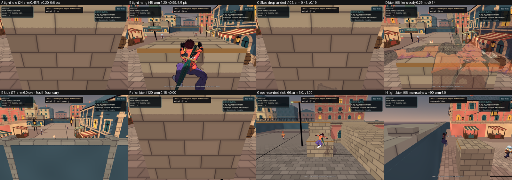
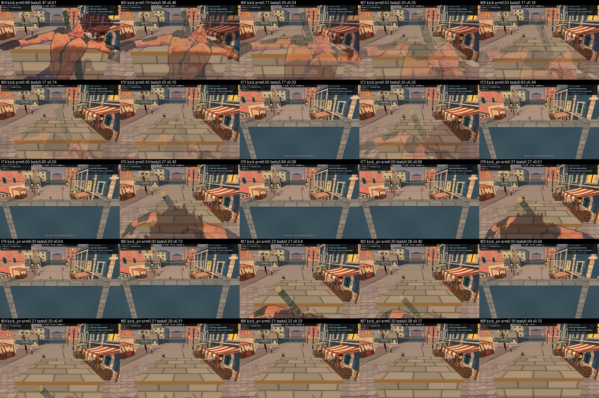

# Базовий замір камери на тісній станції

**Дата:** 2026-10-07 · **Роль:** T2 Гефест · **Статус:** діагностика завершена, `game/` не змінювався. Корекцію обирає T1 у [[2026-10-07-Tight-Support-Camera]].

Доручення T1 Дедала: поставити official Godot 4.7 у контейнер, прогнати базову батарею на `f27fd67` і виміряти камеру на станції `(4,0,31.4)` для hang, звичайного відходу й wall kick. Порівняти з відкритою станцією `(12,0,-3.3)` і дати числа для вибору корекції.

**Коротко.** Камера стиснута ще до будь-якого стрибка, бо станція стоїть за 0,6 м від стіни. У звичайному hang герой читається. Після звичайного drop він знову зникає, якщо приземлився ближче до стіни. Wall kick додає три окремі дефекти. Герой летить у лінзу. Spring arm за 13 тіків вісім разів перескакує через верх межової стіни. Після приземлення герой притиснутий до стіни й повністю схований. Той самий зонд на `abce638`, до PR #183, дав для стояння, hang і drop ті самі числа біт у біт.

## Звірка з реальністю

- `git log --oneline -1` → `f27fd67 Merge pull request #183 …`; гілка `claude/t1-orchestration-2026-10-07`.
- Godot: `SHA512-SUMS.txt` релізу `4.7-stable` → `sha512sum -c` → `Godot_v4.7-stable_linux.x86_64.zip: OK`; `--version` → `4.7.stable.official.5b4e0cb0f`. Бінар лежить у scratchpad, не в репо.
- Під час роботи T1 додав docs-коміти (`git log --oneline f27fd67..HEAD`). `git diff --name-only f27fd67 HEAD -- game tools Makefile .github | wc -l` → `0`: код, тести й CI тотожні `f27fd67`.
- Камерний код PR #183 не змінював. `git diff --stat abce638 f27fd67 -- game/scripts/world/CityCamera.gd game/scripts/world/CityCameraProximity.gd game/shaders/camera_proximity.gdshaderinc game/scripts/world/CityDistrict.gd game/scripts/world/CityLayout.gd game/scripts/core/HarpoonAim.gd` → порожньо. Змінено лише `CityParkourMotor.gd` (+135) і `CityFighter.gd` (+11).
- Станцію перевірено з сирців і в рушії. `CityDistrict.gd:40`: `PracticeLedge` центр `(4,1.4,29)`, розмір `(2.8,2.8,2.4)` — лицьова грань `z=30.2`, верх `y=2.8`. `CityLayout.gd:50`: `SouthBoundary` центр `z=32.5`, товщина 1, висота 4 — внутрішня грань `z=32.0`, верх `y=4`. Промені зонда з `(4,1.2,31.4)`: уперед `PracticeLedge` **1,2 м**, назад `SouthBoundary` **0,6 м**, ліворуч до 30 м — нічого, праворуч `EastBoundary` 28 м. Відкрита станція: уперед `RoofApproachLow` 1,1 м, назад `SouthEastWestWing` 15,3 м (`receipt.json → station_geometry`).
- Drop за HUD: `CityHud.gd:592` пише `… · <grapple_detach>: drop`; мотор скидає hang на `grapple_detach`, `crouch` або `block` (`CityParkourMotor.gd:66-69`). Зонд натискає `grapple_detach` і тримає «від стіни». Так відхід іде в той самий бік, що й kick, але без імпульсу.

## Базова батарея на `f27fd67`, official Godot 4.7

Raw лежить у `<scratchpad>/evidence/t2/`, поза репо; `<scratchpad>` = `/tmp/claude-0/-home-user-nooneisreal/4c591b0b-bd83-5f00-bbc5-b305eb8acb26/scratchpad`.

| команда | rc | вихід | raw |
|---|---|---|---|
| `GODOT_BIN=<godot> make check` | 0 | GDS **119 / 0**; `[smoke] ALL OK (164 checks) in 19847 frames`; `SMOKE ЗЕЛЕНИЙ`; 2 хв 22 с | `make-check.log`, `.rc`, `.meta` |
| `GODOT_BIN=<godot> make gates` | 0 | ВІК 443 сторінки / 6205 лінків / **0** зламаних; РЕЄ **175/175**; ПАР 8/0; ЯКІ ок; ПЛА 30; GDS **119 / 0** з бінарем, а не «ПРОПУЩЕНО»; `БАТАРЕЯ ЗЕЛЕНА` | `make-gates.log`, `.rc` |
| `PLAYABLE_LOG_DIR=… GODOT_BIN=<godot> make check-playable` | 0 | повторний smoke 164/19847, потім `PLAYABLE CHECK: 93 scenarios, 0 failures`; 7 хв 59 с | `make-check-playable.log`, `.rc`, `playable-logs/` (93 файли) |

Скан 93 playable logs: `ERROR:` є лише в 14 названих негативних контролях і лише з дозволеними префіксами (`UI_LAYOUT` 59, `COMFORT_UI` 9, `MATCH_LIFECYCLE` 5, `T4_TRICKS` 4, `FREE_MOVEMENT` 3, `T4_GRAPHICS` 2). `grep -i 'leak|orphan'` → 0. Прогін headless, тому про картинку він нічого не каже.

## Зонд `tools/camera/tight_station_probe.gd`

Новий файл; `game/` не змінено. Зонд вантажить production `CityWorld` з живими `CityCamera`, `SpringArm3D`, `CityCameraProximity`, світлом і HUD. Героя веде лише через віртуальний ввід `InputRouter`, як гравець. Маршрут: 30 тіків стоїть, далі «вперед» + jump до хвату. Після цього три варіанти. **hang** — 100 тіків висить без вводу. **drop** — на 20-му тіку hang натискає `grapple_detach` і тримає «від стіни». **kick** — на 20-му тіку тримає «від стіни» й натискає jump. Маршрут іде до приземлення плюс 45 тіків.

Запуск, як у CI-кроці Compatibility:

```
xvfb-run -a -s '-screen 0 1280x720x24 -nolisten tcp' godot --path game \
  --rendering-method gl_compatibility --audio-driver Dummy --fixed-fps 60 \
  --script "$PWD/tools/camera/tight_station_probe.gd" -- --out=DIR
```

Фільтри `--hero=`, `--station=`, `--transition=` приймають списки через кому. Є також `--orbit=<рад>` (один `HarpoonAim.apply_look` на першому тіку hang), `--profile=low|medium|high`, `--png-every=N`, `--jpg` і `--sample-every=N`. Headless-режим міряє лише геометрію.

Що міряється на кожному тіку після відмальованого кадру:

| поле | визначення |
|---|---|
| `arm_hit` / `arm_desired` | `SpringArm3D.get_hit_length()` проти `spring_length` (6,0) |
| `cam_body` | відстань лінзи до того самого відрізка 0,55–1,9 м над героєм, який міряє `CityCameraProximity` |
| `cam_head` | відстань лінзи до кістки `Head` |
| `visibility` / `applied` | `proximity.visibility` і фактичний `camera_visibility` на матеріалі тіла героя; збігаються на всіх 1586 тіках |
| `keypoints_visible` | частка з 6 кісток (`Head`, кисті, `Hips`, стопи), що в frustum і не закриті `intersect_ray` по всіх шарах без тіл героя |
| `hero_px_frac` | пікселі героя на екрані. Дві службові `SubViewport` 480×320 рендерять ту саму камеру з героєм і без нього; третя рендерить лише героя. Піксель зараховано, якщо він змінився (сума RGB > 6) і лежить у силуеті. Так тінь героя не потрапляє в рахунок. Кожні 3 тіки |
| `cam_in_solid`, `near_plane_overlap`, `near_plane_overlap_21_9` | `intersect_shape` точки лінзи й прямокутника near-plane (3:2 і 21:9) по всіх шарах |
| `clearance` | найбільша вільна сфера навколо лінзи, 0–1 м |

Єдиний дотик до презентації: меші героя переносяться на окремий visual layer 20. Production-камера цей шар бачить, світло має повні маски, gameplay і physics не зачеплені. `failures` рахує лише цілісність маршруту (hang, kick або drop, приземлення), а не читабельність. Зонд — вимір, а не гард. Предмет майбутньої регресії сформулює T1 після вибору корекції.

**Перевірка методу.** Перший запуск упав на компіляції: `--script` SceneTree компілюється до появи autoload, тому статичні типи класів гри (`CityWorld`, `CityFighter` тощо) замінено динамічним доступом, як у наявних capture-скриптах. Маски `m*_with/without/hero_only/visible_mask.png` збережено раз на сегмент. У першій версії рахунок пікселів включав тінь героя на уступі: камера без героя не малює й тіні. Метрику виправлено на перетин із силуетом, матрицю переміряно. Геометричні поля v1 і v2 збігаються на всіх 1586 тіках (`python3` порівняння → `0` розбіжностей). Headless-прогін Skea drop дав ті самі `hang=20 action=60 landed=77`, що й native: рух детермінований і не залежить від рендера. Контроль — відкрита станція: `visibility` 1,00, ключові точки 6/6, жодних стрибків arm.

## Результати: матриця 2 герої × 2 станції × 3 переходи

Прогін `matrix-high-v2`: `TIGHT_STATION_PROBE_COMPLETE routes=12 ticks=1586 images=298 failures=0`, rc0, профіль High. Лог містить лише відоме попередження llvmpipe про V-Sync. Таблиці зібрано скриптами `analyze_probe.py` і `extra_metrics.py` із `receipt.json`.

**Тісна станція, Choko / Skea.** Числа через «/» — Choko / Skea; одне число — однакове для обох.

| сегмент | тіків | arm факт, м (з 6,0) | лінза→тіло, м | visibility | ключові точки | пікселі героя | лінза y макс, м |
|---|---:|---|---|---|---|---|---:|
| стоїть (idle) | 30 | мед **0,45** | мед 0,49, мін 0,42 | мед **0,20**, мін 0,12–0,13 | **0/6**, усі поза frustum | 0,0 % / 0,3 % | 2,19 |
| hang | 101 | мед 1,23, мін 0,76 / 0,79 на хваті | 1,19 | мед 1,00, мін 0,83 / 0,91 | 5/6 | **9,2 % / 9,9 %** | 3,32 / 3,31 |
| drop, падіння | 16 / 17 | мед 1,18 / 1,16 | мін 0,92 / 0,76 | ≥ 1,00 / 0,97 | мед 3/6 / 4/6, наприкінці 0 | мед 7,7 % / 9,9 % | 3,22 |
| drop, приземлився | 46 | **0,74 / 0,43** | 0,73 / 0,49 | мед **0,86 / 0,20** | 1/6 / **0/6** | 2,9 % / 0,1 % | 2,39 / 2,36 |
| kick, фаза | 19 | мін 0,34, мед 0,96, **стрибки до 6,0** | мін **0,17** | мін **0,10**, мед 0,46 / 0,44 | мед 2/6 / 1/6 | мед 12,8 % / 11,5 % | **5,96 / 5,97** |
| kick, політ | 22 | мед 0,19 / 0,20, **стрибки до 6,0** | мін 0,20 | мін 0,15 / 0,14 | **0/6** | 0,0 % | 5,88 / 5,89 |
| kick, приземлився | 46 | **0,18** | 0,27 | мед **0,00** | **0/6** | **0,0 %** | 2,72 / 2,85 |

**Відкрита станція (контроль), обидва герої, усі сегменти:** arm **6,00** на кожному тіку, лінза→тіло ≥ 5,35 м, `visibility` 1,00, ключові точки 6/6 (Skea у hang 5/6), медіана пікселів героя 0,5–0,8 %, стрибків arm 0.

**Додаткові числа, тісна станція:**

| маршрут | тіків зі стрибком arm > 3 м | макс Δarm за тік, м | макс Δvisibility за тік | мін глибина ключової точки, м | тіки «втрачено» після дії: всього / найдовша серія |
|---|---:|---:|---:|---:|---|
| Choko drop | 0 | 0,04 | 0,03 | 0,78 | 5 / 5 |
| Skea drop | 0 | 0,06 | 0,14 | 0,39 | 48 / 48 |
| Choko kick | 10 | **5,79** | 0,23 | 0,27 | **71 / 63** |
| Skea kick | 10 | **5,79** | 0,23 | **0,045** | **74 / 66** |

«Втрачено» означає `keypoints_visible = 0` або `visibility < 0,2`. Так само в idle — **29 з 30** тіків для обох героїв. У hang — 0 тіків.

У hang голова й обидві кисті видимі на **141 з 141** тіку для кожного героя; права стопа — на 21 тіку, решту часу вона під краєм кадру.

Що видно з цих чисел:

1. **Стоячи на станції, героя не видно.** Лінза впирається в `SouthBoundary`: arm 0,45 м із 6,0. Close framing піднімає її на 0,63 м, до `y = 2,19`, і нахиляє до −0,36 рад. Голова опиняється нижче нижнього краю frustum, тому всі 6 ключових точок поза кадром. Поверх цього dither: `visibility` 0,20. Кадр — це уступ на весь екран (`matrix-high-v2/choko_tight_kick/0024.png`).
2. **Hang читається.** Герой піднімається на 1,38 м, лінза йде за ним до `y = 3,32` і відходить на 1,2 м: `visibility` ≥ 0,83, 5 із 6 точок, близько 9–10 % екрана. Це у 15–16 разів більша частка екрана, ніж на відкритій станції (0,6 %); T6 відзначив, що герой у hang «завеликий у кадрі».
3. **Drop.** Під час падіння dither не вмикається (`visibility` ≥ 0,97). Проте герой виходить за нижній край кадру, бо камера лишається вгорі. Після приземлення все залежить від точки торкання. Choko став на `z = 31,12` і зберіг arm 0,74 та `visibility` 0,86. Skea, яка в повітрі змістилася далі, стала на `z = 31,42` — це вже стан idle: arm 0,43, `visibility` 0,20, 0 точок.
4. **Kick.** Відскок несе героя на `+z` просто в лінзу: лінза→тіло падає до 0,17 м, `visibility` до 0,10. Голова Skea на тіку 69 стоїть за **0,045 м** перед лінзою, ближче за near-plane 0,1 м, тобто голову зрізає near-plane. Герой зупиняється біля межі на `z = 31,65`.
5. **Kick: лінза перескакує межову стіну.** Коли close framing піднімає півот, лінза доходить до `y ≈ 4,1`, тобто до верху стіни (4,0). Sweep spring arm тоді проходить над стіною й видає повні 6,0 м: лінза опиняється за межею міста на `z ≈ 37,3`, `y ≈ 5,9`. На наступному тіку close framing опускає півот, і arm знову 0,2–0,4 м. Choko: тіки 71, 73, 74, 76, 77, 79, 80, 83 з arm 6,0 між тіками з 0,3. Skea: 73, 75, 76, 78, 79, 81, 82, 85. На цих тіках усі ключові точки закриті `SouthBoundary`; пікселі Skea на тіках 75, 78, 81 — 0,0 %. Кадр `matrix-high-v2/choko_tight_kick/0077.png` показує вулицю з-за межової стіни без героя. Це видиме «смикання» камери крізь стіну. Чи ловили його кадри попередньої хвилі (кожен 3-й тік), не перевірено: evidence-каталогу 2026-10-05 у контейнері немає. Піксельна вибірка зонда кожні 3 тіки для Choko теж потрапила лише на стиснуті тіки; суцільний ряд нижче показує всі.
6. **Після kick героя немає.** Він притиснутий до межі, arm 0,18 м дорівнює радіусу сфери sweep, `visibility` падає до 0,00, жодної ключової точки в кадрі, 0 % пікселів (`…/0120.png` — суцільна стіна уступу).
7. **Геометрія лінзи чиста.** На всіх 1586 тіках `cam_in_solid` = 0, перетинів near-plane зі світом немає ні при 3:2, ні при 21:9. Найменший `clearance` = **0,180 м**, рівно радіус `SphereShape3D` арма (0,18). Отже `margin = 0.2` при заданій формі не додається; T3 зробив той самий висновок із сирців. Зрізання near-plane стосується лише героя, а не світу.
8. **Швидкість змін.** Найбільший `|Δvisibility|` за тік — 0,23, менше за чинну межу 0,3 у `city_camera_check.gd:60`. Найбільший `|Δarm|` за тік — 5,79 м, і це той самий перескок через стіну.

## Відповіді на питання T1

**(1) Давнє чи через #183?** Стискання й зникнення героя давні. Камера стиснута вже до стрибка (idle: arm 0,45 м, 29 з 30 тіків «втрачено») і після звичайного drop, коли герой приземляється біля стіни (Skea: 48 з 48 тіків). Причина — станція за 0,6 м від стіни, а не трюк. Камерний код #183 не змінював, а виконуваний baseline на `abce638` дав для idle, hang і drop ті самі числа біт у біт (1018 з 1018 тіків). Сам hang читається краще за idle. #183 додав лише шлях kick, який штовхає героя в уже стиснуту лінзу. Звідси дефекти, яких до #183 не було: тіло й голова в лінзі, перескок arm через межову стіну й повне зникнення після приземлення.

**(2) Числа для вибору корекції:**

| що | число | джерело |
|---|---|---|
| Коридор між уступом і межею | 1,8 м; станція за 0,6 м від межі | сирці + промені зонда |
| Лінза стоячи | arm 0,45 з 6,0 м; підйом 0,63; `y` 2,19; лінза→тіло 0,42–0,52 м | idle |
| Пороги dither | `smoothstep(0.35, 0.85)` проти виміряних відстаней: idle 0,42–0,52, hang 1,19, kick мін 0,17, після kick 0,27 | `CityCameraProximity.gd:5-6`, зонд |
| Висота, щоб пройти над межею | верх стіни 4,0 + сфера 0,18 = 4,18 м. Hang досягає 3,32; у kick лінза доходить до 4,07–4,15 і починає перескакувати | `camera_position` |
| Бічний простір уздовж `x` | фізичних перешкод немає: ліворуч до 30 м, праворуч 28 м до `EastBoundary` на висоті 1,2 м. При yaw ±90° arm тримає 6,00 м на всіх трьох переходах | `station_geometry`; розділ «Ручний поворот» |
| Ручний yaw ±45° | hang краще (arm 1,73), kick ні: стрибки arm і `visibility` 0 після приземлення | розділ «Ручний поворот» |
| Зрізання героя near-plane | голова Skea 0,045 м < 0,1 м | kick, тік 69 |
| Тривалість втрати | після kick найдовша серія 63 / 66 тіків, до кінця маршруту; T6 PLACEHOLDER M1 — ≤ 3 кадри в переходах | зонд; [[2026-10-07-Tight-Station-Readability-Criteria]] |



Кадри A–F — тісна станція, G — відкрита, H — тісна з ручним поворотом на +90°. Підписи взято з `receipt.json` тих самих тіків. Повні кадри лежать у `<scratchpad>/evidence/t2/camera/`.

## Виконуваний baseline до #183

Дерево `abce638` (merge PR #182, до PR #183) взято командою `git archive abce638 game | tar -x` у scratchpad; checkout у репо не робився. Імпорт `godot --headless --path game --import` → rc0. Той самий зонд запущено з `--transition=hang,drop`, бо wall kick до #183 не існує. `GraphicsSettings` у цьому дереві ще немає, тому якість — дефолт проєкту; це та сама якість, що й High (за [[2026-10-05-Graphics-Quality-And-Surface-Filtering]]).

Результат: `TIGHT_STATION_PROBE_COMPLETE routes=8 ticks=1018 images=187 failures=0`, rc0. Порівняння з `f27fd67` по `(маршрут, тік)`: **1018 з 1018 тіків збігаються біт у біт** — arm, підйом, лінза→тіло, лінза→голова, `visibility`, ключові точки, clearance, позиції героя й лінзи та частка пікселів героя (`python3` → максимальна розбіжність `0.0`). Отже стоячи, hang і звичайний drop поводяться однаково до й після #183. Raw: `<scratchpad>/evidence/t2/camera/baseline-abce638/`, лог імпорту `<scratchpad>/evidence/t2/baseline-abce638-import.log`.

## Ручний поворот камери (yaw)

Тест для T6 і T3: чи рятує кадр поворот, доступний гравцеві. Зонд викликає `HarpoonAim.apply_look` один раз на першому тіку hang; це той самий шлях, що й миша чи стік. Після повороту клавіша «від стіни» вибирається під новий yaw. Рух від цього не змінюється: тіки хвату, дії й приземлення ті самі.

| yaw після хвату | hang: arm мед / пікселі | drop, приземлився: arm · `visibility` · точки | kick: стрибки arm > 3 м · мін `visibility` | після kick: arm · `visibility` |
|---|---|---|---|---|
| 0 (як є) | 1,23 / 9,2–9,9 % | Choko 0,74 · 0,86 · 1/6; Skea 0,43 · 0,20 · 0/6 | 10 · 0,10 | 0,18 · 0,00 |
| ±45° | 1,73 / 5,8–7,1 %, точки 6/6 | Choko 1,03 · 1,00 · 4/6; Skea 0,61 · 0,53–0,58 · 0/6 | 10–12 · 0,30–0,32 | 0,26 · 0,00 |
| ±90° | **6,00** / 0,4–0,6 %, точки 6/6 | **6,00 · 1,00 · 6/6** для обох | **0 · 1,00** | **6,00 · 1,00** |

Поворот на 45° покращує hang і drop Choko, але не kick. Перескок через стіну лишається, а після приземлення arm 0,26 і `visibility` 0. При +45° голова Skea на найближчому тіку стоїть за 0,02 м від лінзи. Поворот на 90° кладе камеру вздовж коридору. Там arm не стискається, і всі три переходи читаються так само, як на відкритій станції. Raw: `tight-orbit0.785`, `tight-orbit-0.785`, `tight-orbit1.571`, `tight-orbit-1.571`, по 6 маршрутів, `failures=0`.

## Профілі Low і Medium, суцільні ряди кадрів

- `--profile=low` (scale 0,75, MSAA вимкнено) і `--profile=medium` (0,85, MSAA 2×) для тісного kick: по 2 маршрути, `failures=0`. Рух і камера ті самі, що в High. Маршрути Skea збігаються біт у біт. У Choko, першого маршруту в процесі, є стартовий перехідний процес: після 30-го тіку розбіжність `visibility` ≤ 0,0013, з тіку 57 — нуль. Піксельна метрика рахується в окремих viewport 480×320, тому профіль на неї не впливає. Зерно dither на Low крупніше, бо 3D-буфер масштабується (`tight-kick-low/choko_tight_kick_low/0066.png`). Художнього вердикту щодо Low/Medium тут немає.
- Перша спроба суцільного ряду з PNG на кожному тіку виявилася надто повільною: близько 8 хв на маршрут. Її зупинено вручну (rc 143, каталог `tight-every-tick-aborted`) і замінено на JPEG.
- `tight-strips`: тісні drop і kick для обох героїв, кадр на кожному тіку (`--png-every=1 --jpg`), 535 кадрів, `failures=0`. Тіки стрибків arm ті самі, що в матриці. Contact sheets на 25 тіків лежать у `<scratchpad>/evidence/t2/camera/sheets/`; ряд Choko kick — нижче.



## Перевірка перед здачею

Змінені файли: новий `tools/camera/tight_station_probe.gd`; цей журнал; два зведення в `docs/assets/screenshots/2026-10-07-tight-station/`; у [[state]] — рядок «Статус доставки» і одне речення про тісну станцію в блоці T2. `game/` не чіпали: `git status --short game` → порожньо.

| команда | rc | вихід | raw |
|---|---|---|---|
| `GODOT_BIN=<godot> make check` на `814dce8` | 0 | GDS 119 / 0; `[smoke] ALL OK (164 checks) in 19847 frames`; `SMOKE ЗЕЛЕНИЙ` | `final-make-check.log`, `.rc` |
| `GODOT_BIN=<godot> make gates` після останньої правки журналу | 0 | ВІК 456 сторінок / 6520 лінків / 0 зламаних; РЕЄ 175/175; ПАР 8/0; ЯКІ ок; ПЛА 34; GDS 119 / 0; `БАТАРЕЯ ЗЕЛЕНА` | `final-make-gates-3.log`, `.rc` |

Усі прогони, на яких стоять числа цього журналу, виконано саме цим файлом зонда: `sha256sum tools/camera/tight_station_probe.gd` → `a190c9c3…d5e81b`, той самий хеш у 9 `run.meta` (matrix-high-v2, tight-strips, low, medium, 4 × orbit, baseline-abce638). Ранні `dev-*` і `matrix-high` (v1) зроблено попередніми версіями, і вони замінені.

Гейт GDS перевіряє лише `game/**/*.gd`, тому зонд у `tools/` він не бачить. Хук `gd-quickcheck` теж не дивився: `godot` немає на PATH. Зонд перевірено інакше. `--check-only` із фільтром гейта (autoload-ідентифікатори) → 0 справжніх помилок. Усі native-прогони — rc0, `failures=0`. В усіх логах зонда немає `SCRIPT ERROR` і `ERROR:`, є лише попередження llvmpipe про V-Sync. Скрипти аналізу `analyze_probe.py`, `extra_metrics.py`, `contact_sheet.py` і запускач `run_probe.sh` лежать у scratchpad і в репо не входять.

## Межі

- Native — Compatibility на Mesa llvmpipe, 960×640, профіль High; пікселі рахуються у 480×320 без MSAA. Це не Forward+ і не M3. FPS і frame-time не міряли.
- Маршрути стартують зі станції, а не з суцільного проходження від spawn. Камера в `reset_view`: yaw 0, тобто дивиться в уступ. Інший підхід гравця дає інший yaw.
- Промені й `intersect_shape` бачать лише collision. Visual-only меші покриває тільки піксельна метрика, яка рахується кожні 3 тіки.
- Пікселі «силуету» теж проходять dither, бо матеріал один. Тому вони відокремлюють оклюзію світом, а не dither; dither описує `visibility`.
- Художнього вердикту тут немає: числа T2 не замінюють огляд T6 за [[2026-10-07-Tight-Station-Readability-Criteria]].

## Related

- [[state]] · [[2026-10-07-Tight-Support-Camera]] · [[2026-10-07-Tight-Support-Camera-Research]] · [[2026-10-07-Tight-Station-Readability-Criteria]]
- [[2026-10-05-Parkour-Tricks-And-Quality]] · [[2026-10-05-Traversal-And-Surface-Review]] · [[2026-10-05-Tricks-And-Quality-Review]] · [[2026-10-05-Camera-Proximity]] · [[2026-10-05-Trick-Motion]]
