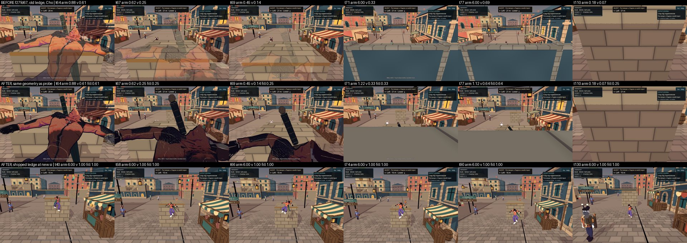

# Камера біля тісної опори: виконання кроків 1–4

**Дата:** 2026-10-07 · **Роль:** T2 Гефест · **Статус:** кроки 1–4 виконано в робочому дереві гілки `claude/t1-orchestration-2026-10-07`; коміт робить T1. Поріг кроку 1 з плану не досяжний у заданій формі, деталі нижче. Художнє приймання — T6, аудит — T4.

Виконую [[2026-10-07-Tight-Support-Camera]] (коміт `03f4d63`). Числа «до» взято з [[2026-10-07-Tight-Station-Camera-Baseline]]. Числа «після» дає той самий зонд `tools/camera/tight_station_probe.gd`, тепер ще й регресія.

## Звірка плану з реальністю

1. **Крок 2 ламає мало.** `grep -rn "PracticeLedge\|practice ledge" game tools` → геометрія `CityDistrict.gd:40` і повідомлення в `city_parkour_check.gd:156,180,188`. Координати станції `(4,0,31.4)` — лише у 4 фікстурах із плану. Підказки HUD прив'язані до фази (`CityHud.gd:589-596`), а не до місця. Онбординг на опору не посилається.
2. **Місце для опори.** Скрипт `site_check.gd` у scratchpad перевіряв кандидатів на живому `CityWorld`: перетин колізій із запасом 0,4 м, смуги мешканців (`CityNpcActor.home_for` ± 0,5 / 4 м), прилавки ринку (`CityMarket.gd:16-19`), відстань до spawn `(0,0,23)`. Обрано центр `(4, 1.4, 15.8)`, той самий розмір:

   | кандидат, центр | грань хвату z | вільно за гранню | найближча смуга мешканця | висновок |
   |---|---:|---:|---:|---|
   | `(4, 1.4, 29)` — було | 30,2 | **1,75 м** до `SouthBoundary` | 1,80 м | тісно |
   | `(4, 1.4, 23.8)` | 25,0 | 6,95 м | **0,10 м** (мешканець 7) | перетинає смугу |
   | `(-4, 1.4, 22.8)` | 24,0 | 7,95 м | 4,10 м | 1,85 м до прилавка, поруч зі spawn |
   | **`(4, 1.4, 15.8)`** | **17,0** | **14,95 м** | **1,00 м** | **обрано**: перетинів колізій 0, до прилавка 1,85 м, від станції до spawn 6,25 м |

   Грань хвату тепер дивиться на spawn; камера за героєм має вулицю на ~15 м. Поріг плану «≥ 3 м» (PLACEHOLDER) виконано з запасом. Запас потрібен через kick: з тісної опори герой пролітає ~4–5 м (з відкритої 2-метрової опори — 3,9–4,2 м, `matrix-high-v2`).
3. **Поріг кроку 1 «max Δarm за тік ≤ 0,5 м» недосяжний при миттєвому стисканні.** Демпфування забирає перескоки на 6 м. Але підйом close framing досі виводить sweep над верхом межової стіни. Тоді лінза повільно виходить за стіну й миттєво повертається. Перевірено на старій геометрії (фікстура, див. крок 4), Choko / Skea kick:

   | `arm_recovery_rate`, 1/с (T = 4,605 / k) | стрибків > 3 м | ріст назовні за тік, м | стиск за тік, м | лінза за гранню стіни, тіків | лінза z / y макс, м |
   |---|---:|---:|---:|---:|---|
   | ∞ (до виправлення) | 10 | 5,70 | 5,79 | 8 | 37,38 / 5,96 |
   | **9,21 (0,5 с, Cinemachine TPF, обрано)** | **0** | **0,82** | **2,18** | 9 | **33,97 / 4,80** |
   | 5,51 (0,84 с) | 0 | 0,50 | 1,81 | 10–11 | 33,61 / 4,67 |
   | 3,0 (1,5 с) | 0 | 0,28 | 1,35 | 11–12 | 33,17 / 4,56 |

   Жодне k не дає `|Δarm| ≤ 0,5` в обидва боки. Стиск миттєвий за задумом (sweep тримає колізію), а розмах стиску дорівнює тому, що лінза встигла набрати над стіною. Обрано константу з дослідження (план: «константа PLACEHOLDER з посиланням на дослідження»). Регресія перевіряє закон демпфування, а не 0,5. Рішення щодо порогу й k — за T1, міняється один рядок.
4. **Крок 3 зачіпає більше тестів, ніж `city_camera_check.gd:50`.** Стару політику «до нуля» також закріплюють `hero_gear_check.gd:381,383` і `living_district_pck_check.gd:347`. Їх переписано з поясненням.
5. **«Пікселі контуру на всіх тісних тіках»** залежить від кадру: на тісній геометрії після kick герой стоїть поза frustum, і пікселів героя немає взагалі. Вимірюю на тіках, де силует героя є в кадрі.

## Що змінено

| крок | файли | суть |
|---|---|---|
| 1 | `game/scripts/world/CityCamera.gd` | `arm_recovery_rate = 9.21` (PLACEHOLDER, посилання на [[2026-10-07-Tight-Support-Camera-Research]]). `_limit_arm_recovery`: SpringArm3D і далі стискає лінзу в тому ж тіку, а довжину назад набирає лише як `lerp(hit, wanted, 1 − e^(−k·dt))`. Після `reset_view` і під час розмови обмеження не діє. Недіючий `arm.margin = 0.2` прибрано, причину записано коментарем |
| 2 | `game/scripts/world/CityDistrict.gd` | `PracticeLedge` → центр `(4, 1.4, 15.8)`, з коментарем про простір і відстані |
| 2 | `tools/parkour/city_parkour_check.gd`, `tools/animation/{trick_capture,trick_production_capture,parkour_capture}.gd` | станція `(4,0,31.4)` → `(4,0,18.2)`; перевірка видертися `z < 30.2` → `z < 17.0` |
| 3 | `game/shaders/camera_proximity.gdshaderinc`, `hero_outline.gdshader`, `outline.gdshader` | ink-hull має власний `camera_outline_visibility` (через `#define CAMERA_PROXIMITY_OUTLINE`); заливка й далі на `camera_visibility` |
| 3 | `game/scripts/world/CityCameraProximity.gd` | `visibility` — сирий фактор лінзи, як і раніше. Застосовуються `fill_visibility = max(visibility, fill_floor)` з `fill_floor = 0.25` (PLACEHOLDER за [[2026-10-07-Tight-Station-Readability-Criteria]]) і `outline_visibility = 1`. Оригінальні значення обох параметрів відновлюються точно |
| 3 | `tools/camera/city_camera_check.gd`, `tools/equipment/hero_gear_check.gd`, `tools/distribution/living_district_pck_check.gd` | нове мірило: фактор лінзи падає як раніше, заливка зупиняється на floor, контур лишається 1 |
| 4 | `tools/camera/tight_station_probe.gd`, `tools/gates/playable_check.sh` | станції `practice` / `tight` (стара опора як фікстура зонда) / `open`; режим `--check` і три негативні контролі; 1 + 3 нові сценарії playable |

Gameplay, колізія героя, числа руху й бою, input map і дуельна камера не змінювалися. `git diff --stat` — у розділі «Перевірка».

## Регресія (крок 4)

Предмет: для всіх тіків маршрутів регресії (2 герої; практична станція × hang/drop/kick; тісна фікстура × kick):
- **S1.** Ріст arm за тік ≤ `follow · (1 − e^(−k·dt))` при виробничому k.
- **S2.** На практичній станції в усталеному hang і на кожному тіку після приземлення видно ≥ 4/6 ключових точок, а visibility ≥ 0,85.
- **S3.** На тісному kick застосована заливка ≥ floor, контур = 1.

Три форми зламу, кожна від свого предмета:

| режим | що ламає | очікування | факт (headless, raw `fix/check-break-*`) |
|---|---|---|---|
| `--check` | — | rc0 | `TIGHT_STATION_COMPLETE checks=20 failures=0 mode=none`, 19 с |
| `--break=damping` | k = 10⁶, миттєве відновлення як до виправлення | rc1 | `outward growth 5.702 m/tick <= 0.859` → `checks=2 failures=1` |
| `--break=floor` | floor 0, контур іде за заливкою | rc1 | `applied fill min 0.000`, `ink outline min 0.000` → `checks=3 failures=2` |
| `--break=station` | S2 міряється на старій тісній геометрії | rc1 | `key points min 0.00, visibility min 0.00 over 56 ticks` → `checks=2 failures=1` |

У `playable_check.sh` додано `tight-station` і `tight-station-negative-{damping,floor,station}`. Дозволений префікс помилок негативів — `ERROR: TIGHT_STATION: `.

## Числа зонда до і після

Native — Compatibility/llvmpipe, High; «до» — `matrix-high-v2` на `f27fd67`, «після» — `after-matrix` і `after-strips` на робочому дереві поверх `6318e02`. Хеш зонда `sha256sum tools/camera/tight_station_probe.gd` → `3c58ccc3…a0bed93` у всіх трьох `run.meta`; `TIGHT_STATION_PROBE_COMPLETE routes=18 ticks=2401 images=451 failures=0` і `routes=4 ticks=584 images=584 failures=0`, rc0.

**Навчальна опора, Choko / Skea: стара станція `(4,0,31.4)` → нова `(4,0,18.2)`.**

| сегмент | arm, м (з 6) | visibility | ключові точки | пікселі героя |
|---|---|---|---|---|
| стоїть | 0,45 → **6,00** | 0,20 → **1,00** | 0/6 → **6/6** | 0,0 / 0,3 % → 0,6 % |
| hang | 1,23 → **6,00** | 1,00 → 1,00 | 5/6 → 6/6 / **4/6** | 9,2 / 9,9 % → 0,6 % |
| drop, після приземлення | 0,74 / 0,43 → **6,00** | 0,86 / 0,20 → **1,00** | 1/6 / 0/6 → **6/6** | 2,9 / 0,1 % → 0,5 / 0,6 % |
| kick, фаза й політ | стрибки 0,2–0,4 ↔ 6,0 → **6,00 рівно** | мін 0,10 → **1,00** | 2/6 / 1/6, далі 0 → **6/6** | 12,8 / 11,5 %, далі 0 → 0,7 % |
| kick, після приземлення | 0,18 → **6,00** | 0,00 → **1,00** | 0/6 → **6/6** | 0 % → 0,5 % |

Тепер герой займає 0,5–0,8 % екрана, як на відкритій контрольній станції. Раніше в hang це було 9–10 %, а T6 відзначав «завеликий». У Skea в hang дві кисті з шести точок закриває верх опори (промінь до кістки зачіпає колізію `PracticeLedge`), тому 4/6 — рівно поріг. Відкрита станція не змінилася: 771 тік обох героїв збігся з `f27fd67` біт у біт.

**Стара геометрія як фікстура, kick (Choko / Skea):**

| що | до | після |
|---|---|---|
| стрибки arm > 3 м за тік | 10 / 10 | **0 / 0** |
| найбільший ріст / стиск arm за тік, м | 5,70 / 5,79 | **0,82 / 2,18** |
| лінза z / y макс, м | 37,38 / 5,96 | **33,97 / 4,80** |
| тіків лінзи за гранню межі | 8 | 9 |
| застосована заливка, мін | 0,00 | **0,25** |
| контур, мін | 0,00 (ішов за заливкою) | **1,00** |
| тіків із видимим героєм із 49 знятих | 23 / 26 | 21 / 29 |

Контур (піксель кольору ink у силуеті) є на кожному знятому тіку, де героя видно хоча б на 0,5 % екрана. Виняток один: Skea drop, тік 75, 0,99 % екрана — край фігури зрізаний рамкою. Тіки 81 і 84 у Choko не рахуються: героя там закриває стіна.

**Що побачить T6 (не вердикт).** На тісній геометрії заливка 25 % пропускає ink-hull, що лежить за тілом. Тому зблизька герой читається як темна, густо заштрихована фігура, а не прозорий привид. У Skea на тіку 69 ink займає 45,5 % кадру. Лінія по краю ціла. «Олівцевого ескізу» з фоном крізь заливку inverted hull не дає: для цього потрібен stencil або шейдер, що знає глибину тіла (відкрите питання T3 щодо stencil у 4.7). На новій опорі камера не підходить ближче 5,4 м, і політика proximity там не вмикається. На кадрі t130 мешканець 7 проходить своєю смугою поруч із лінзою і на мить більший за героя — це питання композиції для T6.

## Перевірка

| команда | rc | вихід | raw (`<scratchpad>/evidence/t2/fix/`) |
|---|---|---|---|
| `GODOT_BIN=<godot> make check` | 0 | GDS `перевірено: 119 · не парсяться: 0 · не виміряно: 0`; `[smoke] ALL OK (164 checks) in 19847 frames`; `SMOKE ЗЕЛЕНИЙ` | `make-check.log`, `.rc` |
| `GODOT_BIN=<godot> make gates` після останньої правки docs | 0 | 458 сторінок / 6575 лінків / 0 зламаних, 175/175, GDS 119/0, `БАТАРЕЯ ЗЕЛЕНА` | `make-gates-final.log`, `.rc` |
| `PLAYABLE_LOG_DIR=… make check-playable` | 0 | `PLAYABLE CHECK: 97 scenarios, 0 failures` (було 93: +`tight-station` і 3 негативи), 9 хв 15 с | `make-check-playable.log`, `playable-logs/` |

Скан 97 logs: `ERROR:` є лише в негативних контролях і лише з дозволеними префіксами, з них `TIGHT_STATION` — 4. У позитивних сценаріях помилок немає, `leak|orphan` → 0. Сценарії, що зачіпають зміни: `city-camera`, `hero-gear`, `city-parkour`, `city-runtime`, `conversation-camera`, `tight-station` — PASS. `living_district_pck_check.gd` не входить ні в батарею, ні в Makefile (`grep -rn living_district_pck_check Makefile tools/gates .github` → порожньо); його рядок змінено, але не запускався.

## Відкрите

- Поріг кроку 1 (≤ 0,5 м/тік) і вибір k — T1, див. «Звірка», п. 3. Перескок через верх стіни як клас (лінза за стіною й стиск назад) демпфування лише пом'якшує. Повністю його прибирає лише перевірка прямої видимості або висоти, а цього в плані немає.
- Художнє приймання кадрів (T6), зокрема темної фігури зблизька й композиції з мешканцем, і незалежний аудит (T4).
- Документи, де досі стоїть стара станція `(4,0,31.4)`: `docs/Tech/2026-10-07-M3-Acceptance-Checklist.md` §5 — маршрут для M3 тепер веде в порожню щілину; датовані Plans/Art/Audit/Research — історія. Власник чекліста має його оновити.
- Ще одна вузька станція, не виміряна: wall run Skea `(14,0,31.25)` у `city_parkour_check.gd:230`, за 0,75 м від `SouthBoundary`.
- Native — Compatibility/llvmpipe, не M3 і не Forward+; FPS не міряли.

## Після аудиту T4

Підстава — [[2026-10-07-Camera-And-Gate-Review]], пп. 2в, 3 і пропозиція 2 (клас 14: поріг регресії виведено з реалізації). Змінено лише тести; `game/` — без змін (`git diff --stat HEAD -- game` → порожньо).

- `tools/camera/tight_station_probe.gd`: пороги тепер беруться з літералів плану й мірил T6, а не з виробничих констант. Змінено три перевірки:
  - S1 — ріст arm ≤ **0,86** м/тік (`PLAN_ARM_GROWTH_MAX`) і нова перевірка `max |Δarm| ≤ 3` м (`PLAN_ARM_JUMP_MAX`) на тісному kick;
  - S3 — заливка ≥ **0,25** (`PLAN_FILL_FLOOR_MIN`);
  - `production_rate` і `production_floor` лишилися в квитанції лише як довідка.

  Новий негатив `--break=recovery50` (k = 50 ін'єкцією).
- `tools/camera/city_camera_check.gd`: `FILL_FLOOR_MIN = 0.25` як літерал; заливка тіла й пізнього матеріалу ≥ межі. `tools/equipment/hero_gear_check.gd`: пізній слот ≥ 0,25.
- `tools/gates/playable_check.sh`: `tight-station-negative-recovery50`, разом 98 сценаріїв.

Предмет: для всіх тіків тісного kick обох героїв ріст arm ≤ 0,86 м/тік і |Δarm| ≤ 3 м; для всіх тісних тіків застосована заливка ≥ 0,25, контур = 1; для практичної станції — S2 без змін.

**Мутації T4 у копії дерева** (`<scratchpad>/t2-mut-copy`, raw `evidence/t2/fix/probe-mutations/`; файл відновлювався після кожної). Стовпець «до» — таблиця T4, «після» — цей прогін:

| мутація | `tight-station --check` до | після | інші фікстури після |
|---|---|---|---|
| без мутації | rc0, 20/0 | rc0, **22/0** | city-camera 434/0, hero-gear 7946/0 |
| M1 — прибрано виклик `_limit_arm_recovery` | rc1 | rc1: ріст 5,702 > 0,86; стрибок 5,792 > 3 | — |
| M2 — k = 0 | rc0 | rc0 | city-camera rc1: «retreat restores full body» ×2 |
| M8 — k = 10⁶ | rc0 (ловив лише негатив) | **rc1**: 5,702 > 0,86; 5,792 > 3 | city-camera rc0 |
| **R50 — k = 50** | **rc0, 20/0 (ніхто)** | **rc1**: ріст 3,224 > 0,86; стрибок 4,697 > 3 | city-camera rc0 |
| **F1 — `fill_floor` = 0** | **rc0 (ніхто)** | **rc1**: заливка 0,000 < 0,25 (обидва герої) | city-camera rc1 (10 падінь), hero-gear rc1 (4) |
| F2 — `keep_outline` = false | rc1 | rc1: контур 0,250 | — |
| F4 — hero_outline без `#define` | rc0 | rc0 | city-camera rc1: «hero ink outline joins the policy…» |
| L1 — опора назад на z 29 | rc1 | rc1: S2, 4 падіння | — |

Кожну мутацію тепер ловить хоча б одна фікстура батареї. M2 і F4 зонд не бачить за задумом: k = 0 не порушує жодного з порогів S1, а підміну шейдера контуру видно лише в `city-camera`. Негативи в повній батареї — розділ «Перевірка після аудиту» нижче.

**Перевірка після аудиту** (raw `<scratchpad>/evidence/t2/audit-fix/`, HEAD `486b2be` + робоче дерево):

| команда | rc | вихід |
|---|---|---|
| `GODOT_BIN=<godot> make check` | 0 | GDS `перевірено: 119 · не парсяться: 0 · не виміряно: 0 · канарка: FAIL як треба`; `[smoke] ALL OK (164 checks) in 19847 frames` |
| `GODOT_BIN=<godot> make gates` | 0 | 460 сторінок / 6628 лінків / 0 зламаних; 175/175; GDS 119/0/0, канарка; `БАТАРЕЯ ЗЕЛЕНА` |
| `make check-playable` | 0 | `PLAYABLE CHECK: 98 scenarios, 0 failures`, 8 хв 57 с |

`tight-station` → `checks=22 failures=0`. Негативи:
- `damping` → 5,702 > 0,86 і 5,792 > 3;
- `recovery50` → 3,224 > 0,86 і 4,697 > 3;
- `floor` → заливка 0,000 і контур 0,000;
- `station` → точки 0,00, visibility 0,00.

Усі чотири дають rc1. `ERROR:` є лише в негативах і лише з дозволеними префіксами, `TIGHT_STATION` — 7. Позитивні сценарії помилок не мають, `leak|orphan` → 0.

## Related

- [[state]] · [[2026-10-07-Tight-Support-Camera]] · [[2026-10-07-Tight-Station-Camera-Baseline]] · [[2026-10-07-Tight-Support-Camera-Research]] · [[2026-10-07-Tight-Station-Readability-Criteria]]
- [[2026-10-05-Camera-Proximity]] · [[2026-10-05-Parkour-Tricks-And-Quality]]
