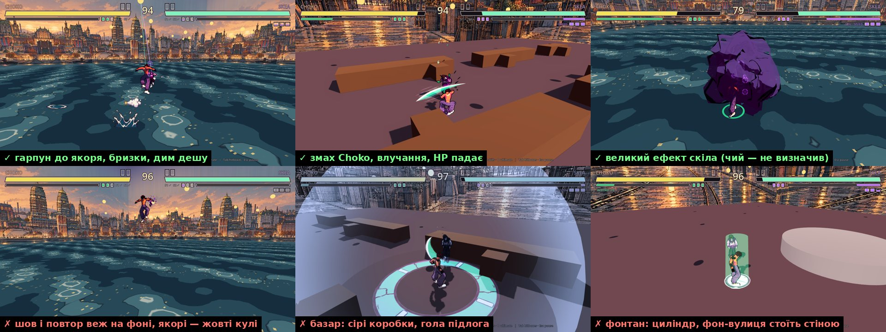
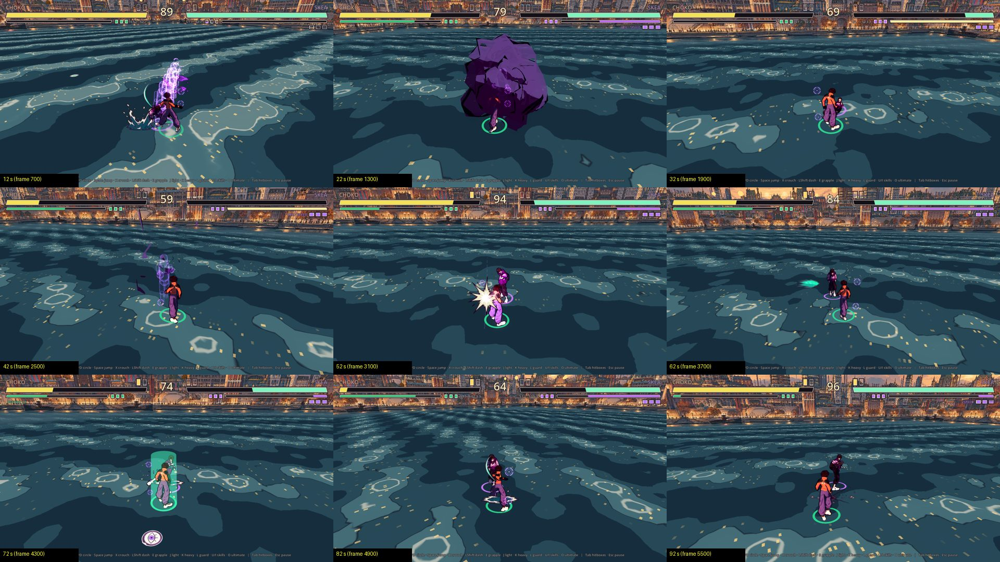

# План — старт хвилі 2: огляд гри в хмарі й хендофи терміналам

**Дата:** 2026-10-03 · **Роль:** T1 Дедал · **Статус:** approved (Santos 2026-10-03: «ти можеш сам подивитися,
запустившись … надай мені зараз хендофи потрібним терміналам, щоб ми закінчили якомога швидше»).
**Виріс із:** [[2026-10-03-Living-Combat]] (хвиля 2, approved) · [[2026-10-03-Santos-Packs-Arenas]] (approved) ·
[[2026-10-03-Sprint-Arenas-VFX]] · журнал [[2026-10-03-T1-Wave-2-Kickoff]]

## Що змінилось

Раніше код хвилі 2 чекав, поки Santos сам зіграє запуски 5, 3c і 6 ([[2026-10-03-T1-Crystal-Ult-Arena-Fatigue]] § Третя
частина). Santos зараз не вдома, і цей гейт знято його словом: замість гри Santos — огляд T1 у хмарі (нижче). Відгук
Santos у santos-va/nooneisreal#52 лишається — коли Santos зіграє вдома.

## Що T1 побачив у грі (хмара, 2026-10-03)

| що | команда | вихід |
|---|---|---|
| Godot | `Godot_v4.7.2-stable_linux.x86_64 --version` | `4.7.2.stable.official.ed1daf0bf` |
| збірка | `GODOT_BIN=… make check` (дерево = `main` `f45c2cb` + лише docs цієї гілки) | `[smoke] ALL OK (161 checks) in 19712 frames`, rc=0 |
| гейти | `make gates` | `БАТАРЕЯ ЗЕЛЕНА`, rc=0 |
| кадри | `xvfb-run … -- --screenshot=<dir> --stage <id> [--night]` (CPU проти CPU) | 24 кадри: 3 арени × день/ніч × 4 (перші 7 с) + 9 кадрів на 92 с бою на `river` |

Кадри:  

**Працює:** справжні Choko і Skea з анімаціями; гарпун з линвою до якоря; бризки води й дим дешу; змахи Choko,
зірка влучання, HP падає; стоп-час із написом FROZEN; RECORD; великі ефекти скілів; два раунди за 92 с.

**Не так:**

| # | що | де видно | куди йде |
|---|---|---|---|
| Н1 | `bazaar` і `fountain` — сірі коробки й циліндр на підлозі одного кольору | `bazaar_day` 230/420, `fountain_day` 330 | паки Ф3–Ф4 (смуга C нижче) |
| Н2 | фон: на `river` вертикальний шов і повтор тих самих веж; на `fountain` намальована вулиця з рейками стоїть стіною | `river_day` 330, `fountain_day` 330 | Ф4.3 (4 картки N/E/S/W) + T6 кільце v2 |
| Н3 | якорі гарпуна — жовті кулі в небі | `river_day` 330/420; `Arena.gd:131-132` «PLACEHOLDER layout until ADR-011's level» | T6-3 ліхтар-якір → запуск 11 |
| Н4 | іконки скілів і портрети згенеровано, у грі їх немає | `grep -rln "ui/icons\|ui/portraits" game/scripts game/scenes` → порожньо; у HUD текст `S1✓ S2✓` | смуга B |
| Н5 | 6 флипбуків без подій у бою | `grep -rl <ім'я> game/scripts \| wc -l` → 0 для `smoke_puff`, `skid_dust`, `speed_lines`, `spark_metal`, `electro_arc`, `slash_skea` | смуга B |
| Н6 | у іконок і портретів немає `.import` у git — імпорт створює 8 нових файлів | `git status --short` після `make import` → 8 рядків `??` у `game/assets/ui/` | смуга B, тим самим PR |
| Н7 | Jolt лається на нерівний масштаб тіл регдола | `grep -c "not supported by Jolt" make_check.log` → 165; масштаби на кшталт `(1.024, 0.958, 1.024)` | Феміда перевіряє причину; T2·A — у запуску 7 |
| Н8 | коли обидва в повітрі або впритул, камера за спиною ховає одного | `river_day` 140 (Skea під HUD), `fountain_night` 420 | Арес — правило кадру в запуску 8 |

**Не бачив:** звук (у контейнері драйвер `dummy`), керування з клавіатури (бій CPU проти CPU), FPS на Mac.
**Здогадка, не перевірено:** Н7 — від присіду з PR santos-va/nooneisreal#141 (масштаби схожі на присід).

## Смуги — хто паралельно, хто послідовно

Правило одне: **кожен термінал — свої файли**. `Fighter.gd` має одного власника — **T2·A**. Інші смуги його не
чіпають; якщо події нема в стані — T2·B просить T2·A додати один `emit` (без логіки), а не правит сам.

| термінал | смуга | що, по черзі | файли | чекає |
|---|---|---|---|---|
| **T2·A** | бій | 7.1 → 7.2 → 8 → 10 → 9 | `game/scripts/fighter/*`, `game/scripts/grapple/*`, `DuelCamera.gd` | 7.1 — ні; кінематика 7.1 — «так» на ADR-017; 7.2 — бриф T3 + правила T5 |
| **T2·B** | картинка | Н4 + Н6 → Н5 | `game/scripts/fx/*`, `game/scripts/ui/*`, `game/assets/ui/**/*.import` | — |
| **T2·C** | арени з паків | Ф0.3 → Ф1.2 → Ф3.2/3.2b → Ф3.3 → Ф4.2–4.4 | `tools/art/*`, `game/scripts/arena/*` (крім `DuelCamera.gd`), `game/assets/models/props/` | Ф4.2 — Арес 4.1 |
| **T3** | ресерч | R4 «живе тіло в Godot 4.7» → R1, R2, R8 → Ф2.1 різкість | `docs/Research/` | — |
| **T5** | правила | 7 → 8 → 10, Ф4.1 | [[02-Combat-System]], [[04-Grapple-System]], [[08-Balance]], значення в `.tres` | — |
| **T6** | арт | 0 кр.: ефекти поверхонь для 9; RED: T6-1 | `docs/Art/`, реєстр | T6-1 — слово Santos |
| **T8** | ввід | ухили в 8 напрямках на клавіатурі P1/P2, геймпаді, таче | [[05-Platforms-Input]], [[06-UI-UX]] | — |
| **T7** | вікі | глосарій хвилі 2; Prop-Catalog після контакт-листа | `docs/World/`, `docs/Art/` | контакт-лист T2·C |
| **T4** | аудит | Н7, PR без вердикту, далі кожен PR смуг | `docs/Audit/` | — |
| **T1** | план | «Арена живе» (запуск 11) | `docs/Plans/` | після 8 |

Порядок 9 і 10 у T2·A: хто перший готовий. Запуску 9 потрібен арт ефектів поверхонь (RED), 10 — лише правила Ареса.

## Протокол — як і раніше, плюс кадри

PR — **не draft**, у описі розділ «Запуск N — що перевірити»; `make check` → `[smoke] ALL OK`, `make gates` → rc=0;
вердикт Феміди без RED → мерж Santos. **Нове:** Santos не вдома, тому кожен PR з видимою зміною несе 2–4 кадри з хмари
(команда нижче) у `docs/assets/screenshots/`.

### Godot у хмарі (перевірено T1 2026-10-03)

```
curl -sSL -o g.zip https://github.com/godotengine/godot/releases/download/4.7.2-stable/Godot_v4.7.2-stable_linux.x86_64.zip && unzip -o -q g.zip && rm g.zip
export GODOT_BIN=$PWD/Godot_v4.7.2-stable_linux.x86_64
make import && make check && make gates
xvfb-run -a -s "-screen 0 1280x720x24" $GODOT_BIN --path game --rendering-driver opengl3 --resolution 1280x720 -- --screenshot=/abs/dir --stage river [--night]
```

Бінар класти в scratchpad, не в репо. Кадри — `game/scripts/core/Screenshot.gd` (`_shots` — номери кадрів фізики).

## Хендофи — текст для вставки в термінал

### T2·A — Гефест, бій (новий або нинішній t2)

> T2 — Гефест, смуга бою хвилі 2. План: `docs/Plans/2026-10-03-Wave-2-Kickoff.md` + `docs/Plans/2026-10-03-Living-Combat.md`
> (запуск 7). Ти — єдиний власник `game/scripts/fighter/*`, `game/scripts/grapple/*`, `DuelCamera.gd`.
> **7.1 зараз:** регдол на скелеті героя (`PhysicalBoneSimulator3D`, [[Active-Ragdoll]] стадія 2) замість капсульних тіл
> у `Ragdoll.gd`; заодно Н7 — 165 попереджень Jolt «scale not supported» у `make check`: тіла регдола не мають
> успадковувати масштаб присіду. Кінематична позиція після регдола (ADR-017 (а), `Fighter.gd:1350-1355`, `:1431`) —
> лише після «так» Santos на ADR-017; до того не чіпай.
> **7.2 після брифу T3 (R4) і правил T5:** IK кінцівок на зону суперника, висота блоку під атаку, ноги на `height(x, z)`.
> Далі 8 (акробатика після зипу) → 10 (стат стійкості, ухили) → 9 (поверхні, коли буде арт).
> Перевірка: `make check` → `ALL OK` з новими перевірками й негативним контролем; `grep -c "not supported by Jolt"` у лозі
> `make check` → 0; `make gates` rc=0; 2–4 кадри з хмари в PR. Godot у хмарі — § Godot у хмарі плану. PR не draft,
> один на запуск (7.1 і 7.2 — можна двома).

### T2·B — Гефест, картинка (новий термінал)

> T2 — Гефест, смуга «картинка». План: `docs/Plans/2026-10-03-Wave-2-Kickoff.md` § Н4–Н6. Твої файли:
> `game/scripts/fx/*`, `game/scripts/ui/*`, `.import` іконок. `Fighter.gd` не чіпай — його власник T2·A.
> **Крок 1:** іконки скілів і ульт (`game/assets/ui/icons/`, 6 файлів) у HUD замість тексту `S1✓ S2✓` — за правилом
> слота Гермеса (`docs/GDD/06-UI-UX.md:345-364`, «Місце під іконку скіла»; PR santos-va/nooneisreal#132); портрети (`game/assets/ui/portraits/`) — у вибір
> героя в `MainMenu.gd`. Закоміть 8 файлів `.import`, які створює імпорт (Н6).
> **Крок 2:** 6 флипбуків без подій — `smoke_puff` (приземлення), `skid_dust` (ковзання), `speed_lines` (деш/зип),
> `spark_metal` (блок), `electro_arc` і `slash_skea` — через `FxDirector`, який лише читає стан
> ([[2026-10-03-lane-b-flipbooks]]). Рішення Дедала щодо «виклики живуть у `Fighter.gd`»: якщо події в стані нема —
> попроси T2·A один `emit` без логіки, не правиш сам.
> Перевірка: гард «ефекти лише картинка» — той самий хеш реплею з `Fx.enabled` false; `make check` → `ALL OK`;
> `make gates` rc=0; `git status --short` після `make import` → порожньо; кадри HUD і ефектів у PR.

### T2·C — Гефест, арени з паків (новий термінал або T2·Mac)

> T2 — Гефест, смуга «арени з паків». План: `docs/Plans/2026-10-03-Santos-Packs-Arenas.md` § Кроки, Ф0.3 → Ф1.2 →
> Ф3.2/3.2b → Ф3.3 → Ф4.2–4.4. Пак — на гілці `textures/santos-pack` (`git fetch origin textures/santos-pack`), у `main`
> не мерджиться. Твої файли: `tools/art/*`, `game/scripts/arena/*` (крім `DuelCamera.gd`), `game/assets/models/props/`.
> Почни з контакт-листа (Ф0.3) — без нього T6 і Кліо обирають пропи наосліп. Ф4.3 (4 картки фону N/E/S/W) закриває шов
> на `river` (Н2) — кадр «до/після» в PR. Ф4.2 (`PropKit`) — після масштабу Ареса (Ф4.1).
> Перевірка — колонка «перевірка» кожного кроку плану паків + `make check`, `make gates`,
> `python3 tools/gates/texture_registry_check.py` → N/N; кадри арен з хмари в PR.

### T3 — Архімед

> T3 — Архімед. План: `docs/Plans/2026-10-03-Wave-2-Kickoff.md`, смуга T3. **Перше — R4 «живе тіло в Godot 4.7»** для
> запуску 7 ([[2026-10-03-Fight-Craft-Research]] § Бриф Архімеду, Частина A, рядок R4): які вузли 4.7.2 дають IK кінцівок і погляд (назви класів і
> параметри — з документації або сирців `4.7.2-stable`); часткове змішування `PhysicalBoneSimulator3D` з анімацією
> (стадія 3 [[Active-Ragdoll]]); вартість на бійця, межа для профілю Low на телефоні; чому Jolt лається на масштаб тіла
> (Н7). Файл — `docs/Research/2026-10-03-Fight-Craft-A.md` (так у плані ремесла бою): R4 першим, R1, R2, R8 — після;
> кожен пункт — URL + версія або `UNGROUNDED`.
> **Друге** — Ф2.1 різкість імпорту з плану паків. Лише текст, без кредитів. Перевірка: `bash tools/gates/run_gates.sh` → rc=0.

### T5 — Арес

> T5 — Арес. План: `docs/Plans/2026-10-03-Wave-2-Kickoff.md`, смуга T5, і `docs/Plans/2026-10-03-Living-Combat.md`.
> Правила для T2·A, по черзі, кожне число — PLACEHOLDER або з джерелом:
> (7) [[02-Combat-System]], новий розділ § Поведінка: зони IK на суперника, висота блоку під зону атаки (верх/середина/низ), пороги
> часткової реакції; (8) [[04-Grapple-System]]: сальто після зипу — за скільки кадрів ноги на землі, довжина ковзання,
> правило кадру камери, коли обидва в повітрі (Н8); (10) [[08-Balance]] + `CharacterData.gd`: стат стійкості
> (флінч / стагер / нокдаун), варіанти ухилу в 8 напрямках; плюс Ф4.1 з плану паків — множник масштабу на пак, що з
> пропів укриття. Перевірка: `bash tools/gates/run_gates.sh` → rc=0; `make check` → `ALL OK`, якщо чіпав `.tres`.

### T6 — Аполлон

> T6 — Аполлон. План: `docs/Plans/2026-10-03-Wave-2-Kickoff.md`, смуга T6. PR хвилі T6-0
> (santos-va/nooneisreal#145) — чекає мержу Santos. **0 кредитів зараз:** для запуску 9 — список ефектів поверхонь
> (вода, асфальт, щебінь, пісок: крок, приземлення, ковзання), що вже є в `game/assets/vfx/` і чого бракує; промпти
> на відсутні + `get_cost` + `balance` → таблиця в PR. **RED:** хвиля T6-1 (ключ стилю + проба кільця `river` v2,
> ≈ 16.5 кр. за планом паків) — лише після слова Santos. Кожен ассет — рядок у [[Textures-Registry]].
> Перевірка: `python3 tools/gates/texture_registry_check.py` → N/N; `bash tools/gates/run_gates.sh` → rc=0.

### T8 — Гермес

> T8 — Гермес. План: `docs/Plans/2026-10-03-Wave-2-Kickoff.md`, смуга T8. Для запуску 10: ухили в 8 напрямках — на
> клавіатурі P1 і P2, геймпаді й таче, без конфліктів із [[ADR-014-Free-Movement-Layout]]; гліфи; рядок у
> [[05-Platforms-Input]] і [[06-UI-UX]]. Якщо T2·B спитає про слот іконки HUD — відповідь з PR santos-va/nooneisreal#132.
> Перевірка: конфліктів клавіш 0 (скрипт або таблиця з командою); `bash tools/gates/run_gates.sh` → rc=0.

### T7 — Кліо

> T7 — Кліо. План: `docs/Plans/2026-10-03-Wave-2-Kickoff.md`, смуга T7. Глосарій хвилі 2 (IK, стат стійкості, флінч /
> стагер / нокдаун, кінематична позиція після регдола); підписи й wikilinks нових кадрів у `docs/assets/screenshots/`.
> Після контакт-листа T2·C — `docs/Art/Prop-Catalog.md` (Ф1.1 плану паків). Перевірка: `bash tools/gates/run_gates.sh` → rc=0.

### T4 — Феміда

> T4 — Феміда. План: `docs/Plans/2026-10-03-Wave-2-Kickoff.md`, смуга T4. **Перше — Н7:** 165 попереджень Jolt
> «scale not supported» у `make check` на `main` `f45c2cb`; прожени `make check` на коміті до мержу
> santos-va/nooneisreal#141 і після — звідки взялось. **Далі** — PR без вердикту: santos-va/nooneisreal#129,
> santos-va/nooneisreal#130, santos-va/nooneisreal#131, santos-va/nooneisreal#132, santos-va/nooneisreal#141
> (і реєстр santos-va/nooneisreal#120). Потім — кожен PR смуг цього плану. Вердикти — `docs/Audit/`.

## Що від Santos

1. Мерж santos-va/nooneisreal#146 (у ньому вже є коміт santos-va/nooneisreal#144, тож #144 закриється сам) і
   santos-va/nooneisreal#145.
2. «Так» чи «ні» на [[ADR-017-Post-Ragdoll-Position]] — без «так» T2·A робить регдол на скелеті, але не кінематику.
3. Слово на T6-1 (≈ 16.5 кр.) — коли захочеш побачити новий стиль фону.
4. Відкрити нові термінали T2·B і T2·C, вставити хендофи вище.
5. Вдома: `make update BRANCH=main && make run` → 3–5 рядків у santos-va/nooneisreal#52.

## Ризики

- **Три термінали T2 зіткнуться у файлах.** Захист — таблиця смуг: `Fighter.gd` лише в T2·A, `arena/*` лише в T2·C,
  `fx/*` і `ui/*` лише в T2·B. Перед PR — `git merge origin/main`.
- **Кадри з хмари не те саме, що гра на Mac.** Звук і клавіатуру хмара не бачить; це закриває відгук Santos у #52.
- **Н7 — здогадка про причину.** Феміда перевіряє перед тим, як T2·A щось правит.

## Related
- [[state]] · [[2026-10-03-Living-Combat]] · [[2026-10-03-Santos-Packs-Arenas]] · [[2026-10-03-Sprint-Arenas-VFX]] ·
  [[2026-10-03-Path-to-First-Fight]] · [[ADR-017-Post-Ragdoll-Position]] · [[Active-Ragdoll]] · [[02-Combat-System]] ·
  [[04-Grapple-System]] · [[08-Balance]] · [[05-Platforms-Input]] · [[06-UI-UX]] · [[Textures-Registry]] ·
  [[2026-10-03-T1-Wave-2-Kickoff]]
