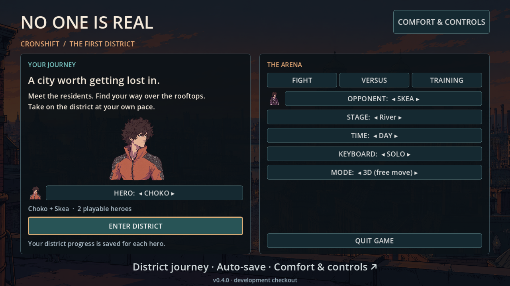
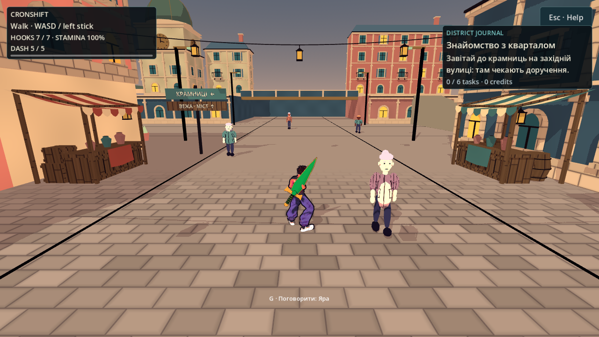
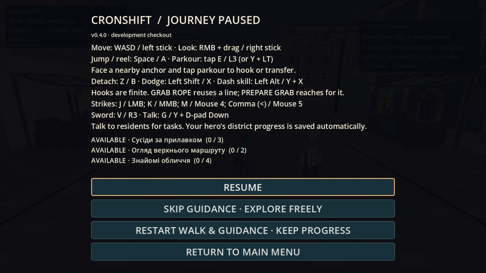

# Квартал: меню, журнал і видима версія збірки

**Дата:** 2026-10-05. **Смуга:** T8 UI та доставка. Робочий пакет — `codex/playable-district`; мердж і оновлення встановленого застосунку не випливають із наявності цього документа.

## Що змінилося

Головне меню ставить подорож кварталом на перше місце: початковий фокус на **ENTER DISTRICT**, окремий вибір Choko/Skea, великий чинний портрет обраного героя, арени в сусідній панелі. Лише двоє героїв доступні для вибору. Кнопка стає **CONTINUE DISTRICT**, коли `CityProgress.has_saved_hero()` підтверджує валідний профіль цього героя; перевірка тільки читає збереження. Порожній профіль стартує при вході. Кнопки стирання кампанії немає. У паузі **RESTART WALK & GUIDANCE · KEEP PROGRESS** перезапускає прогулянку й підказки, зберігаючи прогрес.

Меню має явне кільце фокусу для клавіатури/геймпада. Підказка основної кнопки описує подорож, а VERSUS/FIGHT/TRAINING — свій режим арени. Після зміни порядку кнопок вузький тест SmokeTest звертається до іменованих контролів замість старих індексів.

HUD отримує `CityProgress` через `bind_progress(model)`, підписується на `changed` і показує активне завдання, наступну дію, завершені завдання й кредити. Журнал у паузі читає `journal()`. Нижня підказка NPC належить `NpcDialogue`; NPC-смуга приховує її під час паузи. Мотузкова підказка уникає ресурсної та квестової карток. Журнал доступний через кільце фокусу; ↑/↓ прокручують, ←/→ повертають на Resume.

## Версія всередині гри та macOS bundle

Єдине джерело версії — `game/project.godot`, `config/version="0.4.0"`: незавершений прототип кварталу, не обіцянка повної кампанії. `BuildInfo` показує цю версію й короткий SHA в меню та паузі міста. У редакторському checkout без експортного маркера написано **development checkout**; вигаданої ревізії немає.

Обидва експортери (`export-macos.sh`, `install-local-macos.sh`) у тимчасовій копії:

- записують повний SHA у `build_info.cfg`, додають файл до `include_filter`, щоб він потрапив у PCK;
- зберігають той самий SHA у `Info.plist` → `NIRBuildRevision`, який уже перевіряє updater;
- беруть `config/version` із проєкту для `application/short_version` та `application/version` macOS.

Робочий проєкт не отримує згенерованого маркера; пакет не плутає SHA вихідного коду з поточним станом Git після експорту.

## Чому може бути «немає оновлень»

2026-10-05 під час цієї сесії прочитано live GitHub API `commits/main`, release `macos-main` і сам [manifest.json](https://github.com/santos-va/nooneisreal/releases/download/macos-main/manifest.json). На момент перевірки:

| Джерело | Значення |
|---|---|
| main | `f24d97393a1ae5eeca380f77d36095993096ffea` |
| Опублікований manifest revision | `f24d97393a1ae5eeca380f77d36095993096ffea` |
| Godot / signing у manifest | `4.7-stable` / `ad-hoc; not notarized` |
| Розмір ZIP / SHA-256 | `265947715` байтів / `50b707179132134a76f22a0097ac9be6b813c664ebbdc4ab69e03f15f03af497` |
| Installed revision на Mac Santos | **Не прочитано: ця сесія на Linux.** |

Якщо встановлена саме `f24d973`, новішої опублікованої збірки на момент цієї перевірки не було. Робота в PR до мерджу не змінює канал main. Окремо updater відкладає заміну, поки гра запущена, а наявність новішого Git-коміту сама по собі ще не доводить завершення build/verification/publish workflow.

Updater тепер друкує **Installed build**, **Available main build** та явний результат **No update available; this is a successful check**. У вже встановленій старій копії updater нових повідомлень не буде, доки bootstrap не оновить її.

У малому `NoOneIsReal-Updater.zip` поруч із Enable Updates є **Check Updates.command**. Це `update-macos.sh --status`: читає локальний `NIRBuildRevision`, завантажує лише manifest, показує стан запущеної гри й наявність конфігурації LaunchAgent. Не встановлює гру, не змінює збереження й не реєструє агент. Наявність конфігурації не видається за доказ працездатності LaunchAgent. Через цей файл Santos може отримати фактичне порівняння свого Mac, якого в нас немає.

## Іконка: свідомо відкладено

Santos прямо обрав **залишити іконку до отримання саме нового PNG**. Чинний `res://icon.svg` збережено; портрет у меню не стає іконкою застосунку. Оригінал job `6862c65f-2e2c-4287-b373-03607d7a6d36` раніше повернув HTTP 403; локального `game/assets/ui/app_icon.png` немає. Джерело й точний маршрут завершення — [[2026-10-04-Choko-App-Icon]] та [[2026-10-05-City-Texture-And-Icon]]. Нова генерація, підміна портретом та твердження про зміну `/Applications` не виконувалися.

## Перевірка й кадри

Окрема копія проєкту `/tmp/nir-district-ui`, ізольовані XDG data/config/cache; Godot **4.7-stable** `5b4e0cb0f`:

- `district_ui_check.gd`: **33 checks / 0 failures** — маркер збірки, кільце фокусу, реальний controller accept для героя, оновлення HUD/journal від сигналу.
- `layout_check.gd`: **UI_LAYOUT PASS, 0 failures** на 16:9, 4:3 та ultrawide логічних полотнах; `comfort_ui_check.gd`: **0 failures**.
- `city_onboarding_check.gd`: **56 checks / 0 failures**, включно з паузою, збереженням аренного контексту й реальним входом через кнопку міста.
- `test_distribution.py`: **25 tests / OK**. Нові перевірки: read-only status не змінює app, одночасно показує дві ревізії й не розпаковує ZIP; pinned local exporter передає marker, include filter і версію у staging. macOS-сервіси замокано, це не native Gatekeeper-приймання.
- Native кадри: `DISTRICT_UI_CAPTURE_COMPLETE`, Xvfb `:97`, OpenGL Compatibility / Mesa llvmpipe. Це реальний Linux renderer, не FPS або приймання на M3. Vulkan host не підтримав необхідний instance extension; фінальний capture запущено явно через Compatibility, без прихованого fallback.

Повний інтеграційний `make check-playable` і `make gates` виконує координатор перед PR; наведені локальні результати не підміняють фінальний прохід загального пакета.

## Related

- [[06-UI-UX]] · [[05-Platforms-Input]] · [[Build-and-Run]] · [[Export-Platforms]]
- [[2026-10-04-Choko-App-Icon]] · [[2026-10-05-City-Texture-And-Icon]] · [[Textures-Registry]]
